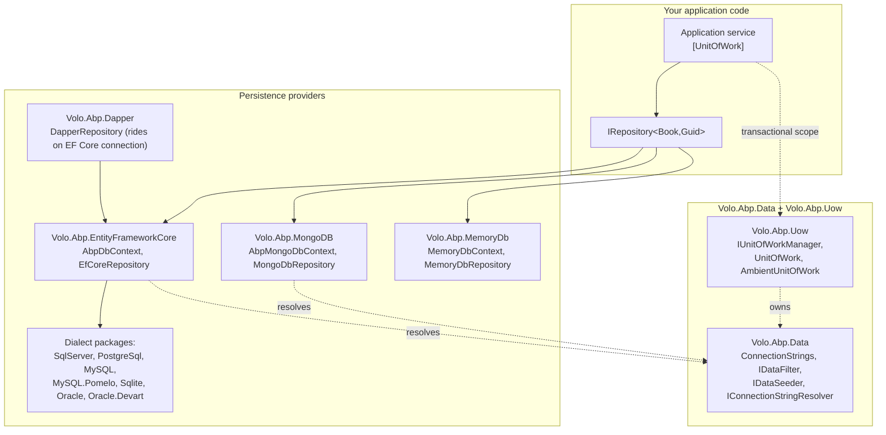

ABP's data access stack is a thin, opinionated layer over native ORMs. It is composed of three concentric rings:

1. **`Volo.Abp.Data`** — connection strings, data seeders, data filters and migration events. Provider-agnostic.
2. **`Volo.Abp.Uow`** — ambient unit of work, transactional scope, double-dispatch event publishing.
3. **Provider packages** — EF Core (+ database dialects), MongoDB, Dapper, in-memory.

Repositories in `/ddd/repositories` are implemented by exactly one of those provider packages, but the calling code only sees `IRepository<TEntity, TKey>`.

## Layering

The unit-of-work interceptor (`UnitOfWorkInterceptor`) wraps every public method whose declaring type is `IUnitOfWorkEnabled` or carries `[UnitOfWork]`. The interceptor opens an `IUnitOfWork`, the repository asks `IDbContextProvider<TDbContext>` for a `DbContext`, and the `DbContext` is cached on the active UoW. See `/flows/unit-of-work-flow` for the timing diagram.

## Package matrix

| Package | Purpose | Module class | Key types |
| --- | --- | --- | --- |
| `Volo.Abp.Data` | Provider-agnostic abstractions | `AbpDataModule` | `ConnectionStrings`, `IDataFilter`, `IDataSeeder`, `IConnectionStringResolver` |
| `Volo.Abp.Uow` | Ambient transaction / event scope | `AbpUnitOfWorkModule` | `IUnitOfWorkManager`, `UnitOfWork`, `[UnitOfWork]` |
| `Volo.Abp.EntityFrameworkCore` | EF Core integration | `AbpEntityFrameworkCoreModule` | `AbpDbContext<TDbContext>`, `EfCoreRepository<,,>`, `IDbContextProvider<>` |
| `Volo.Abp.EntityFrameworkCore.SqlServer` | SQL Server dialect | `AbpEntityFrameworkCoreSqlServerModule` | `UseSqlServer()` extension |
| `Volo.Abp.EntityFrameworkCore.PostgreSql` | PostgreSQL via Npgsql | `AbpEntityFrameworkCorePostgreSqlModule` | `UseNpgsql()` |
| `Volo.Abp.EntityFrameworkCore.MySQL` | MySQL via Oracle's driver | `AbpEntityFrameworkCoreMySQLModule` | `UseMySQL()` |
| `Volo.Abp.EntityFrameworkCore.MySQL.Pomelo` | MySQL via Pomelo | `AbpEntityFrameworkCoreMySQLPomeloModule` | `UseMySQL()` (Pomelo builder) |
| `Volo.Abp.EntityFrameworkCore.Sqlite` | SQLite (tests, embedded) | `AbpEntityFrameworkCoreSqliteModule` | `UseSqlite()`, `AbpSqliteOptions.BusyTimeout` |
| `Volo.Abp.EntityFrameworkCore.Oracle` | Oracle (official) | `AbpEntityFrameworkCoreOracleModule` | `UseOracle()` |
| `Volo.Abp.EntityFrameworkCore.Oracle.Devart` | Oracle (Devart driver) | `AbpEntityFrameworkCoreOracleDevartModule` | `UseOracle(useExistingConnectionIfAvailable)` |
| `Volo.Abp.MongoDB` | MongoDB driver integration | `AbpMongoDbModule` | `AbpMongoDbContext`, `MongoDbRepository<,,>` |
| `Volo.Abp.Dapper` | Raw SQL over EF connection | `AbpDapperModule` | `DapperRepository<TDbContext>` |
| `Volo.Abp.MemoryDb` | In-process store for tests | `AbpMemoryDbModule` | `IMemoryDatabase`, `MemoryDbRepository<,,>` |

## What to read next

<CardGroup cols={2}>
  <Card title="Volo.Abp.Data internals" href="/data/volo-abp-data">Connection strings, data filters, data seeders, the migration event ETOs.</Card>
  <Card title="Unit of work" href="/data/unit-of-work">Lifecycle, `[UnitOfWork]` semantics, `ChildUnitOfWork`, event ordering.</Card>
  <Card title="EF Core" href="/data/entity-framework-core">`AbpDbContext<TDbContext>`, change tracking, value converters.</Card>
  <Card title="EF Core dialects" href="/data/ef-core-providers">Per-provider module classes and `Use*` extension methods.</Card>
  <Card title="MongoDB" href="/data/mongodb">`AbpMongoDbContext`, conventional collection registration, transactions.</Card>
  <Card title="Dapper" href="/data/dapper">When to drop down to raw SQL beside EF Core.</Card>
  <Card title="MemoryDb" href="/data/memory-db">In-memory store, mostly for tests and samples.</Card>
  <Card title="Seeding & migrations" href="/data/data-seeding-and-migrations">`IDataSeedContributor`, the DbMigrator pattern, `ApplyDatabaseMigrationsEto`.</Card>
  <Card title="Data filtering" href="/data/data-filtering">Soft delete, multi-tenancy and custom global filters.</Card>
  <Card title="Connection strings" href="/data/connection-strings">Resolver chain and per-tenant overrides.</Card>
</CardGroup>

## Cross-references

- `/core/overview` — module system that loads all data modules.
- `/ddd/repositories` — `IRepository<TEntity>` abstractions consumed here.
- `/multitenancy/connection-string-resolver` — how `MultiTenantConnectionStringResolver` overrides the default.
- `/flows/unit-of-work-flow` — end-to-end UoW sequence diagram.
- `/modules/audit-logging` — relies on `IDataFilter<ISoftDelete>` and audit property setters.
