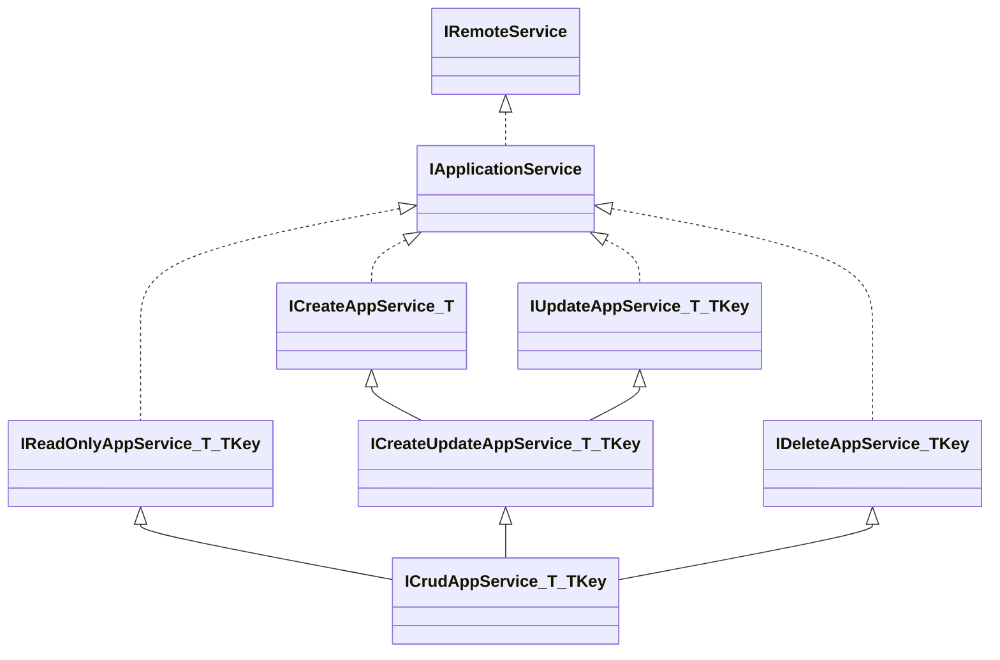

`Volo.Abp.Ddd.Application.Contracts` is the public surface of the application
layer. It exposes only what a **client** — a Blazor app, a JavaScript
front-end, a microservice consumer — should see: DTOs, service interfaces,
permission/feature/setting names, and the auditing contracts that DTOs
inherit. Implementations live one layer up, in
`Volo.Abp.Ddd.Application`.

This is the package every `HttpApi.Client` references — keeping it
behaviour-free is what makes ABP's dynamic HTTP client + Blazor sharing
story work.

## The module

`framework/src/Volo.Abp.Ddd.Application.Contracts/Volo/Abp/Application/AbpDddApplicationContractsModule.cs`:

```csharp
[DependsOn(
    typeof(AbpLocalizationModule),
    typeof(AbpAuditingContractsModule),
    typeof(AbpDataModule)
)]
public class AbpDddApplicationContractsModule : AbpModule
{
    public override void ConfigureServices(ServiceConfigurationContext context)
    {
        Configure<AbpVirtualFileSystemOptions>(options =>
        {
            options.FileSets.AddEmbedded<AbpDddApplicationContractsModule>();
        });

        Configure<AbpLocalizationOptions>(options =>
        {
            options.Resources
                .Add<AbpDddApplicationContractsResource>("en")
                .AddVirtualJson("/Volo/Abp/Application/Localization/Resources/AbpDdd");
        });
    }
}
```

Notice the absence of `AbpDddDomainSharedModule` in the dependency list —
clients reference `Application.Contracts` and the matching
`Domain.Shared` separately, but the Contracts assembly itself stays
domain-agnostic. The localization resource it ships
(`AbpDddApplicationContractsResource`) holds messages like the one used by
`LimitedResultRequestDto`'s "Max result count exceeded" validation.

## DTO inventory

All DTO types live in
`framework/src/Volo.Abp.Ddd.Application.Contracts/Volo/Abp/Application/Dtos/`.

### Identity (entity) DTOs

| File | Type | Members | Use when… |
| --- | --- | --- | --- |
| `IEntityDto.cs` | `IEntityDto` | marker | A DTO has no id. |
| `IEntityDto.cs` | `IEntityDto<TKey>` | `TKey Id { get; set; }` (extends `IKeyedObject`) | A DTO has a single-id. |
| `EntityDto.cs` | `EntityDto` | none | Rarely used (marked `//TODO: Consider to delete`). |
| `EntityDto.cs` | `EntityDto<TKey>` | `TKey Id`, `GetObjectKey()` | The plain "id only" DTO base. |
| `CreationAuditedEntityDto.cs` | `CreationAuditedEntityDto`, `<TPrimaryKey>` | + `DateTime CreationTime`, `Guid? CreatorId` | A read DTO showing creation audit. |
| `CreationAuditedEntityWithUserDto.cs` | `CreationAuditedEntityWithUserDto<TUserDto>` | + `Creator` nav | Embeds the creator user DTO. |
| `AuditedEntityDto.cs` | `AuditedEntityDto`, `<TPrimaryKey>` | + `DateTime? LastModificationTime`, `Guid? LastModifierId` | Adds modification audit. |
| `AuditedEntityWithUserDto.cs` | `AuditedEntityWithUserDto<TUserDto>` | + `LastModifier` nav | With-user variant. |
| `FullAuditedEntityDto.cs` | `FullAuditedEntityDto`, `<TPrimaryKey>` | + `bool IsDeleted`, `Guid? DeleterId`, `DateTime? DeletionTime` | Deletion audit (soft delete). |
| `FullAuditedEntityWithUserDto.cs` | `FullAuditedEntityWithUserDto<TUserDto>` | + `Deleter` nav | With-user variant. |

### Extensible DTOs (with `ExtraProperties`)

For DTOs of `IHasExtraProperties` aggregates, there is a parallel
hierarchy that inherits `ExtensibleObject` so they participate in the
extensibility model:

| File | Type |
| --- | --- |
| `ExtensibleEntityDto.cs` | `ExtensibleEntityDto`, `ExtensibleEntityDto<TKey>` |
| `ExtensibleCreationAuditedEntityDto.cs` | `ExtensibleCreationAuditedEntityDto`, `<TPrimaryKey>` |
| `ExtensibleCreationAuditedEntityWithUserDto.cs` | with-user variant |
| `ExtensibleAuditedEntityDto.cs` | `ExtensibleAuditedEntityDto`, `<TPrimaryKey>` |
| `ExtensibleAuditedEntityWithUserDto.cs` | with-user variant |
| `ExtensibleFullAuditedEntityDto.cs` | `ExtensibleFullAuditedEntityDto`, `<TPrimaryKey>` |
| `ExtensibleFullAuditedEntityWithUserDto.cs` | with-user variant |

`IdentityUserDto` from the Identity module is exactly this pattern:

```csharp
// modules/identity/src/Volo.Abp.Identity.Application.Contracts/Volo/Abp/Identity/IdentityUserDto.cs
public class IdentityUserDto : ExtensibleFullAuditedEntityDto<Guid>,
    IMultiTenant, IHasConcurrencyStamp, IHasEntityVersion
{
    public Guid? TenantId { get; set; }
    public string UserName { get; set; }
    public string Email { get; set; }
    public bool EmailConfirmed { get; set; }
    // ...
    public string ConcurrencyStamp { get; set; }
    public int EntityVersion { get; set; }
}
```

### List / paging request DTOs

| File | Type | Interface | Property |
| --- | --- | --- | --- |
| `ILimitedResultRequest.cs` | `ILimitedResultRequest` | — | `int MaxResultCount` |
| `IPagedResultRequest.cs` | `IPagedResultRequest` | extends `ILimitedResultRequest` | + `int SkipCount` |
| `ISortedResultRequest.cs` | `ISortedResultRequest` | — | `string? Sorting` |
| `IPagedAndSortedResultRequest.cs` | `IPagedAndSortedResultRequest` | extends both | (none) |
| `LimitedResultRequestDto.cs` | `LimitedResultRequestDto` | `IValidatableObject` | `MaxResultCount = DefaultMaxResultCount` (default 10), `[Range(1, int.MaxValue)]`, validates against `MaxMaxResultCount` (default 1000). |
| `PagedResultRequestDto.cs` | `PagedResultRequestDto : LimitedResultRequestDto, IPagedResultRequest` | `[Range(0, int.MaxValue)] SkipCount` | |
| `PagedAndSortedResultRequestDto.cs` | `PagedAndSortedResultRequestDto : PagedResultRequestDto, IPagedAndSortedResultRequest` | + `Sorting` | |
| `LimitedResultRequestDto.cs` (continued) | `ExtensibleLimitedResultRequestDto : ExtensibleEntityDto, ILimitedResultRequest, IValidatableObject` | Extensible variant. | |
| `PagedResultRequestDto.cs` | `ExtensiblePagedResultRequestDto` | Extensible variant. | |
| `PagedAndSortedResultRequestDto.cs` | `ExtensiblePagedAndSortedResultRequestDto` | Extensible variant. | |

`LimitedResultRequestDto.Validate` throws the localized
`MaxResultCountExceededExceptionMessage` from
`AbpDddApplicationContractsResource` if the request exceeds
`MaxMaxResultCount`.

### List / paging response DTOs

| File | Type | Properties |
| --- | --- | --- |
| `IListResult.cs` | `IListResult<T>` | `IReadOnlyList<T> Items { get; set; }` |
| `IPagedResult.cs` | `IPagedResult<T> : IListResult<T>, IHasTotalCount` | + `long TotalCount` |
| `IHasTotalCount.cs` | `IHasTotalCount` | `long TotalCount { get; set; }` |
| `ListResultDto.cs` | `ListResultDto<T>` | Implements `IListResult<T>`. |
| `ListResultDto.cs` | `ExtensibleListResultDto<T>` | Extensible variant. |
| `PagedResultDto.cs` | `PagedResultDto<T>` | Implements `IPagedResult<T>`. |
| `PagedResultDto.cs` | `ExtensiblePagedResultDto<T>` | Extensible variant. |

`PagedResultDto<T>` has two convenient constructors:

```csharp
new PagedResultDto<UserDto>(totalCount, items);
new PagedResultDto<UserDto>(); // for serialization
```

<Note>
`TotalCount` is a `long` — the comment in `PagedResultDto.cs` includes a
`TODO` to confirm it. Adopt `long` in your controllers to avoid integer
overflow when a tenant has billions of rows.
</Note>

### `IHasTotalCount` and friends

The interface `IHasTotalCount` exists separately so you can attach a total
count to a non-list response (e.g. a dashboard summary DTO).

## App-service interface inventory

`framework/src/Volo.Abp.Ddd.Application.Contracts/Volo/Abp/Application/Services/`:

### Root marker

`IApplicationService.cs`:

```csharp
public interface IApplicationService : IRemoteService { }
```

`IRemoteService` (in `framework/src/Volo.Abp.Core/Volo/Abp/IRemoteService.cs`)
is the marker that causes application services to be auto-exposed as HTTP API
endpoints by ABP's `AbpServiceConvention` /
`ConventionalControllerFeatureProvider` pipeline in `Volo.Abp.AspNetCore.Mvc` —
see [MVC Integration](/aspnetcore/mvc-integration).

### CRUD building blocks

| File | Interface |
| --- | --- |
| `ICreateAppService.cs` | `ICreateAppService<TEntityDto>` and `ICreateAppService<TGetOutputDto, TCreateInput>` — `Task<TGetOutputDto> CreateAsync(TCreateInput input)`. |
| `IUpdateAppService.cs` | `IUpdateAppService<TEntityDto, TKey>` and `IUpdateAppService<TGetOutputDto, TKey, TUpdateInput>` — `Task<TGetOutputDto> UpdateAsync(TKey id, TUpdateInput input)`. |
| `IDeleteAppService.cs` | `IDeleteAppService<TKey>` — `Task DeleteAsync(TKey id)`. |
| `ICreateUpdateAppService.cs` | Two-method combo (`Create` + `Update`) with three overloads. |
| `IReadOnlyAppService.cs` | `IReadOnlyAppService<TEntityDto, TKey>` / overloads — `Task<TGetOutputDto> GetAsync(TKey id)`, `Task<PagedResultDto<TGetListOutputDto>> GetListAsync(TGetListInput input)`. |
| `ICrudAppService.cs` | The full union: `Read + Create + Update + Delete`. Five generic-arity overloads (see below). |

### `ICrudAppService` overloads

```csharp
// minimal
public interface ICrudAppService<TEntityDto, in TKey>
    : ICrudAppService<TEntityDto, TKey, PagedAndSortedResultRequestDto> { }

// custom list input
public interface ICrudAppService<TEntityDto, in TKey, in TGetListInput>
    : ICrudAppService<TEntityDto, TKey, TGetListInput, TEntityDto> { }

// custom create input
public interface ICrudAppService<TEntityDto, in TKey, in TGetListInput, in TCreateInput>
    : ICrudAppService<TEntityDto, TKey, TGetListInput, TCreateInput, TCreateInput> { }

// distinct create vs update input
public interface ICrudAppService<TEntityDto, in TKey, in TGetListInput, in TCreateInput, in TUpdateInput>
    : ICrudAppService<TEntityDto, TEntityDto, TKey, TGetListInput, TCreateInput, TUpdateInput> { }

// distinct get vs list output
public interface ICrudAppService<TGetOutputDto, TGetListOutputDto, in TKey,
        in TGetListInput, in TCreateInput, in TUpdateInput>
    : IReadOnlyAppService<TGetOutputDto, TGetListOutputDto, TKey, TGetListInput>,
      ICreateUpdateAppService<TGetOutputDto, TKey, TCreateInput, TUpdateInput>,
      IDeleteAppService<TKey> { }
```

The shorthand → fully-specified table:

| Shorthand | Equivalent fully-specified arguments |
| --- | --- |
| `ICrudAppService<UserDto, Guid>` | `<UserDto, UserDto, Guid, PagedAndSortedResultRequestDto, UserDto, UserDto>` |
| `<UserDto, Guid, UserListInput>` | `<UserDto, UserDto, Guid, UserListInput, UserDto, UserDto>` |
| `<UserDto, Guid, UserListInput, UserCreateDto>` | `<UserDto, UserDto, Guid, UserListInput, UserCreateDto, UserCreateDto>` |
| `<UserDto, Guid, UserListInput, UserCreateDto, UserUpdateDto>` | `<UserDto, UserDto, Guid, UserListInput, UserCreateDto, UserUpdateDto>` |
| `<UserDto, UserListItemDto, Guid, UserListInput, UserCreateDto, UserUpdateDto>` | fully explicit |



## What else lives in Application.Contracts

Beyond what the framework package itself ships, your module's
Application.Contracts project will typically also contain:

| Kind | Suffix | Lives in |
| --- | --- | --- |
| Permission name constants | `*Permissions` (`const string`) | e.g. `IdentityPermissions.cs` |
| Permission definition provider | `*PermissionDefinitionProvider : PermissionDefinitionProvider` | e.g. `IdentityPermissionDefinitionProvider.cs` |
| Feature name constants | `*Features` | similar |
| Setting definitions | `*SettingDefinitionProvider : SettingDefinitionProvider` | similar |
| Localization keys | already in Domain.Shared, but `Application.Contracts` may add additional resources |
| Input DTOs (`CreateXyzDto`, `UpdateXyzDto`, `XyzGetListInputDto`) | sit alongside the read DTOs | |

For Identity, you can see this pattern at
`modules/identity/src/Volo.Abp.Identity.Application.Contracts/Volo/Abp/Identity/`:
`IdentityUserCreateDto.cs`, `IdentityUserUpdateDto.cs`,
`GetIdentityUsersInput.cs`, `IdentityPermissions.cs`,
`IdentityPermissionDefinitionProvider.cs`.

## How clients consume contracts


A Blazor WebAssembly client references `Volo.Abp.Identity.HttpApi.Client`
which generates `IIdentityUserAppService` proxies via
`AbpDynamicHttpClientProxyOptions`. The contract is satisfied locally on
the server, remotely in the browser, identically from the calling code's
perspective.

See [MVC Integration](/aspnetcore/mvc-integration) for the
auto-controller mechanics and `Volo.Abp.Http.Client` for the dynamic
proxy.

## Recipe: design a CRUD service contract

<Steps>
<Step title="Decide your DTO arity">
  - Single DTO for read + write (simplest): `ICrudAppService<UserDto, Guid>`.
  - Separate create / update: `ICrudAppService<UserDto, Guid, GetUserListInput, CreateUserDto, UpdateUserDto>`.
  - Different list DTO: full 6-generic form.
</Step>
<Step title="Pick the right entity DTO base">
  - Audited aggregate ↔ `AuditedEntityDto<Guid>`.
  - Soft-deletable aggregate ↔ `FullAuditedEntityDto<Guid>`.
  - Aggregate with extra properties ↔ `ExtensibleFullAuditedEntityDto<Guid>`.
</Step>
<Step title="Pick the right list input">
  - Plain paging: `PagedAndSortedResultRequestDto`.
  - Custom filters: subclass `PagedAndSortedResultRequestDto` and add
    properties (e.g. `string? Filter`).
</Step>
<Step title="Use PagedResultDto<T> for list returns">
  Even small lists; consistency lets the UI grid bind to the same
  envelope every time.
</Step>
<Step title="Add permission name constants alongside">
  ```csharp
  public static class CatalogPermissions
  {
      public const string GroupName = "Catalog";
      public static class Products
      {
          public const string Default = GroupName + ".Products";
          public const string Create  = Default + ".Create";
          public const string Update  = Default + ".Update";
          public const string Delete  = Default + ".Delete";
      }
  }
  ```
</Step>
</Steps>

## Cross-references

- [Application Services](/ddd/application-services) — the implementations of
  these interfaces.
- [DTOs and Object Mapping](/ddd/dtos-and-object-mapping) — how DTOs are
  produced from entities.
- [Object Extending](/ddd/object-extending) — the `ExtensibleEntityDto`
  family.
- [Auditing](/crosscut/auditing) — the audit interfaces these DTOs inherit.
- [Modules](/modules/overview) — packaging of the Application.Contracts
  project.
