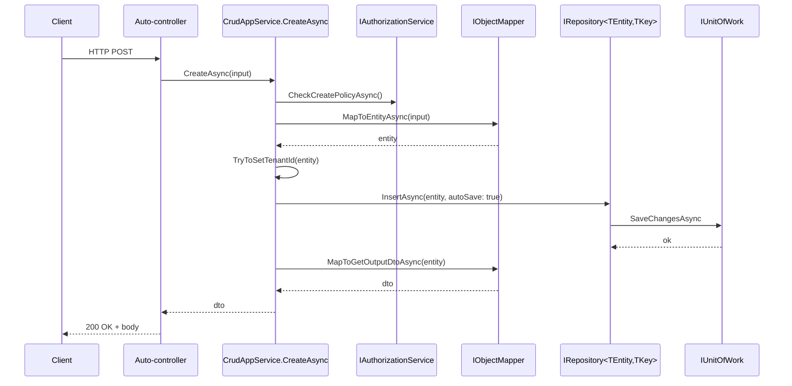

`Volo.Abp.Ddd.Application` ships the runtime side of the application layer:
the `ApplicationService` base class with its rich set of property-injected
services, and the `CrudAppService` / `ReadOnlyAppService` templates that
turn a repository into a fully-featured HTTP API.

## The module

`framework/src/Volo.Abp.Ddd.Application/Volo/Abp/Application/AbpDddApplicationModule.cs`:

```csharp
[DependsOn(
    typeof(AbpDddDomainModule),
    typeof(AbpDddApplicationContractsModule),
    typeof(AbpSecurityModule),
    typeof(AbpObjectMappingModule),
    typeof(AbpValidationModule),
    typeof(AbpAuthorizationModule),
    typeof(AbpHttpAbstractionsModule),
    typeof(AbpSettingsModule),
    typeof(AbpFeaturesModule),
    typeof(AbpGlobalFeaturesModule)
)]
public class AbpDddApplicationModule : AbpModule
{
    public override void ConfigureServices(ServiceConfigurationContext context)
    {
        Configure<AbpApiDescriptionModelOptions>(options =>
        {
            options.IgnoredInterfaces.AddIfNotContains(typeof(IRemoteService));
            options.IgnoredInterfaces.AddIfNotContains(typeof(IApplicationService));
            options.IgnoredInterfaces.AddIfNotContains(typeof(IUnitOfWorkEnabled));
            options.IgnoredInterfaces.AddIfNotContains(typeof(IAuditingEnabled));
            options.IgnoredInterfaces.AddIfNotContains(typeof(IValidationEnabled));
            options.IgnoredInterfaces.AddIfNotContains(typeof(IGlobalFeatureCheckingEnabled));
        });
    }
}
```

The `AbpApiDescriptionModelOptions` step tells the OpenAPI / dynamic
HTTP-client generator to **not** treat these marker interfaces as
exposable service contracts — they are decorations, not the contract.

## `ApplicationService` base class

`framework/src/Volo.Abp.Ddd.Application/Volo/Abp/Application/Services/ApplicationService.cs`
inherits from a fistful of marker interfaces and exposes a long list of
lazy services:

```csharp
public abstract class ApplicationService :
    IApplicationService,
    IAvoidDuplicateCrossCuttingConcerns,
    IValidationEnabled,
    IUnitOfWorkEnabled,
    IAuditingEnabled,
    IGlobalFeatureCheckingEnabled,
    ITransientDependency
{
    public IAbpLazyServiceProvider LazyServiceProvider { get; set; } = default!;
    public List<string> AppliedCrossCuttingConcerns { get; } = new();
    public static string[] CommonPostfixes { get; set; } = { "AppService", "ApplicationService", "Service" };
    // ... lazy properties (next section)
}
```

### Marker interfaces

| Interface | What it switches on |
| --- | --- |
| `IApplicationService` | Marker — picked up by `AbpAspNetCoreMvcConventionalControllerOptions` for auto-controller generation. |
| `IRemoteService` (inherited) | Marker — auto-controller eligibility, dynamic HTTP client eligibility. |
| `IAvoidDuplicateCrossCuttingConcerns` | Tracks `AppliedCrossCuttingConcerns` to prevent duplicate validation / authorization when a service calls another. |
| `IValidationEnabled` | Activates the `ValidationInterceptor` — input DTOs are validated via `IValidator`s. |
| `IUnitOfWorkEnabled` | Activates the `UnitOfWorkInterceptor` — a UoW is opened around each public method. |
| `IAuditingEnabled` | Activates the `AuditingInterceptor`. |
| `IGlobalFeatureCheckingEnabled` | Triggers `RequiresGlobalFeatureAttribute` checks. |
| `ITransientDependency` | Conventional registration as `Transient`. |

### Property-injected services

Every property is resolved via `LazyServiceProvider.LazyGetRequiredService<T>()`
the first time it is accessed:

| Property | Type | Source |
| --- | --- | --- |
| `LazyServiceProvider` | `IAbpLazyServiceProvider` | property-injected by DI. |
| `UnitOfWorkManager` | `IUnitOfWorkManager` | `Volo.Abp.Uow`. |
| `AsyncExecuter` | `IAsyncQueryableExecuter` | `Volo.Abp.Linq`. |
| `ObjectMapper` | `IObjectMapper` (or `IObjectMapper<TContext>` if `ObjectMapperContext` is set) | `Volo.Abp.ObjectMapping`. |
| `GuidGenerator` | `IGuidGenerator` (fallback `SimpleGuidGenerator.Instance`) | `Volo.Abp.Guids`. |
| `LoggerFactory` | `ILoggerFactory` | M.E.L. |
| `CurrentTenant` | `ICurrentTenant` | `Volo.Abp.MultiTenancy`. |
| `DataFilter` | `IDataFilter` | `Volo.Abp.Data`. |
| `CurrentUser` | `ICurrentUser` | `Volo.Abp.Security`. |
| `SettingProvider` | `ISettingProvider` | `Volo.Abp.Settings`. |
| `Clock` | `IClock` | `Volo.Abp.Timing`. |
| `AuthorizationService` | `IAuthorizationService` | `Microsoft.AspNetCore.Authorization`. |
| `FeatureChecker` | `IFeatureChecker` | `Volo.Abp.Features`. |
| `StringLocalizerFactory` | `IStringLocalizerFactory` | M.E.L. |
| `Logger` | `ILogger` typed on the runtime class | computed. |
| `L` | `IStringLocalizer` for the current `LocalizationResource` (defaults to `DefaultResource`) | computed via `CreateLocalizer()`. |
| `CurrentUnitOfWork` | `IUnitOfWork?` | shortcut for `UnitOfWorkManager?.Current`. |

### `LocalizationResource` and `L`

```csharp
protected Type? LocalizationResource
{
    get => _localizationResource;
    set { _localizationResource = value; _localizer = null; }
}
```

Set this in your derived class's constructor (or a property initializer) to
point at the module's resource class:

```csharp
public class CatalogAppServiceBase : ApplicationService
{
    protected CatalogAppServiceBase() { LocalizationResource = typeof(CatalogResource); }
}
```

If `LocalizationResource == null` and no `DefaultResource` is configured,
accessing `L` throws `AbpException` with a clear "Set
LocalizationResource…" message.

### `ObjectMapperContext`

Set `ObjectMapperContext = typeof(MyModuleApplicationModule);` in your
base class so `ObjectMapper` resolves to
`IObjectMapper<MyModuleApplicationModule>`. This lets multiple modules
register isolated mapper profiles without colliding on a shared
`IObjectMapper`. See [DTOs and Object Mapping](/ddd/dtos-and-object-mapping).

### `CheckPolicyAsync` helper

```csharp
protected virtual async Task CheckPolicyAsync(string? policyName)
{
    if (string.IsNullOrEmpty(policyName)) return;
    await AuthorizationService.CheckAsync(policyName!);
}
```

Used by `CrudAppService` to enforce `CreatePolicyName`, `UpdatePolicyName`,
`DeletePolicyName`, `GetPolicyName`, `GetListPolicyName`. Throws
`AbpAuthorizationException` on failure.

## CrudAppService generic ladder

`framework/src/Volo.Abp.Ddd.Application/Volo/Abp/Application/Services/CrudAppService.cs`
provides five overloads that progressively widen the customisation surface:

| Overload | Generic parameters |
| --- | --- |
| Simplest | `CrudAppService<TEntity, TEntityDto, TKey>` |
| Custom list input | `<TEntity, TEntityDto, TKey, TGetListInput>` |
| Custom create input | `<TEntity, TEntityDto, TKey, TGetListInput, TCreateInput>` |
| Distinct create vs update input | `<TEntity, TEntityDto, TKey, TGetListInput, TCreateInput, TUpdateInput>` |
| Distinct get vs list output | `<TEntity, TGetOutputDto, TGetListOutputDto, TKey, TGetListInput, TCreateInput, TUpdateInput>` |

The first four chain into the fifth, each adding a default for one
parameter. The fully-specified form derives from
`AbstractKeyCrudAppService<...>` which is the actual implementation.

### Common constraints

```csharp
where TEntity : class, IEntity<TKey>
```

The service holds two repository references:

```csharp
protected new IRepository<TEntity, TKey> Repository { get; }

protected CrudAppService(IRepository<TEntity, TKey> repository) : base(repository)
{
    Repository = repository;
}
```

### Overridable hooks

| Override | Default behaviour |
| --- | --- |
| `MapToEntity(TUpdateInput, TEntity)` | If `TUpdateInput is IEntityDto<TKey>`, sets `entityDto.Id = entity.Id` first, then calls `base.MapToEntity`. |
| `MapToGetOutputDto(TEntity)` | Uses `ObjectMapper`. |
| `MapToGetOutputDtoAsync(TEntity)` | Default returns synchronous `MapToGetOutputDto`. |
| `MapToGetListOutputDto(TEntity)` | When `TGetListOutputDto == TGetOutputDto`, falls back to `MapToGetOutputDto`. |
| `ApplyDefaultSorting(IQueryable)` | If `TEntity : IHasCreationTime`, orders by `CreationTime` descending. Otherwise orders by `Id` descending. |
| `ApplyPaging(IQueryable, TGetListInput)` | Honours `IPagedResultRequest.SkipCount` + `MaxResultCount`, capped by `LimitedResultRequestDto.MaxMaxResultCount`. |
| `ApplySorting(IQueryable, TGetListInput)` | If `TGetListInput : ISortedResultRequest`, applies the `Sorting` string via Dynamic LINQ. |
| `CreateFilteredQueryAsync(TGetListInput)` | Default returns the unfiltered queryable. **Override this to add `Where(...)` clauses.** |
| `GetEntityByIdAsync(TKey)` | Calls `Repository.GetAsync(id)`. |
| `DeleteByIdAsync(TKey)` | Calls `Repository.DeleteAsync(id)`. |

### Policy properties

```csharp
protected virtual string? CreatePolicyName { get; set; }
protected virtual string? UpdatePolicyName { get; set; }
protected virtual string? DeletePolicyName { get; set; }
protected virtual string? GetPolicyName { get; set; }
protected virtual string? GetListPolicyName { get; set; }
```

Set them in the constructor (e.g. `CreatePolicyName = CatalogPermissions.Products.Create;`)
and the corresponding `CheckCreatePolicyAsync` / `CheckUpdatePolicyAsync` /
… methods will call `CheckPolicyAsync(...)` automatically before each
operation.

### Public surface produced by the full overload

```csharp
public virtual Task<TGetOutputDto> CreateAsync(TCreateInput input);
public virtual Task<TGetOutputDto> UpdateAsync(TKey id, TUpdateInput input);
public virtual Task DeleteAsync(TKey id);
public virtual Task<TGetOutputDto> GetAsync(TKey id);
public virtual Task<PagedResultDto<TGetListOutputDto>> GetListAsync(TGetListInput input);
```

Each method runs through a fixed pipeline:



## `ReadOnlyAppService` ladder

`framework/src/Volo.Abp.Ddd.Application/Volo/Abp/Application/Services/ReadOnlyAppService.cs`
mirrors `CrudAppService` but uses `IReadOnlyRepository<TEntity, TKey>` and
exposes only `GetAsync` / `GetListAsync`. Three generic-arity overloads
chain into `AbstractKeyReadOnlyAppService<...>`:

| Overload | Use when |
| --- | --- |
| `ReadOnlyAppService<TEntity, TEntityDto, TKey>` | Single DTO, default paging input. |
| `<TEntity, TEntityDto, TKey, TGetListInput>` | Custom list input. |
| `<TEntity, TGetOutputDto, TGetListOutputDto, TKey, TGetListInput>` | Distinct get vs list output. |

Default sort: by `CreationTime` desc when `TEntity : ICreationAuditedObject`,
otherwise by `Id` desc.

## `AbstractKeyCrudAppService`

`framework/src/Volo.Abp.Ddd.Application/Volo/Abp/Application/Services/AbstractKeyCrudAppService.cs`
relaxes the `IEntity<TKey>` constraint to `IEntity` and lets you define
`GetEntityByIdAsync` / `DeleteByIdAsync` yourself when the entity has a
composite key:

```csharp
public abstract class AbstractKeyCrudAppService<TEntity, TGetOutputDto, TGetListOutputDto,
        TKey, TGetListInput, TCreateInput, TUpdateInput>
    : AbstractKeyReadOnlyAppService<...>,
      ICrudAppService<TGetOutputDto, TGetListOutputDto, TKey, TGetListInput, TCreateInput, TUpdateInput>
    where TEntity : class, IEntity
{
    protected IRepository<TEntity> Repository { get; }
    protected virtual string? CreatePolicyName { get; set; }
    protected virtual string? UpdatePolicyName { get; set; }
    protected virtual string? DeletePolicyName { get; set; }

    public virtual async Task<TGetOutputDto> CreateAsync(TCreateInput input)
    {
        await CheckCreatePolicyAsync();
        var entity = await MapToEntityAsync(input);
        TryToSetTenantId(entity);
        await Repository.InsertAsync(entity, autoSave: true);
        return await MapToGetOutputDtoAsync(entity);
    }
    // ...
}
```

Use this base for entities like `IdentityUserRole` that have composite keys
`(UserId, RoleId)` and don't fit `IEntity<TKey>`.

## Cross-cutting concerns at runtime

When a service implements the marker interfaces, ABP's dynamic-proxy
interceptors fire around every public method. Each interceptor short-circuits
if it sees its own name already in `AppliedCrossCuttingConcerns`, so a
service-to-service call inside the same scope isn't double-validated.


See [Cross-cutting Auditing](/crosscut/auditing),
[Validation](/crosscut/validation), [Unit of Work](/data/unit-of-work) for
the interceptor details.

## Writing a CRUD app service from scratch

<Steps>
<Step title="Define the contract">
  ```csharp
  // In Application.Contracts
  public interface IProductAppService :
      ICrudAppService<ProductDto, Guid, GetProductListInput, CreateProductDto, UpdateProductDto>
  { }
  ```
</Step>
<Step title="Subclass CrudAppService in Application">
  ```csharp
  public class ProductAppService :
      CrudAppService<Product, ProductDto, Guid, GetProductListInput, CreateProductDto, UpdateProductDto>,
      IProductAppService
  {
      public ProductAppService(IRepository<Product, Guid> repo) : base(repo)
      {
          GetPolicyName     = CatalogPermissions.Products.Default;
          GetListPolicyName = CatalogPermissions.Products.Default;
          CreatePolicyName  = CatalogPermissions.Products.Create;
          UpdatePolicyName  = CatalogPermissions.Products.Update;
          DeletePolicyName  = CatalogPermissions.Products.Delete;
          LocalizationResource = typeof(CatalogResource);
      }

      protected override async Task<IQueryable<Product>> CreateFilteredQueryAsync(GetProductListInput input)
      {
          var query = await Repository.GetQueryableAsync();
          return query
              .WhereIf(!string.IsNullOrWhiteSpace(input.Filter),
                       p => p.Name.Contains(input.Filter!));
      }
  }
  ```
</Step>
<Step title="Register AutoMapper profile">
  ```csharp
  public class CatalogApplicationAutoMapperProfile : Profile
  {
      public CatalogApplicationAutoMapperProfile()
      {
          CreateMap<Product, ProductDto>();
          CreateMap<CreateProductDto, Product>(MemberList.Source).IgnoreFullAuditedObjectProperties();
          CreateMap<UpdateProductDto, Product>(MemberList.Source).IgnoreFullAuditedObjectProperties();
      }
  }
  ```
</Step>
<Step title="That's it — the auto-controller will expose /api/catalog/products">
  GET, POST, PUT, DELETE — including pagination and sorting — without
  writing a controller. See [MVC Integration](/aspnetcore/mvc-integration).
</Step>
</Steps>

## Extension points

| Hook | Use case |
| --- | --- |
| Override `CreateFilteredQueryAsync` | Inject filters (search text, dropdowns). |
| Override `MapToEntityAsync` / `MapToGetOutputDtoAsync` | Async mapping (e.g. fetching extra data). |
| Override `GetEntityByIdAsync` | Use `WithDetailsAsync` for eager loading. |
| Override `ApplyDefaultSorting` | Module-specific default sort. |
| Override `CheckGetListPolicyAsync` | Multi-permission AND/OR checks. |
| Set `ObjectMapperContext` | Use a module-scoped `IObjectMapper<TContext>`. |
| Replace base via `[Dependency(ReplaceServices = true)]` | Override default behaviour wholesale. |

## Cross-references

- [Application.Contracts](/ddd/application-contracts) — DTOs and interfaces.
- [DTOs and Object Mapping](/ddd/dtos-and-object-mapping) — `IObjectMapper`
  resolution.
- [Domain Services](/ddd/domain-services) — typical collaborator.
- [Repositories](/ddd/repositories) — what the app service consumes.
- [Unit of Work](/data/unit-of-work) — `IUnitOfWorkEnabled` semantics.
- [MVC Integration](/aspnetcore/mvc-integration) — auto-controller generation
  driven by `IApplicationService`.
- [Auditing](/crosscut/auditing) — `IAuditingEnabled` semantics.
