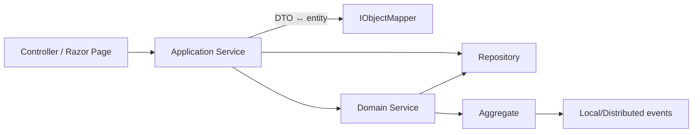

A *domain service* hosts business operations that don't naturally belong on a
single aggregate — usually because they touch multiple aggregates, depend on
external services (clock, GUID generator), or encapsulate a process. ABP
gives you a tiny base class and a convention-based registration mechanism;
the rest is just plain C#.

## The contract: `IDomainService`

`framework/src/Volo.Abp.Ddd.Domain/Volo/Abp/Domain/Services/IDomainService.cs`:

```csharp
public interface IDomainService : ITransientDependency
{
}
```

Two things to note:

1. It is a **marker interface** — no members.
2. It extends `ITransientDependency`, so any class implementing it gets
   auto-registered by `DefaultConventionalRegistrar` with
   `ServiceLifetime.Transient` lifetime.

A class implementing `IDomainService` doesn't need an attribute — it just
shows up in the DI container.

## The base class: `DomainService`

`framework/src/Volo.Abp.Ddd.Domain/Volo/Abp/Domain/Services/DomainService.cs`:

```csharp
public abstract class DomainService : IDomainService
{
    public IAbpLazyServiceProvider LazyServiceProvider { get; set; } = default!;

    [Obsolete("Use LazyServiceProvider instead.")]
    public IServiceProvider ServiceProvider { get; set; } = default!;

    protected IClock Clock => LazyServiceProvider.LazyGetRequiredService<IClock>();
    protected IGuidGenerator GuidGenerator => LazyServiceProvider.LazyGetService<IGuidGenerator>(SimpleGuidGenerator.Instance);
    protected ILoggerFactory LoggerFactory => LazyServiceProvider.LazyGetRequiredService<ILoggerFactory>();
    protected ICurrentTenant CurrentTenant => LazyServiceProvider.LazyGetRequiredService<ICurrentTenant>();
    protected IAsyncQueryableExecuter AsyncExecuter => LazyServiceProvider.LazyGetRequiredService<IAsyncQueryableExecuter>();
    protected ILogger Logger => LazyServiceProvider.LazyGetService<ILogger>(
        provider => LoggerFactory?.CreateLogger(GetType().FullName!) ?? NullLogger.Instance);
}
```

Six services are lazy-resolved via `IAbpLazyServiceProvider`:

| Property | Service | Source |
| --- | --- | --- |
| `Clock` | `IClock` | `framework/src/Volo.Abp.Timing/` |
| `GuidGenerator` | `IGuidGenerator` (fallback `SimpleGuidGenerator.Instance`) | `framework/src/Volo.Abp.Guids/` |
| `LoggerFactory` | `ILoggerFactory` | `Microsoft.Extensions.Logging` |
| `CurrentTenant` | `ICurrentTenant` | `framework/src/Volo.Abp.MultiTenancy/` |
| `AsyncExecuter` | `IAsyncQueryableExecuter` | `framework/src/Volo.Abp.Linq/` |
| `Logger` | `ILogger` typed on the runtime class | computed |

`LazyServiceProvider` is **property-injected**, not constructor-injected,
because subclasses tend to add many repositories to their constructors and
forcing `LazyServiceProvider` into every base() call would be noisy.

<Tip>
You can add new lazy properties in your own base class — e.g. expose
`IDistributedEventBus` or `IDistributedCache<TCacheItem>` — using the same
`LazyServiceProvider.LazyGetRequiredService<T>()` pattern. The pattern lets
subclasses opt in to a service without paying construction cost.
</Tip>

## Naming convention: the `*Manager` suffix

Volo modules name domain services after the aggregate they manage:

| File | Domain service |
| --- | --- |
| `modules/identity/src/Volo.Abp.Identity.Domain/Volo/Abp/Identity/IdentityUserManager.cs` | `IdentityUserManager` |
| `modules/identity/src/Volo.Abp.Identity.Domain/Volo/Abp/Identity/IdentityRoleManager.cs` | `IdentityRoleManager` |
| `modules/identity/src/Volo.Abp.Identity.Domain/Volo/Abp/Identity/OrganizationUnitManager.cs` | `OrganizationUnitManager` |
| `modules/identity/src/Volo.Abp.Identity.Domain/Volo/Abp/Identity/IdentityUserDelegationManager.cs` | `IdentityUserDelegationManager` |
| `modules/tenant-management/src/Volo.Abp.TenantManagement.Domain/Volo/Abp/TenantManagement/TenantManager.cs` | `TenantManager` |
| `modules/feature-management/src/Volo.Abp.FeatureManagement.Domain/Volo/Abp/FeatureManagement/FeatureValueManager.cs` | `FeatureValueManager` |

<Note>
"Manager" is Volo's convention. DDD literature sometimes uses "Service" or
"Workflow" — pick a suffix and stay consistent across your codebase.
</Note>

## Canonical example: `IdentityUserManager`

`modules/identity/src/Volo.Abp.Identity.Domain/Volo/Abp/Identity/IdentityUserManager.cs`
inherits from ASP.NET Core Identity's `UserManager<IdentityUser>` *and*
implements `IDomainService` so it gets conventional DI registration:

```csharp
public class IdentityUserManager : UserManager<IdentityUser>, IDomainService
{
    protected IIdentityRoleRepository RoleRepository { get; }
    protected IIdentityUserRepository UserRepository { get; }
    protected IOrganizationUnitRepository OrganizationUnitRepository { get; }
    protected ISettingProvider SettingProvider { get; }
    protected ICancellationTokenProvider CancellationTokenProvider { get; }
    protected IDistributedEventBus DistributedEventBus { get; }
    protected IIdentityLinkUserRepository IdentityLinkUserRepository { get; }
    protected IDistributedCache<AbpDynamicClaimCacheItem> DynamicClaimCache { get; }
    protected override CancellationToken CancellationToken => CancellationTokenProvider.Token;
    protected IOptions<AbpMultiTenancyOptions> MultiTenancyOptions { get; }
    protected ICurrentTenant CurrentTenant { get; }
    protected IDataFilter DataFilter { get; }

    public IdentityUserManager(
        IdentityUserStore store,
        IIdentityRoleRepository roleRepository,
        IIdentityUserRepository userRepository,
        IOptions<IdentityOptions> optionsAccessor,
        IPasswordHasher<IdentityUser> passwordHasher,
        IEnumerable<IUserValidator<IdentityUser>> userValidators,
        IEnumerable<IPasswordValidator<IdentityUser>> passwordValidators,
        ILookupNormalizer keyNormalizer,
        IdentityErrorDescriber errors,
        IServiceProvider services,
        ILogger<IdentityUserManager> logger,
        ICancellationTokenProvider cancellationTokenProvider,
        IOrganizationUnitRepository organizationUnitRepository,
        ISettingProvider settingProvider,
        IDistributedEventBus distributedEventBus,
        IIdentityLinkUserRepository identityLinkUserRepository,
        IDistributedCache<AbpDynamicClaimCacheItem> dynamicClaimCache,
        IOptions<AbpMultiTenancyOptions> multiTenancyOptions,
        ICurrentTenant currentTenant,
        IDataFilter dataFilter)
        : base(store, optionsAccessor, passwordHasher, userValidators,
               passwordValidators, keyNormalizer, errors, services, logger)
    { /* assigns the protected properties */ }

    // Domain methods (excerpt):
    public virtual async Task<IdentityResult> CreateAsync(IdentityUser user, string password,
        bool validatePassword = true) { ... }

    public virtual async Task<IdentityResult> SetRolesAsync(IdentityUser user,
        IEnumerable<string> roleNames) { ... }
}
```

Two things this example shows:

1. **You can inherit from any framework type** and still get conventional
   registration — `IdentityUserManager` derives from ASP.NET Core Identity's
   non-Abp class but registers with `IDomainService`.
2. **Constructor injection is the norm** when the service holds many
   dependencies that are *always* used. `LazyServiceProvider` is reserved for
   optional / rarely-used services to keep startup snappy.

### Helper application-service consumer

Application services consume domain services like any other DI service:

```csharp
public class IdentityUserAppService : IdentityAppServiceBase, IIdentityUserAppService
{
    protected IdentityUserManager UserManager { get; }
    public IdentityUserAppService(IdentityUserManager userManager, ...) { UserManager = userManager; }

    public async Task<IdentityUserDto> CreateAsync(IdentityUserCreateDto input)
    {
        var user = new IdentityUser(GuidGenerator.Create(), input.UserName,
                                    input.Email, CurrentTenant.Id);
        (await UserManager.CreateAsync(user, input.Password)).CheckErrors();
        // ... map and return
    }
}
```

See `modules/identity/src/Volo.Abp.Identity.Application/Volo/Abp/Identity/IdentityUserAppService.cs`.

## Customising the exposed services

If you want to expose your domain service under multiple interfaces or
provide an alternative implementation, override the default registration
with the `[ExposeServices]` and `[Dependency]` attributes from
`Volo.Abp.DependencyInjection`:

```csharp
[ExposeServices(typeof(ProductManager), typeof(IProductValidator))]
[Dependency(ReplaceServices = true)]
public class ProductManager : DomainService, IProductValidator { ... }
```

`ExposeServices` is consumed by `DefaultConventionalRegistrar` in
`framework/src/Volo.Abp.Core/Volo/Abp/DependencyInjection/`. Without it,
the class is exposed only under its own type and any interfaces it
implements that are conventionally registrable.

`[Dependency(ReplaceServices = true)]` causes the registrar to **replace**
prior registrations of the same service type — useful when you ship a
module that replaces the default `IdentityUserManager` with a subclass.

## Domain service vs application service

| Concern | Domain service | Application service |
| --- | --- | --- |
| Lives in | `*.Domain` | `*.Application` |
| Base class | `DomainService` | `ApplicationService` |
| Concerned with | Aggregate invariants, cross-aggregate logic | Use cases, DTO mapping, transactions, authorization checks |
| Returns | Aggregates / value objects | DTOs |
| Authorization checks | No | Yes (via `IAuthorizationService` / `[Authorize]`) |
| Transaction boundary | No — relies on caller's UoW | Yes — `[UnitOfWork]` / `IUnitOfWorkEnabled` |
| Should know about HTTP / DTOs | No | Yes |



## Common pitfalls

<Warning>
**Don't return DTOs from a domain service.** Mapping is the application
service's job. Returning DTOs blurs the boundary and makes the domain
service un-reusable by other domain code.
</Warning>

<Warning>
**Don't call `IAuthorizationService.AuthorizeAsync` from a domain service.**
Authorization is a request-scoped concern. If you find yourself needing it,
you probably have an *application* service.
</Warning>

<Warning>
**Don't open a `UnitOfWork` explicitly.** Domain services should rely on the
ambient UoW opened by the calling application service. If you must open one
(e.g. background work), do it from the application layer using
`IUnitOfWorkManager.Begin`.
</Warning>

## Recipe: writing your own domain service

<Steps>
<Step title="Inherit from DomainService">
  ```csharp
  public class ProductManager : DomainService { }
  ```
</Step>
<Step title="Inject repositories and required services">
  ```csharp
  public class ProductManager : DomainService
  {
      private readonly IRepository<Product, Guid> _productRepo;
      public ProductManager(IRepository<Product, Guid> productRepo)
      { _productRepo = productRepo; }
  }
  ```
</Step>
<Step title="Add domain methods that enforce invariants">
  ```csharp
  public async Task<Product> CreateAsync(string code, string name)
  {
      if (await _productRepo.AnyAsync(p => p.Code == code))
          throw new BusinessException(MyModuleErrorCodes.DuplicateProductCode)
              .WithData("code", code);

      return await _productRepo.InsertAsync(
          new Product(GuidGenerator.Create(), code, name, Clock.Now), autoSave: true);
  }
  ```
</Step>
<Step title="(Optional) Raise local/distributed events from the aggregate, not from the manager">
  ```csharp
  // inside Product aggregate
  public void Rename(string newName)
  {
      var old = Name; Name = newName;
      AddLocalEvent(new ProductRenamedEvent(Id, old, newName));
  }
  ```
</Step>
<Step title="(Optional) Replace via ExposeServices / Dependency">
  Ship a subclass with `[Dependency(ReplaceServices = true)]` from your
  module's Domain project to swap behaviour without forking the base module.
</Step>
</Steps>

## Cross-references

- [Entities and Aggregates](/ddd/entities-and-aggregates) — the aggregates a
  manager coordinates.
- [Repositories](/ddd/repositories) — repositories injected into managers.
- [Application Services](/ddd/application-services) — typical caller.
- [Modularity System](/core/modularity-system) — how `IDomainService`
  registration plugs into the conventional registrar.
- [DDD Overview](/ddd/overview) — where domain services sit in the layering.
