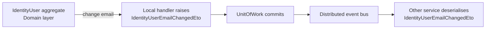

`Volo.Abp.Ddd.Domain.Shared` is the smallest, most-referenced project in any
ABP solution. It contains primitives — constants, enums, error codes,
localization keys, ETOs (Event Transfer Objects) — that **every** other layer
needs to share, including HTTP API clients running in a browser. Because every
other layer references it, you should keep it small and free of behaviour.

The framework's own Domain.Shared module is defined at
`framework/src/Volo.Abp.Ddd.Domain.Shared/Volo/Abp/Domain/AbpDddDomainSharedModule.cs`:

```csharp
[DependsOn(
    typeof(AbpMultiTenancyAbstractionsModule),
    typeof(AbpEventBusAbstractionsModule)
)]
public class AbpDddDomainSharedModule : AbpModule { }
```

Two minimal abstraction modules — multi-tenancy + event bus — are the only
things Domain.Shared can lean on. This is intentional: the project must remain
reference-light because Blazor WebAssembly clients pull it transitively via
`HttpApi.Client → Application.Contracts → Domain.Shared`.

## What belongs in Domain.Shared

<CardGroup cols={2}>
<Card title="Constants" icon="ruler">
  Column lengths, regex patterns, default values shared by entities and DTOs.
  Suffix the class with `Consts`.
</Card>
<Card title="Enums" icon="list">
  Type discriminators visible to both server and clients.
</Card>
<Card title="Error codes" icon="triangle-exclamation">
  Stable string codes thrown via `BusinessException`. Suffix the class with
  `ErrorCodes`.
</Card>
<Card title="Localization" icon="language">
  The `*Resource` class + embedded JSON dictionaries.
</Card>
<Card title="Setting / permission names" icon="key">
  Static classes with `const string` values. (Permission *definition providers*
  live in `Application.Contracts`.)
</Card>
<Card title="ETOs" icon="paper-plane">
  Plain POCO types used by the distributed event bus for cross-service events.
</Card>
</CardGroup>

## Canonical example: `Volo.Abp.Identity.Domain.Shared`

Open `modules/identity/src/Volo.Abp.Identity.Domain.Shared/Volo/Abp/Identity/`
to see the canonical layout. The folder is intentionally flat — no subfolders
for `Entities/` or `Repositories/`, because behaviour does not live here.

### Constants

`IdentityUserConsts.cs` exposes mutable static `int` properties used by entity
configurations and DTO validation attributes:

```csharp
public static class IdentityUserConsts
{
    public static int MaxUserNameLength { get; set; } = AbpUserConsts.MaxUserNameLength;
    public static int MaxNameLength { get; set; } = AbpUserConsts.MaxNameLength;
    public static int MaxEmailLength { get; set; } = AbpUserConsts.MaxEmailLength;
    public static int MaxPasswordLength { get; set; } = 128;
    public static int MaxPasswordHashLength { get; set; } = 256;
    public static int MaxSecurityStampLength { get; set; } = 256;
    // ...
}
```

<Tip>
Make these `static` *properties* with setters (not `const`) so applications can
override them in `PreConfigureServices` before any DbContext or DTO model
binder reads them. Entity configurations and `[StringLength]` attributes will
pick up whatever value is in place when the type is first reflected.
</Tip>

Other examples in the same folder:

| File | Purpose |
| --- | --- |
| `IdentityRoleConsts.cs` | Role name length limits. |
| `IdentityClaimTypeConsts.cs` | Claim name / value length limits. |
| `IdentityRoleClaimConsts.cs` | Role-claim composite-key constants. |
| `IdentityUserClaimConsts.cs` | User-claim length limits. |
| `IdentityUserLoginConsts.cs` | External login provider key limits. |
| `IdentityUserTokenConsts.cs` | Two-factor token limits. |
| `IdentityUserPasskeyConsts.cs` | Passkey credential id / public-key limits. |
| `IdentityUserPasswordHistoriesConsts.cs` | Password history limits. |
| `IdentitySessionConsts.cs` | Active session record limits. |
| `IdentitySecurityLogConsts.cs` | Security log column limits. |
| `IdentitySecurityLogActionConsts.cs` | Stable string codes for log actions. |
| `IdentitySecurityLogIdentityConsts.cs` | Identity-specific log action strings. |
| `OrganizationUnitConsts.cs` | OU display-name / code limits. |
| `LinkUserTokenProviderConsts.cs` | Link-user token provider strings. |

### Enums

`IdentityClaimValueType.cs` is the textbook example — a value-type
discriminator both the server and the UI need to agree on:

```csharp
namespace Volo.Abp.Identity;

public enum IdentityClaimValueType
{
    String,
    Int,
    Boolean,
    DateTime
}
```

### Error codes

`IdentityErrorCodes.cs` exposes stable, namespaced string codes used by
`BusinessException`:

```csharp
public static class IdentityErrorCodes
{
    public const string UserSelfDeletion          = "Volo.Abp.Identity:010001";
    public const string MaxAllowedOuMembership    = "Volo.Abp.Identity:010002";
    public const string ExternalUserPasswordChange = "Volo.Abp.Identity:010003";
    public const string DuplicateOrganizationUnitDisplayName = "Volo.Abp.Identity:010004";
    public const string StaticRoleRenaming        = "Volo.Abp.Identity:010005";
    public const string StaticRoleDeletion        = "Volo.Abp.Identity:010006";
    public const string UsersCanNotChangeTwoFactor = "Volo.Abp.Identity:010007";
    public const string CanNotChangeTwoFactor     = "Volo.Abp.Identity:010008";
    public const string YouCannotDelegateYourself = "Volo.Abp.Identity:010009";
    public const string ClaimNameExist            = "Volo.Abp.Identity:010021";
    public const string CanNotUpdateStaticClaimType = "Volo.Abp.Identity:010022";
    public const string CanNotDeleteStaticClaimType = "Volo.Abp.Identity:010023";
}
```

Code format is `<RootNamespace>:<NNNNNN>`. The framework's exception subsystem
resolves the code into a localized message via the
`{Volo.Abp.Identity:010001}` lookup key in the localization JSON.

### Localization resource class

`Localization/IdentityResource.cs` is a marker class — the localization module
discovers JSON files by walking up the assembly tree from the
`[LocalizationResourceName]` attribute. The companion JSON files sit in
`Localization/Resources/Identity/*.json` and are embedded via
`AbpVirtualFileSystemOptions.AddEmbedded`.

The resource is registered in `AbpIdentityDomainSharedModule.ConfigureServices`:

```csharp
Configure<AbpLocalizationOptions>(options =>
{
    options.Resources
        .Add<IdentityResource>("en")
        .AddVirtualJson("/Volo/Abp/Identity/Localization/Resources/Identity");
});
```

See [Localization](/crosscut/localization) for the full picture.

### Settings name constants

`Settings/IdentitySettingNames.cs` holds `const string` setting keys. Storing
them in Domain.Shared lets both the *definition provider* (in
Application.Contracts) and the *consumer* code (in Domain / Application) agree
on the same key without circular references.

## ETOs (Event Transfer Objects)

ABP's distributed event bus serialises events as ETOs. The base types live in
`framework/src/Volo.Abp.Ddd.Domain.Shared/Volo/Abp/Domain/Entities/Events/Distributed/`:

| File | Type | Purpose |
| --- | --- | --- |
| `IEntityEto.cs` | `IEntityEto<TKey>` | Marker for any keyed ETO. |
| `EntityEto.cs` | `EntityEto` / `EntityEto<TKey>` | Base for module-specific ETOs. |
| `EntityCreatedEto.cs` | `EntityCreatedEto<TEntityEto>` | Generic wrapper for "created" payloads. |
| `EntityUpdatedEto.cs` | `EntityUpdatedEto<TEntityEto>` | Generic wrapper for "updated" payloads. |
| `EntityDeletedEto.cs` | `EntityDeletedEto<TEntityEto>` | Generic wrapper for "deleted" payloads. |
| `IEntityToEtoMapper.cs` | `IEntityToEtoMapper` | Service that turns an entity into its ETO. |
| `EtoMappingDictionary.cs` | `EtoMappingDictionary` | Entity-type → ETO-type registry. |
| `EtoMappingDictionaryItem.cs` | `EtoMappingDictionaryItem` | Single mapping. |
| `IAutoEntityDistributedEventSelectorList.cs` + `AutoEntityDistributedEventSelectorList.cs` | Selector list | Filters which entities auto-publish. |
| `AbpDistributedEntityEventOptions.cs` | Options class | Holds the selectors + the `EtoMappings` dictionary. |

Concrete ETOs for Identity sit alongside the constants — they are part of
Domain.Shared because *subscribers in other services* must deserialise them:

```
modules/identity/src/Volo.Abp.Identity.Domain.Shared/Volo/Abp/Identity/
├── IdentityClaimTypeEto.cs
├── IdentityRoleEto.cs
├── IdentityRoleNameChangedEto.cs
├── IdentityUserEmailChangedEto.cs
├── IdentityUserPasswordChangedEto.cs
├── IdentityUserUserNameChangedEto.cs
└── OrganizationUnitEto.cs
```



<Note>
The ETO **types** are in Domain.Shared but the **publishing** logic (raising
`AddDistributedEvent` from an aggregate, or `EntityToEtoMapper` building the
payload at flush time) lives in Domain. Subscribers register handlers in
Application.
</Note>

## Pattern: `*Consts`, `*ErrorCodes`, `*EtoName`, `*Resource`

A diff-friendly convention used across every module:

| Suffix | Lives in | Example |
| --- | --- | --- |
| `Consts` | Domain.Shared | `IdentityUserConsts` |
| `ErrorCodes` | Domain.Shared | `IdentityErrorCodes` |
| `Eto` | Domain.Shared | `IdentityUserEmailChangedEto` |
| `Resource` | Domain.Shared | `IdentityResource` |
| `SettingNames` | Domain.Shared | `IdentitySettingNames` |
| `PermissionNames` | Application.Contracts | `IdentityPermissions` |
| `Manager` | Domain | `IdentityUserManager` |
| `AppService` | Application | `IdentityUserAppService` |
| `Dto` | Application.Contracts | `IdentityUserDto` |
| `Profile` (AutoMapper) | Application | `IdentityApplicationAutoMapperProfile` |

## When *not* to put something in Domain.Shared

<Warning>
Never reference an entity type, repository interface, or DTO from
Domain.Shared. Those live in higher layers. If you find yourself wanting
`using Volo.Abp.Domain.Entities;` in a Domain.Shared file, you almost
certainly need a new constant or an enum instead.
</Warning>

<Steps>
<Step title="If it has behaviour, move it to Domain">
  Anything with a method body that touches an aggregate belongs in a
  `*Manager` class in Domain.
</Step>
<Step title="If clients should not see it, move it to Domain">
  Internal invariants, hashing, validation rules. Domain.Shared is shipped
  to Blazor WebAssembly clients.
</Step>
<Step title="If it is a DTO, move it to Application.Contracts">
  Inputs and outputs of application services are DTOs, not domain
  primitives.
</Step>
<Step title="If it is a permission definition provider, move it to Application.Contracts">
  Only the **name** constants belong in Domain.Shared; the `PermissionDefinitionProvider`
  class belongs in Application.Contracts.
</Step>
</Steps>

## Sample folder layout for a new module

When creating `MyCompany.MyModule.Domain.Shared`:

```
MyCompany.MyModule.Domain.Shared/
└── MyCompany/MyModule/
    ├── MyModuleDomainSharedModule.cs         # AbpModule, DependsOn(AbpDddDomainSharedModule)
    ├── MyModuleConsts.cs                     # Strings, lengths
    ├── MyModuleErrorCodes.cs                 # "MyCompany.MyModule:000001"
    ├── MyModuleClaimType.cs                  # enum
    ├── Localization/
    │   ├── MyModuleResource.cs
    │   └── Resources/
    │       └── MyModule/
    │           ├── en.json
    │           └── tr.json
    ├── Settings/MyModuleSettingNames.cs
    └── Etos/
        ├── ProductCreatedEto.cs
        └── ProductDeletedEto.cs
```

## Cross-references

- [DDD Overview](/ddd/overview) for the four-layer split.
- [Domain layer](/ddd/domain) — where behaviour lives.
- [Application.Contracts](/ddd/application-contracts) — where DTOs and
  permission name strings live.
- [Modularity System](/core/modularity-system) — how `AbpDddDomainSharedModule`
  is discovered at startup.
