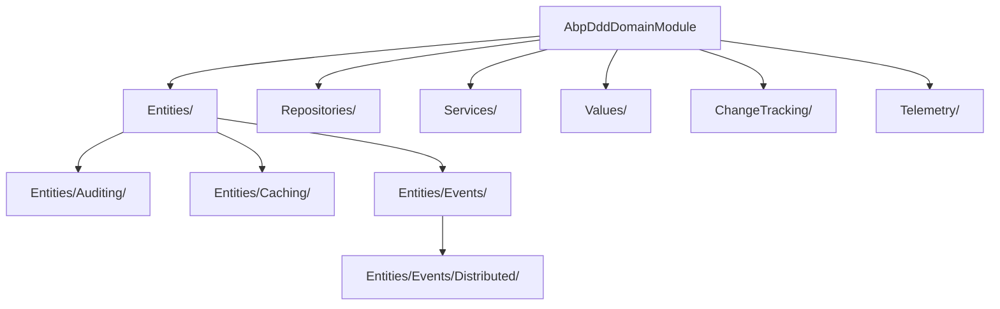

`Volo.Abp.Ddd.Domain` is where the business rules live. It defines the
abstractions every other layer relies on — `IEntity`, `IAggregateRoot`,
`IRepository<T>`, `IDomainService`, `ValueObject`, plus a set of
cross-cutting helpers for change tracking, domain events and telemetry.

Unlike Domain.Shared, this project carries actual behaviour and depends on
the major framework pillars: auditing, data, event bus, GUID generation,
clock, object mapping, exception handling, specifications and caching.

## The module

`framework/src/Volo.Abp.Ddd.Domain/Volo/Abp/Domain/AbpDddDomainModule.cs`:

```csharp
[DependsOn(
    typeof(AbpAuditingModule),
    typeof(AbpDataModule),
    typeof(AbpEventBusModule),
    typeof(AbpGuidsModule),
    typeof(AbpTimingModule),
    typeof(AbpObjectMappingModule),
    typeof(AbpExceptionHandlingModule),
    typeof(AbpSpecificationsModule),
    typeof(AbpCachingModule),
    typeof(AbpDddDomainSharedModule)
)]
public class AbpDddDomainModule : AbpModule
{
    public override void PreConfigureServices(ServiceConfigurationContext context)
    {
        context.Services.AddConventionalRegistrar(new AbpRepositoryConventionalRegistrar());
        context.Services.OnRegistered(ChangeTrackingInterceptorRegistrar.RegisterIfNeeded);
    }
}
```

Two startup hooks matter:

<Steps>
<Step title="AbpRepositoryConventionalRegistrar">
  Defined at `framework/src/Volo.Abp.Ddd.Domain/Volo/Abp/Domain/Repositories/AbpRepositoryConventionalRegistrar.cs`,
  this registrar specialises how repository classes are added to DI. By default,
  repository concrete classes are *not* exposed (`ExposeRepositoryClasses = false`)
  and only their interfaces are. Lifetime is `Transient`. Override by setting
  `AbpRepositoryConventionalRegistrar.ExposeRepositoryClasses = true` in
  `PreConfigureServices` if you need direct class injection.
</Step>
<Step title="ChangeTrackingInterceptorRegistrar">
  At `framework/src/Volo.Abp.Ddd.Domain/Volo/Abp/Domain/ChangeTracking/ChangeTrackingInterceptorRegistrar.cs`,
  hooked via `OnRegistered`. Adds the `ChangeTrackingInterceptor` to types
  marked with `[EntityChangeTrackingAttribute]` /
  `[EnableEntityChangeTrackingAttribute]`.
</Step>
</Steps>

## Folder map



### `Volo/Abp/Domain/Entities/`

| File | Symbol | Purpose |
| --- | --- | --- |
| `IEntity.cs` | `IEntity`, `IEntity<TKey>` | Marker for entity types. |
| `Entity.cs` | `Entity`, `Entity<TKey>` | Default base class. |
| `IAggregateRoot.cs` | `IAggregateRoot`, `IAggregateRoot<TKey>` | Marker for aggregate roots. |
| `BasicAggregateRoot.cs` | `BasicAggregateRoot`, `BasicAggregateRoot<TKey>` | Aggregate root **without** extra properties or concurrency stamp. |
| `AggregateRoot.cs` | `AggregateRoot`, `AggregateRoot<TKey>` | Aggregate root with `ExtraProperties` and `ConcurrencyStamp`. |
| `IGeneratesDomainEvents.cs` | `IGeneratesDomainEvents` | Contract for collecting local + distributed event records. |
| `DomainEventRecord.cs` | `DomainEventRecord` | Tuple of `EventData` + `EventOrder`. |
| `EntityHelper.cs` | static helpers | `EntityEquals`, `IsMultiTenant`, `HasDefaultKeys`, `TrySetTenantId`. |
| `DisableIdGenerationAttribute.cs` | attribute | Opts out of Guid generation. |
| `ConcurrencyStampConsts.cs` | constants | Column length for the stamp. |

The `Auditing/` sub-folder mirrors the same hierarchy with creation-,
audited- and full-audited variants. See
[Entities and Aggregates](/ddd/entities-and-aggregates) for the full table.

The `Caching/` sub-folder provides `IEntityCache<TEntity, TCacheItem, TKey>`
and `EntityCacheBase<...>` which cache entire entities behind
`IDistributedCache`. Files include:

| File | Purpose |
| --- | --- |
| `IEntityCache.cs` | The cache abstraction. |
| `EntityCacheBase.cs` | Base implementation with `IDistributedCache`. |
| `EntityCacheWithObjectMapper.cs` | Variant that maps entity → cache item via `IObjectMapper`. |
| `EntityCacheWithObjectMapperContext.cs` | Same, but with a typed mapper context. |
| `EntityCacheWithoutCacheItem.cs` | Caches the entity directly. |
| `EntityCacheItemWrapper.cs` | Wrapper supporting null caching. |
| `EntityCacheServiceCollectionExtensions.cs` | `services.AddEntityCache<...>()`. |

### `Volo/Abp/Domain/Entities/Events/`

Local domain events (in-process) and distributed events share base types:

| File | Symbol | Purpose |
| --- | --- | --- |
| `EntityCreatedEventData.cs` | `EntityCreatedEventData<TEntity>` | "Entity has been created" payload. |
| `EntityUpdatedEventData.cs` | `EntityUpdatedEventData<TEntity>` | Updated payload. |
| `EntityDeletedEventData.cs` | `EntityDeletedEventData<TEntity>` | Deleted payload. |
| `EntityChangedEventData.cs` | `EntityChangedEventData<TEntity>` | Generic "something changed" payload. |
| `EntityEventData.cs` | base | Wraps the entity instance. |
| `EntityChangeEntry.cs` | `EntityChangeEntry` | A single change recorded by the UoW. |
| `EntityEventReport.cs` | `EntityEventReport` | Bundle of local + distributed events. |
| `DomainEventEntry.cs` | `DomainEventEntry` | UoW-side record of an event awaiting publish. |
| `IEntityChangeEventHelper.cs` + `EntityChangeEventHelper.cs` | helper | Triggers entity-changed event handlers via the bus. |
| `EntitySelectorList.cs` + `EntitySelectorListExtensions.cs` | selectors | Filters which entity types raise auto events. |
| `AbpEntityChangeOptions.cs` | options | Holds publish/ignore selector lists. |

The `Distributed/` sub-folder is the publish-side companion of the ETO types
in Domain.Shared:

| File | Symbol | Purpose |
| --- | --- | --- |
| `EntityToEtoMapper.cs` | `EntityToEtoMapper` | Looks up `AbpDistributedEntityEventOptions.EtoMappings`, calls `IObjectMapper` to build the ETO. |
| `EntitySynchronizer.cs` | `EntitySynchronizer<TEntity, TEto>` | Generic handler for keeping a downstream entity in sync via incoming ETO. |
| `AutoEntityDistributedEventSelectorListExtensions.cs` | extension methods | `Add<TEntity>()`, `AddNamespace(...)`. |

### `Volo/Abp/Domain/Repositories/`

The full repository surface — interfaces, base classes, conventional
registrar — is the subject of [Repositories](/ddd/repositories). The files
are:

```text
Repositories/
├── AbpRepositoryConventionalRegistrar.cs
├── BasicRepositoryBase.cs
├── EntityChangeTrackingProvider.cs
├── IBasicRepository.cs
├── IEntityChangeTrackingProvider.cs
├── IReadOnlyBasicRepository.cs
├── IReadOnlyRepository.cs
├── IRepository.cs
├── ISupportsExplicitLoading.cs
├── RepositoryAsyncExtensions.cs
├── RepositoryBase.cs
├── RepositoryExtensions.cs
├── RepositoryRegistrarBase.cs
└── UnitOfWorkItemNames.cs
```

`framework/src/Volo.Abp.Ddd.Domain/Microsoft/Extensions/DependencyInjection/ServiceCollectionRepositoryExtensions.cs`
exposes the public `AddDefaultRepositories(...)` / `AddRepository<TEntity, TRepository>()`
methods you call from EF Core / Mongo registration code.

### `Volo/Abp/Domain/Services/`

Two files only:

| File | Symbol |
| --- | --- |
| `IDomainService.cs` | `IDomainService : ITransientDependency` |
| `DomainService.cs` | `DomainService` base class with `LazyServiceProvider` and lazy `Clock`, `GuidGenerator`, `LoggerFactory`, `CurrentTenant`, `AsyncExecuter`, `Logger`. |

See [Domain Services](/ddd/domain-services).

### `Volo/Abp/Domain/Values/`

Single file:

- `ValueObject.cs` — abstract base with `ValueEquals(object)` powered by
  the `GetAtomicValues()` template method. See
  [Value Objects and Specifications](/ddd/value-objects-and-specifications).

### `Volo/Abp/Domain/ChangeTracking/`

| File | Symbol | Purpose |
| --- | --- | --- |
| `ChangeTrackingHelper.cs` | `ChangeTrackingHelper` | Diff utility. |
| `ChangeTrackingInterceptor.cs` | `ChangeTrackingInterceptor` | Castle DynamicProxy interceptor. |
| `ChangeTrackingInterceptorRegistrar.cs` | static registrar | Hooked from `AbpDddDomainModule.PreConfigureServices`. |
| `EntityChangeTrackingAttribute.cs` | attribute | Marker for opt-in/out. |
| `EnableEntityChangeTrackingAttribute.cs` | attribute | Force-on. |
| `DisableEntityChangeTrackingAttribute.cs` | attribute | Force-off. |

### `Volo/Abp/Domain/Telemetry/`

`TelemetryDomainInfoEnricher.cs` augments OpenTelemetry traces with the
current aggregate / entity context — see [Telemetry / OpenTelemetry](/core/logging-and-tracing).

### `Volo/Abp/Auditing/`

A single file in the Domain project:
`framework/src/Volo.Abp.Ddd.Domain/Volo/Abp/Auditing/EntityHistorySelectorListExtensions.cs`
extends the audit-log subsystem so it can target specific entity types.

### `Volo/Abp/DependencyInjection/`

Helpers that make EF Core / Mongo registration consistent:

| File | Symbol |
| --- | --- |
| `AbpCommonDbContextRegistrationOptions.cs` | `AbpCommonDbContextRegistrationOptions` |
| `IAbpCommonDbContextRegistrationOptionsBuilder.cs` | builder interface |
| `MultiTenantDbContextType.cs` | enum `Host` / `Tenant` |
| `ReplaceDbContextAttribute.cs` | attribute used when multiple modules share a single DbContext |

`ReplaceDbContextAttribute` is what lets a host application unify, say,
`IIdentityDbContext`, `ITenantManagementDbContext` and
`IPermissionManagementDbContext` into a single physical DbContext. See
[Data Layer](/data/overview).

## Sample Domain project layout

A new `MyCompany.MyModule.Domain` project follows the same skeleton as the
identity module:

```text
MyCompany.MyModule.Domain/
└── MyCompany/MyModule/
    ├── MyModuleDomainModule.cs                # [DependsOn(AbpDddDomainModule, MyModuleDomainSharedModule)]
    ├── Products/
    │   ├── Product.cs                         # AggregateRoot<Guid>
    │   ├── ProductManager.cs                  # DomainService
    │   ├── IProductRepository.cs              # IRepository<Product, Guid>
    │   └── Events/
    │       └── ProductPriceChangedEvent.cs    # local event
    └── Categories/
        ├── Category.cs
        └── ...
```

<Note>
You will see Volo modules sometimes split sub-aggregates into their own
folder under `Products/` (e.g. `Products/Components/Component.cs`). Folder
nesting is purely cosmetic — DDD cares only about the C# namespace
boundaries and the aggregate root composition rules.
</Note>

## Common Domain-layer patterns

<Accordion title="Constructor-private + factory method on the manager">
`AggregateRoot` constructors are kept `internal` or `protected` so they cannot
be `new`'d outside the assembly. A `*Manager` domain service exposes the
factory method that enforces invariants. See `IdentityUserManager.CreateAsync`
in `modules/identity/src/Volo.Abp.Identity.Domain/Volo/Abp/Identity/IdentityUserManager.cs`.
</Accordion>

<Accordion title="Raising domain events from inside the aggregate">
Call `AddLocalEvent(new XyzEventData(this))` from inside the aggregate
method. The UoW will publish them through `ILocalEventBus` *after* the
DbContext / Mongo collection has been saved. See
[Entities and Aggregates](/ddd/entities-and-aggregates).
</Accordion>

<Accordion title="Repository interfaces in Domain, implementations elsewhere">
Define `IIdentityUserRepository : IRepository<IdentityUser, Guid>` in
`modules/identity/src/Volo.Abp.Identity.Domain/Volo/Abp/Identity/IIdentityUserRepository.cs`.
Implement it in `modules/identity/src/Volo.Abp.Identity.EntityFrameworkCore/Volo/Abp/Identity/EntityFrameworkCore/EfCoreIdentityUserRepository.cs`.
</Accordion>

<Accordion title="Multi-tenancy via IMultiTenant">
`EntityHelper.TrySetTenantId(this)` (called from `Entity`'s constructor)
auto-stamps the current `ICurrentTenant.Id` onto new aggregates that
implement `IMultiTenant`. The data-filter pipeline (in `Volo.Abp.Data`)
then filters every query to the current tenant unless `IDataFilter` is
explicitly disabled.
</Accordion>

## Cross-references

- [Entities and Aggregates](/ddd/entities-and-aggregates) — the entity hierarchy
  in depth.
- [Repositories](/ddd/repositories) — IRepository surface, concrete impls.
- [Domain Services](/ddd/domain-services) — `IDomainService` + canonical
  `IdentityUserManager`.
- [Value Objects and Specifications](/ddd/value-objects-and-specifications) — the
  `Values/` folder + the `Volo.Abp.Specifications` package.
- [Data and Unit of Work](/data/overview) — how domain events get published
  alongside the DbContext save.
- [Auditing](/crosscut/auditing) — the audited entity base classes.
