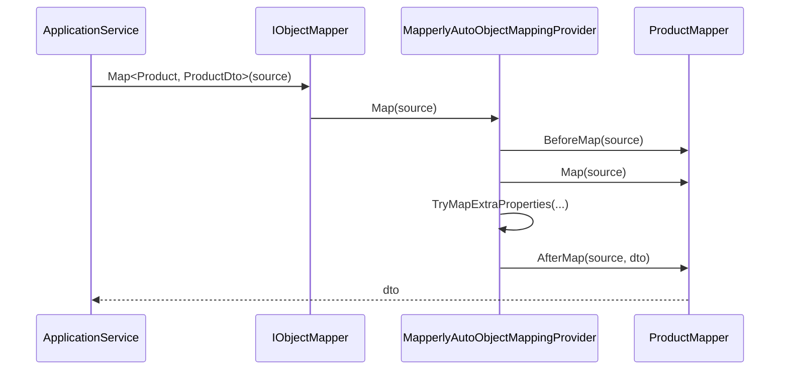

DTOs are inert data containers; the interesting bit is the **mapping**
infrastructure that turns entities into DTOs and DTOs into entity
candidates. ABP abstracts this behind `IObjectMapper`, ships a default
implementation, and provides two convention-driven providers —
**AutoMapper** and **Mapperly** — that you opt into per module.

This page enumerates the abstractions, both providers, and shows how
modules wire them together.

## The abstraction: `IObjectMapper`

`framework/src/Volo.Abp.ObjectMapping/Volo/Abp/ObjectMapping/IObjectMapper.cs`:

```csharp
public interface IObjectMapper
{
    IAutoObjectMappingProvider AutoObjectMappingProvider { get; }
    TDestination Map<TSource, TDestination>(TSource source);
    TDestination Map<TSource, TDestination>(TSource source, TDestination destination);
}

public interface IObjectMapper<TContext> : IObjectMapper { }

public interface IObjectMapper<in TSource, TDestination>
{
    TDestination Map(TSource source);
    TDestination Map(TSource source, TDestination destination);
}
```

Three roles to internalise:

| Interface | Role |
| --- | --- |
| `IObjectMapper` | Generic entry point — DI default, resolves via provider. |
| `IObjectMapper<TContext>` | Module-scoped variant — pick up a different provider per module. |
| `IObjectMapper<TSource, TDestination>` | **Explicit** mapper — write a class to override conventional mapping for a specific pair. |
| `IAutoObjectMappingProvider` | Strategy interface implemented by AutoMapper / Mapperly providers. |
| `IAutoObjectMappingProvider<TContext>` | Module-scoped strategy. |

## Two collaborator interfaces

Source: `IMapFrom.cs` and `IMapTo.cs` in the same folder.

```csharp
public interface IMapFrom<in TSource>
{
    void MapFrom(TSource source);
}

public interface IMapTo<TDestination>
{
    TDestination MapTo();
    void MapTo(TDestination destination);
}
```

Implement these on a DTO so it can perform self-mapping when no
provider-specific mapping is registered.

## `DefaultObjectMapper`

`framework/src/Volo.Abp.ObjectMapping/Volo/Abp/ObjectMapping/DefaultObjectMapper.cs`:

The default mapper is `Transient` and runs a four-step resolution per
`Map<TSource, TDestination>` call:

```mermaid
flowchart TD
    A[Map called] --> B{IObjectMapper<TSource, TDestination><br/>registered?}
    B -- yes --> C[Use specific mapper]
    B -- no --> D{IEnumerable<T>?}
    D -- yes --> E[Map each item recursively]
    D -- no --> F{TSource : IMapTo<TDestination>?}
    F -- yes --> G[Call source.MapTo()]
    F -- no --> H{TDestination : IMapFrom<TSource>?}
    H -- yes --> I[new TDestination(); dst.MapFrom(src)]
    H -- no --> J[Delegate to AutoObjectMappingProvider]
```

In code form (`DefaultObjectMapper.Map<TSource, TDestination>(source)`):

1. Look up `IObjectMapper<TSource, TDestination>` from DI.
2. If none, try to map collections (returns recursive call).
3. If `source is IMapTo<TDestination>`, call `MapTo()`.
4. If `TDestination : IMapFrom<TSource>`, instantiate and call
   `MapFrom(source)`.
5. Otherwise, delegate to `AutoObjectMappingProvider.Map<TSource, TDestination>(source)`.

By default, `AutoObjectMappingProvider` is
`NotImplementedAutoObjectMappingProvider` which throws unless you
configured AutoMapper or Mapperly:

```text
framework/src/Volo.Abp.ObjectMapping/Volo/Abp/ObjectMapping/NotImplementedAutoObjectMappingProvider.cs
```

So *some* provider must be wired in for non-trivial mapping.

## Provider 1: AutoMapper

### Package

`framework/src/Volo.Abp.AutoMapper/`. Module class:

```csharp
// Volo/Abp/AutoMapper/AbpAutoMapperModule.cs
[DependsOn(
    typeof(AbpObjectMappingModule),
    typeof(AbpObjectExtendingModule),
    typeof(AbpAuditingModule)
)]
public class AbpAutoMapperModule : AbpModule
{
    public override void PreConfigureServices(ServiceConfigurationContext context)
        => context.Services.AddConventionalRegistrar(new AbpAutoMapperConventionalRegistrar());

    public override void ConfigureServices(ServiceConfigurationContext context)
    {
        context.Services.AddAutoMapperObjectMapper();
        context.Services.AddSingleton<IConfigurationProvider>(sp =>
        {
            using var scope = sp.CreateScope();
            var options = scope.ServiceProvider
                .GetRequiredService<IOptions<AbpAutoMapperOptions>>().Value;

            var expr = sp.GetRequiredService<IOptions<MapperConfigurationExpression>>().Value;
            var ctx = new AbpAutoMapperConfigurationContext(expr, scope.ServiceProvider);

            foreach (var configurator in options.Configurators) configurator(ctx);

            var config = new MapperConfiguration(expr);
            // ... validate profiles ...
            return config;
        });
    }
}
```

### `AbpAutoMapperOptions`

`Volo/Abp/AutoMapper/AbpAutoMapperOptions.cs`:

```csharp
public class AbpAutoMapperOptions
{
    public List<Action<IAbpAutoMapperConfigurationContext>> Configurators { get; }
    public ITypeList<Profile> ValidatingProfiles { get; set; }

    public void AddMaps<TModule>(bool validate = false) { ... }
    public void AddProfile<TProfile>(bool validate = false) where TProfile : Profile, new() { ... }
    public void ValidateProfile<TProfile>(bool validate = true) where TProfile : Profile { ... }
}
```

`AddMaps<TModule>(validate: true)` is the canonical entry point — it
scans the assembly that contains `TModule` for all `Profile` subclasses
and registers them with optional configuration validation.

### Canonical usage in Identity

```csharp
// modules/identity/src/Volo.Abp.Identity.Application/Volo/Abp/Identity/AbpIdentityApplicationModule.cs
public override void ConfigureServices(ServiceConfigurationContext context)
{
    Configure<AbpAutoMapperOptions>(options =>
    {
        options.AddMaps<AbpIdentityApplicationModule>();
    });
}
```

Combined with a profile under the same project:

```csharp
// modules/identity/src/Volo.Abp.Identity.Application/Volo/Abp/Identity/AbpIdentityApplicationMappers.cs
public class AbpIdentityApplicationAutoMapperProfile : Profile
{
    public AbpIdentityApplicationAutoMapperProfile()
    {
        CreateMap<IdentityUser, IdentityUserDto>();
        CreateMap<IdentityRole, IdentityRoleDto>();
        // ...
    }
}
```

### Conventional registrar

`AbpAutoMapperConventionalRegistrar` registers any class implementing
`IAutoMapperConvention` (rare) or detects `Profile` subclasses for
automatic configuration.

### `AbpAutoMapperExtensibleObjectExtensions`

`framework/src/Volo.Abp.AutoMapper/AutoMapper/AbpAutoMapperExtensibleObjectExtensions.cs`
adds helpers to map `ExtraProperties` between extensible entities and
DTOs — see [Object Extending](/ddd/object-extending).

```csharp
CreateMap<IdentityUser, IdentityUserDto>()
    .MapExtraProperties(MappingPropertyDefinitionChecks.Both, ignoredProperties: new[] { "Password" });
```

### Disabling audit fields on inputs

`IgnoreFullAuditedObjectProperties()` is provided to drop
`CreationTime`, `CreatorId`, `LastModificationTime`, `LastModifierId`,
`IsDeleted`, `DeleterId`, `DeletionTime` when projecting a create/update
input DTO onto an entity — properties the user must not control.

## Provider 2: Mapperly (source-generated)

### Package

`framework/src/Volo.Abp.Mapperly/`. Module class:

```csharp
// Volo/Abp/Mapperly/AbpMapperlyModule.cs
public class AbpMapperlyModule : AbpModule
{
    public override void PreConfigureServices(ServiceConfigurationContext context)
        => context.Services.AddConventionalRegistrar(new AbpMapperlyConventionalRegistrar());

    // ...
}
```

### Mapper base classes

`Volo/Abp/Mapperly/MapperBase.cs`:

```csharp
public abstract class MapperBase<TSource, TDestination>
    : IAbpMapperlyMapper<TSource, TDestination>, ITransientDependency
{
    public abstract TDestination Map(TSource source);
    public abstract void Map(TSource source, TDestination destination);
    public virtual void BeforeMap(TSource source) { }
    public virtual void AfterMap(TSource source, TDestination destination) { }
}

public abstract class TwoWayMapperBase<TSource, TDestination>
    : MapperBase<TSource, TDestination>, IAbpReverseMapperlyMapper<TSource, TDestination>
{
    public abstract TSource ReverseMap(TDestination destination);
    public abstract void ReverseMap(TDestination destination, TSource source);
    public virtual void BeforeReverseMap(TDestination destination) { }
    public virtual void AfterReverseMap(TDestination destination, TSource source) { }
}
```

### Writing a Mapperly mapper

```csharp
using Riok.Mapperly.Abstractions;

[Mapper]
public partial class ProductMapper : MapperBase<Product, ProductDto>
{
    public override partial ProductDto Map(Product source);
    public override partial void Map(Product source, ProductDto destination);
}
```

The Mapperly source generator implements the `partial` methods at compile
time. `ITransientDependency` (inherited from `MapperBase`) means it is
auto-registered.

### `MapExtraProperties` attribute

`Volo/Abp/Mapperly/MapExtraPropertiesAttribute.cs`:

```csharp
[AttributeUsage(AttributeTargets.Class)]
public class MapExtraPropertiesAttribute : Attribute
{
    public MappingPropertyDefinitionChecks DefinitionChecks { get; set; } = MappingPropertyDefinitionChecks.Null;
    public string[]? IgnoredProperties { get; set; }
    public bool MapToRegularProperties { get; set; }
}
```

Attach to a Mapperly mapper class so the
`MapperlyAutoObjectMappingProvider` copies extensible `ExtraProperties`
after the generated mapping runs.

### Provider runtime

`Volo/Abp/Mapperly/MapperlyAutoObjectMappingProvider.cs` mirrors
`AutoMapperAutoObjectMappingProvider`: looks up
`IAbpMapperlyMapper<TSource, TDestination>` from DI, calls `BeforeMap`,
`Map`, then `TryMapExtraProperties` if `[MapExtraProperties]` is present,
then `AfterMap`.



## Picking AutoMapper vs Mapperly

<CardGroup cols={2}>
<Card title="AutoMapper" icon="map">
  - Mature, reflective.
  - Profile-based configuration; one-liners for many cases.
  - Some runtime cost; validation requires `ValidatingProfiles`.
  - Best when you need projection-to-IQueryable (`.ProjectTo<TDto>()`).
</Card>
<Card title="Mapperly" icon="bolt">
  - Source-generated at compile time, near-zero runtime cost.
  - Compile-time errors for missing members.
  - More verbose — explicit `partial` mapper classes.
  - Best when you need maximal performance and AOT-friendliness.
</Card>
</CardGroup>

You can mix both in one solution: each module declares the provider it
prefers, and they coexist via the shared `IObjectMapper` resolution
pipeline.

## Module-scoped mappers (`IObjectMapper<TContext>`)

When two modules in the same host both register `Product → ProductDto`
maps, you can isolate them with the typed mapper:

```csharp
public class CatalogAppService : ApplicationService
{
    public CatalogAppService()
    {
        ObjectMapperContext = typeof(CatalogApplicationModule);
    }
}
```

The base `ApplicationService.ObjectMapper` lazy-resolves
`IObjectMapper<CatalogApplicationModule>` (a `DefaultObjectMapper<TContext>`
or AutoMapper / Mapperly variant) so the lookup never crosses module
boundaries.

`DefaultObjectMapper<TContext>` is shipped from
`framework/src/Volo.Abp.ObjectMapping/Volo/Abp/ObjectMapping/DefaultObjectMapper.cs`.

## Pattern reference

### Read DTO ⟵ entity

```csharp
CreateMap<Product, ProductDto>();
// or
[Mapper] public partial class ProductMapper : MapperBase<Product, ProductDto> { ... }
```

### Create DTO ⟶ entity

```csharp
CreateMap<CreateProductDto, Product>(MemberList.Source)
    .ConstructUsing((src, _) => new Product(GuidGenerator.Create(), src.Name, src.Price))
    .IgnoreFullAuditedObjectProperties();
```

### Update DTO ⟶ existing entity

```csharp
CreateMap<UpdateProductDto, Product>()
    .IgnoreFullAuditedObjectProperties()
    .Ignore(p => p.Id)
    .Ignore(p => p.Code); // immutable

// usage from CrudAppService
ObjectMapper.Map(input, entity); // in-place
```

### Extensible DTO mapping

```csharp
CreateMap<IdentityUser, IdentityUserDto>()
    .MapExtraProperties();
```

The helper at
`framework/src/Volo.Abp.AutoMapper/AutoMapper/AbpAutoMapperExtensibleObjectExtensions.cs`
calls `ExtensibleObjectMapper.MapExtraPropertiesTo` after the property
mapping completes. For Mapperly, attach
`[MapExtraProperties]` to the mapper class instead.

## Canonical layout for a module's mapping files

```text
MyCompany.MyModule.Application/
└── MyCompany/MyModule/
    ├── MyModuleApplicationModule.cs                # ConfigureServices: Configure<AbpAutoMapperOptions>
    └── MyModuleApplicationAutoMapperProfile.cs     # CreateMap<...> calls
```

Mapperly equivalent:

```text
MyCompany.MyModule.Application/
└── MyCompany/MyModule/
    ├── MyModuleApplicationModule.cs
    └── Mappers/
        ├── ProductMapper.cs                        # [Mapper] partial class : MapperBase
        ├── CategoryMapper.cs
        └── ...
```

## Diagnostic tips

<Accordion title="Verify AutoMapper configuration in tests">
Inject `IConfigurationProvider` (from AutoMapper) and call
`AssertConfigurationIsValid()`. With `AddMaps(validate: true)` this
also runs at startup.
</Accordion>

<Accordion title="Find unmapped properties">
Use AutoMapper's `Mapper.ConfigurationProvider.BuildExecutionPlan(typeof(TSource), typeof(TDestination))`
in a unit test to dump the generated expression tree.
</Accordion>

<Accordion title="Confirm a Mapperly mapper is registered">
Look at the build output — Mapperly source-generates a `*.g.cs` file
next to your mapper. If it is absent, the `[Mapper]` attribute or the
partial declaration is missing.
</Accordion>

<Accordion title="Resolve provider conflicts">
If both AutoMapper and Mapperly are present in the same host, the last
`IAutoObjectMappingProvider` registration wins. Use
`IObjectMapper<TContext>` to scope per module.
</Accordion>

## Cross-references

- [Application Services](/ddd/application-services) — primary consumer of
  `ObjectMapper`.
- [Application.Contracts](/ddd/application-contracts) — DTO base types.
- [Object Extending](/ddd/object-extending) — the `MapExtraProperties`
  story.
- [Modularity System](/core/modularity-system) — how the AutoMapper /
  Mapperly modules register themselves.
