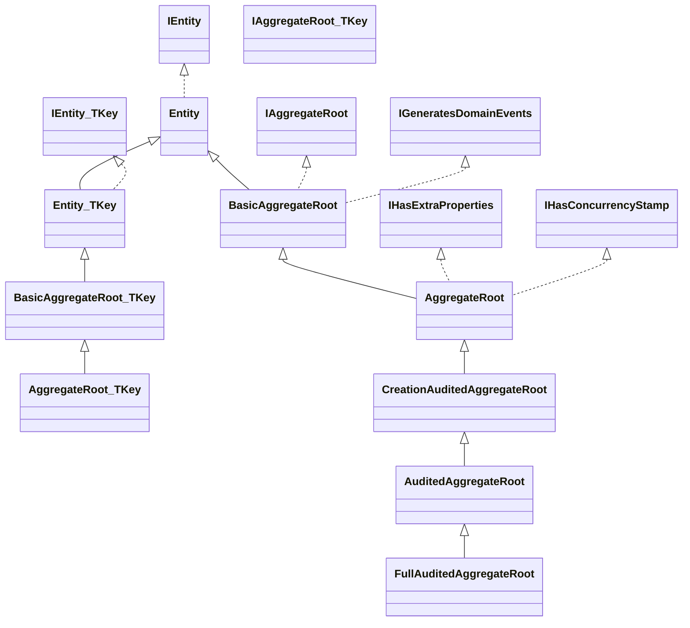
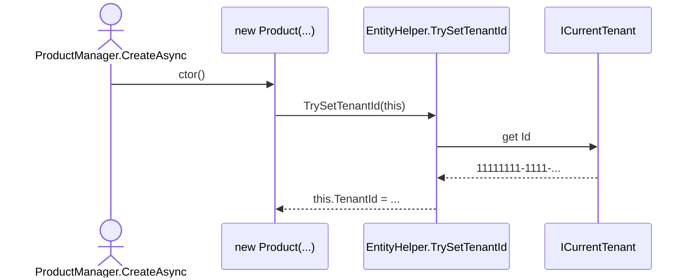
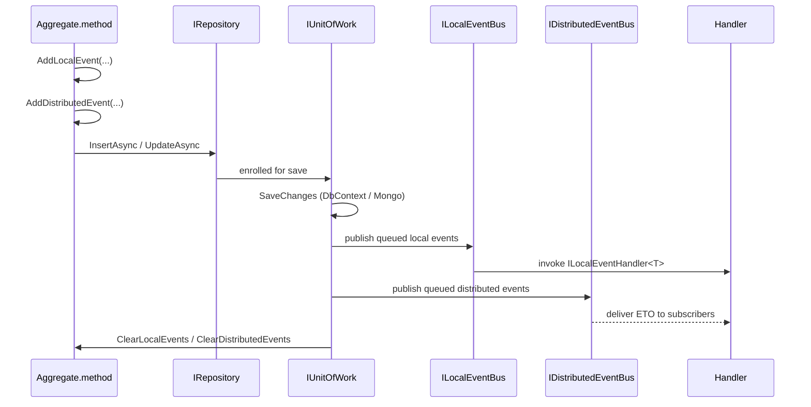

The entity hierarchy in `framework/src/Volo.Abp.Ddd.Domain/Volo/Abp/Domain/Entities/`
is one of the most-referenced parts of ABP. This page enumerates every base
class and marker interface, explains the audit-trail derivations, and shows
how `AddLocalEvent` / `AddDistributedEvent` records flow through the Unit of
Work to subscribers.

## Core interfaces

| Interface | File | Member(s) |
| --- | --- | --- |
| `IEntity` | `Entities/IEntity.cs` | `object?[] GetKeys()` — supports composite keys. Inherits `IKeyedObject`. |
| `IEntity<TKey>` | `Entities/IEntity.cs` | `TKey Id { get; }` |
| `IAggregateRoot` | `Entities/IAggregateRoot.cs` | Marker. |
| `IAggregateRoot<TKey>` | `Entities/IAggregateRoot.cs` | Marker. |
| `IGeneratesDomainEvents` | `Entities/IGeneratesDomainEvents.cs` | `GetLocalEvents()`, `GetDistributedEvents()`, `ClearLocalEvents()`, `ClearDistributedEvents()`. |

Cross-cutting markers that any entity may implement:

| Marker | Defined in | Effect |
| --- | --- | --- |
| `IMultiTenant` | `framework/src/Volo.Abp.MultiTenancy/Volo/Abp/MultiTenancy/IMultiTenant.cs` | Adds a nullable `Guid? TenantId`. Auto-stamped by `Entity..ctor → EntityHelper.TrySetTenantId`. Drives the multi-tenant data filter. |
| `ISoftDelete` | `framework/src/Volo.Abp.Data/Volo/Abp/Data/ISoftDelete.cs` | Adds `bool IsDeleted`. Repository `DeleteAsync` performs a logical delete. |
| `IPassivable` | `framework/src/Volo.Abp.Data/Volo/Abp/Data/IPassivable.cs` | Adds `bool IsActive`. Used by `ActivePassiveFilter`. |
| `IHasExtraProperties` | `framework/src/Volo.Abp.ObjectExtending/Volo/Abp/Data/IHasExtraProperties.cs` | Adds `ExtraPropertyDictionary ExtraProperties`. Implemented by `AggregateRoot` (not `BasicAggregateRoot`). |
| `IHasConcurrencyStamp` | `framework/src/Volo.Abp.Data/Volo/Abp/Data/IHasConcurrencyStamp.cs` | Adds `string ConcurrencyStamp`. Implemented by `AggregateRoot`. |
| `IHasEntityVersion` | `framework/src/Volo.Abp.Data/Volo/Abp/Data/IHasEntityVersion.cs` | Adds `int EntityVersion`. Incremented by EF Core save interceptor. |
| `ICreationAuditedObject` | `framework/src/Volo.Abp.Auditing/...` | `CreationTime`, `CreatorId`. |
| `IModificationAuditedObject` | (auditing) | `LastModificationTime`, `LastModifierId`. |
| `IAuditedObject` | (auditing) | Combines the two above. |
| `IDeletionAuditedObject` | (auditing) | `DeleterId`, `DeletionTime`. |
| `IFullAuditedObject` | (auditing) | `IAuditedObject` + `IDeletionAuditedObject` + `ISoftDelete`. |

## Entity hierarchy table

Both `Entity` and `AggregateRoot` ship a parameterless variant (composite key,
`GetKeys()` is abstract) and a generic `<TKey>` variant. The full table:

| Type | File | Bases / interfaces | Adds |
| --- | --- | --- | --- |
| `Entity` | `Entities/Entity.cs` | `IEntity` | abstract `GetKeys()`. Constructor calls `EntityHelper.TrySetTenantId`. |
| `Entity<TKey>` | `Entities/Entity.cs` | `Entity`, `IEntity<TKey>` | `TKey Id`. |
| `BasicAggregateRoot` | `Entities/BasicAggregateRoot.cs` | `Entity`, `IAggregateRoot`, `IGeneratesDomainEvents` | Local/distributed event collections. |
| `BasicAggregateRoot<TKey>` | same file | `Entity<TKey>`, `IAggregateRoot<TKey>`, `IGeneratesDomainEvents` | Same as above, keyed. |
| `AggregateRoot` | `Entities/AggregateRoot.cs` | `BasicAggregateRoot`, `IHasExtraProperties`, `IHasConcurrencyStamp` | `ExtraProperties`, `ConcurrencyStamp` (new `Guid.NewGuid().ToString("N")` per ctor), `IValidatableObject.Validate` powered by `ExtensibleObjectValidator`. |
| `AggregateRoot<TKey>` | same file | `BasicAggregateRoot<TKey>` + same interfaces | Same as above, keyed. |
| `CreationAuditedEntity` | `Entities/Auditing/CreationAuditedEntity.cs` | `Entity`, `ICreationAuditedObject` | `CreationTime`, `CreatorId`. |
| `CreationAuditedEntity<TKey>` | same | `Entity<TKey>` | keyed. |
| `CreationAuditedEntityWithUser<TUser>` | `Entities/Auditing/CreationAuditedEntityWithUser.cs` | adds `Creator` nav-property | for richer audit views. |
| `AuditedEntity` | `Entities/Auditing/AuditedEntity.cs` | `CreationAuditedEntity`, `IAuditedObject` | `LastModificationTime`, `LastModifierId`. |
| `AuditedEntity<TKey>` / `AuditedEntityWithUser<TUser>` | same family | | keyed / with-user variants. |
| `FullAuditedEntity` | `Entities/Auditing/FullAuditedEntity.cs` | `AuditedEntity`, `IFullAuditedObject` | `IsDeleted`, `DeleterId`, `DeletionTime`. |
| `FullAuditedEntity<TKey>` / `FullAuditedEntityWithUser<TUser>` | same family | | keyed / with-user variants. |
| `CreationAuditedAggregateRoot` | `Entities/Auditing/CreationAuditedAggregateRoot.cs` | `AggregateRoot`, `ICreationAuditedObject` | Same as `CreationAuditedEntity` but a root. |
| `CreationAuditedAggregateRoot<TKey>` / `WithUser` | same family | | keyed / with-user. |
| `AuditedAggregateRoot` | `Entities/Auditing/AuditedAggregateRoot.cs` | `CreationAuditedAggregateRoot`, `IAuditedObject` | adds modification audit. |
| `AuditedAggregateRoot<TKey>` / `WithUser` | same family | | keyed / with-user. |
| `FullAuditedAggregateRoot` | `Entities/Auditing/FullAuditedAggregateRoot.cs` | `AuditedAggregateRoot`, `IFullAuditedObject` | adds deletion audit + soft delete. |
| `FullAuditedAggregateRoot<TKey>` / `WithUser` | same family | | keyed / with-user. |

<Tip>
Pick the **lowest** base class that still covers your requirements. Going
straight to `FullAuditedAggregateRoot<Guid>` makes every entity carry six
audit columns even when you do not need deletion auditing. The two most
common picks are `AggregateRoot<Guid>` (no auditing needed) and
`FullAuditedAggregateRoot<Guid>` (typical CRUD).
</Tip>

## Class diagram



## Anatomy of `Entity` and `AggregateRoot`

### `Entity` base

```csharp
public abstract class Entity : IEntity
{
    protected Entity()
    {
        EntityHelper.TrySetTenantId(this);
    }

    public override string ToString() =>
        $"[ENTITY: {GetType().Name}] Keys = {GetKeys().JoinAsString(", ")}";

    public abstract object?[] GetKeys();

    public bool EntityEquals(IEntity other) => EntityHelper.EntityEquals(this, other);
}
```

`Entity<TKey>` overrides `GetKeys()` to `[Id]` and exposes a `protected set`
on `Id`. The setter is intentionally `protected` so consumers must go through
a constructor or a domain factory — the framework's GUID-generation
infrastructure (`IGuidGenerator`) is wired in by the EF Core / Mongo save
pipelines, which take advantage of this protection.

### `BasicAggregateRoot` — the event-recording base

```csharp
public abstract class BasicAggregateRoot<TKey> : Entity<TKey>,
    IAggregateRoot<TKey>, IGeneratesDomainEvents
{
    private ICollection<DomainEventRecord>? _localEvents;
    private ICollection<DomainEventRecord>? _distributedEvents;

    protected virtual void AddLocalEvent(object eventData)
    {
        _localEvents ??= new Collection<DomainEventRecord>();
        _localEvents.Add(new DomainEventRecord(eventData, EventOrderGenerator.GetNext()));
    }

    protected virtual void AddDistributedEvent(object eventData)
    {
        _distributedEvents ??= new Collection<DomainEventRecord>();
        _distributedEvents.Add(new DomainEventRecord(eventData, EventOrderGenerator.GetNext()));
    }
    // GetLocalEvents / GetDistributedEvents / ClearLocalEvents / ClearDistributedEvents ...
}
```

`EventOrderGenerator` (in `Volo.Abp.EventBus`) hands out a monotonically
increasing `long`, so the UoW can sort events in the order they were raised
even when multiple aggregates contribute to one transaction.

### `AggregateRoot` — adds extra properties + concurrency

```csharp
public abstract class AggregateRoot<TKey> : BasicAggregateRoot<TKey>,
    IHasExtraProperties, IHasConcurrencyStamp
{
    public virtual ExtraPropertyDictionary ExtraProperties { get; protected set; }

    [DisableAuditing]
    public virtual string ConcurrencyStamp { get; set; }

    protected AggregateRoot()
    {
        ConcurrencyStamp = Guid.NewGuid().ToString("N");
        ExtraProperties = new ExtraPropertyDictionary();
        this.SetDefaultsForExtraProperties();
    }

    public virtual IEnumerable<ValidationResult> Validate(ValidationContext validationContext) =>
        ExtensibleObjectValidator.GetValidationErrors(this, validationContext);
}
```

`[DisableAuditing]` on `ConcurrencyStamp` excludes it from the audit log — it
changes every save and would otherwise spam the log.

`SetDefaultsForExtraProperties` (in
`framework/src/Volo.Abp.ObjectExtending/Volo/Abp/Data/HasExtraPropertiesExtensions.cs`)
reads the `ObjectExtensionManager` registry and seeds each extra property
with its default value. See [Object Extending](/ddd/object-extending).

## Multi-tenancy auto-stamping

Both `Entity..ctor()` and `Entity<TKey>..ctor(TKey)` call
`EntityHelper.TrySetTenantId(this)`. That helper inspects the runtime type
for `IMultiTenant` and, if present, resolves `ICurrentTenant.Id` from the
ambient DI scope to stamp the new entity.



<Warning>
The helper resolves `ICurrentTenant` from `DefaultServiceProvider`, which is
the **root** provider. The current `ICurrentTenant` is an `AsyncLocal`-backed
service, so this works only inside an active scope. Construct entities
inside a request / domain-service method, not from a singleton constructor.
</Warning>

## Domain event lifecycle

ABP separates **local** events (in-process, same `IUnitOfWork`) from
**distributed** events (cross-service via the bus).



The orchestrator is the `IUnitOfWork` implementation — the EF Core variant
lives at `framework/src/Volo.Abp.EntityFrameworkCore/Volo/Abp/EntityFrameworkCore/AbpDbContext.cs`
which overrides `SaveChangesAsync` to invoke
`UnitOfWorkEventRecord` collection on each tracked aggregate. See
[Unit of Work](/data/unit-of-work) for the full event-dispatch pipeline.

### Local event from an aggregate method

```csharp
public class Product : AggregateRoot<Guid>
{
    public void ChangePrice(decimal newPrice)
    {
        if (newPrice <= 0)
            throw new BusinessException(MyModuleErrorCodes.InvalidPrice);

        var old = Price;
        Price = newPrice;
        AddLocalEvent(new ProductPriceChangedEvent(Id, old, newPrice));
    }
}
```

Then any class implementing `ILocalEventHandler<ProductPriceChangedEvent>`
in the Application layer is invoked **after** the DbContext save succeeds.

### Distributed event from an aggregate method

```csharp
public class IdentityUser : FullAuditedAggregateRoot<Guid>, IMultiTenant
{
    internal void ChangeUserName(string newUserName)
    {
        var old = UserName;
        UserName = newUserName;
        AddDistributedEvent(new IdentityUserUserNameChangedEto
        {
            Id = Id,
            TenantId = TenantId,
            OldUserName = old,
            UserName = newUserName
        });
    }
}
```

See `modules/identity/src/Volo.Abp.Identity.Domain.Shared/Volo/Abp/Identity/IdentityUserUserNameChangedEto.cs`
for the actual ETO declaration.

## Concurrency stamp

`AggregateRoot.ConcurrencyStamp` becomes the EF Core token column:

```csharp
b.Property(x => x.ConcurrencyStamp)
 .IsConcurrencyToken()
 .HasMaxLength(ConcurrencyStampConsts.MaxLength);
```

`ConcurrencyStampConsts.MaxLength` lives in
`framework/src/Volo.Abp.Ddd.Domain/Volo/Abp/Domain/Entities/ConcurrencyStampConsts.cs`.

On save, EF Core compares the value in the database with the in-memory value;
if they differ, `AbpDbConcurrencyException` is thrown. The save interceptor
then assigns a fresh `Guid.NewGuid().ToString("N")` so the next update
re-checks against the new value.

## Extra properties and extensibility

Because `AggregateRoot` implements `IHasExtraProperties`, every aggregate
can carry arbitrary key/value extras without schema changes. The
`ExtraPropertyDictionary` is persisted as JSON in EF Core (via a value
converter) and as a nested document in Mongo. See
[Object Extending](/ddd/object-extending) for the full extensibility model
including UI, validation and definition providers.

## Tenant filter + soft delete interplay

For an entity implementing `IMultiTenant, ISoftDelete`, EF Core / Mongo
applies a global query filter:

```
WHERE TenantId = @currentTenantId AND IsDeleted = 0
```

You can temporarily disable either by wrapping code in
`IDataFilter.Disable<IMultiTenant>()` (cross-tenant queries) or
`IDataFilter.Disable<ISoftDelete>()` (include deleted rows). See
[Data Layer](/data/overview).

## Helpers in `EntityHelper`

`framework/src/Volo.Abp.Ddd.Domain/Volo/Abp/Domain/Entities/EntityHelper.cs`:

| Method | Purpose |
| --- | --- |
| `EntityEquals(IEntity, IEntity)` | Compares by type compatibility + keys, treating different tenants as distinct. |
| `IsMultiTenant<TEntity>()` / `IsMultiTenant(Type)` | Type check. |
| `IsEntity(Type)` | True if `IEntity` is assignable. |
| `HasDefaultKeys(IEntity)` | Detects transient (unsaved) entities. |
| `TrySetTenantId(IEntity)` | Auto-stamp `TenantId` on construction. |
| `FindPrimaryKeyType<TEntity>()` | Extracts the `TKey` from `IEntity<TKey>`. |
| `CreateEqualityExpressionForId<TEntity, TKey>(TKey)` | Builds `x => x.Id == id` for repository queries. |

## Caching individual entities

The `Entities/Caching/` folder lets you cache entities behind
`IDistributedCache<TCacheItem>`:

```csharp
services.AddEntityCache<IdentityUser, IdentityUserCacheItem, Guid>();
```

`EntityCacheBase` calls the repository on cache miss, then serialises the
result via the configured object mapper. Use this when you need single-key
lookups under high read load. See
`framework/src/Volo.Abp.Ddd.Domain/Volo/Abp/Domain/Entities/Caching/EntityCacheServiceCollectionExtensions.cs`.

## Cross-references

- [Repositories](/ddd/repositories) — the matching repository surface.
- [Domain Services](/ddd/domain-services) — where factory methods live.
- [Data and Unit of Work](/data/overview) and
  [Unit of Work](/data/unit-of-work) for the event-publish pipeline.
- [Auditing](/crosscut/auditing) for the audit-trail interfaces.
- [Object Extending](/ddd/object-extending) for `ExtraProperties` and the
  `ObjectExtensionManager` registry.
