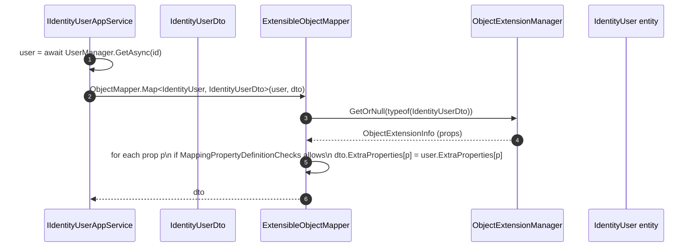

`Volo.Abp.ObjectExtending` is ABP's answer to a recurring DDD modularity problem: how do downstream solutions add fields to entities or DTOs declared by an upstream module without forking it? The package introduces a registry — `ObjectExtensionManager` — plus an `IHasExtraProperties` contract and a value bag (`ExtraPropertyDictionary`) wired into Entity, DTO, validation, mapping, and EF Core / MongoDB persistence. This page walks every class under `framework/src/Volo.Abp.ObjectExtending/Volo/Abp/ObjectExtending/`, then traces how callers register, read, validate, and map extra properties.

## Package layout

```text
framework/src/Volo.Abp.ObjectExtending/
└── Volo/Abp/ObjectExtending/
    ├── AbpObjectExtendingModule.cs
    ├── ExtensibleObject.cs                 # base class for extensible entities/DTOs
    ├── ExtensibleObjectMapper.cs           # AutoMapper helper
    ├── ExtensibleObjectValidator.cs        # IObjectValidationContributor
    ├── ExtensionPropertyHelper.cs
    ├── ExtensionPropertyFeaturePolicyConfiguration.cs
    ├── ExtensionPropertyGlobalFeaturePolicyConfiguration.cs
    ├── ExtensionPropertyPermissionPolicyConfiguration.cs
    ├── ExtensionPropertyPolicyChecker.cs
    ├── ExtensionPropertyPolicyConfiguration.cs
    ├── HasExtraPropertiesObjectExtendingExtensions.cs
    ├── IBasicObjectExtensionPropertyInfo.cs
    ├── MappingPropertyDefinitionChecks.cs
    ├── ModuleObjectExtensionManagerExtensions.cs
    ├── ObjectExtensionInfo.cs
    ├── ObjectExtensionManager.cs           # static registry
    ├── ObjectExtensionManagerExtensions.cs
    ├── ObjectExtensionPropertyInfo.cs
    ├── ObjectExtensionPropertyInfoExtensions.cs
    ├── ObjectExtensionPropertyValidationContext.cs
    ├── ObjectExtensionValidationContext.cs
    └── Modularity/                         # ModuleExtensionConfiguration
```

The persistence-aware companions live in:

| Package | Folder | Role |
| --- | --- | --- |
| `Volo.Abp.EntityFrameworkCore` | `Volo/Abp/ObjectExtending/` | Maps `ExtraProperties` into shadow columns when configured. |
| `Volo.Abp.AspNetCore.Mvc` | `Volo/Abp/ObjectExtending/` | Adds `ExtraProperties` to action model description. |
| `Volo.Abp.AspNetCore.Mvc.UI` | `Volo/Abp/ObjectExtending/` | Razor tag-helpers for extension property inputs. |
| `Volo.Abp.BlazoriseUI` | `Components/ObjectExtending/` | Blazor edit components per property type. |

## Core abstractions

### `IHasExtraProperties` and `ExtraPropertyDictionary`

`IHasExtraProperties` lives in `Volo.Abp.Data` (`framework/src/Volo.Abp.Data/Volo/Abp/Data/IHasExtraProperties.cs`) and exposes one property:

```csharp
public interface IHasExtraProperties
{
    ExtraPropertyDictionary ExtraProperties { get; }
}
```

`ExtraPropertyDictionary` is a `Dictionary<string, object?>` with equality and JSON helpers. Every `AggregateRoot<TKey>` and every DTO that inherits `ExtensibleObject` carries one.

### `ExtensibleObject`

```csharp
public abstract class ExtensibleObject : IHasExtraProperties
{
    public ExtraPropertyDictionary ExtraProperties { get; protected set; }

    protected ExtensibleObject(bool setDefaultsForExtraProperties = true)
    {
        ExtraProperties = new ExtraPropertyDictionary();
        if (setDefaultsForExtraProperties)
        {
            this.SetDefaultsForExtraProperties();
        }
    }
}
```

`SetDefaultsForExtraProperties` (in `HasExtraPropertiesObjectExtendingExtensions.cs`) walks every registered `ObjectExtensionPropertyInfo` for the runtime type and seeds default values declared on the registration.

### `ObjectExtensionManager`

`ObjectExtensionManager.Instance` is a static singleton — the same registry is shared across every module. It exposes:

| Member | Purpose |
| --- | --- |
| `AddOrUpdate<TObject>(Action<ObjectExtensionInfo>?)` | Registers (or augments) an entry for `TObject`. |
| `AddOrUpdate(Type[] types, Action<ObjectExtensionInfo>?)` | Same, but for multiple related types at once (e.g. entity + DTOs). |
| `GetOrNull(Type)` | Lookup by runtime type. |
| `Extensions` | Enumerable of all registered `ObjectExtensionInfo`. |

`ObjectExtensionInfo` holds the per-type metadata: `Properties` (a `Dictionary<string, ObjectExtensionPropertyInfo>`), `Configuration` bag, and a `Type` reference.

### `ObjectExtensionPropertyInfo`

Each registered field is a fully-typed descriptor:

| Field | Default | Meaning |
| --- | --- | --- |
| `Name` | — | Key in `ExtraProperties`. |
| `Type` | — | CLR type (used by mapper + UI + validator). |
| `DefaultValue` | `null` | Seeded by `SetDefaultsForExtraProperties`. |
| `DefaultValueFactory` | `null` | Function-based default (resolved DI). |
| `DisplayName` | property name | Used by tag-helpers + Blazorise grid headers. |
| `Validators` | empty | List of `Action<ObjectExtensionPropertyValidationContext>`. |
| `Attributes` | empty | Mirrors `[Required]`/`[StringLength]` attributes. |
| `Policy` | `null` | `ExtensionPropertyPolicyConfiguration` (Feature / Permission / GlobalFeature gates). |
| `UI` | `ExtensionPropertyUiInfo` | Tag-helper rendering hints. |
| `Configuration` | empty | Arbitrary bag for downstream consumers. |

### `ObjectExtensionManagerExtensions.AddOrUpdateProperty`

The most-used helper:

```csharp
ObjectExtensionManager.Instance
    .AddOrUpdateProperty<IdentityUser, string>("SocialSecurityNumber",
        options =>
        {
            options.Attributes.Add(new RequiredAttribute());
            options.Attributes.Add(new StringLengthAttribute(11));
            options.DefaultValue = "000-00-0000";
            options.Policy.Permissions.Add("MyApp.SsnAccess");
        });
```

Internally this calls `AddOrUpdate(typeof(TObject))` and then registers a typed `ObjectExtensionPropertyInfo`. `ObjectExtensionPropertyInfoExtensions` adds the `IsRequired`, `IsDate`, `IsBoolean`, etc. fluent shortcuts.

### `HasExtraPropertiesObjectExtendingExtensions`

Defines the public surface used by every consumer:

| Extension | Effect |
| --- | --- |
| `SetDefaultsForExtraProperties(this IHasExtraProperties, Type?)` | Iterates registered properties and writes `DefaultValue` / `DefaultValueFactory` results. |
| `ValidateObjectExtensions(this IHasExtraProperties, Type, ValidationContext?, List<ValidationResult>)` | Runs `Validators` + `Attributes` per property. |
| `MapExtraPropertiesTo(this IHasExtraProperties, IHasExtraProperties, MappingPropertyDefinitionChecks?)` | Copies allowed properties from source to destination using `ObjectExtensionInfo`. |

### `ExtensionPropertyHelper` and policies

`ExtensionPropertyPolicyConfiguration` aggregates three gates:

```csharp
public class ExtensionPropertyPolicyConfiguration
{
    public ExtensionPropertyPermissionPolicyConfiguration  Permissions   { get; } = new();
    public ExtensionPropertyFeaturePolicyConfiguration     Features      { get; } = new();
    public ExtensionPropertyGlobalFeaturePolicyConfiguration GlobalFeatures { get; } = new();
}
```

`ExtensionPropertyPolicyChecker` (DI-resolved) consults `IPermissionChecker`, `IFeatureChecker`, and `IGlobalFeatureChecker` to decide whether the property is visible / mutable for the current caller. Razor and Blazor UIs use this to conditionally render the input.

## Module wiring

`AbpObjectExtendingModule` does very little — registry state is static. It registers `ExtensibleObjectValidator` as a contributor to the object validation pipeline:

```csharp
[DependsOn(typeof(AbpValidationModule), typeof(AbpDataModule))]
public class AbpObjectExtendingModule : AbpModule
{
    public override void ConfigureServices(ServiceConfigurationContext context)
    {
        Configure<AbpValidationOptions>(options =>
        {
            options.ObjectValidationContributors.Add<ExtensibleObjectValidator>();
        });
    }
}
```

## Validation pipeline integration

`ExtensibleObjectValidator` (in `ExtensibleObjectValidator.cs`) implements `IObjectValidationContributor`. For every object validated by `IObjectValidator` it:

1. Looks up the type in `ObjectExtensionManager.Instance.GetOrNull(type)`.
2. For each registered property, builds an `ObjectExtensionPropertyValidationContext` containing the actual value from `ExtraProperties`.
3. Runs each `Validator` action and each `Attribute` (via `ValidationAttribute.GetValidationResult`).
4. Appends `ValidationResult` instances to the outer `ObjectValidationContext.Errors`.

The validator runs alongside the standard `[Required]`-style validator chain registered by `Volo.Abp.Validation`, so MVC model binding, app-service interception, and manual `IObjectValidator.Validate` calls all enforce extension property rules consistently.

## Mapping pipeline integration



`MappingPropertyDefinitionChecks` is a flags enum (`None`, `Source`, `Destination`, `Both`). It tells the mapper whether the property must be registered on the source type, destination type, or both. Default is `Both` — both entity and DTO must register `"SocialSecurityNumber"` to participate.

`ExtensibleObjectMapper` is a static helper invoked by ABP's AutoMapper module when the source/destination type both implement `IHasExtraProperties`. The default `AbpAutoMapperConfigurationContext.AddProfile<T>` extension registers the after-map action automatically.

## Persistence integration

### EF Core

`framework/src/Volo.Abp.EntityFrameworkCore/Volo/Abp/ObjectExtending/AbpEfCoreEntityExtensionMappings.cs` exposes:

```csharp
ObjectExtensionManager.Instance
    .MapEfCoreProperty<IdentityUser, string>("SocialSecurityNumber",
        b => { b.HasMaxLength(11); });
```

This registers a shadow EF Core property (a real column) instead of serialising into the JSON `ExtraProperties` column. At `DbContext` boot, `AbpEfCoreObjectExtensionConfigureExtensions.ConfigureObjectExtensions(modelBuilder)` walks the registry and calls `EntityTypeBuilder.Property(propertyType, propertyName)` with the registered configuration action.

`AbpEntityChangeTracker` synchronises the shadow column with `ExtraProperties[name]` on `SaveChanges` (read into the dictionary on load, written back from the dictionary on save).

### MongoDB

`Volo.Abp.MongoDB` ignores the EF mapping helper. `ExtraProperties` is persisted as a single embedded BSON document by the BSON serializer registered for `IHasExtraProperties` types.

## Patterns by module

| Module | Registers properties for | File |
| --- | --- | --- |
| Identity | `IdentityUser`, `IdentityUserDto`, `IdentityUserCreateDto`, `IdentityUserUpdateDto` | `modules/identity/.../IdentityModuleExtensionConfigurator.cs` |
| Tenant Management | `Tenant`, `TenantDto`, `TenantCreateDto`, `TenantUpdateDto` | `TenantManagementModuleExtensionConfigurator.cs` |
| Account | `RegisterDto` | `AccountModuleExtensionConfigurator.cs` |

Each module exposes a static `Configure(...)` method on its `ModuleExtensionConfiguration` class so consuming applications can add fields in one call instead of three:

```csharp
public static class MyAppModuleExtensionConfigurator
{
    public static void Configure()
    {
        OneTimeRunner.Run(() =>
        {
            ConfigureExistingProperties();
            ConfigureExtraProperties();
        });
    }
}
```

## Reading & writing extra properties

`HasExtraPropertiesExtensions` (in `Volo.Abp.Data`) gives the typed accessors:

```csharp
user.SetProperty("SocialSecurityNumber", "123-45-6789");
var ssn = user.GetProperty<string>("SocialSecurityNumber");
user.RemoveProperty("SocialSecurityNumber");
```

`SetProperty` writes to `ExtraProperties[name]`. `GetProperty<T>(name)` reads, converts via `Convert.ChangeType` for primitives, and returns `default(T)` when missing.

## End-to-end registration recipe

<Steps>
  <Step title="Register the property at startup">
```csharp
public override void ConfigureServices(ServiceConfigurationContext context)
{
    ObjectExtensionManager.Instance
        .AddOrUpdateProperty<IdentityUser, string>(
            "SocialSecurityNumber",
            options =>
            {
                options.Attributes.Add(new RequiredAttribute());
                options.Attributes.Add(new StringLengthAttribute(11));
            });

    ObjectExtensionManager.Instance
        .AddOrUpdateProperty<IdentityUserCreateDto, string>(
            "SocialSecurityNumber",
            options => options.Attributes.Add(new RequiredAttribute()));
}
```
  </Step>
  <Step title="Project it onto a shadow column (EF Core)">
```csharp
ObjectExtensionManager.Instance
    .MapEfCoreProperty<IdentityUser, string>(
        "SocialSecurityNumber",
        b => { b.HasMaxLength(11); });
```
After the next migration, the column lives next to the existing `IdentityUsers` columns.
  </Step>
  <Step title="Read it from your code">
```csharp
var ssn = (await UserManager.GetByIdAsync(userId))
    .GetProperty<string>("SocialSecurityNumber");
```
  </Step>
  <Step title="Render it in the UI">
The Razor & Blazor tag-helpers auto-pick the property from `ObjectExtensionManager.Instance` and render an input bound to `ExtraProperties["SocialSecurityNumber"]`.
  </Step>
</Steps>

<Note>
The shadow-column path (EF Core) is the recommended persistence option whenever the property is queryable or required. The default JSON-bag path is the right choice for cosmetic / display-only properties.
</Note>

<Warning>
Two registrations for the same `Type` + property `Name` merge attributes and validators rather than replace them — re-running `AddOrUpdateProperty` in a test fixture stacks `RequiredAttribute` instances. Guard with the `OneTimeRunner` pattern modules use.
</Warning>

## Cross-references

<CardGroup cols={2}>
  <Card title="Entities & Aggregates" icon="cube" href="/ddd/entities-and-aggregates">
    Where `IHasExtraProperties` and `ExtensibleObject` plug into the domain model.
  </Card>
  <Card title="DTOs and Mapping" icon="arrows-left-right" href="/ddd/dtos-and-object-mapping">
    How `ExtensibleObjectMapper` participates in the AutoMapper pipeline.
  </Card>
  <Card title="Permission Management" icon="key" href="/modules/permission-management">
    Backing for `ExtensionPropertyPermissionPolicyConfiguration`.
  </Card>
  <Card title="Feature Management" icon="toggle-on" href="/modules/feature-management">
    Backing for `ExtensionPropertyFeaturePolicyConfiguration`.
  </Card>
</CardGroup>
