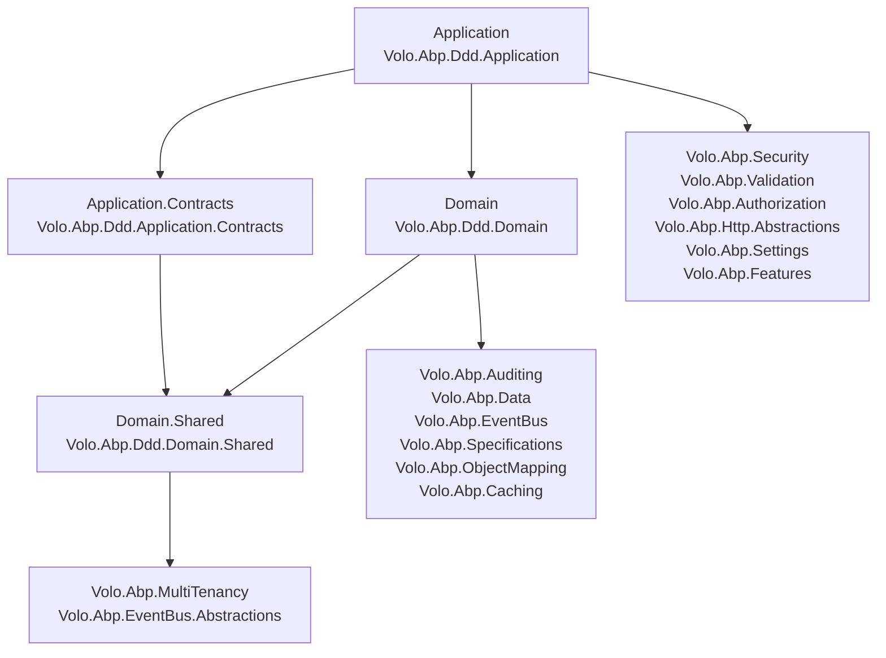

ABP ships an opinionated implementation of Domain-Driven Design built around four
NuGet packages — `Volo.Abp.Ddd.Domain.Shared`, `Volo.Abp.Ddd.Domain`,
`Volo.Abp.Ddd.Application.Contracts` and `Volo.Abp.Ddd.Application` — each
declared as an `AbpModule` so they plug into the modularity system described in
[Modularity System](/core/modularity-system). Every module in `modules/` (and
every generated solution from the templates) follows the same four-project
naming convention, so once you internalise the layering, every business module
in the repository becomes easy to navigate.

This page maps out which file lives in which layer, what dependencies are
allowed, and what each layer should and should not contain.

## The four DDD packages

<CardGroup cols={2}>
<Card title="Volo.Abp.Ddd.Domain.Shared" icon="cube">
  Constants, enums, error codes, ETO (Event Transfer Object) types and shared
  localization. Source: `framework/src/Volo.Abp.Ddd.Domain.Shared/`.
  Module: `Volo.Abp.Domain.AbpDddDomainSharedModule`.
</Card>
<Card title="Volo.Abp.Ddd.Domain" icon="layer-group">
  Entity / aggregate / repository / domain service / value object / specification
  abstractions. Source: `framework/src/Volo.Abp.Ddd.Domain/`. Module:
  `Volo.Abp.Domain.AbpDddDomainModule`.
</Card>
<Card title="Volo.Abp.Ddd.Application.Contracts" icon="file-signature">
  DTOs and app-service interfaces. Source:
  `framework/src/Volo.Abp.Ddd.Application.Contracts/`. Module:
  `Volo.Abp.Application.AbpDddApplicationContractsModule`.
</Card>
<Card title="Volo.Abp.Ddd.Application" icon="gears">
  `ApplicationService`, `CrudAppService`, `ReadOnlyAppService` base classes.
  Source: `framework/src/Volo.Abp.Ddd.Application/`. Module:
  `Volo.Abp.Application.AbpDddApplicationModule`.
</Card>
</CardGroup>

The dependency direction is strictly downward — a higher layer references the
lower layers, never the other way round.



The exact `[DependsOn(...)]` graph is encoded in:

| Module | File | Direct dependencies |
| --- | --- | --- |
| `AbpDddDomainSharedModule` | `framework/src/Volo.Abp.Ddd.Domain.Shared/Volo/Abp/Domain/AbpDddDomainSharedModule.cs` | `AbpMultiTenancyAbstractionsModule`, `AbpEventBusAbstractionsModule` |
| `AbpDddDomainModule` | `framework/src/Volo.Abp.Ddd.Domain/Volo/Abp/Domain/AbpDddDomainModule.cs` | `AbpAuditingModule`, `AbpDataModule`, `AbpEventBusModule`, `AbpGuidsModule`, `AbpTimingModule`, `AbpObjectMappingModule`, `AbpExceptionHandlingModule`, `AbpSpecificationsModule`, `AbpCachingModule`, `AbpDddDomainSharedModule` |
| `AbpDddApplicationContractsModule` | `framework/src/Volo.Abp.Ddd.Application.Contracts/Volo/Abp/Application/AbpDddApplicationContractsModule.cs` | `AbpLocalizationModule`, `AbpAuditingContractsModule`, `AbpDataModule` |
| `AbpDddApplicationModule` | `framework/src/Volo.Abp.Ddd.Application/Volo/Abp/Application/AbpDddApplicationModule.cs` | `AbpDddDomainModule`, `AbpDddApplicationContractsModule`, `AbpSecurityModule`, `AbpObjectMappingModule`, `AbpValidationModule`, `AbpAuthorizationModule`, `AbpHttpAbstractionsModule`, `AbpSettingsModule`, `AbpFeaturesModule`, `AbpGlobalFeaturesModule` |

<Note>
`AbpDddApplicationContractsModule` does **not** depend on
`AbpDddDomainSharedModule` directly — its `AbpAuditingContractsModule` brings in
the auditing interfaces that the DTOs need. Application.Contracts is meant to be
referenced by **clients** (Blazor / MVC / HttpApi.Client) which intentionally
should not see the Domain.Shared event types.
</Note>

## Canonical project naming

Look at `modules/identity/src/` — it is the textbook layout that every other
module mirrors:

| Layer | Project folder | Module class |
| --- | --- | --- |
| Domain.Shared | `modules/identity/src/Volo.Abp.Identity.Domain.Shared/` | `AbpIdentityDomainSharedModule` |
| Domain | `modules/identity/src/Volo.Abp.Identity.Domain/` | `AbpIdentityDomainModule` |
| Application.Contracts | `modules/identity/src/Volo.Abp.Identity.Application.Contracts/` | `AbpIdentityApplicationContractsModule` |
| Application | `modules/identity/src/Volo.Abp.Identity.Application/` | `AbpIdentityApplicationModule` |
| HttpApi | `modules/identity/src/Volo.Abp.Identity.HttpApi/` | `AbpIdentityHttpApiModule` |
| HttpApi.Client | `modules/identity/src/Volo.Abp.Identity.HttpApi.Client/` | `AbpIdentityHttpApiClientModule` |
| EF Core | `modules/identity/src/Volo.Abp.Identity.EntityFrameworkCore/` | `AbpIdentityEntityFrameworkCoreModule` |
| MongoDB | `modules/identity/src/Volo.Abp.Identity.MongoDB/` | `AbpIdentityMongoDbModule` |
| Web (Razor Pages) | `modules/identity/src/Volo.Abp.Identity.Web/` | `AbpIdentityWebModule` |
| Blazor | `modules/identity/src/Volo.Abp.Identity.Blazor/` | `AbpIdentityBlazorModule` |

The same suffixing pattern is used by every Volo module — `tenant-management`,
`permission-management`, `feature-management`, `setting-management`,
`audit-logging`, `background-jobs`, etc.

<Tip>
Open any module's `.csproj` and follow its `ProjectReference` chain — you'll
see the dependency graph in the table above replicated. If you are adding a
new project, copy the references of the equivalent identity project to stay
consistent.
</Tip>

## What goes where

<Tabs>
<Tab title="Domain.Shared">
- **Constants** (column lengths, regex patterns) — see
  `IdentityUserConsts`, `IdentityRoleConsts`,
  `OrganizationUnitConsts` in
  `modules/identity/src/Volo.Abp.Identity.Domain.Shared/Volo/Abp/Identity/`.
- **Enums** — e.g. `IdentityClaimValueType` (file:
  `IdentityClaimValueType.cs`).
- **Error codes** — string constants exposed to clients, e.g.
  `IdentityErrorCodes.UserSelfDeletion = "Volo.Abp.Identity:010001"` from
  `IdentityErrorCodes.cs`.
- **Localization JSON + resource class** — see
  `Localization/IdentityResource.cs` and the embedded
  `Localization/Resources/Identity/*.json` files.
- **Settings / permission name constants** — see
  `Settings/IdentitySettingNames.cs`.
- **ETOs (Event Transfer Objects)** — POCO records for distributed events,
  e.g. `EntityCreatedEto`, `EntityUpdatedEto`, `EntityDeletedEto` in
  `framework/src/Volo.Abp.Ddd.Domain.Shared/Volo/Abp/Domain/Entities/Events/Distributed/`.
- **`GlobalFeatures`** static classes (rare).

See [Domain.Shared layer](/ddd/domain-shared) for the deep dive.
</Tab>
<Tab title="Domain">
- Entities, aggregates, value objects.
- Repository **interfaces** (the implementations live in
  `Volo.Abp.<Module>.EntityFrameworkCore` / `Volo.Abp.<Module>.MongoDB`).
- Domain services (classes ending in `Manager`).
- Domain event types (local + distributed).
- DbContext-agnostic helpers, e.g. `EntityHelper`,
  `framework/src/Volo.Abp.Ddd.Domain/Volo/Abp/Domain/Entities/EntityHelper.cs`.

See [Domain layer](/ddd/domain) and [Entities & Aggregates](/ddd/entities-and-aggregates).
</Tab>
<Tab title="Application.Contracts">
- DTOs (input + output).
- Application service **interfaces** (`IXxxAppService`).
- Permission, feature and setting name constants.
- Authorization permission definition providers.

See [Application.Contracts](/ddd/application-contracts) and
[DTOs and Object Mapping](/ddd/dtos-and-object-mapping).
</Tab>
<Tab title="Application">
- `ApplicationService` implementations.
- AutoMapper profiles / Mapperly mappers.
- Authorization handlers that depend on domain types.

See [Application Services](/ddd/application-services).
</Tab>
</Tabs>

## Layer-by-layer responsibility table

| Concern | Domain.Shared | Domain | Application.Contracts | Application |
| --- | :-: | :-: | :-: | :-: |
| Constants & enums | ✅ | | | |
| Error code strings | ✅ | | | |
| Localization JSON | ✅ | | | |
| ETO (`EntityCreatedEto`, ...) | ✅ | | | |
| Entities & aggregates | | ✅ | | |
| Repository interfaces | | ✅ | | |
| Repository implementations | | | | (in EF Core / Mongo packages) |
| Domain services (`*Manager`) | | ✅ | | |
| Value objects | | ✅ | | |
| Specifications | | ✅ | | |
| Local / distributed event types | | ✅ | (handlers) | (handlers) |
| DTOs | | | ✅ | |
| App-service interfaces | | | ✅ | |
| App-service implementations | | | | ✅ |
| Permission / feature name consts | | | ✅ | |
| Permission definition providers | | | ✅ | |
| AutoMapper / Mapperly mappers | | | | ✅ |
| Authorization handlers | | | | ✅ |

## Why the split matters

<Steps>
<Step title="Client reuse">
  Blazor / Xamarin / Console clients reference only `Application.Contracts` and
  `HttpApi.Client`, never the Domain assembly. That is why DTOs and interfaces
  live in Application.Contracts: they are part of the public surface.
</Step>
<Step title="Test isolation">
  Domain projects have no dependency on AspNetCore — they can be unit-tested
  with just a `Volo.Abp.TestBase` host. Application tests wire in
  authorization, localization, and validation modules.
</Step>
<Step title="Database neutrality">
  Repository **interfaces** live in Domain; **implementations** live in
  `Volo.Abp.<Module>.EntityFrameworkCore` (e.g.
  `modules/identity/src/Volo.Abp.Identity.EntityFrameworkCore/`) or
  `Volo.Abp.<Module>.MongoDB`. Domain code can change databases without
  recompiling.
</Step>
<Step title="Module exchange">
  Because DTOs and interfaces are in Application.Contracts, a module's
  `HttpApi.Client` can implement the same interface against a remote service
  (see [Dynamic HTTP Clients](/aspnetcore/mvc-integration)). Consumers don't
  know if the call is local or remote.
</Step>
</Steps>

## File-path quick reference

<Accordion title="framework/src/Volo.Abp.Ddd.Domain.Shared/">
```text
Volo/Abp/Domain/
├── AbpDddDomainSharedModule.cs
└── Entities/Events/Distributed/
    ├── AbpDistributedEntityEventOptions.cs
    ├── AutoEntityDistributedEventSelectorList.cs
    ├── EntityCreatedEto.cs
    ├── EntityDeletedEto.cs
    ├── EntityEto.cs
    ├── EntityUpdatedEto.cs
    ├── EtoMappingDictionary.cs
    ├── EtoMappingDictionaryItem.cs
    ├── IAutoEntityDistributedEventSelectorList.cs
    ├── IEntityEto.cs
    └── IEntityToEtoMapper.cs
```
</Accordion>

<Accordion title="framework/src/Volo.Abp.Ddd.Domain/Volo/Abp/Domain/">
```text
├── AbpDddDomainModule.cs
├── ChangeTracking/                           (interceptor + attributes)
├── Entities/                                 (Entity, AggregateRoot, *AuditedEntity, ...)
│   ├── Auditing/                             (FullAuditedAggregateRoot, ...)
│   ├── Caching/                              (EntityCacheBase, ...)
│   └── Events/                               (local + distributed event types)
├── Repositories/                             (IRepository, RepositoryBase, ...)
├── Services/                                 (IDomainService, DomainService)
├── Telemetry/                                (TelemetryDomainInfoEnricher)
└── Values/                                   (ValueObject)
```
</Accordion>

<Accordion title="framework/src/Volo.Abp.Ddd.Application.Contracts/Volo/Abp/Application/">
```text
├── AbpDddApplicationContractsModule.cs
├── Dtos/                                     (EntityDto, PagedResultDto, ...)
├── Localization/Resources/AbpDdd/            (AbpDddApplicationContractsResource + JSON)
└── Services/                                 (IApplicationService, ICrudAppService, ...)
```
</Accordion>

<Accordion title="framework/src/Volo.Abp.Ddd.Application/Volo/Abp/Application/">
```text
├── AbpDddApplicationModule.cs
└── Services/
    ├── AbstractKeyCrudAppService.cs
    ├── AbstractKeyReadOnlyAppService.cs
    ├── ApplicationService.cs
    ├── CrudAppService.cs
    └── ReadOnlyAppService.cs
```
</Accordion>

## Cross-cutting integrations

The Domain and Application layers do not live in isolation — they cooperate
with several framework subsystems. Use these pages to dig deeper:

- [Modularity System](/core/modularity-system) — `[DependsOn]`, module lifecycle.
- [Data and Unit of Work](/data/overview) — where `IDataFilter`,
  `ICurrentDbContext`, transactional boundaries are defined.
- [Unit of Work](/data/unit-of-work) — the orchestration that flushes local /
  distributed domain events at the right time.
- [Auditing](/crosscut/auditing) — `ICreationAuditedObject`, `IAuditedObject`,
  `IFullAuditedObject` used by `*AuditedEntity` base classes.
- [Modules](/modules/overview) — how the four DDD layers are bundled per
  Volo module.
- [ASP.NET Core / MVC](/aspnetcore/mvc-integration) — how application services
  are auto-exposed as HTTP APIs.

<Warning>
A common mistake is to put a repository implementation in the Domain project
or a DTO in the Domain project. The framework will still compile, but you
will lose the ability to swap database providers and you will leak entity
types into clients. Stick to the layering table above.
</Warning>
