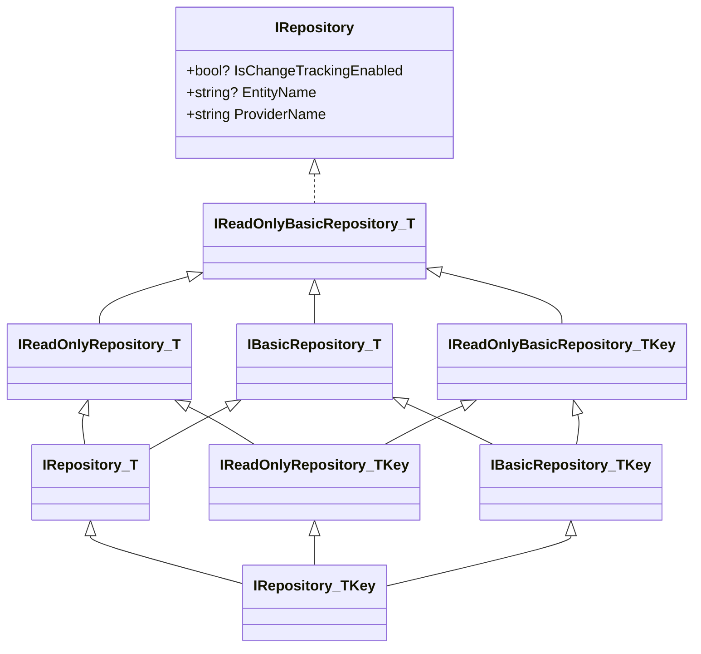

ABP repositories follow Eric Evans's pattern almost literally: the abstraction
lives in `Volo.Abp.Ddd.Domain` and concrete implementations live in the data
provider packages (`Volo.Abp.EntityFrameworkCore`, `Volo.Abp.MongoDB`).
Module-specific repositories add domain queries on top via custom interfaces.

This page enumerates every type in
`framework/src/Volo.Abp.Ddd.Domain/Volo/Abp/Domain/Repositories/`, the public
async extension surface, and the concrete provider implementations.

## Interface hierarchy



## Read-only family

### `IRepository` (root marker)

`framework/src/Volo.Abp.Ddd.Domain/Volo/Abp/Domain/Repositories/IRepository.cs`:

```csharp
public interface IRepository
{
    bool? IsChangeTrackingEnabled { get; }
    string? EntityName { get; set; }
    string ProviderName { get; }
}
```

`ProviderName` is `"EntityFrameworkCore"` or `"MongoDB"` (etc.) depending on
the concrete impl — domain code can branch on it when a feature requires
provider-specific behaviour, but should avoid doing so when possible.

### `IReadOnlyBasicRepository<TEntity>`

| Method | Notes |
| --- | --- |
| `Task<List<TEntity>> GetListAsync(bool includeDetails = false, CancellationToken ct = default)` | Bulk read. |
| `Task<long> GetCountAsync(CancellationToken ct = default)` | `long` to support > 2 billion rows. |
| `Task<List<TEntity>> GetPagedListAsync(int skipCount, int maxResultCount, string sorting, bool includeDetails = false, CancellationToken ct = default)` | Cursor-style paging with Dynamic LINQ sorting. |

### `IReadOnlyBasicRepository<TEntity, TKey>`

Adds:

| Method | Notes |
| --- | --- |
| `Task<TEntity> GetAsync(TKey id, bool includeDetails = true, CancellationToken ct = default)` | Throws `EntityNotFoundException` if missing. |
| `Task<TEntity?> FindAsync(TKey id, bool includeDetails = true, CancellationToken ct = default)` | Returns `null` if missing. |

### `IReadOnlyRepository<TEntity>`

Adds `IAsyncQueryableExecuter AsyncExecuter` + the `WithDetailsAsync` /
`GetQueryableAsync` family:

| Method | Notes |
| --- | --- |
| `Task<IQueryable<TEntity>> GetQueryableAsync()` | Raw `IQueryable` after data filters. |
| `Task<IQueryable<TEntity>> WithDetailsAsync()` | Default eager-loading. |
| `Task<IQueryable<TEntity>> WithDetailsAsync(params Expression<Func<TEntity, object>>[] propertySelectors)` | Selective eager-loading. |
| `Task<List<TEntity>> GetListAsync(Expression<Func<TEntity, bool>> predicate, bool includeDetails = false, CancellationToken ct = default)` | Predicate variant. |

Two `[Obsolete]` synchronous methods (`WithDetails()` / `WithDetails(...)`)
remain for compatibility — always prefer the async forms.

## Write family

### `IBasicRepository<TEntity>`

`framework/src/Volo.Abp.Ddd.Domain/Volo/Abp/Domain/Repositories/IBasicRepository.cs`:

| Method | Notes |
| --- | --- |
| `Task<TEntity> InsertAsync(TEntity entity, bool autoSave = false, CancellationToken ct = default)` | Returns the same entity with generated keys applied. |
| `Task InsertManyAsync(IEnumerable<TEntity> entities, bool autoSave = false, ...)` | Bulk insert. |
| `Task<TEntity> UpdateAsync(TEntity entity, bool autoSave = false, ...)` | |
| `Task UpdateManyAsync(IEnumerable<TEntity> entities, bool autoSave = false, ...)` | |
| `Task DeleteAsync(TEntity entity, bool autoSave = false, ...)` | Honours `ISoftDelete`. |
| `Task DeleteManyAsync(IEnumerable<TEntity> entities, bool autoSave = false, ...)` | |

### `IBasicRepository<TEntity, TKey>`

Adds delete-by-id helpers:

```csharp
Task DeleteAsync(TKey id, bool autoSave = false, CancellationToken ct = default);
Task DeleteManyAsync(IEnumerable<TKey> ids, bool autoSave = false, ...);
```

### `IRepository<TEntity>` and `IRepository<TEntity, TKey>`

`IRepository.cs` adds predicate-based queries and predicate-based deletes:

| Method | Notes |
| --- | --- |
| `Task<TEntity?> FindAsync(Expression<Func<TEntity, bool>> predicate, bool includeDetails = true, ...)` | Returns null. |
| `Task<TEntity> GetAsync(Expression<Func<TEntity, bool>> predicate, bool includeDetails = true, ...)` | Throws `EntityNotFoundException`, `InvalidOperationException` on duplicate. |
| `Task DeleteAsync(Expression<Func<TEntity, bool>> predicate, bool autoSave = false, ...)` | Loads then deletes — soft delete + audit + multi-tenancy work. |
| `Task DeleteDirectAsync(Expression<Func<TEntity, bool>> predicate, CancellationToken ct = default)` | Direct SQL/Mongo delete — bypasses soft delete, multi-tenancy, audit logging. |

<Warning>
`DeleteDirectAsync` is the only repository method that **bypasses** soft
delete, multi-tenancy filters, the audit log and the change-event pipeline.
Use it only when you need raw bulk deletion and you have understood the
consequences. The XML doc on the method spells out the restrictions.
</Warning>

## Method matrix

| Method | `IReadOnlyBasicRepository<T>` | `IReadOnlyBasicRepository<T,K>` | `IReadOnlyRepository<T>` | `IBasicRepository<T>` | `IBasicRepository<T,K>` | `IRepository<T>` | `IRepository<T,K>` |
| --- | :-: | :-: | :-: | :-: | :-: | :-: | :-: |
| `GetListAsync()` | ✅ | ✅ | ✅ | ✅ | ✅ | ✅ | ✅ |
| `GetCountAsync` | ✅ | ✅ | ✅ | ✅ | ✅ | ✅ | ✅ |
| `GetPagedListAsync` | ✅ | ✅ | ✅ | ✅ | ✅ | ✅ | ✅ |
| `GetAsync(TKey)` / `FindAsync(TKey)` | | ✅ | | | ✅ | | ✅ |
| `GetQueryableAsync` / `WithDetailsAsync` | | | ✅ | | | ✅ | ✅ |
| `GetListAsync(predicate)` | | | ✅ | | | ✅ | ✅ |
| `InsertAsync` / `UpdateAsync` / `DeleteAsync(entity)` | | | | ✅ | ✅ | ✅ | ✅ |
| `*ManyAsync` | | | | ✅ | ✅ | ✅ | ✅ |
| `DeleteAsync(TKey)` / `DeleteManyAsync(IEnumerable<TKey>)` | | | | | ✅ | | ✅ |
| `GetAsync(predicate)` / `FindAsync(predicate)` | | | | | | ✅ | ✅ |
| `DeleteAsync(predicate)` / `DeleteDirectAsync(predicate)` | | | | | | ✅ | ✅ |

## `RepositoryAsyncExtensions`

`framework/src/Volo.Abp.Ddd.Domain/Volo/Abp/Domain/Repositories/RepositoryAsyncExtensions.cs`
exposes LINQ-style async helpers on `IReadOnlyRepository<TEntity>`. Each
helper calls `GetQueryableAsync()` then delegates to
`IAsyncQueryableExecuter` so it works against EF Core, Mongo, in-memory or
any other LINQ provider.

| Method | Surface |
| --- | --- |
| `ContainsAsync<T>(T item)` | LINQ `Contains` over the repository. |
| `AnyAsync<T>()` / `AnyAsync<T>(predicate)` | `Any`. |
| `AllAsync<T>(predicate)` | `All`. |
| `CountAsync<T>()` / `CountAsync<T>(predicate)` | `Count`. |
| `LongCountAsync<T>()` / `LongCountAsync<T>(predicate)` | `LongCount`. |
| `FirstAsync<T>()` / `FirstOrDefaultAsync<T>()` (predicate overloads) | `First`. |
| `SingleAsync<T>()` / `SingleOrDefaultAsync<T>()` (predicate overloads) | `Single`. |
| `LastAsync<T>()` / `LastOrDefaultAsync<T>()` (predicate overloads) | `Last`. |
| `MinAsync<T,TResult>(Expression<...>)` / `MaxAsync<T,TResult>(...)` | aggregate. |
| `SumAsync<T>(Expression<...>)` / `AverageAsync<T>(Expression<...>)` | aggregate, overloads for `int/long/decimal/double/float` and nullable. |
| `ToListAsync<T>()` | materialise. |

```csharp
var stale = await userRepository.CountAsync(u => u.LastLoginTime < cutoff);
```

`IAsyncQueryableExecuter` is the abstraction that hides EF Core's
`EntityFrameworkQueryableExtensions` so domain code in
`Volo.Abp.Ddd.Application` can stay provider-agnostic.

## Base classes

### `BasicRepositoryBase<TEntity>`

Located at
`framework/src/Volo.Abp.Ddd.Domain/Volo/Abp/Domain/Repositories/BasicRepositoryBase.cs`.
Implements `IBasicRepository<TEntity>, IServiceProviderAccessor,
IUnitOfWorkEnabled` and lazy-resolves common services:

| Service | Type |
| --- | --- |
| `LazyServiceProvider` | `IAbpLazyServiceProvider` |
| `DataFilter` | `IDataFilter` |
| `CurrentTenant` | `ICurrentTenant` |
| `AsyncExecuter` | `IAsyncQueryableExecuter` |
| `UnitOfWorkManager` | `IUnitOfWorkManager` |
| `CancellationTokenProvider` | `ICancellationTokenProvider` (falls back to `NullCancellationTokenProvider`). |
| `Logger` | `ILogger` keyed on the runtime type. |
| `EntityChangeTrackingProvider` | `IEntityChangeTrackingProvider` |

Subclasses must pass `providerName` to the constructor (e.g.
`"EntityFrameworkCore"`).

### `RepositoryBase<TEntity>`

Inherits `BasicRepositoryBase<TEntity>`, implements
`IRepository<TEntity>, IUnitOfWorkManagerAccessor` and provides the abstract
`GetQueryableAsync` template method. `GetAsync(predicate)` is built once on
top of `FindAsync(predicate)` and throws `EntityNotFoundException<TEntity>`
on null.

`ApplyDataFilters<TQueryable>(query)` honours `ISoftDelete` and `IMultiTenant`
without sub-classes having to repeat the boilerplate.

### `RepositoryRegistrarBase`

Used by `Volo.Abp.EntityFrameworkCore` and `Volo.Abp.MongoDB` to scan a
`DbContext` / `MongoDbContext` for entity sets, then register matching
`IRepository<TEntity>` / `IRepository<TEntity, TKey>` / `IReadOnlyRepository<...>`
services. The base class normalises the registration logic across providers.

## Conventional registration

`AbpRepositoryConventionalRegistrar` at
`framework/src/Volo.Abp.Ddd.Domain/Volo/Abp/Domain/Repositories/AbpRepositoryConventionalRegistrar.cs`:

```csharp
public class AbpRepositoryConventionalRegistrar : DefaultConventionalRegistrar
{
    public static bool ExposeRepositoryClasses { get; set; }

    protected override bool IsConventionalRegistrationDisabled(Type type) =>
        !typeof(IRepository).IsAssignableFrom(type) || base.IsConventionalRegistrationDisabled(type);

    protected override List<Type> GetExposedServiceTypes(Type type)
    {
        if (ExposeRepositoryClasses) return base.GetExposedServiceTypes(type);
        return base.GetExposedServiceTypes(type).Where(x => x.IsInterface).ToList();
    }

    protected override ServiceLifetime? GetDefaultLifeTimeOrNull(Type type) => ServiceLifetime.Transient;
}
```

Registered from `AbpDddDomainModule.PreConfigureServices`. The default
`ExposeRepositoryClasses = false` ensures only repository **interfaces** are
exposed for injection — concrete `EfCoreRepository<...>` will not bind to
`var x = sp.GetRequiredService<EfCoreRepository<MyDbContext, Product, Guid>>()`
unless you opt in.

## Provider implementations

| File | Type | Notes |
| --- | --- | --- |
| `framework/src/Volo.Abp.EntityFrameworkCore/Volo/Abp/Domain/Repositories/EntityFrameworkCore/EfCoreRepository.cs` | `EfCoreRepository<TDbContext, TEntity>` / `<TDbContext, TEntity, TKey>` | EF Core implementation. Uses `IDbContextProvider<TDbContext>` to resolve the active DbContext for the current UoW. Implements `ISupportsExplicitLoading<TEntity>`. |
| `framework/src/Volo.Abp.MongoDB/Volo/Abp/Domain/Repositories/MongoDB/MongoDbRepository.cs` | `MongoDbRepository<TMongoDbContext, TEntity>` / `<TMongoDbContext, TEntity, TKey>` | Mongo implementation using the C# driver's `IMongoCollection<TEntity>`. |

### EF Core registration sketch

```csharp
public override void ConfigureServices(ServiceConfigurationContext context)
{
    context.Services.AddAbpDbContext<MyModuleDbContext>(options =>
    {
        options.AddDefaultRepositories(includeAllEntities: true);
        options.AddRepository<Product, EfCoreProductRepository>();
    });
}
```

The helpers are in
`framework/src/Volo.Abp.Ddd.Domain/Microsoft/Extensions/DependencyInjection/ServiceCollectionRepositoryExtensions.cs`
and the provider-specific overrides live in the EF Core / Mongo packages.

### Custom repository pattern

When you need queries that aren't covered by the generic surface, define an
interface in Domain and an implementation in the provider package:

```csharp
// modules/identity/src/Volo.Abp.Identity.Domain/Volo/Abp/Identity/IIdentityUserRepository.cs
public interface IIdentityUserRepository : IRepository<IdentityUser, Guid>
{
    Task<IdentityUser?> FindByNormalizedUserNameAsync(string normalizedUserName,
        bool includeDetails = true, CancellationToken cancellationToken = default);

    Task<List<IdentityUser>> GetListAsync(string? sorting, int maxResultCount, int skipCount,
        string? filter = null, bool includeDetails = false, ...);
}
```

```csharp
// modules/identity/src/Volo.Abp.Identity.EntityFrameworkCore/Volo/Abp/Identity/EntityFrameworkCore/EfCoreIdentityUserRepository.cs
public class EfCoreIdentityUserRepository
    : EfCoreRepository<IIdentityDbContext, IdentityUser, Guid>, IIdentityUserRepository { ... }
```

Conventional registration picks up both — `IRepository<IdentityUser, Guid>`
binds to the generic impl, while `IIdentityUserRepository` binds to the
custom impl.

## `ISupportsExplicitLoading`

`Repositories/ISupportsExplicitLoading.cs` is implemented by EF Core
repositories to allow lazy navigation loading on demand:

```csharp
await userRepo.EnsureCollectionLoadedAsync(user, x => x.Roles, ct);
await userRepo.EnsurePropertyLoadedAsync(user, x => x.Profile, ct);
```

Mongo repositories do not implement it because Mongo has no analog of
EF Core's change tracker.

## Change-tracking switch

| Member | Purpose |
| --- | --- |
| `IRepository.IsChangeTrackingEnabled` | True/false to override the provider default. |
| `IEntityChangeTrackingProvider` | Singleton that resolves the current scope's switch. |
| `[DisableEntityChangeTrackingAttribute]` / `[EnableEntityChangeTrackingAttribute]` | Method/class-level overrides used by the interceptor. |

In EF Core, this maps to `AsNoTracking()` / `AsTracking()` on the queryable.
In Mongo it is a no-op.

## Unit of Work integration

| Symbol | File | Role |
| --- | --- | --- |
| `IUnitOfWorkEnabled` | `framework/src/Volo.Abp.Uow/...` | Marker — when an `ApplicationService` or repository implements it, the UoW interceptor opens an ambient UoW around each public method. |
| `UnitOfWorkItemNames` | `Repositories/UnitOfWorkItemNames.cs` | Constants for items the UoW caches per scope (e.g. `EntityHistoryHelper`). |

See [Unit of Work](/data/unit-of-work) for transaction boundaries and event
flushing.

## Usage patterns

<Tabs>
<Tab title="Inject in a domain service">
```csharp
public class ProductManager : DomainService
{
    private readonly IRepository<Product, Guid> _productRepo;
    public ProductManager(IRepository<Product, Guid> productRepo)
    {
        _productRepo = productRepo;
    }

    public async Task<Product> CreateAsync(string name)
    {
        if (await _productRepo.AnyAsync(p => p.Name == name))
            throw new BusinessException(MyModuleErrorCodes.DuplicateProduct);

        return await _productRepo.InsertAsync(new Product(GuidGenerator.Create(), name), autoSave: true);
    }
}
```
</Tab>
<Tab title="Project to a DTO via queryable">
```csharp
public async Task<List<ProductSummaryDto>> GetSummariesAsync()
{
    var queryable = await _productRepo.GetQueryableAsync();
    var projection = queryable
        .Where(p => p.IsActive)
        .Select(p => new ProductSummaryDto { Id = p.Id, Name = p.Name });

    return await AsyncExecuter.ToListAsync(projection);
}
```
`AsyncExecuter` lets this work over EF Core or Mongo unchanged.
</Tab>
<Tab title="Eager-loading details">
```csharp
public async Task<Order> GetWithLinesAsync(Guid id)
{
    var queryable = await _orderRepo.WithDetailsAsync(o => o.Lines, o => o.Customer);
    return await AsyncExecuter.FirstAsync(queryable.Where(o => o.Id == id));
}
```
</Tab>
<Tab title="Predicate-based bulk delete">
```csharp
// Loads matching aggregates so soft-delete + audit + events fire.
await _orderRepo.DeleteAsync(o => o.Status == OrderStatus.Cancelled
                              && o.CreationTime < cutoff,
                              autoSave: true);

// Direct SQL DELETE — fastest, but bypasses soft-delete + audit.
await _orderRepo.DeleteDirectAsync(o => o.Status == OrderStatus.Cancelled);
```
</Tab>
</Tabs>

## Bulk repositories

`Volo.Abp.EntityFrameworkCore` adds `IEfCoreBulkOperationProvider` and
`IBulkRepository<TEntity>` (in `Volo.Abp.EntityFrameworkCore.BulkOperations`)
for high-throughput inserts and updates that bypass the standard change
tracker. Reach for it only after measuring — `InsertManyAsync` is sufficient
for most workloads.

## Filterers and tenant context

| Symbol | Purpose |
| --- | --- |
| `IDataFilter` | Toggle global filters (`ISoftDelete`, `IMultiTenant`). |
| `ICurrentTenant.Change(Guid? tenantId)` | Scope a block to another tenant. |
| `BasicRepositoryBase.ApplyDataFilters` | Reused by EF Core / Mongo repositories. |

## Cross-references

- [Entities and Aggregates](/ddd/entities-and-aggregates) — the entity types
  consumed by repositories.
- [Data and Unit of Work](/data/overview) — `IDataFilter`,
  `IDbContextProvider`, save interceptors.
- [Unit of Work](/data/unit-of-work) — ambient transaction scope.
- [Domain Services](/ddd/domain-services) — typical consumers of repositories.
- [Application Services](/ddd/application-services) — the layer above that
  exposes repository queries as DTOs.
