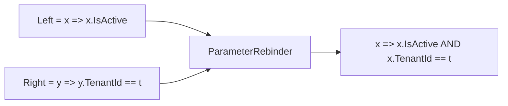

Two small but important pieces of ABP's DDD toolbox live outside the entity
hierarchy: **value objects** (atomic, equality-by-value pieces of state) and
**specifications** (encapsulated business rules that double as LINQ
predicates). This page enumerates every type in the relevant packages and
shows how they interlock with repositories.

## Value objects

### The base class

`framework/src/Volo.Abp.Ddd.Domain/Volo/Abp/Domain/Values/ValueObject.cs`:

```csharp
public abstract class ValueObject
{
    protected abstract IEnumerable<object> GetAtomicValues();

    public bool ValueEquals(object obj)
    {
        if (obj == null || obj.GetType() != GetType()) return false;
        var other = (ValueObject)obj;

        var thisValues = GetAtomicValues().GetEnumerator();
        var otherValues = other.GetAtomicValues().GetEnumerator();

        var thisMoveNext = thisValues.MoveNext();
        var otherMoveNext = otherValues.MoveNext();
        while (thisMoveNext && otherMoveNext)
        {
            if (ReferenceEquals(thisValues.Current, null) ^ ReferenceEquals(otherValues.Current, null))
                return false;

            if (thisValues.Current is ValueObject currentValueObject
                && otherValues.Current is ValueObject otherValueObject)
            {
                if (!currentValueObject.ValueEquals(otherValueObject)) return false;
            }
            else if (thisValues.Current != null && !thisValues.Current.Equals(otherValues.Current))
                return false;

            thisMoveNext = thisValues.MoveNext();
            otherMoveNext = otherValues.MoveNext();
            if (thisMoveNext != otherMoveNext) return false;
        }
        return !thisMoveNext && !otherMoveNext;
    }
}
```

The template method pattern: subclasses override `GetAtomicValues()` to
yield the fields that participate in identity, and `ValueEquals` walks both
sequences in parallel, recursing into nested `ValueObject`s.

<Note>
The class is inspired by Microsoft's
[microservices DDD/CQRS reference](https://docs.microsoft.com/en-us/dotnet/standard/microservices-architecture/microservice-ddd-cqrs-patterns/implement-value-objects)
(comment in source). It does **not** override `Equals`/`GetHashCode` — those
remain reference-equality. Use `ValueEquals` explicitly when you need
value equality semantics.
</Note>

### Example

```csharp
public class Address : ValueObject
{
    public string Street { get; }
    public string City { get; }
    public string ZipCode { get; }
    public string CountryCode { get; }

    public Address(string street, string city, string zip, string countryCode)
    {
        Street = Check.NotNullOrWhiteSpace(street, nameof(street));
        City = Check.NotNullOrWhiteSpace(city, nameof(city));
        ZipCode = Check.NotNullOrWhiteSpace(zip, nameof(zip));
        CountryCode = Check.NotNullOrWhiteSpace(countryCode, nameof(countryCode));
    }

    protected override IEnumerable<object> GetAtomicValues()
    {
        yield return Street;
        yield return City;
        yield return ZipCode;
        yield return CountryCode;
    }
}
```

### Persistence

Map a value object as an owned type in EF Core:

```csharp
b.OwnsOne(c => c.ShippingAddress, a =>
{
    a.Property(p => p.Street).HasMaxLength(MyModuleConsts.MaxStreetLength).IsRequired();
    a.Property(p => p.City).HasMaxLength(MyModuleConsts.MaxCityLength).IsRequired();
    a.Property(p => p.ZipCode).HasMaxLength(16).IsRequired();
    a.Property(p => p.CountryCode).HasMaxLength(2).IsRequired();
});
```

For Mongo, value objects map as nested BSON documents automatically.

<Tip>
A value object is **immutable**. Use init-only or read-only properties so the
"replace, don't mutate" rule is enforced at compile time. Aggregates
"change" their value-object members by assigning a new instance.
</Tip>

## Specifications

### Package layout

`framework/src/Volo.Abp.Specifications/Volo/Abp/Specifications/`:

```text
├── AbpSpecificationsModule.cs
├── ISpecification.cs
├── ICompositeSpecification.cs
├── ISpecificationParser.cs
├── Specification.cs
├── CompositeSpecification.cs
├── AndSpecification.cs
├── AndNotSpecification.cs
├── OrSpecification.cs
├── NotSpecification.cs
├── AnySpecification.cs
├── NoneSpecification.cs
├── ExpressionSpecification.cs
├── SpecificationExtensions.cs
├── ExpressionFuncExtender.cs
└── ParameterRebinder.cs
```

The module is empty — it exists only so other modules can declare a
`[DependsOn(typeof(AbpSpecificationsModule))]` dependency. `AbpDddDomainModule`
references it, so every domain project transitively gets the types.

### The contract

```csharp
public interface ISpecification<T>
{
    bool IsSatisfiedBy(T obj);
    Expression<Func<T, bool>> ToExpression();
}
```

Two methods, two complementary uses:

1. `IsSatisfiedBy(obj)` — in-memory predicate, used for invariant checks
   inside aggregates or domain services.
2. `ToExpression()` — `Expression<Func<T, bool>>` that LINQ providers
   translate into SQL / MongoDB queries.

### `Specification<T>` base

```csharp
public abstract class Specification<T> : ISpecification<T>
{
    public virtual bool IsSatisfiedBy(T obj) => ToExpression().Compile()(obj);

    public abstract Expression<Func<T, bool>> ToExpression();

    public static implicit operator Expression<Func<T, bool>>(Specification<T> spec)
        => spec.ToExpression();
}
```

The implicit conversion lets you pass a spec directly to a repository call
expecting an `Expression<Func<T, bool>>`:

```csharp
var spec = new ActiveUsersSpecification();
var count = await userRepo.CountAsync(spec); // implicit -> Expression
```

### Composite specifications

| Type | Combines via |
| --- | --- |
| `AndSpecification<T>` | `Left.ToExpression().And(Right.ToExpression())` (LINQ-Kit-style `And` extension). |
| `OrSpecification<T>` | `Left.ToExpression().Or(Right.ToExpression())`. |
| `AndNotSpecification<T>` | `Left AND NOT Right`. Rebuilds the right expression with `Expression.Not(body)`. |
| `NotSpecification<T>` | `Expression.Not(body)` of the wrapped spec. |
| `AnySpecification<T>` | Always-satisfied (`o => true`). Use as identity for `And`. |
| `NoneSpecification<T>` | Never-satisfied (`o => false`). Use as identity for `Or`. |
| `ExpressionSpecification<T>` | Adapter — wraps any pre-built `Expression<Func<T, bool>>`. |

```csharp
public abstract class CompositeSpecification<T> : Specification<T>, ICompositeSpecification<T>
{
    protected CompositeSpecification(ISpecification<T> left, ISpecification<T> right)
    { Left = left; Right = right; }

    public ISpecification<T> Left { get; }
    public ISpecification<T> Right { get; }
}
```

### Fluent extensions

`SpecificationExtensions.cs`:

```csharp
public static ISpecification<T> And<T>(this ISpecification<T> spec, ISpecification<T> other);
public static ISpecification<T> Or<T>(this ISpecification<T> spec, ISpecification<T> other);
public static ISpecification<T> AndNot<T>(this ISpecification<T> spec, ISpecification<T> other);
public static ISpecification<T> Not<T>(this ISpecification<T> spec);
```

Each helper performs `Check.NotNull` and returns the matching composite.
Build a non-trivial query in a readable way:

```csharp
var spec = new ActiveUsersSpec()
    .And(new TenantSpec(currentTenantId))
    .AndNot(new LockedOutSpec());
```

### Expression composition under the hood

`ExpressionFuncExtender.cs` provides the `And` / `Or` extension methods on
`Expression<Func<T, bool>>` used by the composite specs. It uses
`ParameterRebinder.cs` to rewrite the right-hand expression's parameter
into the left-hand parameter so the combined expression is a single
LINQ-translatable tree.



Without `ParameterRebinder`, the combined expression would have two
distinct `ParameterExpression` instances and EF Core would fail to
translate it.

### Specification parser

`ISpecificationParser<TCriteria>`:

```csharp
public interface ISpecificationParser<out TCriteria>
{
    TCriteria Parse<T>(ISpecification<T> specification);
}
```

The framework does not ship a concrete parser — it is a hook for legacy
ORMs (NHibernate `ICriteria`, etc.) that need a non-LINQ representation.
For EF Core / Mongo you just use `ToExpression()`.

## Using specifications with repositories

Because of the implicit conversion in `Specification<T>`, any
`Expression<Func<T, bool>>`-accepting repository method takes a spec
unchanged:

<Tabs>
<Tab title="Predicate-based queries">
```csharp
public sealed class ActiveUserSpecification : Specification<IdentityUser>
{
    public override Expression<Func<IdentityUser, bool>> ToExpression()
        => u => u.IsActive && !u.IsDeleted;
}

// usage
var users = await _userRepo.GetListAsync(new ActiveUserSpecification());
var total = await _userRepo.CountAsync(new ActiveUserSpecification());
var first = await _userRepo.FindAsync(new ActiveUserSpecification());
```
</Tab>
<Tab title="Composing">
```csharp
public sealed class UserInTenantSpec : Specification<IdentityUser>
{
    private readonly Guid? _tenantId;
    public UserInTenantSpec(Guid? tenantId) => _tenantId = tenantId;
    public override Expression<Func<IdentityUser, bool>> ToExpression()
        => u => u.TenantId == _tenantId;
}

var activeInTenant = new ActiveUserSpecification()
    .And(new UserInTenantSpec(CurrentTenant.Id));

var queryable = await _userRepo.GetQueryableAsync();
var page = await AsyncExecuter.ToListAsync(
    queryable.Where(activeInTenant.ToExpression()).Skip(0).Take(20));
```
</Tab>
<Tab title="In-memory invariants">
```csharp
public class TransferFundsService : DomainService
{
    public void Transfer(Account from, Account to, decimal amount)
    {
        var spec = new SufficientFundsSpec(amount);
        if (!spec.IsSatisfiedBy(from))
            throw new BusinessException(BankingErrorCodes.InsufficientFunds);

        from.Debit(amount);
        to.Credit(amount);
    }
}
```
The same `SufficientFundsSpec` can be re-used in a queryable filter to
project "accounts ready for a payout" — write the rule once, use it in
two modes.
</Tab>
</Tabs>

## Specification + repository test recipe

<Steps>
<Step title="Define the spec next to the aggregate">
  `Products/Specifications/HighValueProductSpec.cs` under the Domain
  project.
</Step>
<Step title="Write a unit test for IsSatisfiedBy">
  No DbContext needed — pure in-memory.
  ```csharp
  Assert.True(new HighValueProductSpec(1000m).IsSatisfiedBy(new Product { Price = 2500m }));
  ```
</Step>
<Step title="Write an integration test via the repository">
  ```csharp
  var actual = await _productRepo.GetListAsync(new HighValueProductSpec(1000m));
  ```
  This exercises the SQL translation path.
</Step>
<Step title="Compose with other specs">
  ```csharp
  var spec = new HighValueProductSpec(1000m).And(new InStockSpec());
  ```
</Step>
</Steps>

## ValueObject + Specification together

A typical pattern: a value object captures the criteria *data*, and a
specification turns it into a predicate.

```csharp
public sealed class DateRange : ValueObject
{
    public DateTime From { get; }
    public DateTime To { get; }
    public DateRange(DateTime from, DateTime to) { From = from; To = to; }
    protected override IEnumerable<object> GetAtomicValues() { yield return From; yield return To; }
}

public sealed class OrderInRangeSpec : Specification<Order>
{
    private readonly DateRange _range;
    public OrderInRangeSpec(DateRange range) => _range = range;
    public override Expression<Func<Order, bool>> ToExpression() =>
        o => o.CreationTime >= _range.From && o.CreationTime <= _range.To;
}
```

## Cross-references

- [Entities and Aggregates](/ddd/entities-and-aggregates) — aggregates that
  *contain* value objects.
- [Repositories](/ddd/repositories) — methods that accept
  `Expression<Func<T, bool>>` / `ISpecification<T>`.
- [Domain Services](/ddd/domain-services) — where invariants enforced by
  `IsSatisfiedBy` typically live.
- [Domain](/ddd/domain) — folder layout that includes `Values/` and
  references `Volo.Abp.Specifications`.
