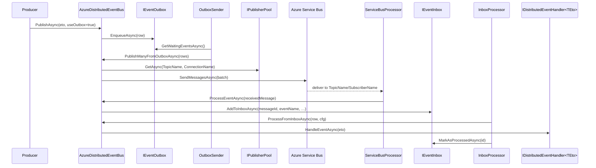

The Azure provider package is `framework/src/Volo.Abp.EventBus.Azure/`. It rides on **`Volo.Abp.AzureServiceBus`** (`framework/src/Volo.Abp.AzureServiceBus/Volo/Abp/AzureServiceBus/`), which wraps `Azure.Messaging.ServiceBus.ServiceBusClient` behind pooled abstractions.

## Files in this package

| File | Role |
| --- | --- |
| `AbpEventBusAzureModule.cs` | ABP module — binds the `Azure:EventBus` config section. If `IsServiceBusDisabled` is false, calls `AzureDistributedEventBus.Initialize()` at startup. |
| `AbpAzureEventBusOptions.cs` | Connection name, topic, subscriber and a kill-switch. |
| `AzureDistributedEventBus.cs` | The `DistributedEventBusBase` implementation. Singleton. |

`Volo.Abp.AzureServiceBus` provides:

- `AbpAzureServiceBusModule`, `AbpAzureServiceBusOptions`, `AzureServiceBusConnections`
- `IConnectionPool` / `ConnectionPool` — cached `ServiceBusClient` per connection name.
- `IPublisherPool` / `PublisherPool` — cached `ServiceBusSender` per (topic, connection).
- `IProcessorPool` / `ProcessorPool` — cached `ServiceBusProcessor`.
- `IAzureServiceBusMessageConsumer` / `…Factory` — a thin wrapper around the processor that subscribes ABP handlers.
- `IAzureServiceBusSerializer` (`Utf8JsonAzureServiceBusSerializer` by default).
- `ServiceBusAdministrationClientExtensions` — provisions topic/subscription via `ServiceBusAdministrationClient` when needed.

## Module wiring

```csharp
[DependsOn(
    typeof(AbpEventBusModule),
    typeof(AbpAzureServiceBusModule))]
public class AbpEventBusAzureModule : AbpModule
{
    public override void ConfigureServices(ServiceConfigurationContext context)
    {
        var configuration = context.Services.GetConfiguration();
        Configure<AbpAzureEventBusOptions>(configuration.GetSection("Azure:EventBus"));
    }

    public override void OnApplicationInitialization(ApplicationInitializationContext context)
    {
        var options = context.ServiceProvider.GetRequiredService<IOptions<AbpAzureEventBusOptions>>().Value;
        if (!options.IsServiceBusDisabled)
        {
            context.ServiceProvider
                .GetRequiredService<AzureDistributedEventBus>()
                .Initialize();
        }
    }
}
```

`IsServiceBusDisabled = true` skips `Initialize()` — useful for hosts that depend on the module but don't want the consumer running (e.g. during migrations).

## Options

`AbpAzureEventBusOptions`:

| Property | Purpose |
| --- | --- |
| `ConnectionName` | Picks an entry from `AbpAzureServiceBusOptions.Connections`. Each connection carries the fully-qualified namespace or connection string. |
| `TopicName` | Service Bus topic used as the **event-bus topic** for both publishing (sender) and consuming (processor). |
| `SubscriberName` | Subscription on `TopicName` for this service. Each service gets its own subscription; replicas of the same service share it. |
| `IsServiceBusDisabled` | If `true`, `Initialize()` is skipped. |

Example `appsettings.json`:

```json
{
  "Azure": {
    "ServiceBus": {
      "Connections": {
        "Default": { "ConnectionString": "Endpoint=sb://…" }
      }
    },
    "EventBus": {
      "TopicName": "abp-events",
      "SubscriberName": "order-service",
      "ConnectionName": "Default"
    }
  }
}
```

## Initialize

```csharp
public void Initialize()
{
    Consumer = MessageConsumerFactory.CreateMessageConsumer(
        Options.TopicName,
        Options.SubscriberName,
        Options.ConnectionName);

    Consumer.OnMessageReceived(ProcessEventAsync);
    SubscribeHandlers(AbpDistributedEventBusOptions.Handlers);
}
```

The factory resolves (or creates) the topic/subscription via the administration client, builds a `ServiceBusProcessor` from `IProcessorPool`, and starts it. `OnMessageReceived` registers the callback against `ServiceBusProcessor.ProcessMessageAsync`.

## Publish path

`PublishFromOutboxAsync` and the direct publisher both flow through an internal `PublishAsync(string eventName, byte[] body, string? correlationId, Guid? messageId)`:

```csharp
var publisher = await PublisherPool.GetAsync(Options.TopicName, Options.ConnectionName);
var message = new ServiceBusMessage(body)
{
    Subject       = eventName,
    MessageId     = (messageId ?? Guid.NewGuid()).ToString(),
    CorrelationId = correlationId
};
await publisher.SendMessageAsync(message);
```

The event name lives in `ServiceBusMessage.Subject`; that is what the consumer reads on the receive side. Publisher confirmations are native to Service Bus (the `SendMessageAsync` task completes only after the broker has acknowledged).

`PublishManyFromOutboxAsync` builds a `ServiceBusMessageBatch`:

```csharp
var publisher = await PublisherPool.GetAsync(Options.TopicName, Options.ConnectionName);
using var messageBatch = await publisher.CreateMessageBatchAsync();

foreach (var outgoing in outgoingEvents)
{
    var msg = new ServiceBusMessage(outgoing.EventData) { Subject = outgoing.EventName };
    msg.MessageId     = msg.MessageId.IsNullOrWhiteSpace() ? outgoing.Id.ToString() : msg.MessageId;
    msg.CorrelationId = outgoing.GetCorrelationId();

    if (!messageBatch.TryAddMessage(msg))
        throw new AbpException("The message is too large to fit in the batch. " +
                               "Set AbpEventBusBoxesOptions.OutboxWaitingEventMaxCount to reduce the number");
}

await publisher.SendMessagesAsync(messageBatch);
```

If the batch overflows the broker's max-batch-size, the bus throws and the outbox sender's loop will pick the rows up on the next tick. Lowering `OutboxWaitingEventMaxCount` is the documented mitigation.

## Receive and inbox handoff

```csharp
private async Task ProcessEventAsync(ServiceBusReceivedMessage message)
{
    var eventName = message.Subject;
    if (eventName == null) return;
    var eventType = EventTypes.GetOrDefault(eventName);
    if (eventType == null) return;

    var eventData = Serializer.Deserialize(message.Body.ToArray(), eventType);

    if (await AddToInboxAsync(message.MessageId, eventName, eventType, eventData, message.CorrelationId))
        return;

    using (CorrelationIdProvider.Change(message.CorrelationId))
        await TriggerHandlersDirectAsync(eventType, eventData);
}
```

Same shape as the other providers: inbox if configured, direct dispatch otherwise. `message.MessageId` is what makes inbox idempotency work — repeated deliveries of the same Service Bus message id are recognized by `IEventInbox.ExistsByMessageIdAsync`.

## End-to-end sequence



## Operational notes

- **One topic, many subscriptions.** All services produce to `TopicName`; each consuming service owns a subscription named `SubscriberName`. Replicas of the same service compete on the same subscription (Service Bus load-balances). Use SQL or correlation filters at the subscription level to pre-filter event types if needed.
- **Topic/subscription provisioning.** `Volo.Abp.AzureServiceBus.ServiceBusAdministrationClientExtensions` exposes idempotent create-or-update helpers; the consumer factory ensures the subscription exists before starting the processor. Production deployments typically pre-provision these with infrastructure-as-code instead.
- **Idempotency.** Service Bus does *not* guarantee single delivery; the inbox plus `MessageId` is the correct deduplication path. Avoid relying on `RequiresDuplicateDetection` at the topic level except as a coarse safety net.
- **Dead-lettering.** ABP doesn't disable Service Bus's native DLQ. Combined with `InboxProcessorFailurePolicy.Discard`, you can have ABP rapidly discard locally while the broker keeps the original payload in the DLQ for inspection.
- **Kill switch.** Toggling `IsServiceBusDisabled` is useful for hosts that run the same module (e.g. a CLI tool) but should not start a consumer.

## Related files

- `Volo.Abp.AzureServiceBus/Volo/Abp/AzureServiceBus/AbpAzureServiceBusModule.cs` — depends-on entry point.
- `Volo.Abp.AzureServiceBus/Volo/Abp/AzureServiceBus/AbpAzureServiceBusOptions.cs` + `AzureServiceBusConnections.cs` — connections.
- `Volo.Abp.AzureServiceBus/Volo/Abp/AzureServiceBus/ConnectionPool.cs` — cached `ServiceBusClient`.
- `Volo.Abp.AzureServiceBus/Volo/Abp/AzureServiceBus/PublisherPool.cs` — cached `ServiceBusSender` per (topic, connection).
- `Volo.Abp.AzureServiceBus/Volo/Abp/AzureServiceBus/ProcessorPool.cs` — cached `ServiceBusProcessor`.
- `Volo.Abp.AzureServiceBus/Volo/Abp/AzureServiceBus/AzureServiceBusMessageConsumer(Factory).cs` — wraps the processor and dispatches into the bus.
- `Volo.Abp.AzureServiceBus/Volo/Abp/AzureServiceBus/ServiceBusAdministrationClientExtensions.cs` — topic/subscription creation.
- `Volo.Abp.AzureServiceBus/Volo/Abp/AzureServiceBus/Utf8JsonAzureServiceBusSerializer.cs` — default payload codec.

Related pages: [Distributed event bus](/eventbus/distributed-event-bus) · [Distributed publish flow](/flows/distributed-event-publish).
