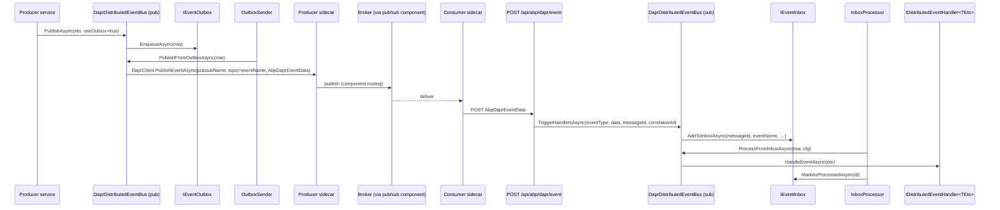

The Dapr provider is split across two packages:

- `framework/src/Volo.Abp.EventBus.Dapr/` — publish side and the bus itself.
- `framework/src/Volo.Abp.AspNetCore.Mvc.Dapr.EventBus/` — the ASP.NET Core endpoint that maps Dapr Topic subscriptions to ABP handlers.

Both depend on **`Volo.Abp.Dapr`** (`framework/src/Volo.Abp.Dapr/Volo/Abp/Dapr/`), which owns the typed `DaprClient` factory (`IAbpDaprClientFactory`), `AbpDaprOptions`, the API token validator and the default JSON serializer (`IDaprSerializer`).

## Files in this package

### `Volo.Abp.EventBus.Dapr`

| File | Role |
| --- | --- |
| `AbpEventBusDaprModule.cs` | ABP module — calls `DaprDistributedEventBus.Initialize()` at startup. |
| `AbpDaprEventBusOptions.cs` | One option: `PubSubName` (default `"pubsub"`). |
| `AbpDaprEventData.cs` | Wire envelope sent to Dapr — wraps `PubSubName`, `Topic`, `MessageId`, `JsonData`, `CorrelationId`. |
| `DaprDistributedEventBus.cs` | The `DistributedEventBusBase` implementation. |

### `Volo.Abp.AspNetCore.Mvc.Dapr.EventBus`

| File | Role |
| --- | --- |
| `AbpAspNetCoreMvcDaprEventBusModule.cs` | Module — maps `POST /api/abp/dapr/event` and emits a `TopicAttribute` per registered `IDistributedEventHandler<TEto>` so Dapr's `MapSubscribeHandler()` advertises them. |

## Module wiring (publish side)

```csharp
[DependsOn(
    typeof(AbpEventBusModule),
    typeof(AbpDaprModule))]
public class AbpEventBusDaprModule : AbpModule
{
    public override void OnApplicationInitialization(ApplicationInitializationContext context)
    {
        context.ServiceProvider
            .GetRequiredService<DaprDistributedEventBus>()
            .Initialize();
    }
}
```

`Initialize()` only calls `SubscribeHandlers(AbpDistributedEventBusOptions.Handlers)` — there is no consumer to start because *Dapr pushes events to your HTTP endpoint*. The receive path is the ASP.NET Core route, not a long-running consumer task.

## Options

`AbpDaprEventBusOptions`:

| Property | Default | Purpose |
| --- | --- | --- |
| `PubSubName` | `"pubsub"` | Logical name of the Dapr **Pub/Sub component** (`pubsub.yaml`) the sidecar resolves to a concrete broker (Redis, Kafka, Service Bus, RabbitMQ, …). |

The `topic` is the ABP event name (`EventNameAttribute.GetNameOrDefault(eventType)` — falling back to `eventType.FullName`). Configure your sidecar component once; the bus does not know which broker is behind it.

## Publish path

`DaprDistributedEventBus.PublishToEventBusAsync` ends in `PublishToDaprAsync`:

```csharp
protected virtual async Task PublishToDaprAsync(
    string eventName, object eventData, Guid? messageId = null, string? correlationId = null)
{
    var client = await DaprClientFactory.CreateAsync();
    var data = new AbpDaprEventData(
        DaprEventBusOptions.PubSubName,
        eventName,
        (messageId ?? GuidGenerator.Create()).ToString("N"),
        Serializer.SerializeToString(eventData),
        correlationId);
    await client.PublishEventAsync(pubsubName: DaprEventBusOptions.PubSubName, topicName: eventName, data: data);
}
```

The `AbpDaprEventData` envelope is what travels over Dapr — the actual ETO is the `JsonData` string field inside it. This wrapping is necessary because Dapr forwards arbitrary JSON; ABP needs envelope-level fields (`MessageId`, `CorrelationId`) regardless of the broker behind the sidecar.

`PublishManyFromOutboxAsync` simply loops `PublishFromOutboxAsync` — Dapr's HTTP/gRPC API does not have a built-in batch publish.

## Receive path: ASP.NET Core endpoint

`AbpAspNetCoreMvcDaprEventBusModule.ConfigureServices` post-configures `AbpEndpointRouterOptions` to map a single endpoint:

```csharp
var endpointConventionBuilder = endpointContext.Endpoints.MapPost(
    "/api/abp/dapr/event", async httpContext => { await HandleEventAsync(httpContext); });

var abpEvents = GetAbpEvents(endpointContext);
foreach (var @event in abpEvents.Where(x => !topicMetadatas.Any(t => t.PubsubName == x.PubsubName && t.Name == x.Name)))
{
    endpointConventionBuilder.WithMetadata(new TopicAttribute(@event.PubsubName, @event.Name, true));
}

endpointContext.Endpoints.MapSubscribeHandler();
```

`GetAbpEvents` walks `AbpDistributedEventBusOptions.Handlers` and produces one `TopicAttribute(PubsubName, EventName)` per `IDistributedEventHandler<TEto>` interface. `endpoints.MapSubscribeHandler()` then exposes Dapr's standard `/dapr/subscribe` discovery endpoint advertising every topic. The Dapr sidecar polls that, subscribes on the broker for your service, and pushes every matching message back to `POST /api/abp/dapr/event`.

`HandleEventAsync` validates the Dapr app-API token, reads the body, deserializes it as `AbpDaprEventData`, resolves the event type via `DaprDistributedEventBus.GetEventType(eventName)`, deserializes the payload, and calls `DaprDistributedEventBus.TriggerHandlersAsync(eventType, eventData, messageId, correlationId)` — which itself either enqueues into the inbox or dispatches synchronously.

## End-to-end sequence



## Operational notes

- **One `pubsub` component, one ABP event bus.** All ABP events share `PubSubName`. If you need to route different events to different brokers, run more than one pub/sub component (e.g. `events-internal`, `events-external`) and split via a custom `OutboxConfig.Selector` plus a custom IDistributedEventBus override per outbox — Dapr itself does not multiplex.
- **HTTP vs gRPC sidecar.** `IAbpDaprClientFactory` builds a `DaprClient` via the standard `DaprClientBuilder`, configured by `AbpDaprOptions` (HTTP endpoint, gRPC endpoint, API tokens). The bus is agnostic.
- **API tokens.** `httpContext.ValidateDaprAppApiToken()` (from `Volo.Abp.Dapr.AspNetCore`) checks the `dapr-api-token` header. If `AbpDaprOptions.AppApiToken` is set, untrusted requests are rejected.
- **Topic discovery.** Topics are computed at app start from the registered handlers. New handler types added at runtime (after `MapSubscribeHandler` ran) will not be advertised — you must restart the host. This matches Dapr's static subscription model.
- **No native batch.** Outbox batching is a no-op here; rely on the broker behind the sidecar (Kafka, Service Bus, …) for throughput.
- **Receive HTTP path bypasses the consumer.** `OutboxSender` is still a background worker, but there is no `InboxProcessManager`-equivalent consumer task — Dapr's sidecar is the "receiver loop".

## Related files

- `Volo.Abp.Dapr/Volo/Abp/Dapr/AbpDaprModule.cs` — depends-on entry point.
- `Volo.Abp.Dapr/Volo/Abp/Dapr/AbpDaprOptions.cs` — sidecar endpoints and API tokens.
- `Volo.Abp.Dapr/Volo/Abp/Dapr/AbpDaprClientFactory.cs` — `DaprClient` builder.
- `Volo.Abp.Dapr/Volo/Abp/Dapr/IDaprSerializer.cs`, `Utf8JsonDaprSerializer.cs` — payload codec.
- `Volo.Abp.AspNetCore.Mvc.Dapr.EventBus/Volo/Abp/AspNetCore/Mvc/Dapr/EventBus/AbpAspNetCoreMvcDaprEventBusModule.cs` — the receive endpoint.

Related pages: [Distributed event bus](/eventbus/distributed-event-bus) · [Distributed publish flow](/flows/distributed-event-publish) · [Dapr integration](/integrations/dapr).
