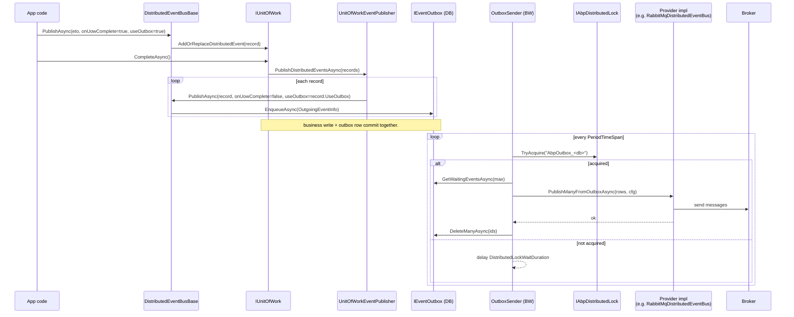

The distributed event bus is the cross-process counterpart of the local bus. Producers publish typed event-transfer-objects (**ETOs**) and receivers in other services pick them up through a broker (RabbitMQ, Kafka, Azure Service Bus, Dapr, Rebus) or — in default/dev mode — through the in-process `LocalDistributedEventBus`. All implementations derive from `DistributedEventBusBase` and share the same outbox/inbox and UoW mechanics.

## Contract

`framework/src/Volo.Abp.EventBus.Abstractions/Volo/Abp/EventBus/Distributed/IDistributedEventBus.cs`:

```csharp
public interface IDistributedEventBus : IEventBus
{
    IDisposable Subscribe<TEvent>(IDistributedEventHandler<TEvent> handler) where TEvent : class;

    Task PublishAsync<TEvent>(TEvent eventData, bool onUnitOfWorkComplete = true, bool useOutbox = true) where TEvent : class;
    Task PublishAsync(Type eventType, object eventData, bool onUnitOfWorkComplete = true, bool useOutbox = true);
}
```

Handlers implement `IDistributedEventHandler<TEto>`:

```csharp
public interface IDistributedEventHandler<in TEvent> : IEventHandler
{
    Task HandleEventAsync(TEvent eventData);
}
```

A typical handler:

```csharp
public class WhenInvoicePaidUpdateLedger :
    IDistributedEventHandler<InvoicePaidEto>, ITransientDependency
{
    public Task HandleEventAsync(InvoicePaidEto eventData) { /* … */ return Task.CompletedTask; }
}
```

ABP discovers it through the same `AbpEventBusModule.OnRegistered` scan that discovers `ILocalEventHandler<>`; the handler type is added to `AbpDistributedEventBusOptions.Handlers` and the active provider's constructor calls `SubscribeHandlers` over that list.

<Tip>
  There is no abstract `DistributedEventHandler<TEto>` base class in the framework — the contract is the interface. Several application modules ship their own thin base classes (e.g. for telemetry), but they are not part of `Volo.Abp.EventBus.*`.
</Tip>

## Event-name resolution and ETO mapping

The wire identifier for an event is its **event name**, resolved by `EventNameAttribute.GetNameOrDefault(eventType)`:

```csharp
return (eventType.GetCustomAttributes(true)
            .OfType<IEventNameProvider>()
            .FirstOrDefault()?.GetName(eventType)
        ?? eventType.FullName)!;
```

Attach `[EventName("invoice.paid.v1")]` to make the name stable across refactors and across services. For generic ETOs use `[GenericEventName(…)]` (see `Volo.Abp.EventBus.Abstractions/Volo/Abp/EventBus/GenericEventNameAttribute.cs`).

The DDD layer adds a higher-level mapping called **`EtoMappings`** (under `framework/src/Volo.Abp.Ddd.Domain.Shared/Volo/Abp/Domain/Entities/Events/Distributed/EtoMappingDictionary.cs`). It tells the framework which ETO type to publish for a given entity type, so `EntityCreatedEto<Order>` is translated to your custom `OrderEto` automatically by `EntityToEtoMapper`:

```csharp
Configure<AbpDistributedEntityEventOptions>(options =>
{
    options.EtoMappings.Add<Order, OrderEto>();
    options.AutoEventSelectors.Add<Order>();
});
```

That configuration lives outside this section ([DDD application contracts](/ddd/application-contracts)) but every distributed event bus implementation eventually receives the resulting ETO through `PublishAsync`.

## DistributedEventBusBase

`framework/src/Volo.Abp.EventBus/Volo/Abp/EventBus/Distributed/DistributedEventBusBase.cs` extends `EventBusBase` and implements `ISupportsEventBoxes`. Provider classes override two abstract methods and three lifecycle hooks:

| Abstract member | Purpose |
| --- | --- |
| `Subscribe(Type, IEventHandlerFactory)` | Register handler in the provider's internal dictionary and (often) bind the queue/topic. |
| `Unsubscribe*`, `UnsubscribeAll` | Mirror of subscription. Most providers do not unbind on the broker. |
| `Serialize(object) : byte[]` | Used by `AddToOutboxAsync` to persist the ETO. Defaults vary by provider (UTF-8 JSON in `LocalDistributedEventBus`). |
| `PublishToEventBusAsync(Type, object)` | Direct (non-outbox) publish path. |
| `PublishFromOutboxAsync`, `PublishManyFromOutboxAsync` | Drained by `OutboxSender`. The broker-facing publish call lives here. |
| `ProcessFromInboxAsync` | Drained by `InboxProcessor`. Deserializes from `IncomingEventInfo.EventData` and calls `TriggerHandlersFromInboxAsync`. |

The publish algorithm in the base class is:

```csharp
public override async Task PublishAsync(Type eventType, object eventData, bool onUnitOfWorkComplete = true, bool useOutbox = true)
{
    if (onUnitOfWorkComplete && UnitOfWorkManager.Current != null)
    {
        AddToUnitOfWork(UnitOfWorkManager.Current,
            new UnitOfWorkEventRecord(eventType, eventData, EventOrderGenerator.GetNext(), useOutbox));
        return;
    }

    if (useOutbox && await AddToOutboxAsync(eventType, eventData))
        return;

    await PublishToEventBusAsync(eventType, eventData);
    await TriggerDistributedEventSentAsync(new DistributedEventSent { Source = DistributedEventSource.Direct, … });
}
```

`AddToOutboxAsync` walks every `OutboxConfig` registered in `AbpDistributedEventBusOptions.Outboxes`, applies the optional `Selector` predicate to decide whether this outbox handles the given event type, resolves `IEventOutbox` from the UoW's `ServiceProvider`, and inserts an `OutgoingEventInfo`. The `correlation-id` is copied from `ICorrelationIdProvider` into the ETO's `ExtraProperties[X-Correlation-Id]`.

The inbox mirror is `AddToInboxAsync(messageId, eventName, eventType, eventData, correlationId)`. It checks `ExistsByMessageIdAsync` for idempotency before inserting, and is called from the **receive** path of every provider (`RabbitMqDistributedEventBus.ProcessEventAsync`, `KafkaDistributedEventBus.ProcessEventAsync`, etc.).

## Options

### `AbpDistributedEventBusOptions`

```csharp
public class AbpDistributedEventBusOptions
{
    public ITypeList<IEventHandler> Handlers { get; } = new TypeList<IEventHandler>();
    public OutboxConfigDictionary Outboxes { get; } = new OutboxConfigDictionary();
    public InboxConfigDictionary Inboxes { get; } = new InboxConfigDictionary();
}
```

Outbox/inbox configs are typically added by the storage package, e.g.:

```csharp
Configure<AbpDistributedEventBusOptions>(options =>
{
    options.Outboxes.Configure(config =>
    {
        config.UseDbContext<MyAppDbContext>();
    });
    options.Inboxes.Configure(config =>
    {
        config.UseDbContext<MyAppDbContext>();
    });
});
```

`OutboxConfig` and `InboxConfig` carry these fields (see `Distributed/OutboxConfig.cs` / `InboxConfig.cs`):

| Field | Outbox | Inbox | Notes |
| --- | --- | --- | --- |
| `Name` | ✓ | ✓ | Defaults to `Default`. |
| `DatabaseName` | ✓ | ✓ | Used to compute the distributed lock key (`AbpOutbox_<db>`, `AbpInbox_<db>`). |
| `ImplementationType` | ✓ | ✓ | Concrete `IEventOutbox` / `IEventInbox` resolved from the UoW scope. |
| `Selector : Func<Type,bool>` | ✓ | — | Decides if this outbox handles a given event type. |
| `EventSelector : Func<Type,bool>` | — | ✓ | Filter incoming events into this inbox. |
| `HandlerSelector : Func<Type,bool>` | — | ✓ | Filter which handlers run for inbox events. |
| `IsSendingEnabled` | ✓ | — | Toggle the `OutboxSender` for this outbox. |
| `IsProcessingEnabled` | — | ✓ | Toggle the `InboxProcessor` for this inbox. |

### `AbpEventBusBoxesOptions`

Timing and retry behaviour for both senders and processors (see [Overview](/eventbus/overview) for the full table). The key ones:

```csharp
Configure<AbpEventBusBoxesOptions>(options =>
{
    options.PeriodTimeSpan = TimeSpan.FromSeconds(1);
    options.BatchPublishOutboxEvents = true;
    options.InboxProcessorFailurePolicy = InboxProcessorFailurePolicy.RetryLater;
    options.InboxProcessorMaxRetryCount = 8;
    options.InboxProcessorRetryBackoffFactor = 20; // 20, 40, 80, 160 … s
});
```

## Background workers

`AbpEventBusModule.OnApplicationInitializationAsync` registers two background workers (see [Background workers](/background/background-workers)):

```csharp
await context.AddBackgroundWorkerAsync<OutboxSenderManager>();
await context.AddBackgroundWorkerAsync<InboxProcessManager>();
```

`OutboxSenderManager` iterates `Options.Outboxes.Values`, creates an `IOutboxSender` per `OutboxConfig` where `IsSendingEnabled`, and calls `sender.StartAsync(outboxConfig)`. The same pattern applies to `InboxProcessManager` / `InboxProcessor`.

`OutboxSender.RunAsync` (file `Distributed/OutboxSender.cs`) acquires the distributed lock `AbpOutbox_<DatabaseName>` via `IAbpDistributedLock`, then loops:

```csharp
while (true)
{
    var waitingEvents = await Outbox.GetWaitingEventsAsync(
        EventBusBoxesOptions.OutboxWaitingEventMaxCount,
        EventBusBoxesOptions.OutboxProcessorFilter, StoppingToken);
    if (waitingEvents.Count <= 0) break;

    if (EventBusBoxesOptions.BatchPublishOutboxEvents)
        await PublishOutgoingMessagesInBatchAsync(waitingEvents);
    else
        await PublishOutgoingMessagesAsync(waitingEvents);
}
```

Only one host instance can drain a given outbox at a time. The distributed lock is provided by `Volo.Abp.DistributedLocking` (Redis, EF Core, or in-memory).

## InboxProcessor failure policy

`InboxProcessor` runs each event inside its own transactional UoW (`UnitOfWorkManager.Begin(isTransactional: true, requiresNew: true)`) so that "mark as processed" and the handler side-effects commit atomically. On exception the next step depends on `InboxProcessorFailurePolicy`:

| Policy | Effect |
| --- | --- |
| `Retry` (default) | Rethrow — the next tick reprocesses the same event. Use when handlers are idempotent and a poison message is acceptable. |
| `RetryLater` | Stamp `RetryCount` and `NextRetryTime = now + factor × 2^retryCount` via `Inbox.RetryLaterAsync`. After `InboxProcessorMaxRetryCount` failures, the row is marked `IncomingEventStatus.Discarded`. |
| `Discard` | Mark as discarded immediately, no further attempts. |

Discarded rows stay in `AbpEventInbox` for `WaitTimeToDeleteProcessedInboxEvents` so you can inspect or replay them, then `DeleteOldEventsAsync` reaps them on the `CleanOldEventTimeIntervalSpan` schedule.

## Publish-through-outbox sequence



## LocalDistributedEventBus

Default registration when no provider is added. Defined in `Distributed/LocalDistributedEventBus.cs` with `[Dependency(TryRegister = true)] [ExposeServices(typeof(IDistributedEventBus), typeof(LocalDistributedEventBus))]`. It does not touch any broker:

- `PublishToEventBusAsync` calls `AddToInboxAsync` (so inbox semantics still work) and otherwise forwards to `LocalEventBus.PublishAsync`.
- `PublishFromOutboxAsync` deserializes the JSON ETO and likewise dispatches in-process.
- `Subscribe` delegates to `LocalEventBus.Subscribe`.

This keeps a single-host development setup honest — your code uses `IDistributedEventBus.PublishAsync` and your handler is invoked — without requiring infrastructure.

## Diagnostics events

Every provider raises two **local** events after sending or receiving:

- `DistributedEventSent { Source, EventName, EventData }`
- `DistributedEventReceived { Source, EventName, EventData }`

`Source` is one of `Direct`, `Outbox`, `Inbox` (see `DistributedEventSource.cs`). Subscribe with a `ILocalEventHandler<DistributedEventSent>` to feed your tracing/metrics pipeline. The base class swallows exceptions from these notifications.

## Related files

| File | Purpose |
| --- | --- |
| `Distributed/DistributedEventBusBase.cs` | Common publish/inbox/outbox plumbing. |
| `Distributed/LocalDistributedEventBus.cs` | Default in-proc implementation. |
| `Distributed/AbpDistributedEventBusOptions.cs` | Handlers + outboxes + inboxes. |
| `Distributed/AbpEventBusBoxesOptions.cs` | Timing and retry. |
| `Distributed/OutboxSender(Manager).cs` | Background-worker pair draining the outbox. |
| `Distributed/InboxProcessor(Manager).cs` | Background-worker pair draining the inbox. |
| `Distributed/InboxProcessorFailurePolicy.cs` | `Retry`/`RetryLater`/`Discard` enum. |
| `Distributed/NullDistributedEventBus.cs` | No-op implementation for tests. |
| `Abstractions/Distributed/ISupportsEventBoxes.cs` | Interface exposed to `OutboxSender`/`InboxProcessor`. |

Related pages: [Local event bus](/eventbus/local-event-bus) · [Unit of work](/data/unit-of-work) · [Distributed publish flow](/flows/distributed-event-publish) · [Background workers](/background/background-workers) · [Distributed locking](/background/distributed-locking).
