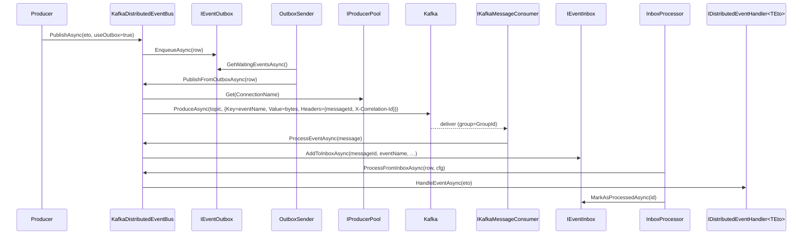

The Kafka provider package is `framework/src/Volo.Abp.EventBus.Kafka/`. It rides on **`Volo.Abp.Kafka`** (`framework/src/Volo.Abp.Kafka/Volo/Abp/Kafka/`), which wraps `Confluent.Kafka.IProducer<string, byte[]>` and `IConsumer<string, byte[]>` behind pooled abstractions.

## Files in this package

| File | Role |
| --- | --- |
| `AbpEventBusKafkaModule.cs` | ABP module — binds the `Kafka:EventBus` config section and calls `KafkaDistributedEventBus.Initialize()` at app startup. |
| `AbpKafkaEventBusOptions.cs` | Connection name, topic, consumer group. |
| `KafkaDistributedEventBus.cs` | The `DistributedEventBusBase` implementation. Singleton. |
| `MessageExtensions.cs` | Header helpers: `GetMessageId` / `GetCorrelationId` over `Message<TKey, TValue>.Headers`. |

`Volo.Abp.Kafka` provides:

- `AbpKafkaModule`, `AbpKafkaOptions`, `KafkaConnections`
- `IProducerPool` / `ProducerPool` (per-connection cached producers)
- `IKafkaMessageConsumerFactory` / `KafkaMessageConsumer` (a long-running consumer task per topic+group)
- `IKafkaSerializer` (`Utf8JsonKafkaSerializer` by default)

## Module wiring

```csharp
[DependsOn(
    typeof(AbpEventBusModule),
    typeof(AbpKafkaModule))]
public class AbpEventBusKafkaModule : AbpModule
{
    public override void ConfigureServices(ServiceConfigurationContext context)
    {
        var configuration = context.Services.GetConfiguration();
        Configure<AbpKafkaEventBusOptions>(configuration.GetSection("Kafka:EventBus"));
    }

    public override void OnApplicationInitialization(ApplicationInitializationContext context)
    {
        context.ServiceProvider
            .GetRequiredService<KafkaDistributedEventBus>()
            .Initialize();
    }
}
```

`Initialize()` is required (just like the RabbitMQ provider): it creates the consumer and binds handlers.

## Options

`AbpKafkaEventBusOptions`:

| Property | Purpose |
| --- | --- |
| `ConnectionName` | Picks an entry out of `AbpKafkaOptions.Connections` (defaults to `Default`). The connection carries `BootstrapServers`, security settings, etc. |
| `TopicName` | The single topic used as the **event-bus topic**. All distributed events are produced to and consumed from this topic. |
| `GroupId` | Consumer-group id for this service. Two replicas of the same service share the same `GroupId`. Two different services use different `GroupId`s. |

Example `appsettings.json`:

```json
{
  "Kafka": {
    "Connections": {
      "Default": { "BootstrapServers": "localhost:9092" }
    },
    "EventBus": {
      "TopicName": "abp.events",
      "GroupId": "my-service",
      "ConnectionName": "Default"
    }
  }
}
```

Topic creation, partition count and replication factor are **not** the bus's concern — they are pulled from `AbpKafkaOptions` (which exposes `ConfigureTopic(name, n => …)` for auto-creation) or done out-of-band. See `Volo.Abp.Kafka/AbpKafkaOptions.cs`.

## Initialize

```csharp
public void Initialize()
{
    Consumer = MessageConsumerFactory.Create(
        AbpKafkaEventBusOptions.TopicName,
        AbpKafkaEventBusOptions.GroupId,
        AbpKafkaEventBusOptions.ConnectionName);
    Consumer.OnMessageReceived(ProcessEventAsync);

    SubscribeHandlers(AbpDistributedEventBusOptions.Handlers);
}
```

`IKafkaMessageConsumer.Create` returns a singleton-per-(topic,group,connection) consumer that runs `_consumer.Consume()` on a dedicated `Task`. Internally it uses `EnableAutoOffsetStore = false` and stores offsets after the handler returns, providing at-least-once semantics.

## Publish path

Producing is direct — there is no Kafka-specific publish overload, only the inherited `PublishToEventBusAsync`:

```csharp
protected async override Task PublishToEventBusAsync(Type eventType, object eventData)
{
    await PublishAsync(eventType, eventData, headers: null, headersArguments: null, correlationId: CorrelationIdProvider.Get());
}
```

The internal `PublishAsync` resolves an `IProducer<string, byte[]>` from `IProducerPool.Get(ConnectionName)`, builds:

```csharp
var msg = new Message<string, byte[]>
{
    Key   = EventNameAttribute.GetNameOrDefault(eventType),   // routing/key
    Value = Serializer.Serialize(eventData),                  // UTF-8 JSON ETO
    Headers = { ("messageId", id), (EventBusConsts.CorrelationIdHeaderName, correlationId) }
};
await producer.ProduceAsync(TopicName, msg);
```

The **key** carries the event name. Kafka uses keys to pick the partition (consistent hashing), so two events with the same `Key` will land on the same partition and therefore be delivered in order to the same consumer instance.

`MessageId` and `X-Correlation-Id` travel as Kafka headers. `MessageExtensions.GetMessageId` / `GetCorrelationId` reads them on the receive side:

```csharp
public static string? GetMessageId<TKey, TValue>(this Message<TKey, TValue> message)
{
    if (message.Headers.TryGetLastBytes("messageId", out var bytes))
        return Encoding.UTF8.GetString(bytes);
    return null;
}
```

`PublishManyFromOutboxAsync` is not specially optimised — it loops `PublishFromOutboxAsync`. The `IProducer<>` already batches messages internally via `linger.ms` and `batch.num.messages`, so flushing at the per-event level is normally fine.

## Receive and inbox handoff

```csharp
private async Task ProcessEventAsync(Message<string, byte[]> message)
{
    var eventName = message.Key;
    var eventType = EventTypes.GetOrDefault(eventName);
    if (eventType == null) return;                                // unknown – ignored

    var messageId = message.GetMessageId();
    var eventData = Serializer.Deserialize(message.Value, eventType);
    var correlationId = message.GetCorrelationId();

    if (await AddToInboxAsync(messageId, eventName, eventType, eventData, correlationId))
        return;                                                   // inbox owns it now

    using (CorrelationIdProvider.Change(correlationId))
        await TriggerHandlersDirectAsync(eventType, eventData);
}
```

Same two-path branching as every provider: hand off to the inbox if one is configured, otherwise dispatch synchronously and let `EventBusBase.TriggerHandlersAsync` aggregate exceptions.

## End-to-end sequence



## Operational notes

- **Ordering.** Order is per-partition, and partition is hashed from `Key = eventName`. Different event types interleave freely; the same event type from a single producer is ordered for a given consumer.
- **Consumer groups.** Two replicas of the same service must use the same `GroupId`; the broker will distribute the topic's partitions between them. Lower the partition count and you cap horizontal scale of consumers.
- **At-least-once.** The consumer stores offsets *after* the handler returns; on crash the next poll re-delivers in-flight events. Combine with the inbox (it uses `messageId` for idempotency via `ExistsByMessageIdAsync`) to absorb duplicates.
- **`EventTypes` registry.** Populated lazily from `SubscribeHandlers` and from `OnAddToOutboxAsync`. If a producer adds a new event type but the consumer has never registered a handler for it, the message is silently dropped — make sure handler types are deployed on both sides.
- **Inbox is recommended.** Without an inbox, handlers run on the consumer thread; a slow handler will hold the offset and pause the partition. With an inbox the consumer enqueues quickly and the `InboxProcessor` runs handlers from background workers with their own UoW and retry policy.

## Related files

- `Volo.Abp.Kafka/Volo/Abp/Kafka/AbpKafkaModule.cs` — depends-on entry point.
- `Volo.Abp.Kafka/Volo/Abp/Kafka/AbpKafkaOptions.cs` + `KafkaConnections.cs` — bootstrap servers and per-connection `ProducerConfig`/`ConsumerConfig`.
- `Volo.Abp.Kafka/Volo/Abp/Kafka/ProducerPool.cs` — caches `IProducer<string, byte[]>` per connection.
- `Volo.Abp.Kafka/Volo/Abp/Kafka/KafkaMessageConsumer.cs` — long-running poll loop.
- `Volo.Abp.Kafka/Volo/Abp/Kafka/IKafkaSerializer.cs` — payload serializer.

Related pages: [Distributed event bus](/eventbus/distributed-event-bus) · [Distributed publish flow](/flows/distributed-event-publish) · [Distributed locking](/background/distributed-locking).
