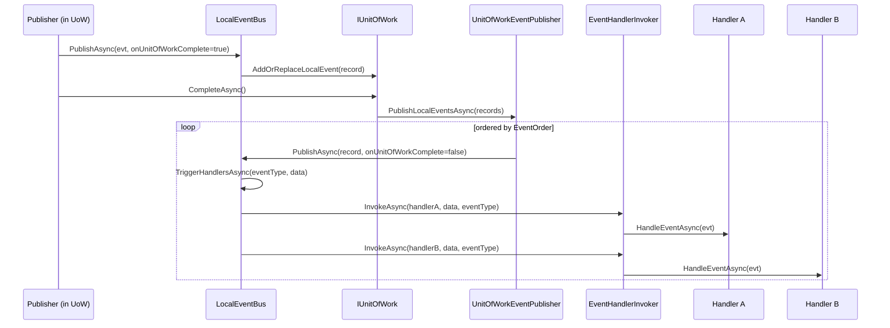

The local event bus is an in-process, in-memory pub/sub. Producers and handlers live in the same process and the bus does not cross any wire. Implementation lives under `framework/src/Volo.Abp.EventBus/Volo/Abp/EventBus/Local/`.

## Contracts

`framework/src/Volo.Abp.EventBus.Abstractions/Volo/Abp/EventBus/Local/ILocalEventBus.cs`:

```csharp
public interface ILocalEventBus : IEventBus
{
    IDisposable Subscribe<TEvent>(ILocalEventHandler<TEvent> handler) where TEvent : class;
    List<EventTypeWithEventHandlerFactories> GetEventHandlerFactories(Type eventType);
}
```

`ILocalEventBus` extends the generic `IEventBus`, so a producer typically uses just:

```csharp
public class StockManager
{
    private readonly ILocalEventBus _localEventBus;

    public StockManager(ILocalEventBus localEventBus) => _localEventBus = localEventBus;

    public async Task DecreaseAsync(Guid productId, int amount)
    {
        // ...domain logic...
        await _localEventBus.PublishAsync(new StockDecreasedEvent(productId, amount));
    }
}
```

A handler is any class implementing `ILocalEventHandler<TEvent>` (defined in `IEventHandler.cs` and `Local/ILocalEventHandler.cs`):

```csharp
public class WhenStockDecreasedRecomputeKpis :
    ILocalEventHandler<StockDecreasedEvent>, ITransientDependency
{
    public Task HandleEventAsync(StockDecreasedEvent eventData) { /* … */ return Task.CompletedTask; }
}
```

The interface is non-generic-rooted on `IEventHandler` so the framework can store handlers from both bus flavours (`ILocalEventHandler<>` and `IDistributedEventHandler<>`) in the same registry.

## Conventional registration

`AbpEventBusModule.PreConfigureServices` installs an `OnRegistered` callback that adds every type matching `ILocalEventHandler<>` to `AbpLocalEventBusOptions.Handlers` and every type matching `IDistributedEventHandler<>` to `AbpDistributedEventBusOptions.Handlers`:

```csharp
// AbpEventBusModule.cs
services.OnRegistered(context =>
{
    if (ReflectionHelper.IsAssignableToGenericType(context.ImplementationType, typeof(ILocalEventHandler<>)))
        localHandlers.Add(context.ImplementationType);

    if (ReflectionHelper.IsAssignableToGenericType(context.ImplementationType, typeof(IDistributedEventHandler<>)))
        distributedHandlers.Add(context.ImplementationType);
});
```

`LocalEventBus`'s constructor calls `SubscribeHandlers(Options.Handlers)` (inherited from `EventBusBase`) which, for each handler type and each `ILocalEventHandler<TEvent>` interface it implements, registers an `IocEventHandlerFactory` bound to `TEvent`. You therefore **never call `Subscribe` manually for IoC-resolvable handlers** — being registered in the container is enough.

`AbpLocalEventBusOptions` (`Local/AbpLocalEventBusOptions.cs`) is intentionally minimal:

```csharp
public class AbpLocalEventBusOptions
{
    public ITypeList<IEventHandler> Handlers { get; } = new TypeList<IEventHandler>();
}
```

## Subscription model and handler factories

Handlers are not stored as instances; they are stored as `IEventHandlerFactory` objects in a `ConcurrentDictionary<Type, List<IEventHandlerFactory>>`. Three factory types exist (under `framework/src/Volo.Abp.EventBus/Volo/Abp/EventBus/`):

| Factory | When used | Lifetime semantics |
| --- | --- | --- |
| `IocEventHandlerFactory` | Conventional registration (DI scan) and explicit `Subscribe(eventType, IocEventHandlerFactory)`. | Opens a new `IServiceScopeFactory.CreateScope()` per invocation, resolves `HandlerType`, disposes scope after dispatch. |
| `SingleInstanceHandlerFactory` | `Subscribe(eventType, IEventHandler)` and `Subscribe<TEvent>(handler)`. | Reuses the supplied instance for every event. |
| `TransientEventHandlerFactory<THandler>` | `Subscribe<TEvent, THandler>()` where `THandler : new()`. | `new THandler()` per invocation via `Activator.CreateInstance`. |

`IocEventHandlerFactory` is the production path:

```csharp
public IEventHandlerDisposeWrapper GetHandler()
{
    var scope = ScopeFactory.CreateScope();
    return new EventHandlerDisposeWrapper(
        (IEventHandler)scope.ServiceProvider.GetRequiredService(HandlerType),
        () => scope.Dispose()
    );
}
```

That single scope per invocation is why scoped services (e.g. `ICurrentUser`, `ICurrentTenant`, EF Core `DbContext`) work inside handlers, even when the handler is invoked from a background worker.

## Dispatch path

`LocalEventBus.PublishAsync` boils down to `EventBusBase.PublishAsync`, which decides between "buffer in UoW" and "dispatch now":

```csharp
public virtual async Task PublishAsync(Type eventType, object eventData, bool onUnitOfWorkComplete = true)
{
    if (onUnitOfWorkComplete && UnitOfWorkManager.Current != null)
    {
        AddToUnitOfWork(UnitOfWorkManager.Current,
            new UnitOfWorkEventRecord(eventType, eventData, EventOrderGenerator.GetNext()));
        return;
    }
    await PublishToEventBusAsync(eventType, eventData);
}
```

For the local bus, `AddToUnitOfWork` calls `IUnitOfWork.AddOrReplaceLocalEvent(record)` and `PublishToEventBusAsync` wraps the data into a `LocalEventMessage` and calls `TriggerHandlersAsync`. `TriggerHandlersAsync` then walks the factory list and uses `IEventHandlerInvoker` to do the actual call:



`UnitOfWorkEventPublisher` (under `Volo.Abp.EventBus/Volo/Abp/EventBus/UnitOfWorkEventPublisher.cs`) is the bridge: when a UoW completes, it iterates `localEvents` and re-publishes each with `onUnitOfWorkComplete: false` so they actually fan out. The same instance also handles distributed events.

<Note>
  Passing `onUnitOfWorkComplete: false` to `PublishAsync` forces immediate dispatch. Use this when you intentionally want the side effect even if the surrounding UoW rolls back (e.g. an audit-fail event). It is rarely the right choice in domain code.
</Note>

## Handler ordering

`LocalEventBus.GetHandlerFactories` reads `[LocalEventHandlerOrder(Order = …)]` (`Local/LocalEventHandlerOrderAttribute.cs`) via `ReflectionHelper.GetAttributesOfMemberOrDeclaringType`, then sorts handlers by `Order` ascending before returning the list. Handlers without the attribute default to order `0`. Order is **per event type**, not global — two handlers for different events do not affect each other.

```csharp
[LocalEventHandlerOrder(-10)]
public class FirstHandler : ILocalEventHandler<MyEvent>, ITransientDependency { … }

[LocalEventHandlerOrder(100)]
public class LastHandler : ILocalEventHandler<MyEvent>, ITransientDependency { … }
```

## Inheritance and generic-argument fan-out

`EventBusBase.TriggerHandlersAsync` includes two cleverness points worth knowing:

1. **Type-assignability fan-out.** `ShouldTriggerEventForHandler(targetEventType, handlerEventType)` returns true when `handlerEventType.IsAssignableFrom(targetEventType)`. Publishing `OrderPlaced` (a subclass) therefore also runs handlers subscribed to a base class `DomainEvent`.
2. **Generic argument inheritance.** When the event type implements `IEventDataWithInheritableGenericArgument` and is itself a single-arg generic (e.g. `EntityCreatedEventData<Order>`), the bus also publishes the base-argument version (`EntityCreatedEventData<AggregateRoot<Guid>>`). This is what makes generic entity-event handlers work without subscribing to every concrete entity.

## Exception handling

If a handler throws, the bus stores the exception in a `List<Exception>` but continues to dispatch the remaining handlers. After the loop finishes, `ThrowOriginalExceptions` re-throws a single exception when there is exactly one, or an `AggregateException` containing all of them otherwise. There is no built-in `IEventErrorHandler` interface in the local bus — surrounding code (e.g. the calling controller, a background worker, or the UoW completion) is responsible for catching the result.

Inside a UoW, the local events run *after* `CompleteAsync` returns from the data store; an exception there will fail the UoW transaction (in the case of double-completed transactions, see `UnitOfWork.cs`).

## Multi-tenancy

Before invoking the handler, `EventBusBase.TriggerHandlerAsync` calls `CurrentTenant.Change(GetEventDataTenantId(eventData))`:

```csharp
protected virtual Guid? GetEventDataTenantId(object eventData) => eventData switch
{
    IMultiTenant mt => mt.TenantId,
    IEventDataMayHaveTenantId may when may.IsMultiTenant(out var t) => t,
    _ => CurrentTenant.Id
};
```

So a handler always runs in the same tenant scope as the producer (or the tenant explicitly set on the event payload). See [Multi-tenancy: current tenant](/multitenancy/current-tenant).

## Manual subscription

For non-IoC scenarios (tests, console apps, dynamic plugins) you can still subscribe imperatively:

```csharp
var subscription = localEventBus.Subscribe<MyEvent>(async evt =>
{
    // ad-hoc lambda handler – wrapped in ActionEventHandler<MyEvent>
});

// Or with an instance you own:
localEventBus.Subscribe<MyEvent>(new MySingletonHandler());

// Disposing the returned IDisposable detaches it.
subscription.Dispose();
```

`ActionEventHandler<T>` (`framework/src/Volo.Abp.EventBus/Volo/Abp/EventBus/ActionEventHandler.cs`) is the internal wrapper used for delegate subscriptions. `EventHandlerFactoryUnregistrar` is the `IDisposable` returned by every `Subscribe` overload.

## Related files

| File | What it does |
| --- | --- |
| `Volo.Abp.EventBus/Volo/Abp/EventBus/Local/LocalEventBus.cs` | The implementation. Singleton. |
| `Volo.Abp.EventBus/Volo/Abp/EventBus/EventBusBase.cs` | Shared base — `PublishAsync`, `TriggerHandlersAsync`, exception aggregation, tenant scoping. |
| `Volo.Abp.EventBus/Volo/Abp/EventBus/EventHandlerInvoker.cs` | Caches and invokes `LocalEventHandlerMethodExecutor<T>` / `DistributedEventHandlerMethodExecutor<T>`. |
| `Volo.Abp.EventBus/Volo/Abp/EventBus/IocEventHandlerFactory.cs` | Per-invocation scoped resolution. |
| `Volo.Abp.EventBus/Volo/Abp/EventBus/UnitOfWorkEventPublisher.cs` | Re-publishes buffered events on UoW complete. |
| `Volo.Abp.EventBus.Abstractions/Volo/Abp/EventBus/Local/LocalEventHandlerOrderAttribute.cs` | Ordering metadata. |
| `Volo.Abp.EventBus/Volo/Abp/EventBus/Local/NullLocalEventBus.cs` | No-op implementation for tests/host modes that disable events. |

Related pages: [Distributed event bus](/eventbus/distributed-event-bus) · [Unit of work](/data/unit-of-work) · [Distributed publish flow](/flows/distributed-event-publish).
