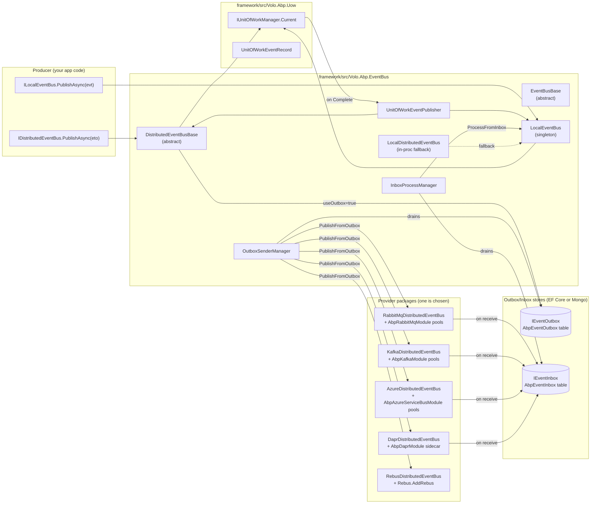
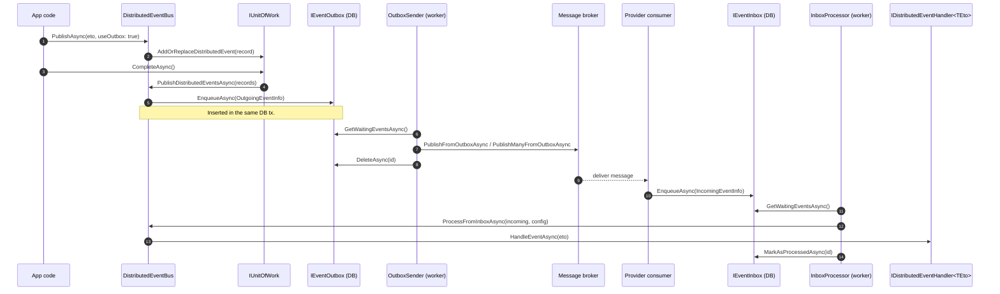

ABP ships two complementary event bus abstractions:

- **`ILocalEventBus`** — in-process, synchronous-style publish/subscribe within a single host. Implemented by `LocalEventBus` (singleton).
- **`IDistributedEventBus`** — cross-process publish/subscribe. The default implementation `LocalDistributedEventBus` falls back to the local bus; production implementations come from a broker provider package (`Volo.Abp.EventBus.RabbitMq`, `Kafka`, `Azure`, `Dapr`, `Rebus`).

Both share the common `IEventBus` contract in `framework/src/Volo.Abp.EventBus.Abstractions/Volo/Abp/EventBus/IEventBus.cs`, and both are integrated with the **unit of work** so that events are buffered until `IUnitOfWork.CompleteAsync` succeeds. Distributed publishing additionally supports the **transactional outbox/inbox** pattern through `IEventOutbox`, `IEventInbox`, `OutboxSenderManager` and `InboxProcessManager`.

<Info>
  Wiring entry point: `AbpEventBusModule` in `framework/src/Volo.Abp.EventBus/Volo/Abp/EventBus/AbpEventBusModule.cs`. It scans for any `ILocalEventHandler<T>` or `IDistributedEventHandler<T>` registered in the container and accumulates them into `AbpLocalEventBusOptions.Handlers` / `AbpDistributedEventBusOptions.Handlers`. It also registers `OutboxSenderManager` and `InboxProcessManager` as background workers.
</Info>

## Component model

## Packages

The table below enumerates every NuGet package under `framework/src/Volo.Abp.EventBus.*` (and the two providers required as transitive dependencies).

| Package | Role | Key types |
| --- | --- | --- |
| `Volo.Abp.EventBus.Abstractions` | Contracts: `IEventBus`, `ILocalEventBus`, `IDistributedEventBus`, `IEventHandler`, `ILocalEventHandler<T>`, `IDistributedEventHandler<T>`, `IEventInbox`, `IEventOutbox`, `IIncomingEventInfo`, `IOutgoingEventInfo`, `ISupportsEventBoxes`, `EventNameAttribute`, `InboxConfig`, `OutboxConfig`. | `IEventBus.cs`, `IDistributedEventBus.cs` |
| `Volo.Abp.EventBus` | Default in-process implementation: `LocalEventBus`, `LocalDistributedEventBus`, `EventBusBase`, `DistributedEventBusBase`, `UnitOfWorkEventPublisher`, `OutboxSender(Manager)`, `InboxProcessor(Manager)`, options classes. | `AbpEventBusModule.cs` |
| `Volo.Abp.EventBus.RabbitMq` | RabbitMQ provider — implements `IRabbitMqDistributedEventBus` over the `Volo.Abp.RabbitMQ` connection/channel/consumer pools. | `RabbitMqDistributedEventBus.cs`, `AbpRabbitMqEventBusOptions.cs` |
| `Volo.Abp.EventBus.Kafka` | Kafka provider — `KafkaDistributedEventBus` over `Volo.Abp.Kafka` `IProducerPool` / `IKafkaMessageConsumerFactory` (Confluent.Kafka under the hood). | `KafkaDistributedEventBus.cs`, `AbpKafkaEventBusOptions.cs` |
| `Volo.Abp.EventBus.Azure` | Azure Service Bus provider — `AzureDistributedEventBus` over `Volo.Abp.AzureServiceBus` `IPublisherPool` / `IAzureServiceBusMessageConsumerFactory`. | `AzureDistributedEventBus.cs`, `AbpAzureEventBusOptions.cs` |
| `Volo.Abp.EventBus.Dapr` | Dapr provider — publishes via `DaprClient.PublishEventAsync`; receive side is HTTP-based (Topic-attribute subscriptions). | `DaprDistributedEventBus.cs`, `AbpDaprEventBusOptions.cs` |
| `Volo.Abp.EventBus.Rebus` | Rebus.NET provider — adapts ABP handlers to Rebus's `IHandleMessages<T>` through `RebusDistributedEventHandlerAdapter<T>`. | `RebusDistributedEventBus.cs`, `AbpRebusEventBusOptions.cs` |
| `Volo.Abp.AspNetCore.Mvc.Dapr.EventBus` | ASP.NET Core glue for Dapr — auto-maps `POST /api/abp/dapr/event` and emits `TopicAttribute` metadata for every registered `IDistributedEventHandler<TEto>`. | `AbpAspNetCoreMvcDaprEventBusModule.cs` |

The outbox/inbox stores themselves are not in this section — they live in **`modules/distributed-event-bus`** packages (`Volo.Abp.EventBus.Boxes.EntityFrameworkCore`, `…MongoDB`). They are the storage half of `IEventOutbox`/`IEventInbox`.

## The outbox / inbox pattern

When `IDistributedEventBus.PublishAsync(eto, useOutbox: true)` is called inside a unit of work and an outbox is configured, the event is **not** sent to the broker immediately. Instead `DistributedEventBusBase.AddToOutboxAsync` serializes the ETO to `byte[]` and inserts an `OutgoingEventInfo` row into the same DB transaction as your business write. After the UoW commits, the `OutboxSender` background worker picks the row up, publishes it to the broker, and deletes the row. The inbox is the mirror — a receiver writes `IncomingEventInfo` rows on consume and the `InboxProcessor` drains them by calling `IDistributedEventBus.ProcessFromInboxAsync`.

`AbpEventBusBoxesOptions` (see `framework/src/Volo.Abp.EventBus/Volo/Abp/EventBus/Distributed/AbpEventBusBoxesOptions.cs`) controls timing and failure policy:

| Option | Default | Purpose |
| --- | --- | --- |
| `PeriodTimeSpan` | 2 s | Polling period for both senders and processors. |
| `OutboxWaitingEventMaxCount` | 1000 | Page size of `IEventOutbox.GetWaitingEventsAsync`. |
| `InboxWaitingEventMaxCount` | 1000 | Page size of `IEventInbox.GetWaitingEventsAsync`. |
| `BatchPublishOutboxEvents` | `true` | Use `PublishManyFromOutboxAsync` instead of one-by-one. |
| `DistributedLockWaitDuration` | 15 s | Backoff when another instance holds the `AbpOutbox_*` / `AbpInbox_*` distributed lock. |
| `WaitTimeToDeleteProcessedInboxEvents` | 2 h | Grace period before processed inbox rows are reaped. |
| `CleanOldEventTimeIntervalSpan` | 6 h | How often `IEventInbox.DeleteOldEventsAsync` runs. |
| `InboxProcessorFailurePolicy` | `Retry` | One of `Retry`, `RetryLater`, `Discard`. See `InboxProcessor.cs`. |
| `InboxProcessorMaxRetryCount` | 10 | Used by `RetryLater`. |
| `InboxProcessorRetryBackoffFactor` | 10 | Backoff = `factor × 2^retryCount` seconds. |

## How to read this section

<CardGroup cols={2}>
  <Card title="Local event bus" icon="bolt" href="/eventbus/local-event-bus">
    `ILocalEventBus`, `LocalEventBus`, handler discovery, UoW integration.
  </Card>
  <Card title="Distributed event bus" icon="network-wired" href="/eventbus/distributed-event-bus">
    `IDistributedEventBus`, `DistributedEventBusBase`, outbox/inbox, ETO mapping.
  </Card>
  <Card title="RabbitMQ provider" icon="rabbit" href="/eventbus/rabbitmq">
    `RabbitMqDistributedEventBus`, exchange/queue declare, connection pool.
  </Card>
  <Card title="Kafka provider" icon="k" href="/eventbus/kafka">
    `KafkaDistributedEventBus`, producer/consumer pools.
  </Card>
  <Card title="Azure Service Bus" icon="cloud" href="/eventbus/azure-service-bus">
    `AzureDistributedEventBus`, publisher/processor pools, topic/subscriber.
  </Card>
  <Card title="Dapr integration" icon="cube" href="/eventbus/dapr-integration">
    `DaprDistributedEventBus`, sidecar `pubsub` component, ASP.NET Core route.
  </Card>
  <Card title="Rebus integration" icon="bus-simple" href="/eventbus/rebus-integration">
    `RebusDistributedEventBus`, pipeline step, handler adapter.
  </Card>
  <Card title="Distributed publish flow" icon="diagram-project" href="/flows/distributed-event-publish">
    End-to-end trace from `PublishAsync` to `HandleEventAsync` through the outbox.
  </Card>
</CardGroup>

Related: [Unit of work](/data/unit-of-work) (the trigger for buffered publishing) · [Background jobs & workers](/background/overview) (the `OutboxSenderManager` / `InboxProcessManager` are background workers) · [Dapr integration](/integrations/dapr) (sidecar wiring).
