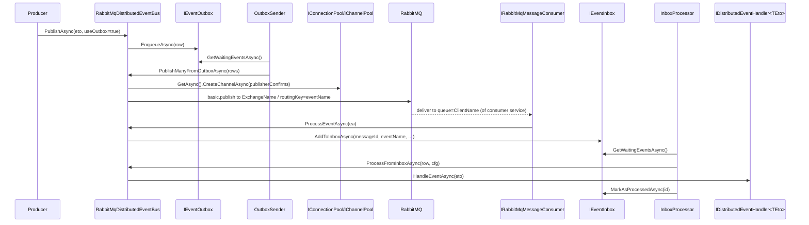

The RabbitMQ provider package is `framework/src/Volo.Abp.EventBus.RabbitMQ/`. It depends on **`Volo.Abp.RabbitMQ`** (under `framework/src/Volo.Abp.RabbitMQ/Volo/Abp/RabbitMQ/`), which owns the connection pool, channel pool and consumer abstractions over `RabbitMQ.Client` 7.x.

## Files in this package

| File | Role |
| --- | --- |
| `AbpEventBusRabbitMqModule.cs` | ABP module — binds `RabbitMQ:EventBus` config section, registers `PostConfigureAbpRabbitMqEventBusOptions`, and calls `IRabbitMqDistributedEventBus.Initialize()` at app startup. |
| `AbpRabbitMqEventBusOptions.cs` | Strongly-typed options (exchange/queue/client/prefetch/arguments). |
| `PostConfigureAbpRabbitMqEventBusOptions.cs` | Coerces string config values for `x-message-ttl`, `x-max-length`, `x-single-active-consumer`, etc. into the integer/bool RabbitMQ expects. |
| `IRabbitMqDistributedEventBus.cs` | Provider-specific interface (`IDistributedEventBus + Initialize()`). |
| `RabbitMqDistributedEventBus.cs` | The `DistributedEventBusBase` implementation. Singleton. |

## Module wiring

```csharp
[DependsOn(
    typeof(AbpEventBusModule),
    typeof(AbpRabbitMqModule))]
public class AbpEventBusRabbitMqModule : AbpModule
{
    public override void ConfigureServices(ServiceConfigurationContext context)
    {
        var configuration = context.Services.GetConfiguration();
        Configure<AbpRabbitMqEventBusOptions>(configuration.GetSection("RabbitMQ:EventBus"));
        context.Services.TryAddEnumerable(
            ServiceDescriptor.Singleton<IPostConfigureOptions<AbpRabbitMqEventBusOptions>,
                                         PostConfigureAbpRabbitMqEventBusOptions>());
    }

    public override void OnApplicationInitialization(ApplicationInitializationContext context)
    {
        context.ServiceProvider
            .GetRequiredService<IRabbitMqDistributedEventBus>()
            .Initialize();
    }
}
```

The bus is **not** wired through DI alone — `Initialize()` must run at startup to declare the exchange and queue and register the message consumer. This is done by the module itself, so applications only need `DependsOn(typeof(AbpEventBusRabbitMqModule))`.

The connection pool comes from `AbpRabbitMqModule`. `AbpRabbitMqOptions.Connections` (a `RabbitMqConnections` dictionary) maps connection-name → `ConnectionFactory`. Multiple connections are supported; the bus uses `AbpRabbitMqEventBusOptions.ConnectionName` to pick one (`null` means `Default`).

## Options

`AbpRabbitMqEventBusOptions` (`AbpRabbitMqEventBusOptions.cs`):

| Property | Default | Purpose |
| --- | --- | --- |
| `ConnectionName` | `null` (→ `Default`) | Key into `AbpRabbitMqOptions.Connections`. |
| `ClientName` | required | Queue name used by **this** application; usually the deployment name. Each receiver has its own queue. |
| `ExchangeName` | required | Shared exchange every publisher writes to. |
| `ExchangeType` | `Direct` (`RabbitMqConsts.ExchangeTypes.Direct`) | `Direct`, `Topic`, `Fanout`, `Headers`. |
| `PrefetchCount` | `null` | `basic.qos` prefetch on the consumer channel. |
| `QueueArguments` | empty | Passed to `queue.declare`; can include `x-message-ttl`, `x-max-length`, `x-quorum-initial-group-size`, `x-single-active-consumer`, etc. |
| `ExchangeArguments` | empty | Passed to `exchange.declare`. |

The companion `PostConfigureAbpRabbitMqEventBusOptions` understands string-typed config and rewrites known headers to the type RabbitMQ expects:

```csharp
// uint64-ish headers
private readonly FrozenSet<string> _uint64QueueArguments = new HashSet<string>
{
    "x-delivery-limit", "x-expires", "x-message-ttl", "x-max-length",
    "x-max-length-bytes", "x-quorum-initial-group-size",
    "x-quorum-target-group-size", "x-stream-filter-size-bytes",
    "x-stream-max-segment-size-bytes",
};
// bool headers
private readonly FrozenSet<string> _boolQueueArguments = new HashSet<string> { "x-single-active-consumer" };
```

Example `appsettings.json`:

```json
{
  "RabbitMQ": {
    "Connections": {
      "Default": { "HostName": "localhost", "UserName": "guest", "Password": "guest" }
    },
    "EventBus": {
      "ClientName": "MyService.OrderApi",
      "ExchangeName": "Messages",
      "ExchangeType": "Direct",
      "PrefetchCount": 32,
      "QueueArguments": { "x-message-ttl": "86400000", "x-max-length": "100000" }
    }
  }
}
```

## Initialize: exchange + queue declare

`RabbitMqDistributedEventBus.Initialize()`:

```csharp
Consumer = MessageConsumerFactory.Create(
    new ExchangeDeclareConfiguration(
        AbpRabbitMqEventBusOptions.ExchangeName,
        type: AbpRabbitMqEventBusOptions.GetExchangeTypeOrDefault(),
        durable: true,
        arguments: AbpRabbitMqEventBusOptions.ExchangeArguments),
    new QueueDeclareConfiguration(
        AbpRabbitMqEventBusOptions.ClientName,
        durable: true,
        exclusive: false,
        autoDelete: false,
        prefetchCount: AbpRabbitMqEventBusOptions.PrefetchCount,
        arguments: AbpRabbitMqEventBusOptions.QueueArguments),
    AbpRabbitMqEventBusOptions.ConnectionName);

Consumer.OnMessageReceived(ProcessEventAsync);
SubscribeHandlers(AbpDistributedEventBusOptions.Handlers);
```

`IRabbitMqMessageConsumer` (from `Volo.Abp.RabbitMQ`) wraps a long-lived channel that:

1. Declares the exchange (`durable: true`).
2. Declares the queue named `ClientName` (`durable: true`, not exclusive, not auto-deleted).
3. Sets `basic.qos` per `PrefetchCount`.
4. Calls `basic.consume` and dispatches each `BasicDeliverEventArgs` to `ProcessEventAsync`.

`SubscribeHandlers` walks `AbpDistributedEventBusOptions.Handlers` and, for each `IDistributedEventHandler<TEto>` interface, registers an `IocEventHandlerFactory`. Internally `Subscribe(eventType, factory)` also issues `Consumer.BindAsync(eventName)` the **first** time a handler appears for a type — that's the `queue.bind` with `routing-key = event name`.

## Publish path

```csharp
protected async override Task PublishToEventBusAsync(Type eventType, object eventData)
{
    await PublishAsync(eventType, eventData, correlationId: CorrelationIdProvider.Get());
}
```

The internal `PublishAsync` opens a channel from `IChannelPool`, sets `BasicProperties.Persistent = true`, copies `MessageId` and `CorrelationId`, serializes the ETO with `IRabbitMqSerializer` (`Utf8JsonRabbitMqSerializer` by default), and publishes to:

```
exchange = AbpRabbitMqEventBusOptions.ExchangeName
routingKey = EventNameAttribute.GetNameOrDefault(eventType)
```

`PublishManyFromOutboxAsync` creates a single channel with publisher confirmations enabled (`new CreateChannelOptions(publisherConfirmationsEnabled: true, publisherConfirmationTrackingEnabled: true, new ThrottlingRateLimiter(256))`) and writes the whole batch through it — that is what makes `BatchPublishOutboxEvents` cheap.

## Receive and inbox handoff

```csharp
private async Task ProcessEventAsync(IChannel channel, BasicDeliverEventArgs ea)
{
    var eventName = ea.RoutingKey;
    var eventType = EventTypes.GetOrDefault(eventName);
    if (eventType == null) return; // unknown event – ignored

    var eventData = Serializer.Deserialize(ea.Body.ToArray(), eventType);

    if (await AddToInboxAsync(ea.BasicProperties.MessageId, eventName, eventType, eventData, ea.BasicProperties.CorrelationId))
        return;

    using (CorrelationIdProvider.Change(ea.BasicProperties.CorrelationId))
        await TriggerHandlersDirectAsync(eventType, eventData);
}
```

Two paths:

- **Inbox is configured:** `AddToInboxAsync` returns `true` after writing the row, the message is acked, and the `InboxProcessor` will dispatch it inside its own transactional UoW.
- **No inbox:** handlers run synchronously inside `ProcessEventAsync`. Any exception is collected by `EventBusBase.TriggerHandlerAsync` and surfaced through `TriggerHandlersAsync` — by default the consumer infrastructure logs and ack/naks per its policy.

`EventTypes` is a `ConcurrentDictionary<string, Type>` populated by `SubscribeHandlers` and `OnAddToOutboxAsync`. An incoming message whose name is not in the dictionary is silently dropped — make sure both producer and consumer agree on the `[EventName("…")]`.

## End-to-end sequence



## Operational notes

- **Queue per service.** Set `ClientName` to a stable, per-service name. Two replicas of the same service share the same queue (competing consumers). Two different services use two queues bound to the same exchange.
- **Routing keys are event names.** Use `[EventName("ns.entity.action.v1")]` and stick to it — renaming a class without updating the attribute breaks consumers.
- **PrefetchCount tuning.** The consumer channel uses `basic.qos(prefetch_count = PrefetchCount)`. Combine with `WaitTimeToDeleteProcessedInboxEvents` and `InboxWaitingEventMaxCount` to bound RAM use.
- **Distributed lock.** The outbox sender needs `IAbpDistributedLock` (`framework/src/Volo.Abp.DistributedLocking*`). In a multi-replica deployment configure a real implementation (Redis or DB-based) so only one replica drains the outbox at a time.
- **Unsubscribe is local-only.** `Unsubscribe*` removes the handler from the in-memory dictionary but does **not** unbind on RabbitMQ — by design (see the `TODO` comment at the top of `RabbitMqDistributedEventBus.cs`).

## Related files

- `Volo.Abp.RabbitMQ/Volo/Abp/RabbitMQ/AbpRabbitMqModule.cs` — depends-on entry point.
- `Volo.Abp.RabbitMQ/Volo/Abp/RabbitMQ/AbpRabbitMqOptions.cs` + `RabbitMqConnections.cs` — connection configuration.
- `Volo.Abp.RabbitMQ/Volo/Abp/RabbitMQ/ConnectionPool.cs`, `ChannelPool.cs` — pooled `IConnection`/`IChannel`.
- `Volo.Abp.RabbitMQ/Volo/Abp/RabbitMQ/RabbitMqMessageConsumer.cs`, `RabbitMqMessageConsumerFactory.cs` — long-lived consumer.
- `Volo.Abp.RabbitMQ/Volo/Abp/RabbitMQ/IRabbitMqSerializer.cs`, `Utf8JsonRabbitMqSerializer.cs` — payload serialization.

Related pages: [Distributed event bus](/eventbus/distributed-event-bus) · [Distributed publish flow](/flows/distributed-event-publish) · [RabbitMQ background jobs](/background/rabbitmq-jobs) · [Distributed locking](/background/distributed-locking).
