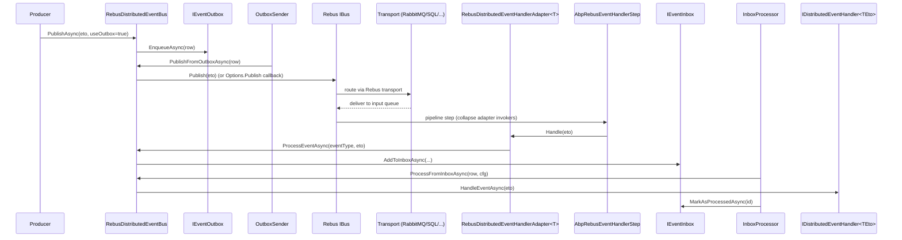

The Rebus provider package is `framework/src/Volo.Abp.EventBus.Rebus/`. It is **transport-agnostic**: ABP delegates to a user-configured `RebusConfigurer` callback so the underlying queue (RabbitMQ, MSMQ, Azure Storage Queues, SQL Server, in-memory, …) is whatever the caller wires up. The `AbpEventBusRebusModule` only wires Rebus into ABP's handler model.

## Files in this package

| File | Role |
| --- | --- |
| `AbpEventBusRebusModule.cs` | ABP module — calls `services.AddRebus(…)`, installs an `IPipeline` decorator, starts the bus, and calls `RebusDistributedEventBus.Initialize()` at app startup. |
| `AbpRebusEventBusOptions.cs` | `InputQueueName`, `RebusInstanceName`, the user-supplied `Action<RebusConfigurer> Configurer`, an optional custom `Publish` callback. |
| `RebusDistributedEventBus.cs` | The `DistributedEventBusBase` implementation. Singleton. |
| `RebusDistributedEventHandlerAdapter.cs` | Generic `IHandleMessages<TEventData>` registered for every event type — forwards into the ABP bus. |
| `IRebusDistributedEventHandlerAdapter.cs` | Marker interface used by `AbpRebusEventHandlerStep` to recognise ABP-routed messages. |
| `AbpRebusEventHandlerStep.cs` | `IIncomingStep` injected after `ActivateHandlersStep` that collapses multiple adapter invokers into one so a Rebus message hits the ABP bus exactly once. |
| `IRebusSerializer.cs`, `Utf8JsonRabbitMqSerializer.cs` | Serializer abstraction (the file name is `Utf8JsonRabbitMqSerializer.cs` but the class inside is `Utf8JsonRebusSerializer`). |

## Module wiring

```csharp
[DependsOn(typeof(AbpEventBusModule))]
public class AbpEventBusRebusModule : AbpModule
{
    public override void ConfigureServices(ServiceConfigurationContext context)
    {
        // ABP handlers are dispatched through this single open-generic adapter:
        context.Services.AddTransient(typeof(IHandleMessages<>), typeof(RebusDistributedEventHandlerAdapter<>));

        var preActions = context.Services.GetPreConfigureActions<AbpRebusEventBusOptions>();
        var rebusOptions = preActions.Configure();
        Configure<AbpRebusEventBusOptions>(options => preActions.Configure(options));

        context.Services.AddRebus(configure =>
        {
            configure.Options(options =>
            {
                options.Decorate<IPipeline>(d =>
                {
                    var step = new AbpRebusEventHandlerStep();
                    var pipeline = d.Get<IPipeline>();
                    return new PipelineStepInjector(pipeline)
                        .OnReceive(step, PipelineRelativePosition.After, typeof(ActivateHandlersStep));
                });
            });

            rebusOptions.Configurer?.Invoke(configure);   // ← user wires transport here
            return configure;
        }, startAutomatically: false, key: rebusOptions.RebusInstanceName);
    }

    public override void OnApplicationInitialization(ApplicationInitializationContext context)
    {
        context.ServiceProvider.GetRequiredService<RebusDistributedEventBus>().Initialize();
        var rebusOptions = context.ServiceProvider.GetRequiredService<IOptions<AbpRebusEventBusOptions>>().Value;
        context.ServiceProvider.GetRequiredService<IBusRegistry>()
            .StartBus(rebusOptions.RebusInstanceName);
    }
}
```

Important details:

- `startAutomatically: false` — Rebus does not start polling its queue until ABP has finished module initialization. `OnApplicationInitialization` calls `IBusRegistry.StartBus` after `Initialize()`.
- `key: rebusOptions.RebusInstanceName` — ABP supports multiple bus instances if you `PreConfigure<AbpRebusEventBusOptions>` per host with different names; the named instance is what gets started.
- The `IHandleMessages<>` open generic registration is what makes Rebus call into ABP for *every* event type, without listing them one-by-one.

## Options

`AbpRebusEventBusOptions`:

| Property | Default | Purpose |
| --- | --- | --- |
| `InputQueueName` | required (used by `DefaultConfigure`) | Queue this service consumes from. |
| `RebusInstanceName` | `"default-instance"` | Key under which Rebus is registered in `IBusRegistry`. |
| `Configurer` | `t => t.UseInMemoryTransport(new InMemNetwork(), InputQueueName)` | A `Action<RebusConfigurer>` the caller replaces to choose the transport, serializer, retry strategy, etc. |
| `Publish` | `null` | Optional `Func<IBus, Type, object, Task>` to replace the default `IBus.Publish(eventData)` call (e.g. to send to a specific queue instead of publishing). |

`PreConfigure<AbpRebusEventBusOptions>` is how downstream modules wire a real transport:

```csharp
PreConfigure<AbpRebusEventBusOptions>(options =>
{
    options.InputQueueName = "my-service";
    options.Configurer = configure =>
    {
        configure
            .Transport(t => t.UseRabbitMq("amqp://localhost", options.InputQueueName))
            .Routing(r => r.TypeBased().MapAssemblyOf<OrderEto>("my-service"));
    };
});
```

## Publish path

`RebusDistributedEventBus.PublishToEventBusAsync` either calls the user-supplied `AbpRebusEventBusOptions.Publish` callback or `IBus.Publish(eventData)`:

```csharp
protected async override Task PublishToEventBusAsync(Type eventType, object eventData)
{
    if (AbpRebusEventBusOptions.Publish != null)
        await AbpRebusEventBusOptions.Publish(Rebus, eventType, eventData);
    else
        await Rebus.Publish(eventData);
}
```

Subscribe is broker-aware via `Rebus.Subscribe(eventType)` — that is what makes the topic/queue binding happen on RabbitMQ, the SQL Server pub/sub table, etc. ABP issues `Rebus.Subscribe(eventType)` the first time it sees a handler for a given type:

```csharp
public override IDisposable Subscribe(Type eventType, IEventHandlerFactory factory)
{
    var handlerFactories = GetOrCreateHandlerFactories(eventType);
    if (factory.IsInFactories(handlerFactories)) return NullDisposable.Instance;
    handlerFactories.Add(factory);
    if (handlerFactories.Count == 1) Rebus.Subscribe(eventType);
    return new EventHandlerFactoryUnregistrar(this, eventType, factory);
}
```

## Receive path: adapter + pipeline step

Because the framework registered `IHandleMessages<>` → `RebusDistributedEventHandlerAdapter<>` for every closed generic, Rebus's `ActivateHandlersStep` resolves the adapter for the incoming `TEventData`. The adapter forwards into the ABP bus:

```csharp
public class RebusDistributedEventHandlerAdapter<TEventData>
    : IHandleMessages<TEventData>, IRebusDistributedEventHandlerAdapter
{
    protected RebusDistributedEventBus RebusDistributedEventBus { get; }

    public RebusDistributedEventHandlerAdapter(RebusDistributedEventBus bus) => RebusDistributedEventBus = bus;

    public async Task Handle(TEventData message)
    {
        await RebusDistributedEventBus.ProcessEventAsync(message!.GetType(), message);
    }
}
```

`AbpRebusEventHandlerStep` runs **after** `ActivateHandlersStep` and collapses Rebus's per-handler invokers into a single one, so a single Rebus message lands on `ProcessEventAsync` exactly once even if Rebus discovered multiple `IHandleMessages<>` implementations:

```csharp
public Task Process(IncomingStepContext context, Func<Task> next)
{
    var message = context.Load<Message>();
    var handlerInvokers = context.Load<HandlerInvokers>().ToList();

    if (handlerInvokers.All(x => x.Handler is IRebusDistributedEventHandlerAdapter))
    {
        handlerInvokers = new List<HandlerInvoker> { handlerInvokers.Last() };
        context.Save(new HandlerInvokers(message, handlerInvokers));
    }

    return next();
}
```

Once `ProcessEventAsync` is invoked, the same outbox/inbox machinery applies as in the other providers — `AddToInboxAsync` is consulted, and if no inbox is configured `TriggerHandlersDirectAsync` dispatches to the registered `IDistributedEventHandler<TEto>`s.

## End-to-end sequence



## Operational notes

- **Transport choice is yours.** ABP does not opinionate on Rebus's transport — anything Rebus supports works (RabbitMQ via `Rebus.RabbitMq`, SQL Server via `Rebus.SqlServer`, Azure Storage Queues via `Rebus.AzureStorageQueues`, in-memory for tests). The bus only sees `IBus`.
- **Subscriptions are type-based.** Rebus's pub/sub uses CLR types; `Rebus.Subscribe(typeof(OrderPlacedEto))` translates to whatever subscription primitive the transport supports. Renaming the ETO class without keeping the old name as a route will break producers/subscribers — `[EventName]` does **not** affect Rebus routing.
- **Multiple bus instances.** Set `RebusInstanceName` and use `IBusRegistry` to manage multiple Rebus buses (e.g. one for internal events, one for external). Each `AddRebus(…, key)` is independent.
- **`startAutomatically: false`.** The bus is started after ABP initialization is complete to avoid receiving messages before the inbox/handler registry is fully built.
- **Serializer.** `Utf8JsonRebusSerializer` (lives in `Utf8JsonRabbitMqSerializer.cs` — historical filename) wraps `IJsonSerializer`. Replace via `IRebusSerializer` if you need a different format, or configure Rebus's own serializer through `configure.Serialization(...)`.

## Related files

- `Volo.Abp.EventBus.Rebus/Volo/Abp/EventBus/Rebus/AbpEventBusRebusModule.cs` — Rebus container registration and pipeline step.
- `Volo.Abp.EventBus.Rebus/Volo/Abp/EventBus/Rebus/RebusDistributedEventBus.cs` — bus implementation.
- `Volo.Abp.EventBus.Rebus/Volo/Abp/EventBus/Rebus/AbpRebusEventHandlerStep.cs` — pipeline step that ensures single dispatch.
- `Volo.Abp.EventBus.Rebus/Volo/Abp/EventBus/Rebus/RebusDistributedEventHandlerAdapter.cs` — `IHandleMessages<>` adapter.
- `Volo.Abp.EventBus.Rebus/Volo/Abp/EventBus/Rebus/Utf8JsonRabbitMqSerializer.cs` — default serializer (class name is `Utf8JsonRebusSerializer`).

Related pages: [Distributed event bus](/eventbus/distributed-event-bus) · [Distributed publish flow](/flows/distributed-event-publish) · [Background workers](/background/background-workers).
