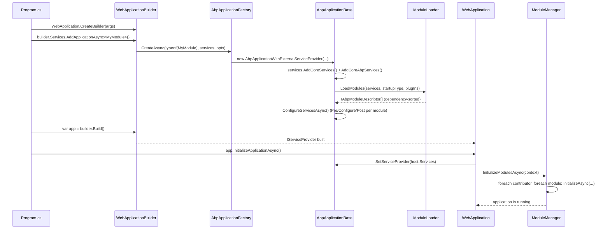

This page traces the exact code path that turns a stock `Program.cs` into a running ABP host. The entry point is `WebApplication.CreateBuilder` &mdash; everything ABP-specific kicks in when you call `builder.Services.AddApplicationAsync<TStartupModule>()` and `app.InitializeApplicationAsync()`. The path crosses four files in `framework/src/Volo.Abp.Core`, the host-integration extension methods, and finally the module lifecycle contributors registered in [`Modularity`](/core/modularity-system).

<Note>
All hot paths in this flow live in `framework/src/Volo.Abp.Core/Volo/Abp/`. The host-integration glue (Generic Host vs minimal API vs Autofac) is in `framework/src/Volo.Abp.AspNetCore` and `framework/src/Volo.Abp.Autofac`.
</Note>

## The three-act boot

ABP startup splits cleanly into three acts. Holding this picture in your head keeps the rest of the page comprehensible:

1. **Construct.** `AbpApplicationFactory.Create*` returns either `AbpApplicationWithInternalServiceProvider` or `AbpApplicationWithExternalServiceProvider`. The ctor runs `LoadModules` and (unless told to skip) `ConfigureServices`.
2. **Build container.** The host's `WebApplication.Build()` materialises `IServiceProvider`. ABP grabs that provider via `SetServiceProvider`.
3. **Initialize.** `InitializeApplicationAsync` runs every lifecycle contributor against every module in the resolved order.



## Step-by-step trace

The following table walks the exact methods called for a standard ASP.NET Core host. Files are repo-relative under `framework/src/Volo.Abp.Core/Volo/Abp/` unless noted.

| # | Caller | File / Method | Side effect |
|---|--------|---------------|-------------|
| 1 | `Program.cs` | `WebApplication.CreateBuilder(args)` (Microsoft) | Creates `WebApplicationBuilder` &mdash; standard ASP.NET, not ABP. |
| 2 | `Program.cs` | `IServiceCollectionApplicationExtensions.AddApplicationAsync<TStartupModule>` (in `Volo.Abp.AspNetCore`) | Forwards to `AbpApplicationFactory.CreateAsync`. |
| 3 | extension | `AbpApplicationFactory.CreateAsync(Type, IServiceCollection, Action<AbpApplicationCreationOptions>?)` | Instantiates `AbpApplicationWithExternalServiceProvider`. |
| 4 | factory | `AbpApplicationBase..ctor` | Captures `StartupModuleType` + `Services`, sets `InstanceId`. |
| 5 | ctor | `AbpApplicationCreationOptions` lambda | User code adds plug-ins (`options.PlugInSources.AddFolder(...)`) or sets `ApplicationName`. |
| 6 | ctor | `services.AddSingleton<IAbpApplication>(this)` plus `IApplicationInfoAccessor`, `IModuleContainer`, `IAbpHostEnvironment` | Registers the app as a singleton it can later resolve itself from DI. |
| 7 | ctor | `IServiceCollectionCommonExtensions.AddCoreServices` | Adds `IObjectAccessor<>`, options, logging, etc. |
| 8 | ctor | `ServiceCollectionInternalExtensions.AddCoreAbpServices(this, options)` | Registers `IModuleLoader`, `IInitLoggerFactory`, the `AbpApplicationCreationOptions`, telemetry, GUID generator. |
| 9 | ctor | `LoadModules(services, options)` &rarr; `ModuleLoader.LoadModules` | See [Module loading lifecycle](/flows/module-loading-lifecycle). Returns dependency-sorted `IAbpModuleDescriptor[]`. |
| 10 | ctor (`CreateAsync` path) | sets `options.SkipConfigureServices = true` first | Async overload defers `ConfigureServices` to step 12. |
| 11 | ctor (`Create` sync path) | calls `ConfigureServices()` immediately | Sync path runs all (Pre/Configure/Post) on the spot. |
| 12 | factory | `await app.ConfigureServicesAsync()` | See "ConfigureServices sequence" below. |
| 13 | `Program.cs` | `var app = builder.Build()` | Microsoft hosting builds the actual `IServiceProvider`. |
| 14 | `Program.cs` | `app.InitializeApplicationAsync()` (extension on `WebApplication`) | Calls `application.SetServiceProvider(app.Services)` then `application.InitializeModulesAsync()`. |
| 15 | host ext | `AbpApplicationBase.SetServiceProvider` | Stores `ServiceProvider` and fills the `ObjectAccessor<IServiceProvider>` so any frozen reference now resolves the real provider. |
| 16 | host ext | `AbpApplicationBase.InitializeModulesAsync` | Creates a scope, calls `IModuleManager.InitializeModulesAsync(new ApplicationInitializationContext(scope.ServiceProvider))`. |
| 17 | scope | `ModuleManager.InitializeModulesAsync` | Iterates `AbpModuleLifecycleOptions.Contributors`, then iterates `_moduleContainer.Modules`, invoking each contributor. |
| 18 | `Program.cs` | `app.Run()` | Standard Kestrel/`IHost.RunAsync`. Process is now serving requests. |

## `AbpApplicationBase` constructor in detail

The constructor (`framework/src/Volo.Abp.Core/Volo/Abp/AbpApplicationBase.cs`) is the heart of phase 1. The notable section:

```csharp
StartupModuleType = startupModuleType;
Services = services;

services.TryAddObjectAccessor<IServiceProvider>();

var options = new AbpApplicationCreationOptions(services);
optionsAction?.Invoke(options);

ApplicationName = GetApplicationName(options);

services.AddSingleton<IAbpApplication>(this);
services.AddSingleton<IApplicationInfoAccessor>(this);
services.AddSingleton<IModuleContainer>(this);
services.AddSingleton<IAbpHostEnvironment>(new AbpHostEnvironment()
{
    EnvironmentName = options.Environment
});

services.AddCoreServices();
services.AddCoreAbpServices(this, options);

Modules = LoadModules(services, options);

if (!options.SkipConfigureServices)
{
    ConfigureServices();
}
```

Three subtle facts:

<AccordionGroup>
  <Accordion title="The application is itself a service">
    Because `AbpApplicationBase` is registered as `IAbpApplication`, `IApplicationInfoAccessor`, and `IModuleContainer`, every module can later resolve the application instance and walk `Modules` &mdash; that is what `ModuleManager` does internally.
  </Accordion>
  <Accordion title="ObjectAccessor<IServiceProvider> is the chicken-and-egg fix">
    The `IServiceProvider` does not exist when modules want to register services that depend on it. `services.TryAddObjectAccessor<IServiceProvider>()` adds a mutable holder; `SetServiceProvider` fills the holder later. Any singleton can inject `IObjectAccessor<IServiceProvider>` and read `.Value` after `SetServiceProvider` is called.
  </Accordion>
  <Accordion title="SkipConfigureServices is the async/sync split">
    The async `AbpApplicationFactory.CreateAsync` overloads force `SkipConfigureServices = true` so the ctor returns without running `ConfigureServices()` synchronously. They then `await app.ConfigureServicesAsync()` so user modules can use async `Configure*Async` overloads. The non-async `Create` overloads run `ConfigureServices()` inline.
  </Accordion>
</AccordionGroup>

## ConfigureServices sequence

`AbpApplicationBase.ConfigureServicesAsync` (and its sync twin) execute three phases over the **already dependency-sorted** module list:

```csharp
//PreConfigureServices
foreach (var module in Modules.Where(m => m.Instance is IPreConfigureServices))
    await ((IPreConfigureServices)module.Instance).PreConfigureServicesAsync(context);

var assemblies = new HashSet<Assembly>();

//ConfigureServices
foreach (var module in Modules)
{
    if (module.Instance is AbpModule abpModule && !abpModule.SkipAutoServiceRegistration)
        foreach (var assembly in module.AllAssemblies)
            if (assemblies.Add(assembly))
                Services.AddAssembly(assembly);

    await module.Instance.ConfigureServicesAsync(context);
}

//PostConfigureServices
foreach (var module in Modules.Where(m => m.Instance is IPostConfigureServices))
    await ((IPostConfigureServices)module.Instance).PostConfigureServicesAsync(context);
```

| Phase | What modules typically do | Side effect on `IServiceCollection` |
|-------|---------------------------|-------------------------------------|
| `PreConfigureServicesAsync` | Add option contributors, register conventions before other modules read them. | Mutations visible to every subsequent module. |
| Auto-assembly registration | (Framework) `services.AddAssembly(asm)` for each `module.AllAssemblies`. | Calls every `IConventionalRegistrar` in `AbpApplicationCreationOptions.Services` to bulk-register services by interface. |
| `ConfigureServicesAsync` | Register the module's services, configure `TOptions`, wire EF Core, MVC, etc. | The bulk of DI registrations live here. |
| `PostConfigureServicesAsync` | Final cross-module fix-ups (e.g. `Configure<MvcOptions>`). | Mutations land after every module has registered the core stuff. |

After the three phases finish, the line `_configuredServices = true` is set so a second call throws `AbpInitializationException` and the per-module `ServiceConfigurationContext` field is nulled out so later access via the `AbpModule` protected property throws.

<Warning>
Once `ConfigureServicesAsync` returns, mutating `IServiceCollection` from inside a module is a bug. The container will be built by the host immediately after. Use the `OnApplicationInitialization` hook for runtime configuration instead.
</Warning>

## Initialize sequence

After `WebApplication.Build()` produces the `IServiceProvider`, calling `app.InitializeApplicationAsync()`:

1. Calls `AbpApplicationBase.SetServiceProvider(serviceProvider)` &mdash; fills `ObjectAccessor<IServiceProvider>` so any singleton frozen during ConfigureServices now sees a real provider.
2. Calls `InitializeModulesAsync()` which creates a *root scope*, writes init logs collected during ConfigureServices, and calls `IModuleManager.InitializeModulesAsync(context)`.

`ModuleManager` (`Volo/Abp/Modularity/ModuleManager.cs`) iterates **contributors as the outer loop, modules as the inner loop**:

```csharp
foreach (var contributor in _lifecycleContributors)
    foreach (var module in _moduleContainer.Modules)
        await contributor.InitializeAsync(context, module.Instance);
```

That ordering is critical &mdash; the default contributor list (`AbpModuleLifecycleOptions.Contributors`) is:

1. `OnPreApplicationInitializationModuleLifecycleContributor`
2. `OnApplicationInitializationModuleLifecycleContributor`
3. `OnPostApplicationInitializationModuleLifecycleContributor`

So every module's `OnPreApplicationInitialization` runs before *any* module's `OnApplicationInitialization`. See [module loading lifecycle](/flows/module-loading-lifecycle) for the full contributor table.

## Error handling and exceptions

| Throwable | Where | Meaning |
|-----------|-------|---------|
| `AbpInitializationException` | `AbpApplicationBase.ConfigureServicesAsync` and `CheckMultipleConfigureServices` | A `Configure*` phase threw, or `ConfigureServices` was called twice. Inner exception is the real error. |
| `AbpException` | `ModuleLoader.SetDependencies` | A `[DependsOn(typeof(X))]` references a module that is not reachable from the startup module. |
| `AbpInitializationException` | `ModuleManager.InitializeModulesAsync` | A lifecycle contributor threw. Message includes contributor + module type names. |
| `AbpShutdownException` | `ModuleManager.ShutdownModulesAsync` | Symmetric to the above but on shutdown. |

`Program.cs` itself rarely needs a try/catch &mdash; the host's logging shuts the process down on these exceptions. ABP captures pre-host messages in `IInitLoggerFactory` and re-emits them through the real `ILogger` inside `WriteInitLogs` after the provider exists.

## A canonical Program.cs

For reference, an idiomatic ABP web host looks like this:

```csharp
public class Program
{
    public async static Task<int> Main(string[] args)
    {
        var builder = WebApplication.CreateBuilder(args);
        builder.Host.AddAppSettingsSecretsJson()
                    .UseAutofac()
                    .UseSerilog();

        await builder.Services.AddApplicationAsync<MyWebModule>(options =>
        {
            options.PlugInSources.AddFolder(@"./plugins");
            options.ApplicationName = "MyHost";
        });

        var app = builder.Build();
        await app.InitializeApplicationAsync();
        await app.RunAsync();
        return 0;
    }
}
```

Each call corresponds to a row in the trace table above. From `await app.RunAsync()` onward, every incoming HTTP request follows the path described in [HTTP request lifecycle](/flows/http-request-lifecycle).

## Shutdown

When the host receives `SIGTERM`/`Ctrl+C`, ASP.NET Core calls `IHostApplicationLifetime.StopAsync`. Behind that, ABP's host integration calls `AbpApplicationBase.ShutdownAsync`:

```csharp
public virtual async Task ShutdownAsync()
{
    using (var scope = ServiceProvider.CreateScope())
    {
        await scope.ServiceProvider
            .GetRequiredService<IModuleManager>()
            .ShutdownModulesAsync(new ApplicationShutdownContext(scope.ServiceProvider));
    }
}
```

`ModuleManager.ShutdownModulesAsync` iterates `_moduleContainer.Modules.Reverse()` &mdash; reverse dependency order &mdash; and runs the `OnApplicationShutdownModuleLifecycleContributor` against each. Modules that implement `IOnApplicationShutdown` (or override `AbpModule.OnApplicationShutdown`) get their chance to flush queues, close connections, stop background workers, etc.

## Three host shapes

ABP supports three subtly different host shapes through `AbpApplicationFactory`. All three end up running the same `LoadModules` + `ConfigureServices` + `InitializeModules` sequence, but they differ on **who owns** `IServiceProvider`.

| Factory entry point | Returns | Used by |
|---------------------|---------|---------|
| `CreateAsync<TModule>()` | `AbpApplicationWithInternalServiceProvider` | Console hosts, unit tests &mdash; ABP both builds and owns the container. |
| `CreateAsync<TModule>(services)` | `AbpApplicationWithExternalServiceProvider` | ASP.NET Core, generic host &mdash; the host's `IServiceCollection` is reused; ABP does not call `BuildServiceProvider`. |
| `Create<TModule>()` / `Create(...services...)` | Sync analogues of the above. | Hosts that cannot await at startup (some test rigs, source generators). |

The `Internal` variant calls `services.BuildServiceProvider()` inside `SetServiceProvider`; the `External` variant relies on the host to call `builder.Build()` and then accepts the provider through `app.InitializeApplicationAsync()`. In both cases ABP plumbs the provider through `ObjectAccessor<IServiceProvider>` so singletons constructed during `ConfigureServices` can resolve services later.

## Where the host-integration extensions live

The `WebApplicationBuilder` extension methods that hide the factory calls live in `framework/src/Volo.Abp.AspNetCore/Microsoft/AspNetCore/Builder/`:

| Method | What it does |
|--------|--------------|
| `WebApplicationBuilderExtensions.AddApplicationAsync<TModule>` | Calls `AbpApplicationFactory.CreateAsync<TModule>(builder.Services, optsAction)`, then stashes the application as an `IAbpApplicationWithExternalServiceProvider` in `services`. |
| `WebApplicationExtensions.InitializeApplicationAsync` | Resolves the application from DI, `SetServiceProvider(app.Services)`, then `InitializeModulesAsync()`. Also hooks `IHostApplicationLifetime.ApplicationStopping` to `ShutdownAsync`. |

So for an ASP.NET Core host, the contract you ultimately depend on is:

1. `builder.Services.AddApplicationAsync<TStartupModule>(opts => ...)`.
2. `var app = builder.Build()`.
3. `await app.InitializeApplicationAsync()`.
4. `await app.RunAsync()`.

The factory layer hides whether you got `Internal` or `External` &mdash; the typed extension method picked the right one.

## InitLogger &mdash; the chicken-and-egg fix for logs

`AbpApplicationBase.WriteInitLogs` is one of the more subtle pieces:

```csharp
protected virtual void WriteInitLogs(IServiceProvider serviceProvider)
{
    var logger = serviceProvider.GetService<ILogger<AbpApplicationBase>>();
    if (logger == null) return;

    var initLogger = serviceProvider.GetRequiredService<IInitLoggerFactory>().Create<AbpApplicationBase>();

    foreach (var entry in initLogger.Entries)
        logger.Log(entry.LogLevel, entry.EventId, entry.State, entry.Exception, entry.Formatter);

    initLogger.Entries.Clear();
}
```

`IInitLoggerFactory` (registered in `AddCoreAbpServices`) is an in-memory sink any code can write to *before* the real logging pipeline exists. `ModuleLoader.FillModules`, for instance, uses it to log every discovered module type. When `InitializeModulesAsync` finally creates a scope and the real `ILogger<AbpApplicationBase>` is resolvable, `WriteInitLogs` flushes everything captured so far through the user's Serilog/NLog/etc. sinks.

That is why discovery logs appear after the host's "Now listening on..." line, not before &mdash; the sink simply did not exist yet.

## Telemetry opt-out

`SetupTelemetryTrackingAsync` runs after `InitializeModulesAsync` and only when:

| Check | Default behaviour |
|-------|-------------------|
| `RuntimeInformation.IsOSPlatform(...)` returns `true` for Windows/Linux/macOS | Always true on desktop/server OSes. |
| `abpHostEnvironment.IsDevelopment()` | Only sends in `Development` to keep prod hosts silent. |
| `configuration.GetValue<bool?>("Abp:Telemetry:IsEnabled") != false` | Opt-out by setting `false` in `appsettings.json`. |

The payload (`ITelemetryService.AddActivityAsync(ActivityNameConsts.ApplicationRun)`) is sent in a fire-and-forget scope, with every exception swallowed except for a trace-level log. No PII; only a coarse "an ABP app started" pulse.

## Related pages

- [Module loading lifecycle](/flows/module-loading-lifecycle) &mdash; the six hooks and the dependency graph traversal.
- [Modularity system](/core/modularity-system) &mdash; complete reference of every file under `Modularity/`.
- [Dependency injection](/core/dependency-injection) &mdash; how `services.AddAssembly` registers services conventionally.
- [Volo.Abp.Core module reference](/core/volo-abp-core) &mdash; `AddCoreServices` and friends.
- [Logging and tracing](/core/logging-and-tracing) for the `IInitLoggerFactory` mechanism.
- [HTTP request lifecycle](/flows/http-request-lifecycle) for what happens after `app.RunAsync()`.
