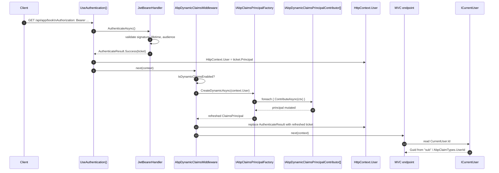

This page traces an authenticated HTTP request from the inbound `Authorization: Bearer ...` header to the moment `ICurrentUser.Id` is readable inside an application service. It covers the bearer path (`Volo.Abp.AspNetCore.Authentication.JwtBearer`), the cookie path (used by MVC UI and OpenIddict-issued sessions), and the dynamic-claims refresh path that lets ABP revoke permissions or rotate features without forcing a re-login.

<Info>
The companion [HTTP request lifecycle](/flows/http-request-lifecycle) page shows where in the pipeline the middlewares discussed here sit. The [Security & claims](/auth/security-and-claims) page enumerates every built-in contributor.
</Info>

## Components

| Type | File | Role |
|------|------|------|
| `AddAbpJwtBearer` | `framework/src/Volo.Abp.AspNetCore.Authentication.JwtBearer/Microsoft/Extensions/DependencyInjection/AbpJwtBearerExtensions.cs` | DI helper that wraps `AddJwtBearer` &mdash; identical token validation, plus ABP error info on challenge. |
| `IAbpClaimsPrincipalFactory` / `AbpClaimsPrincipalFactory` | `framework/src/Volo.Abp.Security/Volo/Abp/Security/Claims/AbpClaimsPrincipalFactory.cs` | Builds a `ClaimsPrincipal` by walking `AbpClaimsPrincipalFactoryOptions.Contributors`. |
| `IAbpClaimsPrincipalContributor` | `Volo/Abp/Security/Claims/IAbpClaimsPrincipalContributor.cs` | Pluggable shape: add claims to an existing principal. |
| `IAbpDynamicClaimsPrincipalContributor` | `Volo/Abp/Security/Claims/IAbpDynamicClaimsPrincipalContributor.cs` | Variant used when ABP rebuilds the principal mid-request for dynamic claims. |
| `AbpDynamicClaimsMiddleware` | `framework/src/Volo.Abp.AspNetCore/Volo/Abp/AspNetCore/Security/Claims/AbpDynamicClaimsMiddleware.cs` | Replaces `HttpContext.User` with a freshly built principal when the feature is enabled. |
| `ICurrentPrincipalAccessor` / `ThreadCurrentPrincipalAccessor` | `Volo/Abp/Security/Claims/ThreadCurrentPrincipalAccessor.cs` | The ambient "current principal" &mdash; an `AsyncLocal`-backed swap. |
| `ICurrentUser` / `CurrentUser` | `framework/src/Volo.Abp.Users/.../CurrentUser.cs` | Reads `ICurrentPrincipalAccessor.Principal` claims into a typed surface. |
| `AbpClaimTypes` | `Volo/Abp/Security/Claims/AbpClaimTypes.cs` | Canonical claim-name constants (`UserName`, `UserId`, `TenantId`, `Email`, ...). |
| `AbpClaimsIdentityExtensions` | `framework/src/Volo.Abp.Security/System/Security/Principal/AbpClaimsIdentityExtensions.cs` | `FindUserId()`, `FindTenantId()`, `FindClaimValue()`, etc. |

## Bearer token path &mdash; sequence diagram



## AddAbpJwtBearer &mdash; what it does

ABP does **not** ship a custom token handler. `AddAbpJwtBearer` calls the standard `AddJwtBearer` and inserts an `OnChallenge` hook that surfaces ABP-specific error info:

```csharp
public static AuthenticationBuilder AddAbpJwtBearer(this AuthenticationBuilder builder,
    string authenticationScheme, string displayName, Action<JwtBearerOptions> configureOptions)
{
    builder.Services.Configure<AbpClaimsPrincipalFactoryOptions>(options =>
    {
        var jwtBearerOption = new JwtBearerOptions();
        configureOptions?.Invoke(jwtBearerOption);
        if (!jwtBearerOption.Authority.IsNullOrEmpty())
        {
            options.RemoteRefreshUrl = jwtBearerOption.Authority.RemovePostFix("/") + options.RemoteRefreshUrl;
        }
    });

    return builder.AddJwtBearer(authenticationScheme, displayName, options =>
    {
        configureOptions?.Invoke(options);

        options.Events ??= new JwtBearerEvents();
        var previousOnChallenge = options.Events.OnChallenge;
        options.Events.OnChallenge = async eventContext =>
        {
            await previousOnChallenge(eventContext);

            if (eventContext.Handled || ...) return;

            var tokenUnauthorizedErrorInfo = eventContext.HttpContext.RequestServices
                .GetRequiredService<AbpAspNetCoreTokenUnauthorizedErrorInfo>();
            if (string.IsNullOrEmpty(tokenUnauthorizedErrorInfo.Error) && ...) return;

            eventContext.Error = tokenUnauthorizedErrorInfo.Error;
            eventContext.ErrorDescription = tokenUnauthorizedErrorInfo.ErrorDescription;
            eventContext.ErrorUri = tokenUnauthorizedErrorInfo.ErrorUri;
        };
    });
}
```

Two effects:

| Effect | Why |
|--------|-----|
| `RemoteRefreshUrl` is rebased to `{Authority}/...` | The dynamic-claims contributor `WebRemoteDynamicClaimsPrincipalContributor` calls back to the auth server to refresh permissions and uses this URL. |
| `OnChallenge` enriches the response with `error`, `error_description`, `error_uri` | Lets clients distinguish "token expired" from "token revoked"/"audience mismatch". |

Token validation itself &mdash; signature, lifetime, audience, issuer &mdash; is delegated to Microsoft's `JwtBearerHandler` and `TokenValidationParameters` set by the caller.

## AbpClaimsPrincipalFactory &mdash; building the principal

`AbpClaimsPrincipalFactory` is the heart of claim assembly. Its `InternalCreateAsync`:

```csharp
public virtual async Task<ClaimsPrincipal> InternalCreateAsync(
    AbpClaimsPrincipalFactoryOptions options,
    ClaimsPrincipal? existsClaimsPrincipal = null,
    bool isDynamic = false)
{
    var claimsPrincipal = existsClaimsPrincipal ?? new ClaimsPrincipal(new ClaimsIdentity(
        AuthenticationType,
        AbpClaimTypes.UserName,
        AbpClaimTypes.Role));

    var context = new AbpClaimsPrincipalContributorContext(claimsPrincipal, ServiceProvider);

    if (!isDynamic)
    {
        foreach (var contributorType in options.Contributors)
        {
            var contributor = (IAbpClaimsPrincipalContributor)ServiceProvider.GetRequiredService(contributorType);
            await contributor.ContributeAsync(context);
        }
    }
    else
    {
        foreach (var contributorType in options.DynamicContributors)
        {
            var contributor = (IAbpDynamicClaimsPrincipalContributor)ServiceProvider.GetRequiredService(contributorType);
            await contributor.ContributeAsync(context);
        }
    }

    return context.ClaimsPrincipal;
}
```

Two entry points:

| Method | When called | Contributor list |
|--------|-------------|------------------|
| `CreateAsync(existing)` | Issuing a new token (e.g. OpenIddict sign-in flow). | `Options.Contributors` |
| `CreateDynamicAsync(existing)` | `AbpDynamicClaimsMiddleware` rebuilding a request principal. | `Options.DynamicContributors` |

Both walk a list of contributor *types* and resolve them from DI &mdash; each one can add/replace claims on the in-flight `ClaimsPrincipal`.

### Standard claim types

`AbpClaimTypes` defines the canonical keys; ABP applies `JwtSecurityTokenHandler.DefaultInboundClaimTypeMap` plus `AbpClaimsPrincipalFactoryOptions.Contributors` so that `nameid` &rarr; `sub` &rarr; `AbpClaimTypes.UserId` produces the same value regardless of which IdP issued the token.

| Key | Constant | Read by |
|-----|----------|---------|
| User id (GUID) | `AbpClaimTypes.UserId` | `CurrentUser.Id` &mdash; the focus of most app-service code. |
| Tenant id | `AbpClaimTypes.TenantId` | `CurrentUserTenantResolveContributor` (see [Multi-tenant request](/flows/multi-tenant-request)). |
| Username | `AbpClaimTypes.UserName` | `CurrentUser.UserName` |
| Email | `AbpClaimTypes.Email` | `CurrentUser.Email` |
| Roles | `AbpClaimTypes.Role` | `CurrentUser.Roles`, `[Authorize(Roles="...")]` |
| Editions / impersonation | `AbpClaimTypes.EditionId`, `AbpClaimTypes.ImpersonatorUserId` | feature/impersonation logic |

## Dynamic claims path

The dynamic claims feature exists so a freshly-revoked permission or just-flipped feature flag does not require the user to log out. The middleware:

```csharp
public async override Task InvokeAsync(HttpContext context, RequestDelegate next)
{
    if (context.User.Identity?.IsAuthenticated == true)
    {
        if (context.RequestServices.GetRequiredService<IOptions<AbpClaimsPrincipalFactoryOptions>>().Value.IsDynamicClaimsEnabled)
        {
            var authenticateResultFeature = context.Features.Get<IAuthenticateResultFeature>();
            var authenticationType = authenticateResultFeature?.AuthenticateResult?.Ticket?.AuthenticationScheme
                                     ?? context.User.Identity.AuthenticationType;

            if (authenticateResultFeature != null && !authenticationType.IsNullOrWhiteSpace())
            {
                var abpClaimsPrincipalFactory = context.RequestServices
                    .GetRequiredService<IAbpClaimsPrincipalFactory>();
                var user = await abpClaimsPrincipalFactory.CreateDynamicAsync(context.User);

                authenticateResultFeature.AuthenticateResult = AuthenticateResult.Success(new AuthenticationTicket(
                    user,
                    authenticateResultFeature?.AuthenticateResult?.Properties,
                    authenticationType));
            }

            if (context.User.Identity?.IsAuthenticated == false)
            {
                var authenticationSchemeProvider = context.RequestServices.GetRequiredService<IAuthenticationSchemeProvider>();
                if (!authenticationType.IsNullOrWhiteSpace())
                {
                    var authenticationScheme = await authenticationSchemeProvider.GetSchemeAsync(authenticationType);
                    if (authenticationScheme != null && typeof(IAuthenticationSignOutHandler).IsAssignableFrom(authenticationScheme.HandlerType))
                        await context.SignOutAsync(authenticationScheme.Name);
                }
            }
        }
    }

    await next(context);
}
```

Two side effects:

| Branch | Trigger | Effect |
|--------|---------|--------|
| Refresh | `IsAuthenticated == true` + `IsDynamicClaimsEnabled` | `CreateDynamicAsync` rebuilds the principal; updates `IAuthenticateResultFeature` so `context.User` (and downstream code) sees the new claims. |
| Sign-out | Contributor invalidated the user (e.g. account locked) | Calls `context.SignOutAsync(scheme)` for schemes that support sign-out (cookies) &mdash; effectively logs the user out for the next request. |

The contributors that supply dynamic claims live in `Volo.Abp.AspNetCore.Authentication.JwtBearer/.../DynamicClaims/` (web app talking back to auth server) and the OpenIddict module (auth server itself). Both descend from `RemoteDynamicClaimsPrincipalContributorBase` and cache results through `RemoteDynamicClaimsPrincipalContributorCacheBase` &mdash; consult [JWT bearer](/auth/jwt-bearer) for details.

## Cookie path (MVC UI / OpenIddict server)

For the MVC UI scenario, the same `AbpClaimsPrincipalFactory` is used &mdash; just at a different time:

| Step | Where | Effect |
|------|-------|--------|
| 1 | `Login.cshtml.cs` &mdash; OpenIddict module | User posts credentials. |
| 2 | `IIdentityUserManager.CheckPasswordAsync` | Validates credentials. |
| 3 | `IAbpClaimsPrincipalFactory.CreateAsync(existing)` | Runs the **static** contributor list to add `UserId`, `TenantId`, `Email`, roles, settings claims. |
| 4 | `HttpContext.SignInAsync(scheme, principal)` | ASP.NET cookie handler issues the auth cookie. |
| 5 | Subsequent request | `app.UseAuthentication()` reads cookie, hydrates `HttpContext.User`. |
| 6 | `AbpDynamicClaimsMiddleware` | Rebuilds principal via `CreateDynamicAsync` if enabled (same as bearer path). |

Cookies and bearer tokens converge on the same factory and the same middleware &mdash; the only difference is **who initially constructed** the principal.

## Where ICurrentUser is read

`CurrentUser` is just a thin wrapper. From its source:

```csharp
public Guid? Id => _principalAccessor.Principal?.FindUserId();
public string? UserName => _principalAccessor.Principal?.FindUserName();
public Guid? TenantId => _principalAccessor.Principal?.FindTenantId();
public string[] Roles => _principalAccessor.Principal?.FindRoles() ?? Array.Empty<string>();
public bool IsAuthenticated => _principalAccessor.Principal?.Identity?.IsAuthenticated ?? false;
```

`ICurrentPrincipalAccessor` defaults to `ThreadCurrentPrincipalAccessor`, which delegates to `Thread.CurrentPrincipal` in tests/console scenarios and to `HttpContextPrincipalAccessor` (wired by `Volo.Abp.AspNetCore`) at runtime. The latter returns `IHttpContextAccessor.HttpContext?.User`.

| Reader | What it ultimately calls |
|--------|--------------------------|
| `CurrentUser.Id` | `principal.FindClaim(AbpClaimTypes.UserId)?.Value` (parsed to GUID). |
| `CurrentUser.Roles` | `principal.FindAll(AbpClaimTypes.Role).Select(c => c.Value)`. |
| `[Authorize(Policy="...")]` | `IAuthorizationService.AuthorizeAsync(principal, policy)` &mdash; uses the same `ClaimsPrincipal`. |
| `[Authorize(Roles="X,Y")]` | Same; checks the `Role` claim. |

So once the middleware finishes, every downstream call &mdash; controllers, filters, application-service interceptors, repositories &mdash; reads the same hydrated principal.

## Putting the bearer path on one table

| # | Caller | File / Method | Side effect |
|---|--------|---------------|-------------|
| 1 | Kestrel | request reaches `UseAuthentication()` middleware | ASP.NET picks the scheme. |
| 2 | `JwtBearerHandler.HandleAuthenticateAsync` | Microsoft package | Validates token using `TokenValidationParameters`; produces `AuthenticationTicket`. |
| 3 | `AddAbpJwtBearer` `OnChallenge` | `AbpJwtBearerExtensions.cs` | On 401 path, fills `WWW-Authenticate` error fields. |
| 4 | `HttpContext.User = ticket.Principal` | Microsoft built-in | Principal carries the **raw token claims**. |
| 5 | `AbpDynamicClaimsMiddleware.InvokeAsync` | `AbpDynamicClaimsMiddleware.cs` | If enabled, calls `CreateDynamicAsync(context.User)`. |
| 6 | `AbpClaimsPrincipalFactory.InternalCreateAsync` | `AbpClaimsPrincipalFactory.cs` | Walks `DynamicContributors`; each can `AddClaim`, `RemoveClaim`, or invalidate the principal. |
| 7 | Authorization middleware | Microsoft built-in | Runs `[Authorize]` policies on the (possibly updated) principal. |
| 8 | App service interceptor `AuthorizationInterceptor` | `Volo.Abp.Authorization` | Method-level `[Authorize]` and `IAuthorizationService.CheckAsync`. |
| 9 | Application service code | user code | Reads `ICurrentUser.Id`, `Roles`, etc. |

## When AbpClaimsPrincipalFactory matters most

`Options.Contributors` is the list run when **issuing** a principal &mdash; typically:

1. `AbpDefaultClaimsPrincipalContributor` (copy known claim types).
2. `IdentityModelClaimsPrincipalContributor` (resolve user id/tenant/email from `IdentityUser`).
3. `AbpUserExtendedClaimsPrincipalContributor` (apply object-extension claims).

`Options.DynamicContributors` is the list run when **refreshing** a principal mid-request &mdash; typically the remote claim fetcher plus any custom contributor that needs to invalidate per-request state.

You configure both through `PreConfigureServices`:

```csharp
PreConfigure<AbpClaimsPrincipalFactoryOptions>(options =>
{
    options.IsDynamicClaimsEnabled = true;
    options.Contributors.Add<MyExtraClaimContributor>();
    options.DynamicContributors.Add<MyDynamicContributor>();
});
```

The Pre-phase is required because some downstream modules read this list inside their `ConfigureServices` (see [Module loading lifecycle](/flows/module-loading-lifecycle)).

## Error scenarios

| Symptom | Likely cause |
|---------|--------------|
| 401 with empty body | Default behaviour &mdash; client should look at `WWW-Authenticate`. ABP's `OnChallenge` populates `error` / `error_description` when `AbpAspNetCoreTokenUnauthorizedErrorInfo` was filled during validation. |
| 401 even with valid token | `UseAuthentication()` was called *after* `UseRouting()` for endpoint routing, or the scheme name does not match. |
| `CurrentUser.Id == null` for a logged-in user | The token's `sub`/`nameid` claim was not mapped to `AbpClaimTypes.UserId`. Check `JwtSecurityTokenHandler.DefaultInboundClaimTypeMap` and `AbpClaimsPrincipalFactoryOptions.Contributors`. |
| Permissions still appear after revocation | `IsDynamicClaimsEnabled` is `false`, or the cache TTL on `RemoteDynamicClaimsPrincipalContributorCacheBase` has not expired. |
| `TenantId` missing | `CurrentUserTenantResolveContributor` only fires if the principal has the `AbpClaimTypes.TenantId` claim. Add it in a custom `IAbpClaimsPrincipalContributor`. |

## Related pages

- [HTTP request lifecycle](/flows/http-request-lifecycle) for surrounding middleware order.
- [Multi-tenant request](/flows/multi-tenant-request) for how `CurrentUserTenantResolveContributor` reads the principal.
- [JWT bearer](/auth/jwt-bearer) for `AddAbpJwtBearer` configuration knobs.
- [OpenIddict](/modules/openiddict) for the issuing side.
- [Security & claims](/auth/security-and-claims) for the full contributor catalogue.
- [Identity module](/modules/identity) for `IIdentityUserManager` and friends.
