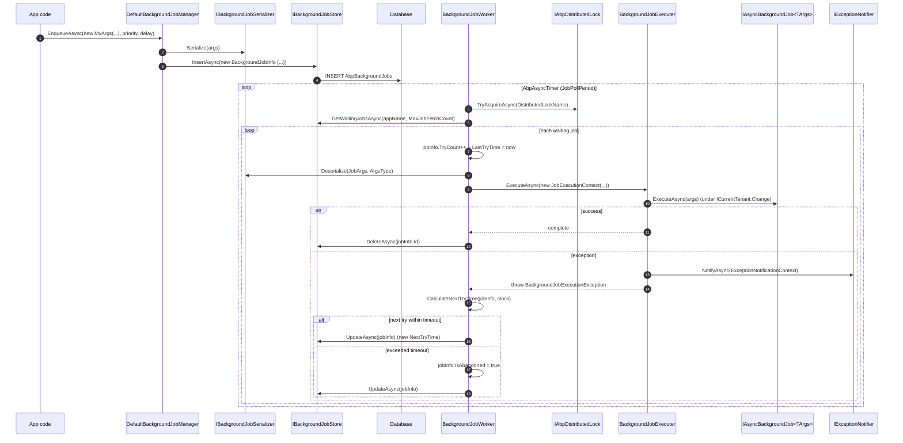

The default `Volo.Abp.BackgroundJobs` module is the simplest of ABP's job processors &mdash; a database-backed queue with exponential-backoff retry. This page traces a job from `IBackgroundJobManager.EnqueueAsync<TArgs>` through `IBackgroundJobStore`, the polling `BackgroundJobWorker`, the `BackgroundJobExecuter`, and back to the store on success or failure. The same shape applies (with provider-specific transport) to the Hangfire, Quartz, RabbitMQ-jobs, and TickerQ packages.

<Note>
All code referenced here lives under `framework/src/Volo.Abp.BackgroundJobs/Volo/Abp/BackgroundJobs/` and `framework/src/Volo.Abp.BackgroundJobs.Abstractions/Volo/Abp/BackgroundJobs/`. The abstractions package is what other providers replace.
</Note>

## Components

| Type | File | Role |
|------|------|------|
| `IBackgroundJobManager` | Abstractions | Public producer API: `EnqueueAsync<TArgs>(args, priority, delay)`. |
| `DefaultBackgroundJobManager` | `DefaultBackgroundJobManager.cs` | Default implementation &mdash; serialises args, inserts a `BackgroundJobInfo`. |
| `BackgroundJobInfo` | `BackgroundJobInfo.cs` | Row entity (`Id`, `JobName`, `JobArgs`, `TryCount`, `NextTryTime`, `IsAbandoned`, ...). |
| `IBackgroundJobStore` | `IBackgroundJobStore.cs` | Storage abstraction. |
| `InMemoryBackgroundJobStore` | `InMemoryBackgroundJobStore.cs` | Default store; EF Core, MongoDB replace it via `[Dependency(ReplaceServices = true)]`. |
| `IBackgroundJobSerializer` / `JsonBackgroundJobSerializer` | `IBackgroundJobSerializer.cs`, `JsonBackgroundJobSerializer.cs` | `System.Text.Json` based serializer. |
| `IBackgroundJobWorker` / `BackgroundJobWorker` | `IBackgroundJobWorker.cs`, `BackgroundJobWorker.cs` | The polling background worker. |
| `IBackgroundJobExecuter` / `BackgroundJobExecuter` | `BackgroundJobExecuter.cs` (Abstractions) | Resolves the job class and invokes `Execute` / `ExecuteAsync`. |
| `AbpBackgroundJobOptions` | Abstractions | `AddJob<TJob>()` registry &mdash; maps `TArgs` to job type and `JobName`. |
| `AbpBackgroundJobWorkerOptions` | `AbpBackgroundJobWorkerOptions.cs` | Polling tuning (period, batch, distributed lock name, default timeouts). |

## End-to-end sequence diagram



## EnqueueAsync &mdash; producer side

`DefaultBackgroundJobManager.EnqueueAsync<TArgs>` is annotated with `[Dependency(ReplaceServices = true)]` so providers (Hangfire, Quartz) can swap it without touching call sites:

```csharp
public virtual async Task<string> EnqueueAsync<TArgs>(
    TArgs args,
    BackgroundJobPriority priority = BackgroundJobPriority.Normal,
    TimeSpan? delay = null)
{
    var jobName = BackgroundJobOptions.Value.GetBackgroundJobName(typeof(TArgs));
    var jobId = await EnqueueAsync(jobName, args!, priority, delay);
    return jobId.ToString();
}

protected virtual async Task<Guid> EnqueueAsync(string jobName, object args, BackgroundJobPriority priority, TimeSpan? delay)
{
    var jobInfo = new BackgroundJobInfo
    {
        Id = GuidGenerator.Create(),
        ApplicationName = BackgroundJobWorkerOptions.Value.ApplicationName,
        JobName = jobName,
        JobArgs = Serializer.Serialize(args),
        Priority = priority,
        CreationTime = Clock.Now,
        NextTryTime = Clock.Now
    };

    if (delay.HasValue) jobInfo.NextTryTime = Clock.Now.Add(delay.Value);

    await Store.InsertAsync(jobInfo);

    return jobInfo.Id;
}
```

| Field | Source | Notes |
|-------|--------|-------|
| `Id` | `IGuidGenerator` | Tenant-friendly sequential GUID by default. |
| `ApplicationName` | `AbpBackgroundJobWorkerOptions.ApplicationName` | Multi-tenant/multi-app stores can shard. |
| `JobName` | `AbpBackgroundJobOptions.GetBackgroundJobName(argsType)` | Logical key the worker uses to look up the job type. |
| `JobArgs` | `IBackgroundJobSerializer.Serialize(args)` | JSON-encoded arg payload. |
| `Priority` | caller | `BackgroundJobPriority` enum &mdash; `Low`, `BelowNormal`, `Normal`, `AboveNormal`, `High`; influences `GetWaitingJobsAsync` ordering. |
| `CreationTime` | `IClock.Now` | Anchor for the "abandon after N seconds" check. |
| `NextTryTime` | now or `now + delay` | What `GetWaitingJobsAsync` filters on. |

Insert happens within the **caller's UoW** when an EF Core-backed store is used &mdash; meaning the job becomes visible only when the surrounding business transaction commits. This is the same outbox pattern that distributed events use (see [Distributed event publish](/flows/distributed-event-publish)).

## Job registration

`AbpBackgroundJobOptions` maps `JobName <-> ArgsType <-> JobType`. The standard registration looks like:

```csharp
Configure<AbpBackgroundJobOptions>(options =>
{
    options.AddJob<MyEmailSendingJob>(); // Args type inferred from IAsyncBackgroundJob<TArgs>
});
```

`AddJob<TJob>` reads `IAsyncBackgroundJob<TArgs>`/`IBackgroundJob<TArgs>` off `TJob` and registers `BackgroundJobConfiguration { JobName, ArgsType, JobType }`. `GetBackgroundJobName(argsType)` returns the configured name (defaults to the args type's full name).

`BackgroundJobName` attribute can override the string &mdash; useful when args classes move between assemblies.

## BackgroundJobWorker.DoWorkAsync

The worker derives from `AsyncPeriodicBackgroundWorkerBase` (in `Volo.Abp.BackgroundWorkers`), which gives it an `AbpAsyncTimer` and a `PeriodicBackgroundWorkerContext` scope per tick:

```csharp
public BackgroundJobWorker(...)
    : base(timer, serviceScopeFactory)
{
    ...
    Timer.Period = WorkerOptions.JobPollPeriod;
}

protected override async Task DoWorkAsync(PeriodicBackgroundWorkerContext workerContext)
{
    await using (var handler = await DistributedLock.TryAcquireAsync(WorkerOptions.DistributedLockName, cancellationToken: StoppingToken))
    {
        if (handler != null)
        {
            var store = workerContext.ServiceProvider.GetRequiredService<IBackgroundJobStore>();
            var waitingJobs = await store.GetWaitingJobsAsync(WorkerOptions.ApplicationName, WorkerOptions.MaxJobFetchCount);
            if (!waitingJobs.Any()) return;

            var jobExecuter = workerContext.ServiceProvider.GetRequiredService<IBackgroundJobExecuter>();
            var clock = workerContext.ServiceProvider.GetRequiredService<IClock>();
            var serializer = workerContext.ServiceProvider.GetRequiredService<IBackgroundJobSerializer>();

            foreach (var jobInfo in waitingJobs)
            {
                jobInfo.TryCount++;
                jobInfo.LastTryTime = clock.Now;

                try
                {
                    var jobConfiguration = JobOptions.GetJob(jobInfo.JobName);
                    var jobArgs = serializer.Deserialize(jobInfo.JobArgs, jobConfiguration.ArgsType);
                    var context = new JobExecutionContext(workerContext.ServiceProvider, jobConfiguration.JobType, jobArgs, workerContext.CancellationToken);

                    try
                    {
                        await jobExecuter.ExecuteAsync(context);
                        await store.DeleteAsync(jobInfo.Id);
                    }
                    catch (BackgroundJobExecutionException)
                    {
                        var nextTryTime = CalculateNextTryTime(jobInfo, clock);
                        if (nextTryTime.HasValue) jobInfo.NextTryTime = nextTryTime.Value;
                        else jobInfo.IsAbandoned = true;

                        await TryUpdateAsync(store, jobInfo);
                    }
                }
                catch (Exception ex)
                {
                    Logger.LogException(ex);
                    jobInfo.IsAbandoned = true;
                    await TryUpdateAsync(store, jobInfo);
                }
            }
        }
        else
        {
            try { await Task.Delay(WorkerOptions.JobPollPeriod * 12, StoppingToken); }
            catch (TaskCanceledException) { }
        }
    }
}
```

| Knob | Default-ish | Meaning |
|------|-------------|---------|
| `JobPollPeriod` | 5&nbsp;000&nbsp;ms | Timer tick. |
| `MaxJobFetchCount` | 1000 | Max rows per tick. |
| `DistributedLockName` | `"AbpBackgroundJobWorker"` | Ensures only one node executes at a time when distributed locking is configured. |
| `DefaultFirstWaitDuration` | 60&nbsp;s | First retry delay seed. |
| `DefaultWaitFactor` | 2 | Exponent base for `delay = first * factor^(try-1)`. |
| `DefaultTimeout` | 2&nbsp;592&nbsp;000&nbsp;s (30&nbsp;d) | Total window after `CreationTime` before a failing job is abandoned. |
| `ApplicationName` | the host process | Lets multiple apps share a store. |

<Note>
The `Task.Delay(WorkerOptions.JobPollPeriod * 12)` branch is the back-off when another replica holds the distributed lock &mdash; this avoids hammering the lock provider while another node is processing.
</Note>

## BackgroundJobExecuter.ExecuteAsync

```csharp
public virtual async Task ExecuteAsync(JobExecutionContext context)
{
    var job = context.ServiceProvider.GetService(context.JobType);
    if (job == null)
        throw new AbpException("The job type is not registered to DI: " + context.JobType);

    var jobExecuteMethod = context.JobType.GetMethod(nameof(IBackgroundJob<object>.Execute))
                       ?? context.JobType.GetMethod(nameof(IAsyncBackgroundJob<object>.ExecuteAsync));
    if (jobExecuteMethod == null)
        throw new AbpException($"Given job type does not implement {typeof(IBackgroundJob<>).Name} or {typeof(IAsyncBackgroundJob<>).Name}. ...");

    try
    {
        using (CurrentTenant.Change(GetJobArgsTenantId(context.JobArgs)))
        {
            var cancellationTokenProvider = context.ServiceProvider.GetRequiredService<ICancellationTokenProvider>();
            using (cancellationTokenProvider.Use(context.CancellationToken))
            {
                if (jobExecuteMethod.Name == nameof(IAsyncBackgroundJob<object>.ExecuteAsync))
                    await ((Task)jobExecuteMethod.Invoke(job, new[] { context.JobArgs })!);
                else
                    jobExecuteMethod.Invoke(job, new[] { context.JobArgs });
            }
        }
    }
    catch (Exception ex)
    {
        Logger.LogException(ex);

        await context.ServiceProvider
            .GetRequiredService<IExceptionNotifier>()
            .NotifyAsync(new ExceptionNotificationContext(ex));

        throw new BackgroundJobExecutionException("A background job execution is failed. See inner exception for details.", ex)
        {
            JobType = context.JobType.AssemblyQualifiedName!,
            JobArgs = context.JobArgs
        };
    }
}

protected virtual Guid? GetJobArgsTenantId(object jobArgs)
{
    return jobArgs switch
    {
        IMultiTenant multiTenantJobArgs => multiTenantJobArgs.TenantId,
        _ => CurrentTenant.Id
    };
}
```

Key behaviours:

| Step | Effect |
|------|--------|
| `context.ServiceProvider.GetService(JobType)` | Resolves the job class &mdash; jobs are normally registered as `ITransientDependency`. |
| `IBackgroundJob<TArgs>` vs `IAsyncBackgroundJob<TArgs>` | The framework supports both; sync jobs are invoked via reflection without `await`. |
| `CurrentTenant.Change(GetJobArgsTenantId(...))` | If `TArgs` implements `IMultiTenant` the job runs as that tenant; otherwise the ambient `CurrentTenant.Id` is preserved. |
| `ICancellationTokenProvider.Use(...)` | Stitches the worker's `StoppingToken` into the ambient cancellation accessor so `DbContext` etc. see it. |
| `IExceptionNotifier.NotifyAsync` | Pushes the exception into the audit-logging / notification pipeline before re-throwing. |
| `throw new BackgroundJobExecutionException(...)` | Distinguished exception that the worker catches separately from generic exceptions for retry-vs-abandon decisions. |

## Retry / abandon math

```csharp
protected virtual DateTime? CalculateNextTryTime(BackgroundJobInfo jobInfo, IClock clock)
{
    var nextWaitDuration = WorkerOptions.DefaultFirstWaitDuration *
                           (Math.Pow(WorkerOptions.DefaultWaitFactor, jobInfo.TryCount - 1));
    var nextTryDate = jobInfo.LastTryTime?.AddSeconds(nextWaitDuration)
                      ?? clock.Now.AddSeconds(nextWaitDuration);

    if (nextTryDate.Subtract(jobInfo.CreationTime).TotalSeconds > WorkerOptions.DefaultTimeout)
        return null;

    return nextTryDate;
}
```

| Try # | Wait formula | Example (60&nbsp;s seed, factor 2) |
|-------|--------------|------------------------------------|
| 1 fails &rarr; 2 | `60 * 2^0` | next attempt in 60&nbsp;s |
| 2 fails &rarr; 3 | `60 * 2^1` | next attempt in 120&nbsp;s |
| 3 fails &rarr; 4 | `60 * 2^2` | next attempt in 240&nbsp;s |
| ... | | grows until `nextTryDate - CreationTime > DefaultTimeout` |

When the next try would land *past* `CreationTime + DefaultTimeout`, the method returns `null` and the worker sets `IsAbandoned = true`. Abandoned jobs are skipped by `GetWaitingJobsAsync` but remain in the store for inspection.

## Two exception code paths

The worker distinguishes:

| Exception | Source | Effect |
|-----------|--------|--------|
| `BackgroundJobExecutionException` | Thrown by `BackgroundJobExecuter` after the actual job method failed. | Reschedule via `CalculateNextTryTime` or abandon. |
| Any other `Exception` | Misconfiguration: missing job registration, deserialisation failure, DI resolution error. | Immediate `jobInfo.IsAbandoned = true` &mdash; retrying is pointless because the args/type cannot be loaded. |

The `try/catch (BackgroundJobExecutionException)` block is the **inner** try; the outer `try/catch (Exception)` handles "infrastructure" failures.

## A complete trace: `MyEmailSendingJob`

Suppose the user submits `EmailDto` from a `SendEmailAppService`:

| # | Caller | File / Method | Side effect |
|---|--------|---------------|-------------|
| 1 | `SendEmailAppService.SendAsync` | `_backgroundJobManager.EnqueueAsync(new EmailJobArgs(...))` | Producer call. |
| 2 | `DefaultBackgroundJobManager.EnqueueAsync<TArgs>` | `GetBackgroundJobName(typeof(EmailJobArgs))` | Looks up `"Volo.Abp.MyApp.EmailJobArgs"`. |
| 3 | same | `Serializer.Serialize(args)` | JSON: `{"To":"a@b","Body":"..."}`. |
| 4 | same | `Store.InsertAsync(jobInfo)` | INSERT (committed with caller's UoW). |
| 5 | tick fires | `BackgroundJobWorker.DoWorkAsync` | `TryAcquireAsync("AbpBackgroundJobWorker")` succeeds. |
| 6 | same | `store.GetWaitingJobsAsync(appName, 1000)` | Returns rows where `IsAbandoned=false`, `NextTryTime <= now`, sorted by `Priority` then `NextTryTime`. |
| 7 | same | `jobInfo.TryCount++ ; jobInfo.LastTryTime = clock.Now` | Tick now owns the row. |
| 8 | same | `jobConfiguration = JobOptions.GetJob("Volo.Abp.MyApp.EmailJobArgs")` | Returns `{ JobType = typeof(MyEmailSendingJob), ArgsType = typeof(EmailJobArgs) }`. |
| 9 | same | `serializer.Deserialize(jobInfo.JobArgs, ArgsType)` | Hydrates `EmailJobArgs`. |
| 10 | same | `jobExecuter.ExecuteAsync(context)` | See below. |
| 11 | `BackgroundJobExecuter` | `context.ServiceProvider.GetService(typeof(MyEmailSendingJob))` | DI resolves. |
| 12 | same | `using (CurrentTenant.Change(GetJobArgsTenantId(args)))` | If `EmailJobArgs : IMultiTenant`, switches tenant. |
| 13 | same | `await jobExecuteMethod.Invoke(job, new[] { args })` | Runs `MyEmailSendingJob.ExecuteAsync`. |
| 14a (success) | worker | `store.DeleteAsync(jobInfo.Id)` | Row gone. |
| 14b (failure) | worker | `CalculateNextTryTime` → `store.UpdateAsync(jobInfo)` | Row stays for retry. |

## Where multi-tenancy fits

`GetJobArgsTenantId(jobArgs)` is the only multi-tenancy hook. The pattern is:

```csharp
public class EmailJobArgs : IMultiTenant
{
    public Guid? TenantId { get; set; }
    public string To { get; set; } = default!;
    public string Body { get; set; } = default!;
}
```

When the worker picks up the row, `ICurrentTenant.Change(args.TenantId)` enters a tenant scope. Downstream resolvers (`MultiTenantConnectionStringResolver`, settings, features) will use that tenant for the duration of the call. See [Multi-tenant request](/flows/multi-tenant-request) for the same `ICurrentTenant.Change` pattern in HTTP.

## Authoring a job

```csharp
public class MyEmailSendingJob : AsyncBackgroundJob<EmailJobArgs>, ITransientDependency
{
    private readonly IEmailSender _emailSender;

    public MyEmailSendingJob(IEmailSender emailSender) => _emailSender = emailSender;

    public override async Task ExecuteAsync(EmailJobArgs args)
    {
        await _emailSender.SendAsync(args.To, "Subject", args.Body);
    }
}
```

`AsyncBackgroundJob<TArgs>` is just a thin base with `IAsyncBackgroundJob<TArgs>` plus an `ILogger` property &mdash; in DI terms the base offers nothing special.

## Choosing a provider

Provider modules implement the same producer/consumer contracts; the differences are where jobs live and how they get dispatched. See:

| Module | Notes |
|--------|-------|
| `Volo.Abp.BackgroundJobs` (default) | Database-backed, single-process or DB-coordinated multi-process. |
| `Volo.Abp.BackgroundJobs.Hangfire` | Hangfire dashboard, in-memory or SQL storage. |
| `Volo.Abp.BackgroundJobs.Quartz` | Quartz.NET scheduling primitives. |
| `Volo.Abp.BackgroundJobs.RabbitMq` | RabbitMQ transport &mdash; jobs become messages. |
| `Volo.Abp.BackgroundJobs.TickerQ` | TickerQ-backed scheduler. |

Each replaces `IBackgroundJobManager`, often `IBackgroundJobWorker`, and the store. See [Background jobs overview](/background/overview) for a comparison.

## Related pages

- [Background jobs](/background/background-jobs) for the user-facing reference.
- [Background workers](/background/background-workers) for `IBackgroundWorker` itself.
- [Distributed locking](/background/distributed-locking) for `IAbpDistributedLock` &mdash; the same shield used by [Distributed event publish](/flows/distributed-event-publish).
- [Multi-tenant request](/flows/multi-tenant-request) for `ICurrentTenant.Change` semantics.
- [Unit of work flow](/flows/unit-of-work-flow) for why `Store.InsertAsync` commits with the producer's transaction.
