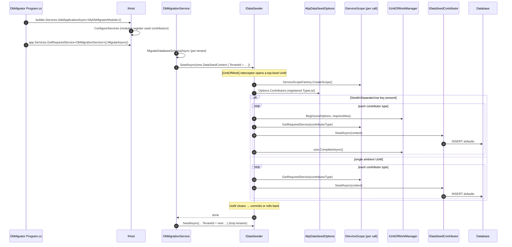

ABP's solution templates ship a `*.DbMigrator` console project whose only job is to apply EF Core migrations and run the seeding pipeline. This page traces a seed run from `Program.cs` into `DbMigrationService`, then into `IDataSeeder.SeedAsync`, the registered `IDataSeedContributor` list, and per-contributor unit-of-work behaviour. The framework code lives under `framework/src/Volo.Abp.Data/Volo/Abp/Data/`.

<Info>
The DbMigrator host is a thin wrapper around the same ABP application boot covered in [Application startup](/flows/application-startup). The seeding code itself is purely `Volo.Abp.Data` &mdash; no EF Core dependency &mdash; so the same flow works against MongoDB and Dapper stores.
</Info>

## Components

| Type | File | Role |
|------|------|------|
| `IDataSeeder` | `framework/src/Volo.Abp.Data/Volo/Abp/Data/IDataSeeder.cs` | Public API. |
| `DataSeeder` | `Volo/Abp/Data/DataSeeder.cs` | Default implementation. Iterates contributors inside a UoW (or a per-contributor UoW). |
| `DataSeedContext` | `Volo/Abp/Data/DataSeedContext.cs` | Carries `TenantId`, `Properties` (a free-form bag), helpers like `WithProperty`. |
| `IDataSeedContributor` | `Volo/Abp/Data/IDataSeedContributor.cs` | One method: `Task SeedAsync(DataSeedContext context)`. |
| `AbpDataSeedOptions` | `Volo/Abp/Data/AbpDataSeedOptions.cs` | Holds the ordered `DataSeedContributorList`. |
| `DataSeederExtensions` | `Volo/Abp/Data/DataSeederExtensions.cs` | Convenience helpers (`SeedAsync(tenantId)`, `SeedInSeparateUow*` markers). |
| `DataSeederExtensions` constants | same file | `SeedInSeparateUow`, `SeedInSeparateUowOptions`, `SeedInSeparateUowRequiresNew` &mdash; keys used in `DataSeedContext.Properties`. |
| (Solution template) `DbMigrationService` | `*.DbMigrator/DbMigrationService.cs` (generated per project) | Orchestrates `EnsureMigrationsApplied` + `IDataSeeder.SeedAsync` per tenant. |

## Sequence diagram



## DbMigrator host shape

Generated by the solution template, the host program looks like:

```csharp
public class Program
{
    public async static Task<int> Main(string[] args)
    {
        Log.Logger = new LoggerConfiguration()...CreateLogger();

        try
        {
            await CreateHostBuilder(args).RunConsoleAsync();
            return 0;
        }
        catch (Exception ex) { Log.Fatal(ex, "Host terminated"); return 1; }
    }

    public static IHostBuilder CreateHostBuilder(string[] args) =>
        Host.CreateDefaultBuilder(args)
            .ConfigureServices((hostContext, services) =>
            {
                services.AddHostedService<MyAppDbMigratorHostedService>();
            });
}
```

`MyAppDbMigratorHostedService` is the actual driver:

```csharp
public class MyAppDbMigratorHostedService : IHostedService
{
    private readonly IHostApplicationLifetime _hostApplicationLifetime;

    public async Task StartAsync(CancellationToken cancellationToken)
    {
        using (var application = await AbpApplicationFactory.CreateAsync<MyAppDbMigratorModule>(options =>
               {
                   options.Services.ReplaceConfiguration(BuildConfiguration());
                   options.UseAutofac();
                   options.Services.AddLogging(c => c.AddSerilog());
                   options.AddDataMigrationEnvironment();
               }))
        {
            await application.InitializeAsync();

            await application
                .ServiceProvider
                .GetRequiredService<MyAppDbMigrationService>()
                .MigrateAsync();

            await application.ShutdownAsync();

            _hostApplicationLifetime.StopApplication();
        }
    }
}
```

Two notable things:

| Call | Effect |
|------|--------|
| `AddDataMigrationEnvironment()` | Registers an `AbpDataMigrationEnvironment` object accessor (`Volo/Abp/Data/AbpDataMigrationEnvironmentExtensions.cs`). Modules check `IServiceCollection.IsDataMigrationEnvironment()` and short-circuit work that does not belong in a migrator process &mdash; for example `AbpBackgroundJobsAbstractionsModule` and `AbpBackgroundWorkersModule` disable their workers, and `AbpAspNetCoreMvcUiBundlingModule` skips bundle generation. |
| `application.InitializeAsync()` | Same boot as a web app &mdash; every module's `OnApplicationInitialization` runs. This is what registers all `IDataSeedContributor`s onto `AbpDataSeedOptions`. |

## Contributor registration

Contributors are registered conventionally: any class implementing `IDataSeedContributor` gets picked up by `services.AddAssembly` during phase 2 of [Module loading](/flows/module-loading-lifecycle). Each module also explicitly adds its contributor to `AbpDataSeedOptions.Contributors`:

```csharp
Configure<AbpDataSeedOptions>(options =>
{
    options.Contributors.TryAdd<MyAppDataSeedContributor>();
});
```

`DataSeedContributorList.TryAdd<TContributor>` ensures the contributor type is registered exactly once. The order in `Contributors` is the execution order.

## DataSeeder.SeedAsync &mdash; full source

```csharp
public class DataSeeder : IDataSeeder, ITransientDependency
{
    protected IServiceScopeFactory ServiceScopeFactory { get; }
    protected AbpDataSeedOptions Options { get; }

    [UnitOfWork]
    public virtual async Task SeedAsync(DataSeedContext context)
    {
        using (var scope = ServiceScopeFactory.CreateScope())
        {
            if (context.Properties.ContainsKey(DataSeederExtensions.SeedInSeparateUow))
            {
                var manager = scope.ServiceProvider.GetRequiredService<IUnitOfWorkManager>();
                foreach (var contributorType in Options.Contributors)
                {
                    var options = context.Properties.TryGetValue(DataSeederExtensions.SeedInSeparateUowOptions, out var uowOptions)
                        ? (AbpUnitOfWorkOptions) uowOptions!
                        : new AbpUnitOfWorkOptions();
                    var requiresNew = context.Properties.TryGetValue(DataSeederExtensions.SeedInSeparateUowRequiresNew, out var obj) && (bool) obj!;

                    using (var uow = manager.Begin(options, requiresNew))
                    {
                        var contributor = (IDataSeedContributor)scope.ServiceProvider.GetRequiredService(contributorType);
                        await contributor.SeedAsync(context);
                        await uow.CompleteAsync();
                    }
                }
            }
            else
            {
                foreach (var contributorType in Options.Contributors)
                {
                    var contributor = (IDataSeedContributor)scope.ServiceProvider.GetRequiredService(contributorType);
                    await contributor.SeedAsync(context);
                }
            }
        }
    }
}
```

Two important details:

### `[UnitOfWork]` on `SeedAsync`

Because `DataSeeder` is registered as a service with the `UnitOfWorkInterceptor` in the chain, calling `IDataSeeder.SeedAsync` opens a UoW for the whole method (transactional by default, since the name does not start with `Get`). That means the "single UoW" branch commits **all contributors atomically** &mdash; one failure rolls everyone back.

See [Unit of work flow](/flows/unit-of-work-flow) for the interceptor mechanics.

### `SeedInSeparateUow` mode

For long-running seeders (think hundreds of localisation rows, thousands of permission grants) the "everything in one transaction" model can be a problem. The helper `DataSeederExtensions.SeedInSeparateUowAsync(...)` opts into per-contributor UoWs:

```csharp
public static Task SeedInSeparateUowAsync(this IDataSeeder seeder,
    Guid? tenantId = null,
    AbpUnitOfWorkOptions? options = null,
    bool requiresNew = false)
{
    var context = new DataSeedContext(tenantId);
    context.WithProperty(SeedInSeparateUow, true);
    context.WithProperty(SeedInSeparateUowOptions, options);
    context.WithProperty(SeedInSeparateUowRequiresNew, requiresNew);
    return seeder.SeedAsync(context);
}
```

The three `DataSeederExtensions` constants &mdash; `SeedInSeparateUow`, `SeedInSeparateUowOptions`, `SeedInSeparateUowRequiresNew` &mdash; are the exact keys `DataSeeder.SeedAsync` looks for in `context.Properties`. When `SeedInSeparateUow` is present, `DataSeeder` opens a fresh UoW per contributor via `IUnitOfWorkManager.Begin(options, requiresNew)`. Pros and cons:

| Mode | Pro | Con |
|------|-----|-----|
| Single ambient UoW (default) | Atomic across contributors; simpler debugging. | Long transactions, potential bloat in `ChangeTracker`. |
| `SeedInSeparateUow` | Each contributor commits independently; smaller transactions. | Partial-failure recovery is the user's problem. |

## Authoring a contributor

```csharp
public class MyAppDataSeedContributor : IDataSeedContributor, ITransientDependency
{
    private readonly IRepository<Book, Guid> _books;
    private readonly IGuidGenerator _guid;

    public MyAppDataSeedContributor(IRepository<Book, Guid> books, IGuidGenerator guid)
    {
        _books = books;
        _guid = guid;
    }

    public async Task SeedAsync(DataSeedContext context)
    {
        if (await _books.AnyAsync()) return;

        await _books.InsertAsync(new Book(_guid.Create(), "1984", 1949), autoSave: true);
        await _books.InsertAsync(new Book(_guid.Create(), "Brave New World", 1932), autoSave: true);
    }
}
```

The `if (await ... AnyAsync())` early-out is the **idiomatic idempotency check** &mdash; seed contributors run on every migration cycle, so they must check before inserting.

## Tenant-scoped seeding

The DbMigrator typically iterates tenants:

```csharp
public class MyAppDbMigrationService : ITransientDependency
{
    private readonly IDataSeeder _dataSeeder;
    private readonly ITenantRepository _tenantRepository;
    private readonly ICurrentTenant _currentTenant;
    // ...

    public async Task MigrateAsync()
    {
        await MigrateHostAsync(); // schema only

        await _dataSeeder.SeedAsync(); // host data

        var tenants = await _tenantRepository.GetListWithConnectionStringAsync();
        foreach (var tenant in tenants)
        {
            using (_currentTenant.Change(tenant.Id))
            {
                await MigrateTenantSchemaAsync(tenant);
                await _dataSeeder.SeedAsync(new DataSeedContext(tenant.Id));
            }
        }
    }
}
```

Two passes:

| Pass | `DataSeedContext.TenantId` | UoW connects to | Contributors run |
|------|---------------------------|-----------------|-----------------|
| Host | `null` | Global default connection string. | All registered contributors with `context.TenantId == null`. |
| Tenant | `tenant.Id` | Resolved via `MultiTenantConnectionStringResolver` (see [Multi-tenant request](/flows/multi-tenant-request)). | Same contributor list, but each may branch on `context.TenantId.HasValue`. |

The `using (_currentTenant.Change(tenant.Id))` block is essential &mdash; without it, the repositories inside contributors would resolve the host's connection string.

## Module contributor examples (out of the box)

| Module | Contributor | Purpose |
|--------|-------------|---------|
| `Volo.Abp.Identity.Domain` | `IdentityDataSeedContributor` | Seeds the `admin` user, default roles, claim types. |
| `Volo.Abp.PermissionManagement.Domain` | `PermissionDataSeedContributor` | Grants every permission to the `admin` role. |
| `Volo.Abp.LanguageManagement.Domain` | language-list contributor | Inserts supported languages. |
| `Volo.Abp.FeatureManagement.Domain` | feature default-value contributor | Sets `Edition` feature defaults. |

Custom modules add their own contributors via `Configure<AbpDataSeedOptions>` as shown above.

## File / method trace

| # | Caller | File / Method | Side effect |
|---|--------|---------------|-------------|
| 1 | `Program.Main` | `AbpApplicationFactory.CreateAsync<TModule>` | Boot path identical to [Application startup](/flows/application-startup). |
| 2 | `application.InitializeAsync()` | `AbpApplicationBase.InitializeModulesAsync` | Every module's `OnApplicationInitialization` runs &mdash; `Configure<AbpDataSeedOptions>` was already wired during `ConfigureServices`. |
| 3 | `DbMigrationService.MigrateAsync` | `EnsureMigrationsApplied` (EF Core) | `DbContext.Database.MigrateAsync` for each context. |
| 4 | `DbMigrationService` | `_dataSeeder.SeedAsync(DataSeedContext)` | Enters interceptor &mdash; `[UnitOfWork]` opens UoW. |
| 5 | `UnitOfWorkInterceptor.InterceptAsync` | `framework/src/Volo.Abp.Uow/Volo/Abp/Uow/UnitOfWorkInterceptor.cs` | `_uowManager.Begin(options)` (top-level &mdash; no reservation here). |
| 6 | `DataSeeder.SeedAsync` | `framework/src/Volo.Abp.Data/Volo/Abp/Data/DataSeeder.cs` | `ServiceScopeFactory.CreateScope()` for contributor resolution. |
| 7 | branch 1 (default) | `foreach contributorType` | Resolve contributor, `await SeedAsync(context)`, repeat. |
| 8 | branch 2 (`SeedInSeparateUow`) | `_uowManager.Begin(uowOptions, requiresNew)` per contributor | Each contributor commits independently. |
| 9 | contributor | `_repo.AnyAsync()` / `_repo.InsertAsync(entity)` | EF Core change-tracker entries. |
| 10 | UoW close (single mode) | `[UnitOfWork]` interceptor finally branch | `uow.CompleteAsync` &mdash; `SaveChangesAsync`, distributed event publish (e.g. `EntityCreatedEto<Book>` &mdash; see [Distributed event publish](/flows/distributed-event-publish)). |
| 11 | next tenant | `using (_currentTenant.Change(tenant.Id))` | Repeats from step 4 with tenant connection string. |

## Pitfalls and patterns

<AccordionGroup>
  <Accordion title="Always check before insert">
    Seed methods run on every migration. Use `if (await repo.AnyAsync(predicate)) return;` or `FindAsync` and update.
  </Accordion>
  <Accordion title="Use `autoSave: true` for early-out idempotency">
    Calling `_repo.InsertAsync(entity, autoSave: true)` flushes immediately. Useful when later code reads the entity back inside the same contributor.
  </Accordion>
  <Accordion title="Beware ordering between contributors">
    `DataSeedContributorList` is an ordered list. If you depend on another contributor's data, register yours *after* it &mdash; the framework cannot infer dependencies.
  </Accordion>
  <Accordion title="Suppress distributed events during seeding">
    The seeded entities normally publish `EntityCreatedEto` via `CompleteAsync`. If your subscribers should ignore seed inserts, check `IServiceCollection.IsDataMigrationEnvironment()` during module configuration (the same flag `AbpBackgroundWorkersModule` uses to avoid starting workers in DbMigrator) or guard the handler on `DataSeedContext.Properties` you set explicitly.
  </Accordion>
  <Accordion title="Tenant connection string must be resolvable">
    `using (_currentTenant.Change(tenant.Id))` only works if the tenant row has a connection string (or the host falls back to the global). See [Connection-string resolver](/multitenancy/connection-string-resolver).
  </Accordion>
</AccordionGroup>

## Calling seed from runtime code

Outside DbMigrator, `IDataSeeder` is callable from any service. The most common case is during tenant creation, where the tenant-management module schedules a seed run right after the tenant row + connection string are committed. The `DataSeedContext.WithProperty(key, value)` fluent helper is the universal extension point &mdash; contributors read those properties to pick up out-of-band data like admin credentials:

```csharp
var context = new DataSeedContext(createdTenantId)
    .WithProperty("AdminEmail", input.AdminEmail)
    .WithProperty("AdminPassword", input.AdminPassword);

// Either keep the single-UoW default:
await _dataSeeder.SeedAsync(context);

// Or opt into per-contributor UoWs via the dedicated extension:
await _dataSeeder.SeedInSeparateUowAsync(
    tenantId: createdTenantId,
    requiresNew: true);
```

`SeedInSeparateUowAsync` builds the `DataSeedContext` internally and fills in the three `DataSeederExtensions` keys &mdash; it does not take user properties, so when both are needed call the two-step form: build the context with `WithProperty`, set `context.Properties[DataSeederExtensions.SeedInSeparateUow] = true`, then `SeedAsync(context)`.

## Related pages

- [Data seeding and migrations](/data/data-seeding-and-migrations) for the user-facing reference.
- [Unit of work flow](/flows/unit-of-work-flow) for what `[UnitOfWork]` on `SeedAsync` actually does.
- [Multi-tenant request](/flows/multi-tenant-request) for `ICurrentTenant.Change` semantics during tenant-scoped seeding.
- [Application startup](/flows/application-startup) for the host boot the DbMigrator shares.
- [Tenant management module](/modules/tenant-management) for the new-tenant trigger.
