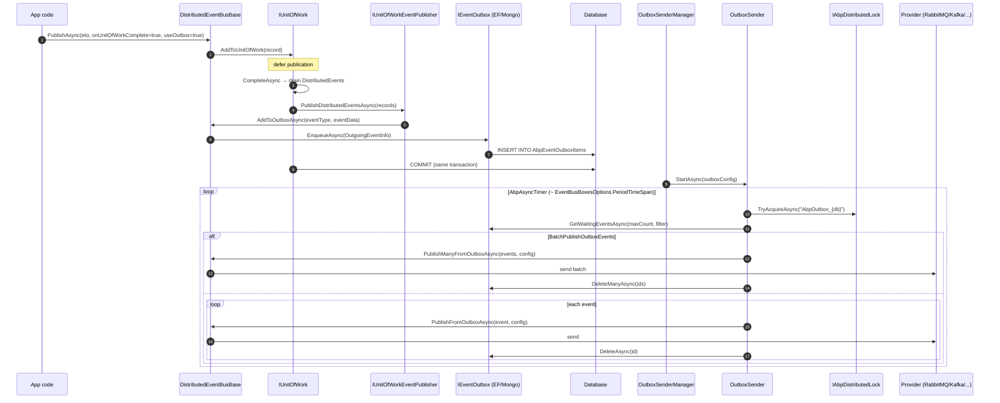
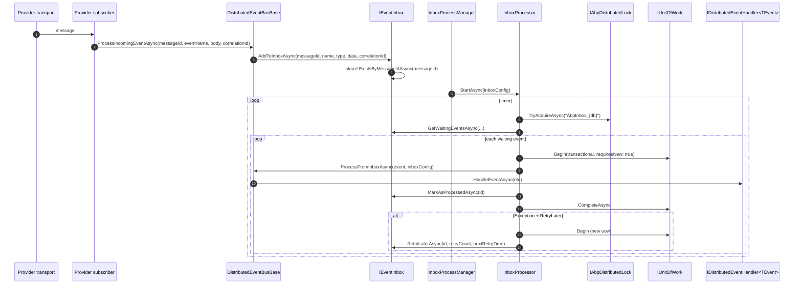

This page traces a distributed event from `IDistributedEventBus.PublishAsync<TEto>(eto)` all the way through the outbox, transport, inbox, and consumer handler invocation. All framework code lives under `framework/src/Volo.Abp.EventBus/Volo/Abp/EventBus/Distributed/` &mdash; provider modules (RabbitMQ, Kafka, Azure Service Bus, Dapr, Rebus) plug in to `DistributedEventBusBase`.

<Info>
Local events stay in-process and bypass the boxes. See [Local event bus](/eventbus/local-event-bus) for that path. The companion [Unit of work flow](/flows/unit-of-work-flow) page covers `UoW.CompleteAsync` &mdash; the moment when distributed events actually get drained.
</Info>

## The components

| Object | File | Role |
|--------|------|------|
| `IDistributedEventBus` | `IDistributedEventBus.cs` (Abstractions) | Public API: `PublishAsync<TEvent>(eto, onUnitOfWorkComplete, useOutbox)`. |
| `DistributedEventBusBase` | `DistributedEventBusBase.cs` | Shared logic for every provider: UoW deferral, outbox/inbox routing, serialization. |
| `AbpDistributedEventBusOptions` | `AbpDistributedEventBusOptions.cs` | Per-context outbox/inbox configuration (`Outboxes`, `Inboxes`). |
| `IEventOutbox` / `IEventInbox` | Abstractions | Storage abstraction (EF Core, MongoDB implementations live in their modules). |
| `OutboxSenderManager` | `OutboxSenderManager.cs` | Background worker that spins up one `OutboxSender` per configured outbox. |
| `OutboxSender` | `OutboxSender.cs` | Periodic poller that publishes waiting events through the underlying provider. |
| `InboxProcessManager` / `InboxProcessor` | `InboxProcessManager.cs`, `InboxProcessor.cs` | Worker chain that drains the inbox into handlers. |
| `IUnitOfWorkEventPublisher` | (under `Volo.Abp.Uow`) | Bridge that `UnitOfWork.CompleteAsync` calls to publish deferred events. |

## Sequence diagram &mdash; producer side



## Sequence diagram &mdash; consumer side



## PublishAsync &mdash; the producer entry point

`DistributedEventBusBase.PublishAsync` is the single dispatch point. Its behaviour pivots on two flags &mdash; `onUnitOfWorkComplete` (default `true`) and `useOutbox` (default `true`):

```csharp
public virtual async Task PublishAsync(
    Type eventType,
    object eventData,
    bool onUnitOfWorkComplete = true,
    bool useOutbox = true)
{
    if (onUnitOfWorkComplete && UnitOfWorkManager.Current != null)
    {
        AddToUnitOfWork(
            UnitOfWorkManager.Current,
            new UnitOfWorkEventRecord(eventType, eventData, EventOrderGenerator.GetNext(), useOutbox));
        return;
    }

    if (useOutbox)
    {
        if (await AddToOutboxAsync(eventType, eventData))
            return;
    }

    await PublishToEventBusAsync(eventType, eventData);

    await TriggerDistributedEventSentAsync(new DistributedEventSent {
        Source = DistributedEventSource.Direct,
        EventName = EventNameAttribute.GetNameOrDefault(eventType),
        EventData = eventData
    });
}
```

### Decision matrix

| `onUnitOfWorkComplete` | `useOutbox` | Ambient UoW? | Result |
|------------------------|-------------|--------------|--------|
| true | true | yes | Record stashed in UoW; published via `IUnitOfWorkEventPublisher.PublishDistributedEventsAsync` on `CompleteAsync`. May go through outbox. |
| true | true | no | `AddToOutboxAsync` &mdash; tries each `Outboxes` entry. If at least one matches, the row is inserted (in caller's UoW or none). |
| true | false | yes | Record stashed in UoW with `useOutbox = false`; publisher calls provider directly. |
| false | true | n/a | `AddToOutboxAsync` immediately. |
| false | false | n/a | `PublishToEventBusAsync` &mdash; provider transport directly. |

`AddToUnitOfWork` ends up calling `IUnitOfWork.AddDistributedEvent`; the record is enqueued in `UnitOfWork.DistributedEvents`.

## AddToOutboxAsync &mdash; routing to the right outbox

```csharp
protected virtual async Task<bool> AddToOutboxAsync(Type eventType, object eventData)
{
    var unitOfWork = UnitOfWorkManager.Current;
    if (unitOfWork == null) return false;

    var addedToOutbox = false;

    foreach (var outboxConfig in AbpDistributedEventBusOptions.Outboxes.Values.OrderBy(x => x.Selector is null))
    {
        if (outboxConfig.Selector == null || outboxConfig.Selector(eventType))
        {
            var eventOutbox = (IEventOutbox)unitOfWork.ServiceProvider.GetRequiredService(outboxConfig.ImplementationType);
            var eventName = EventNameAttribute.GetNameOrDefault(eventType);

            await OnAddToOutboxAsync(eventName, eventType, eventData);

            var outgoingEventInfo = new OutgoingEventInfo(
                GuidGenerator.Create(),
                eventName,
                Serialize(eventData),
                Clock.Now);

            var correlationId = CorrelationIdProvider.Get();
            if (correlationId != null) outgoingEventInfo.SetCorrelationId(correlationId);

            await eventOutbox.EnqueueAsync(outgoingEventInfo);
            addedToOutbox = true;
        }
    }

    return addedToOutbox;
}
```

Notes:

- `Outboxes` is a `Dictionary<string, OutboxConfig>` keyed by a logical database name. Each config carries an `ImplementationType` (e.g. an EF Core-backed `BookStoreOutbox`) and an optional `Selector` &mdash; a `Func<Type,bool>` so different events go to different databases.
- The sort `OrderBy(x => x.Selector is null)` puts selector-bearing configs first, so the catch-all (`Selector == null`) ends up last as a fallback.
- The outbox row is inserted via the *current* UoW's DI scope. That means it lives in the **same DbContext** as the business changes, and commits in the same transaction. No two-phase commit is required.

The serialised payload is whatever `Serialize(eventData)` (an `IDistributedEventBusSerializer` &mdash; JSON by default) produces.

## CompleteAsync &rarr; PublishDistributedEventsAsync

Inside `UnitOfWork.CompleteAsync` (see [Unit of work flow](/flows/unit-of-work-flow)):

```csharp
while (LocalEvents.Any() || DistributedEvents.Any())
{
    if (LocalEvents.Any()) await UnitOfWorkEventPublisher.PublishLocalEventsAsync(...);

    if (DistributedEvents.Any())
    {
        var distributedEventsToBePublished = DistributedEvents.OrderBy(e => e.EventOrder).ToArray();
        DistributedEvents.Clear();
        await UnitOfWorkEventPublisher.PublishDistributedEventsAsync(distributedEventsToBePublished);
    }

    await SaveChangesAsync(cancellationToken);
}
```

The `IUnitOfWorkEventPublisher` (default implementation `UnitOfWorkEventPublisher` in `Volo.Abp.EventBus`) walks each record and routes it:

| Record `UseOutbox` flag | Action |
|-------------------------|--------|
| `true` | `IDistributedEventBus.PublishAsync(type, data, onUnitOfWorkComplete: false, useOutbox: true)` &mdash; ends up in `AddToOutboxAsync`. Outbox row is `INSERT`ed into the same DbContext that is about to commit. |
| `false` | `IDistributedEventBus.PublishAsync(type, data, onUnitOfWorkComplete: false, useOutbox: false)` &mdash; provider transport called immediately. |

That outer `while` loop is important: handlers (especially local ones) may publish *more* events, so the loop drains until no events are left and only then commits the transaction.

## OutboxSenderManager &mdash; the background worker

`OutboxSenderManager : IBackgroundWorker` starts during `OnApplicationInitialization`. For each `OutboxConfig` with `IsSendingEnabled == true`, it resolves an `OutboxSender` from DI and calls `StartAsync(outboxConfig)`.

`OutboxSender` is a polling worker driven by `AbpAsyncTimer`:

```csharp
Timer.Period = Convert.ToInt32(EventBusBoxesOptions.PeriodTimeSpan.TotalMilliseconds);
Timer.Elapsed += TimerOnElapsed;
```

Each tick:

```csharp
protected virtual async Task RunAsync()
{
    await using (var handle = await DistributedLock.TryAcquireAsync(DistributedLockName, cancellationToken: StoppingToken))
    {
        if (handle != null)
        {
            while (true)
            {
                var waitingEvents = await GetWaitingEventsAsync();
                if (waitingEvents.Count <= 0) break;

                if (EventBusBoxesOptions.BatchPublishOutboxEvents)
                    await PublishOutgoingMessagesInBatchAsync(waitingEvents);
                else
                    await PublishOutgoingMessagesAsync(waitingEvents);
            }
        }
        else
        {
            try { await Task.Delay(EventBusBoxesOptions.DistributedLockWaitDuration, StoppingToken); }
            catch (TaskCanceledException) { }
        }
    }
}
```

| Behaviour | Knob | Default-ish meaning |
|-----------|------|---------------------|
| Distributed lock name | `AbpOutbox_{OutboxConfig.DatabaseName}` | One sender per logical DB across all replicas. |
| Poll period | `AbpEventBusBoxesOptions.PeriodTimeSpan` | 2&nbsp;seconds (set per replica). |
| Batch size | `OutboxWaitingEventMaxCount` | How many rows per round-trip. |
| Filter | `OutboxProcessorFilter` | Optional `Func<OutgoingEventInfo, bool>` &mdash; e.g. tenant-aware filtering. |
| Mode | `BatchPublishOutboxEvents` | Switch between `PublishFromOutboxAsync` (single) and `PublishManyFromOutboxAsync` (batch). |
| Lock back-off | `DistributedLockWaitDuration` | Sleep when another replica holds the lock. |

`PublishFromOutboxAsync` is **provider-implemented**: RabbitMQ, Kafka, etc. each override it. They are the place where the actual `BasicPublish` / `ProduceAsync` happens.

## Consumer side &mdash; provider subscriber to handler

Each provider also subscribes to the underlying topic/queue. When a message arrives:

1. Provider deserialises just enough to know the **event name**.
2. Calls `DistributedEventBusBase` to look up `IDistributedEventHandler<TEvent>` instances for that name.
3. If an inbox is configured, calls `AddToInboxAsync` &mdash; otherwise dispatches to handlers directly.

`AddToInboxAsync`:

```csharp
if (!messageId.IsNullOrEmpty())
{
    if (await eventInbox.ExistsByMessageIdAsync(messageId!))
    {
        addToInbox = true;
        continue; // already enqueued, do not double-insert
    }
}

var incomingEventInfo = new IncomingEventInfo(
    GuidGenerator.Create(), messageId!, eventName, Serialize(eventData), Clock.Now);
incomingEventInfo.SetCorrelationId(correlationId!);
await eventInbox.EnqueueAsync(incomingEventInfo);
```

The `ExistsByMessageIdAsync` check is the **idempotency line of defence** &mdash; if the provider redelivers a message ABP has already enqueued, it is silently skipped.

## InboxProcessor &mdash; draining the inbox

`InboxProcessor.RunAsync` mirrors `OutboxSender.RunAsync` but takes a *transactional* UoW per event so handler side-effects (and the `MarkAsProcessedAsync` write) commit atomically:

```csharp
foreach (var waitingEvent in waitingEvents)
{
    try
    {
        using (var uow = UnitOfWorkManager.Begin(isTransactional: true, requiresNew: true))
        {
            await DistributedEventBus
                .AsSupportsEventBoxes()
                .ProcessFromInboxAsync(waitingEvent, InboxConfig);

            await Inbox.MarkAsProcessedAsync(waitingEvent.Id);
            await uow.CompleteAsync(StoppingToken);
        }
    }
    catch (Exception e)
    {
        // Retry / Discard / RetryLater paths
    }
}
```

`ProcessFromInboxAsync` looks up every handler bound to `waitingEvent.EventName` (the provider's `EventNameAttribute` &mdash; e.g. `[EventName("books.created")]`) and awaits them sequentially inside the UoW.

### Failure policies

`AbpEventBusBoxesOptions.InboxProcessorFailurePolicy` controls what happens on handler exception:

| Policy | Behaviour |
|--------|-----------|
| `Retry` | Re-throw &mdash; the processor surfaces the error; provider/timer retries on next tick. |
| `RetryLater` | New UoW, increment `RetryCount`, set `NextRetryTime = now + factor * 2^retryCount`. If `RetryCount >= InboxProcessorMaxRetryCount` mark as discarded. |
| `Discard` | New UoW, call `MarkAsDiscardAsync(id)`. |

The actual code:

```csharp
if (EventBusBoxesOptions.InboxProcessorFailurePolicy == InboxProcessorFailurePolicy.RetryLater)
{
    using (var uow = UnitOfWorkManager.Begin(isTransactional: true, requiresNew: true))
    {
        if (waitingEvent.NextRetryTime != null) waitingEvent.RetryCount++;

        if (waitingEvent.RetryCount >= EventBusBoxesOptions.InboxProcessorMaxRetryCount)
        {
            await Inbox.RetryLaterAsync(waitingEvent.Id, waitingEvent.RetryCount, null);
            await Inbox.MarkAsDiscardAsync(waitingEvent.Id);
            await uow.CompleteAsync(StoppingToken);
            continue;
        }

        waitingEvent.NextRetryTime = GetNextRetryTime(waitingEvent.RetryCount, EventBusBoxesOptions.InboxProcessorRetryBackoffFactor);
        await Inbox.RetryLaterAsync(waitingEvent.Id, waitingEvent.RetryCount, waitingEvent.NextRetryTime);
        await uow.CompleteAsync(StoppingToken);
    }
}
```

Backoff: `delaySeconds = factor * 2^retryCount` (exponential).

## Per-call file walkthrough

| Phase | File | Method | Side effect |
|-------|------|--------|-------------|
| Publish | `Distributed/DistributedEventBusBase.cs` | `PublishAsync(Type, object, bool, bool)` | UoW deferral or direct outbox/transport. |
| Defer | `Distributed/DistributedEventBusBase.cs` | `AddToUnitOfWork` | Adds `UnitOfWorkEventRecord` to ambient UoW. |
| Drain | `Volo.Abp.Uow/Volo/Abp/Uow/UnitOfWork.cs` | `CompleteAsync` | Loops local/distributed event publishing until empty. |
| Bridge | `Volo.Abp.EventBus/Volo/Abp/EventBus/UnitOfWorkEventPublisher.cs` | `PublishDistributedEventsAsync` | Re-enters `PublishAsync(onUnitOfWorkComplete: false)`. |
| Outbox insert | `Distributed/DistributedEventBusBase.cs` | `AddToOutboxAsync` | `IEventOutbox.EnqueueAsync` in current DbContext. |
| Poll | `Distributed/OutboxSenderManager.cs` | `StartAsync` | One `OutboxSender` per `OutboxConfig`. |
| Send | `Distributed/OutboxSender.cs` | `RunAsync` / `PublishOutgoingMessagesAsync` | Acquires distributed lock; calls provider. |
| Transport | provider module | `PublishFromOutboxAsync` / `PublishManyFromOutboxAsync` | Actual `IBus.Publish` / `IProducer.ProduceAsync`. |
| Receive | provider module | Subscriber callback | Calls `DistributedEventBusBase.AddToInboxAsync` or direct dispatch. |
| Inbox insert | `Distributed/DistributedEventBusBase.cs` | `AddToInboxAsync` | Skip on duplicate `messageId`; otherwise enqueue. |
| Drain | `Distributed/InboxProcessor.cs` | `RunAsync` | Distributed-lock-guarded poll; per-event UoW. |
| Dispatch | provider impl | `ProcessFromInboxAsync` | Calls `IDistributedEventHandler<TEvent>.HandleEventAsync`. |
| Bookkeeping | `Distributed/InboxProcessor.cs` | `MarkAsProcessedAsync` / `RetryLaterAsync` / `MarkAsDiscardAsync` | Honour `InboxProcessorFailurePolicy`. |

## Idempotency, ordering, and tenancy

| Concern | Where handled |
|---------|---------------|
| **At-least-once delivery** | `Outbox -> Provider` may retry on transient failures; `MarkAsProcessedAsync` is part of the inbox UoW. |
| **Duplicate suppression** | `ExistsByMessageIdAsync` in `AddToInboxAsync`. |
| **Ordering inside one UoW** | `EventOrderGenerator.GetNext()` stamps every record; `CompleteAsync` orders by `EventOrder` before publishing. |
| **Ordering across UoWs** | Provider-dependent (Kafka partition, RabbitMQ single-queue, etc.). |
| **Tenancy** | `ICurrentTenant.Change(tenantId)` is wrapped around `ProcessFromInboxAsync` via the inbox processor &mdash; see provider implementations like `RabbitMqDistributedEventBus.ProcessIncomingEventAsync`. |
| **Correlation propagation** | `CorrelationIdProvider.Get()` is captured in `OutgoingEventInfo`/`IncomingEventInfo` and restored on the consumer side. |

## Knobs in `AbpEventBusBoxesOptions`

| Property | Effect |
|----------|--------|
| `PeriodTimeSpan` | Poll period for both `OutboxSender` and `InboxProcessor`. |
| `OutboxWaitingEventMaxCount` / `InboxWaitingEventMaxCount` | Batch size per tick. |
| `BatchPublishOutboxEvents` | Single vs batch send. |
| `OutboxProcessorFilter` / `InboxProcessorFilter` | Optional row-level filters. |
| `InboxProcessorFailurePolicy` | `Retry` / `RetryLater` / `Discard`. |
| `InboxProcessorMaxRetryCount` | Discard threshold for `RetryLater`. |
| `InboxProcessorRetryBackoffFactor` | `delaySeconds = factor * 2^retryCount`. |
| `DistributedLockWaitDuration` | Sleep when lock contended. |

## Related pages

- [Event bus overview](/eventbus/overview) for the top-level architecture.
- [Distributed event bus](/eventbus/distributed-event-bus) for module-by-module configuration.
- [Unit of work flow](/flows/unit-of-work-flow) for how `CompleteAsync` drains events.
- [RabbitMQ](/eventbus/rabbitmq), [Kafka](/eventbus/kafka), [Azure Service Bus](/eventbus/azure-service-bus) for provider specifics.
- [Distributed locking](/background/distributed-locking) &mdash; the same `IAbpDistributedLock` shields outbox/inbox workers.
