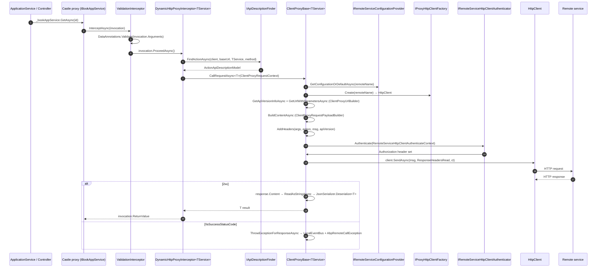

ABP's HTTP client proxies let one microservice call another by injecting the **interface** of the remote application service &mdash; no hand-written DTO mappers, no Refit. This page traces a call from `_bookAppService.GetAsync(id)` (resolved to a Castle proxy) through `DynamicHttpProxyInterceptor`, the API description finder, the URL/payload builders, the auth pipeline, and back to the deserialised result. All code lives under `framework/src/Volo.Abp.Http.Client/Volo/Abp/Http/Client/`.

<Info>
Two flavours of proxy exist: **dynamic** (the focus of this page &mdash; one round-trip per call to read API metadata from `/api/abp/api-definition`) and **static** (uses a `generate-proxy.json` virtual file generated by `abp generate-proxy` at build time). Both share the same `ClientProxyBase`/HTTP/auth chain &mdash; only the way the `ActionApiDescriptionModel` is resolved differs.
</Info>

## Components

| Type | File | Role |
|------|------|------|
| `AddHttpClientProxies` / `AddHttpClientProxy` | `Microsoft/Extensions/DependencyInjection/ServiceCollectionHttpClientProxyExtensions.cs` | DI helpers. Register a Castle `ProxyGenerator.CreateInterfaceProxyWithoutTarget` for each interface implementing `IRemoteService`. |
| `DynamicHttpProxyInterceptor<TService>` | `DynamicProxying/DynamicHttpProxyInterceptor.cs` | The Castle interceptor. Resolves an `ActionApiDescriptionModel` per call. |
| `DynamicHttpProxyInterceptorClientProxy<TService>` | `DynamicProxying/DynamicHttpProxyInterceptorClientProxy.cs` | Thin descendant of `ClientProxyBase<TService>` exposing `CallRequestAsync`. |
| `ClientProxyBase<TService>` | `ClientProxying/ClientProxyBase.cs` | Heart of the proxy: builds the URL, body, headers; calls the authenticator; sends; deserialises. |
| `IClientProxyApiDescriptionFinder` / `ClientProxyApiDescriptionFinder` | `ClientProxying/ClientProxyApiDescriptionFinder.cs` | **Static** path's metadata: reads `generate-proxy.json` files from the virtual file system. |
| `IApiDescriptionFinder` | `Volo.Abp.Http.Client/.../IApiDescriptionFinder.cs` | **Dynamic** path: fetches `/api/abp/api-definition` from the remote service. |
| `ClientProxyUrlBuilder` | `ClientProxying/ClientProxyUrlBuilder.cs` | Builds path + query string. |
| `ClientProxyRequestPayloadBuilder` | `ClientProxying/ClientProxyRequestPayloadBuilder.cs` | Builds JSON/form/stream body. |
| `IRemoteServiceHttpClientAuthenticator` | `Authentication/IRemoteServiceHttpClientAuthenticator.cs` | Adds `Authorization` header (and other auth state). |
| `IProxyHttpClientFactory` | `Volo.Abp.Http.Client/.../IProxyHttpClientFactory.cs` | Resolves `HttpClient` from `IHttpClientFactory` by remote-service name. |
| `IRemoteServiceConfigurationProvider` | `Volo.Abp.Http.Client/.../IRemoteServiceConfigurationProvider.cs` | Picks `BaseUrl`, `Version`, `Scope` for the configured `RemoteServiceName`. |

## Registration in DI

`AddHttpClientProxies(typeof(SomeModule).Assembly)` scans the assembly for interfaces matching `IsSuitableForClientProxying`:

```csharp
public static IServiceCollection AddHttpClientProxies(
    this IServiceCollection services,
    Assembly assembly,
    string remoteServiceConfigurationName = "Default",
    bool asDefaultServices = true,
    ApplicationServiceTypes applicationServiceTypes = ApplicationServiceTypes.All)
{
    var serviceTypes = assembly
        .GetTypes()
        .Where(x => IsSuitableForClientProxying(x, applicationServiceTypes))
        .ToArray();

    foreach (var serviceType in serviceTypes)
        services.AddHttpClientProxy(serviceType, remoteServiceConfigurationName, asDefaultServices);

    return services;
}
```

Per-type `AddHttpClientProxy`:

```csharp
AddHttpClientFactory(services, remoteServiceConfigurationName);

services.Configure<AbpHttpClientOptions>(options =>
{
    options.HttpClientProxies[type] = new HttpClientProxyConfig(type, remoteServiceConfigurationName);
});

var interceptorType = typeof(DynamicHttpProxyInterceptor<>).MakeGenericType(type);
services.AddTransient(interceptorType);

var interceptorAdapterType = typeof(AbpAsyncDeterminationInterceptor<>).MakeGenericType(interceptorType);
var validationInterceptorAdapterType =
    typeof(AbpAsyncDeterminationInterceptor<>).MakeGenericType(typeof(ValidationInterceptor));

if (asDefaultService)
{
    services.AddTransient(type, serviceProvider => ProxyGeneratorInstance
        .CreateInterfaceProxyWithoutTarget(
            type,
            (IInterceptor)serviceProvider.GetRequiredService(validationInterceptorAdapterType),
            (IInterceptor)serviceProvider.GetRequiredService(interceptorAdapterType)
        ));
}
```

Three things to notice:

| Detail | Effect |
|--------|--------|
| `HttpClientProxies[type] = new HttpClientProxyConfig(...)` | Maps `IBookAppService` &rarr; remote-service config name (`"Default"` / `"AbpAccountPublic"` / etc.). |
| `CreateInterfaceProxyWithoutTarget` | Castle generates a class implementing the interface with **no backing object** &mdash; every method call goes straight to interceptors. |
| Two interceptors registered | `ValidationInterceptor` runs *before* `DynamicHttpProxyInterceptor<TService>`, so DataAnnotations validation happens client-side before the network call. |

`AddHttpClientFactory` also registers a named `HttpClient` with `services.AddHttpClient(remoteServiceConfigurationName, ...)`; this is what `IProxyHttpClientFactory` later resolves.

## Sequence diagram



## DynamicHttpProxyInterceptor in full

```csharp
public class DynamicHttpProxyInterceptor<TService> : AbpInterceptor, ITransientDependency
{
    public override async Task InterceptAsync(IAbpMethodInvocation invocation)
    {
        var context = new ClientProxyRequestContext(
            await GetActionApiDescriptionModel(invocation),
            invocation.ArgumentsDictionary,
            typeof(TService));

        if (invocation.Method.ReturnType.GenericTypeArguments.IsNullOrEmpty())
        {
            await InterceptorClientProxy.CallRequestAsync(context);
        }
        else
        {
            var returnType = invocation.Method.ReturnType.GenericTypeArguments[0];
            var result = (Task)CallRequestAsyncMethod
                .MakeGenericMethod(returnType)
                .Invoke(this, new object[] { context })!;

            invocation.ReturnValue = await GetResultAsync(result, returnType);
        }
    }

    protected virtual async Task<ActionApiDescriptionModel> GetActionApiDescriptionModel(IAbpMethodInvocation invocation)
    {
        var clientConfig = ClientOptions.HttpClientProxies.GetOrDefault(typeof(TService)) ??
                           throw new AbpException($"Could not get DynamicHttpClientProxyConfig for {typeof(TService).FullName}.");
        var remoteServiceConfig = await RemoteServiceConfigurationProvider.GetConfigurationOrDefaultAsync(clientConfig.RemoteServiceName);
        var client = HttpClientFactory.Create(clientConfig.RemoteServiceName);

        return await ApiDescriptionFinder.FindActionAsync(
            client,
            remoteServiceConfig.BaseUrl,
            typeof(TService),
            invocation.Method
        );
    }
}
```

| Step | Effect |
|------|--------|
| `ClientOptions.HttpClientProxies.GetOrDefault(TService)` | Locates the per-interface remote-service binding registered by `AddHttpClientProxy`. |
| `IApiDescriptionFinder.FindActionAsync` | Fetches `/api/abp/api-definition` (caches by base URL) and looks up `TService` + method overload to produce an `ActionApiDescriptionModel`. The model carries the HTTP verb, route template, supported versions, and parameter binding sources. |
| `CallRequestAsync` (sync/async chosen via reflection) | Hands off to `ClientProxyBase<TService>.RequestAsync<T>`. |

The reflection trick (`CallRequestAsyncMethod.MakeGenericMethod(returnType)`) is what lets a single interceptor handle every `Task<T>` shape.

### Static-proxy variant

For the **static** path (build-time generated proxies), `ClientProxyBase<TService>.BuildHttpProxyClientProxyContext` is the equivalent of `GetActionApiDescriptionModel`. It uses `IClientProxyApiDescriptionFinder` to look up the action by a stable key:

```csharp
var methodUniqueName = $"{typeof(TService).FullName}.{methodName}.{string.Join("-", arguments.Values.Select(...))}";
var action = ClientProxyApiDescriptionFinder.FindAction(methodUniqueName);
if (action == null)
    throw new AbpException($"The API description of the {typeof(TService).FullName}.{methodName} method was not found!");
```

`ClientProxyApiDescriptionFinder.Initialize` enumerates every `generate-proxy.json` file via the **virtual file system** &mdash; that is how a build-time `abp generate-proxy` ends up at runtime without a network round-trip.

## ClientProxyBase.RequestAsync &mdash; the HTTP call

The shared work happens in `ClientProxyBase<TService>.RequestAsync(ClientProxyRequestContext)`:

```csharp
var clientConfig = ClientOptions.Value.HttpClientProxies.GetOrDefault(requestContext.ServiceType)
                   ?? throw new AbpException(...);
var remoteServiceConfig = await RemoteServiceConfigurationProvider.GetConfigurationOrDefaultAsync(clientConfig.RemoteServiceName);
var client = HttpClientFactory.Create(clientConfig.RemoteServiceName);

var apiVersion = await GetApiVersionInfoAsync(requestContext);
var url = remoteServiceConfig.BaseUrl.EnsureEndsWith('/')
          + await GetUrlWithParametersAsync(requestContext, apiVersion);

var requestMessage = new HttpRequestMessage(requestContext.Action.GetHttpMethod(), url)
{
    Content = await ClientProxyRequestPayloadBuilder.BuildContentAsync(
        requestContext.Action, requestContext.Arguments, JsonSerializer, apiVersion)
};

AddHeaders(requestContext.Arguments, requestContext.Action, requestMessage, apiVersion);

if (requestContext.Action.AllowAnonymous != true)
{
    await ClientAuthenticator.Authenticate(
        new RemoteServiceHttpClientAuthenticateContext(
            client, requestMessage, remoteServiceConfig, clientConfig.RemoteServiceName));
}

HttpResponseMessage response;
try
{
    foreach (var preSendAction in ClientOptions.Value.ProxyHttpClientPreSendActions
        .Where(x => x.Key == clientConfig.RemoteServiceName).SelectMany(x => x.Value))
    {
        preSendAction(clientConfig, requestContext, client);
    }

    response = await client.SendAsync(
        requestMessage,
        HttpCompletionOption.ResponseHeadersRead,
        GetCancellationToken(requestContext.Arguments));
}
catch (Exception ex)
{
    throw new AbpRemoteCallException($"An error occurred during the ABP remote HTTP request. ({ex.Message}) ...", ex);
}

if (!response.IsSuccessStatusCode)
    await ThrowExceptionForResponseAsync(response);

return response.Content;
```

Step-by-step:

| # | Action | File |
|---|--------|------|
| 1 | Resolve `HttpClientProxyConfig` for `TService`. | `ClientProxyBase` |
| 2 | Resolve `RemoteServiceConfiguration` (`BaseUrl`, `Version`, `Scope`) from `IRemoteServiceConfigurationProvider`. | `IRemoteServiceConfigurationProvider.cs` |
| 3 | Get a named `HttpClient` from `IProxyHttpClientFactory.Create(remoteName)`. | `IProxyHttpClientFactory.cs` (factory delegates to `IHttpClientFactory.CreateClient(name)` registered in step "AddHttpClientFactory"). |
| 4 | Pick API version (`GetApiVersionInfoAsync`). | `ClientProxyBase` |
| 5 | Build URL via `ClientProxyUrlBuilder.GenerateUrlWithParametersAsync` (path tokens + query string). | `ClientProxyUrlBuilder.cs` |
| 6 | Build body via `ClientProxyRequestPayloadBuilder.BuildContentAsync` (JSON for `FromBody`, multipart for `IRemoteStreamContent`, form for `FromForm`). | `ClientProxyRequestPayloadBuilder.cs` |
| 7 | `AddHeaders` &mdash; copies any `[FromHeader]`-bound arguments. | `ClientProxyBase` |
| 8 | If `AllowAnonymous != true`, call `IRemoteServiceHttpClientAuthenticator.Authenticate` &mdash; adds `Authorization` header. | `IRemoteServiceHttpClientAuthenticator.cs` |
| 9 | Run user-supplied `ProxyHttpClientPreSendActions` for this remote name. | options bag |
| 10 | `client.SendAsync(...)` with `ResponseHeadersRead`. | Microsoft `HttpClient` |
| 11 | On non-success status, `ThrowExceptionForResponseAsync` raises `LocalEventBus.PublishAsync(new ClientProxyExceptionEventData(...))` then throws `AbpRemoteCallException`. | `ClientProxyBase` |

Then the calling overload turns the `HttpContent` into a typed result:

```csharp
protected virtual async Task<T> RequestAsync<T>(ClientProxyRequestContext requestContext)
{
    var responseContent = await RequestAsync(requestContext);

    if (typeof(T) == typeof(IRemoteStreamContent) || typeof(T) == typeof(RemoteStreamContent))
        return (T)(object)new RemoteStreamContent(
            await responseContent.ReadAsStreamAsync(),
            responseContent.Headers?.ContentDisposition?.FileNameStar ?? ...,
            responseContent.Headers?.ContentType?.ToString(),
            responseContent.Headers?.ContentLength);

    var stringContent = await responseContent.ReadAsStringAsync();
    if (typeof(T) == typeof(string)) return (T)(object)stringContent;
    if (stringContent.IsNullOrWhiteSpace()) return default!;

    return JsonSerializer.Deserialize<T>(stringContent);
}
```

| `T` shape | Branch |
|-----------|--------|
| `RemoteStreamContent` / `IRemoteStreamContent` | Hand the response stream straight through &mdash; do not buffer. |
| `string` | Raw body. |
| Empty body | `default!`. |
| Anything else | `IJsonSerializer.Deserialize<T>(body)`. |

## Authentication path

`IRemoteServiceHttpClientAuthenticator.Authenticate(context)` is provider-pluggable. The default behaviour in ABP solutions:

| Authenticator | Source |
|---------------|--------|
| `NullRemoteServiceHttpClientAuthenticator` | `framework/src/Volo.Abp.Http.Client/.../Authentication/NullRemoteServiceHttpClientAuthenticator.cs` &mdash; no-op for anonymous APIs. |
| `IdentityModelAuthenticationService` (in `Volo.Abp.Http.Client.IdentityModel`) | Fetches a token from OpenIddict / IdentityServer using the `ClientId/ClientSecret/Scope/UserName/Password` configured under the `RemoteServiceName`. Adds `Authorization: Bearer ...`. Caches tokens per remote name. |
| Custom | Replace via `[Dependency(ReplaceServices = true)]` to attach API keys, mTLS info, or downstream auth tokens read off `HttpContext`. |

The relevant context shape:

```csharp
new RemoteServiceHttpClientAuthenticateContext(
    client, requestMessage, remoteServiceConfig, clientConfig.RemoteServiceName)
```

`remoteServiceConfig` is the `RemoteServiceConfiguration` &mdash; the same object that supplied `BaseUrl`. Authenticators typically read `remoteServiceConfig.Identity?.ClientId`, `Scope`, etc.

## `LazyServiceProvider` and `[Dependency]`

`ClientProxyBase<TService>` uses `IAbpLazyServiceProvider` for every dependency:

```csharp
public IAbpLazyServiceProvider LazyServiceProvider { get; set; } = default!;

protected IClientProxyApiDescriptionFinder ClientProxyApiDescriptionFinder
    => LazyServiceProvider.LazyGetRequiredService<IClientProxyApiDescriptionFinder>();
protected ICancellationTokenProvider CancellationTokenProvider
    => LazyServiceProvider.LazyGetRequiredService<ICancellationTokenProvider>();
protected ICurrentTenant CurrentTenant
    => LazyServiceProvider.LazyGetRequiredService<ICurrentTenant>();
protected IRemoteServiceHttpClientAuthenticator ClientAuthenticator
    => LazyServiceProvider.LazyGetRequiredService<IRemoteServiceHttpClientAuthenticator>();
// ...
```

Each property triggers DI resolution only on first access, which keeps the proxy itself cheap to construct.

## Tenancy and correlation propagation

While `ClientProxyBase` does not handle these directly, the framework wires header builders via `AbpHttpClientBuilderOptions.ProxyClientActions` and `ProxyClientHandlerActions` (in `AddHttpClientFactory`). The default builders add:

| Header | Source | Read by remote |
|--------|--------|---------------|
| `Authorization` | `IRemoteServiceHttpClientAuthenticator` | `UseAuthentication()` |
| `__tenant` | `ICurrentTenant.Id` | `HeaderTenantResolveContributor` (see [Multi-tenant request](/flows/multi-tenant-request)) |
| `Accept-Language` | `CultureInfo.CurrentUICulture` | `AbpRequestLocalizationMiddleware` |
| `X-Correlation-Id` | `ICorrelationIdProvider` | `AbpCorrelationIdMiddleware` |
| `__abp.unwrap-result` | When the action expects ABP-style response wrappers | server-side wrapper filter |

These come from cross-cutting modules (`Volo.Abp.AspNetCore.Mvc.Client`, `Volo.Abp.MultiTenancy.HttpClient`, `Volo.Abp.Tracing`) that contribute through `PreConfigure<AbpHttpClientBuilderOptions>` &mdash; see [Module loading lifecycle](/flows/module-loading-lifecycle) for the Pre-phase.

## File-by-file table

| # | Phase | File | Method | Notes |
|---|-------|------|--------|-------|
| 1 | DI | `ServiceCollectionHttpClientProxyExtensions.cs` | `AddHttpClientProxies` | Loops every interface; calls `AddHttpClientProxy(type)`. |
| 2 | DI | same | `AddHttpClientProxy` | Registers `DynamicHttpProxyInterceptor<T>`, validation interceptor, Castle-generated interface proxy. |
| 3 | DI | same | `AddHttpClientFactory` | `services.AddHttpClient(remoteName, ...)`; runs `ProxyClientActions` to add default headers. |
| 4 | call | Castle proxy | `IBookAppService.GetAsync` &rarr; `Interceptor.InterceptAsync` | First interceptor: `ValidationInterceptor` (DataAnnotations). |
| 5 | call | `DynamicHttpProxyInterceptor.cs` | `InterceptAsync` | Builds `ClientProxyRequestContext`. |
| 6 | call | same | `GetActionApiDescriptionModel` | Talks to remote `/api/abp/api-definition` via `IApiDescriptionFinder`. |
| 7 | call | `DynamicHttpProxyInterceptorClientProxy.cs` | `CallRequestAsync<T>(context)` | Forwards to `ClientProxyBase<TService>.RequestAsync<T>`. |
| 8 | call | `ClientProxyBase.cs` | `RequestAsync` | Builds URL/body, runs authenticator, sends. |
| 9 | call | `ClientProxyUrlBuilder.cs` | `GenerateUrlWithParametersAsync` | Substitutes `{id}`, appends query string. |
| 10 | call | `ClientProxyRequestPayloadBuilder.cs` | `BuildContentAsync` | JSON / multipart / form. |
| 11 | call | `IRemoteServiceHttpClientAuthenticator` impl | `Authenticate(ctx)` | Adds `Authorization` header. |
| 12 | call | `HttpClient` (Microsoft) | `SendAsync` | Network. |
| 13 | call | `ClientProxyBase.cs` | response handling | Throws `AbpRemoteCallException` on failure, deserialises on success. |
| 14 | call | `ClientProxyBase.cs` | `ThrowExceptionForResponseAsync` | Parses `WWW-Authenticate`; publishes `ClientProxyExceptionEventData` via `ILocalEventBus`. |

## Exception decoding

When the remote returns a non-2xx, `ThrowExceptionForResponseAsync` produces a structured error:

```csharp
var wwwAuthenticate = response.Headers.WwwAuthenticate.ToString() ?? string.Empty;
var errorMatch = Regex.Match(wwwAuthenticate, "error=\"([^\"]+)\"");
var errorDescriptionMatch = Regex.Match(wwwAuthenticate, "error_description=\"([^\"]+)\"");
var errorUriMatch = Regex.Match(wwwAuthenticate, "error_uri=\"([^\"]+)\"");
// ...
await LocalEventBus.PublishAsync(new ClientProxyExceptionEventData { ... });
```

`ClientProxyExceptionEventData` is broadcast via the local event bus so consumer code (e.g. UI redirection on 401) can react. The eventual exception is `AbpRemoteCallException`, which the calling application service will see propagating out of the proxy.

## Static vs dynamic at a glance

| Aspect | Dynamic | Static |
|--------|---------|--------|
| Metadata source | Remote `/api/abp/api-definition` JSON (cached). | Local `generate-proxy.json` files in the virtual file system. |
| Wireup | `AddHttpClientProxies(assembly)` | `AddStaticHttpClientProxies(assembly)` + `abp generate-proxy` at build time. |
| First-call latency | Pays for the metadata fetch on cold start. | Zero &mdash; metadata loaded in `ClientProxyApiDescriptionFinder.Initialize` at app start. |
| Behaviour when remote API changes | Picks up new shape automatically. | Requires re-running `abp generate-proxy`. |
| Interceptor | `DynamicHttpProxyInterceptor<T>` | `static-proxy partial class` calls `ClientProxyBase<T>.RequestAsync` directly. |

Both end up in the same `ClientProxyBase.RequestAsync` flow described above. See [MVC client proxies](/aspnetcore/mvc-client-proxies) for static-side details and [`abp generate-proxy`](/cli/generate-proxy) for the codegen tool.

## Customising

| Need | Knob |
|------|------|
| Add headers to every request | `PreConfigure<AbpHttpClientBuilderOptions>(o => o.ProxyClientActions.Add(...))` |
| Replace `HttpClientHandler` (mTLS, retries, Polly) | `PreConfigure<AbpHttpClientBuilderOptions>(o => o.ProxyClientHandlerActions.Add(...))` |
| Per-call mutation | `Configure<AbpHttpClientOptions>(o => o.ProxyHttpClientPreSendActions.Add(remoteName, ...))` |
| Bearer token from current user | Default authenticator does this when the host is configured to share credentials; otherwise replace `IRemoteServiceHttpClientAuthenticator`. |
| Skip authentication for one action | `[AllowAnonymous]` on the remote action &mdash; surfaces as `ActionApiDescriptionModel.AllowAnonymous == true`. |

## Related pages

- [HTTP client overview](/comm/http-client) for the wider configuration story.
- [Remote services](/comm/remote-services) for `RemoteServiceConfiguration` shape.
- [MVC client proxies](/aspnetcore/mvc-client-proxies) for the static path.
- [`abp generate-proxy`](/cli/generate-proxy) for the codegen tool.
- [Multi-tenant request](/flows/multi-tenant-request) for the `__tenant` header consumer side.
- [Authentication flow](/flows/authentication-flow) for what produces the bearer token the authenticator forwards.
- [Dynamic proxy and aspects](/core/dynamic-proxy-and-aspects) for how Castle proxies are wired in general.
