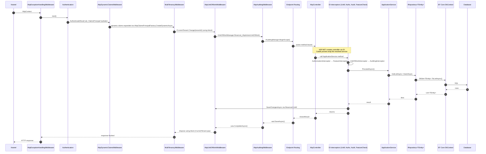

This page traces a single HTTP request through every ABP-flavoured pipeline stage &mdash; from Kestrel reading bytes to the JSON response being written. The flow stitches together middleware in `framework/src/Volo.Abp.AspNetCore`, controllers in `framework/src/Volo.Abp.AspNetCore.Mvc`, dynamic-proxy interceptors in `framework/src/Volo.Abp.Castle`, and persistence in `framework/src/Volo.Abp.EntityFrameworkCore`.

<Info>
The startup path that registered all the middleware is described in [Application startup](/flows/application-startup) and [Module lifecycle](/flows/module-loading-lifecycle). Tenant resolution detail is on the [Multi-tenant request](/flows/multi-tenant-request) page and authentication detail is on the [Authentication flow](/flows/authentication-flow) page.
</Info>

## The standard middleware order

Inside `AbpAspNetCoreModule.OnApplicationInitialization` (and the per-template `MyWebModule.OnApplicationInitialization` it cooperates with), `IApplicationBuilder` is wired up roughly in this order. The order matters &mdash; each row depends on state set by the previous one.

| # | Middleware | File / extension | Registered by |
|---|------------|------------------|---------------|
| 1 | Exception handling | `AbpExceptionHandlingMiddleware` &mdash; `Volo/Abp/AspNetCore/ExceptionHandling/` | `app.UseAbpExceptionHandling()` |
| 2 | Correlation ID | `AbpCorrelationIdMiddleware` &mdash; `Volo/Abp/AspNetCore/Tracing/` | `app.UseAbpRequestLocalization()` chain |
| 3 | Static files / routing | Microsoft built-in | `app.UseStaticFiles(); app.UseRouting()` |
| 4 | Request localization | `AbpRequestLocalizationMiddleware` &mdash; `Microsoft/AspNetCore/RequestLocalization/` | `app.UseAbpRequestLocalization()` |
| 5 | Time zone | `AbpTimeZoneMiddleware` &mdash; `Microsoft/AspNetCore/Timing/` | `app.UseAbpRequestLocalization()` |
| 6 | Authentication | `app.UseAuthentication()` (ASP.NET Core) | host code |
| 7 | Dynamic claims | `AbpDynamicClaimsMiddleware` &mdash; `Volo/Abp/AspNetCore/Security/Claims/` | `app.UseDynamicClaims()` (configures `IAuthenticateResultFeature`) |
| 8 | Multi-tenancy | `MultiTenancyMiddleware` &mdash; `Volo.Abp.AspNetCore.MultiTenancy/Volo/Abp/AspNetCore/MultiTenancy/` | `app.UseMultiTenancy()` |
| 9 | Authorization | `app.UseAuthorization()` (ASP.NET Core) | host code |
| 10 | Unit of work | `AbpUnitOfWorkMiddleware` &mdash; `Volo/Abp/AspNetCore/Uow/` | `app.UseUnitOfWork()` |
| 11 | Auditing | `AbpAuditingMiddleware` &mdash; `Volo/Abp/AspNetCore/Auditing/` | `app.UseAuditing()` |
| 12 | Security headers | `AbpSecurityHeadersMiddleware` &mdash; `Volo/Abp/AspNetCore/Security/` | `app.UseAbpSecurityHeaders()` |
| 13 | Endpoints | Routing/endpoint dispatch | `app.MapControllers()` etc. |

## End-to-end sequence diagram



## Phase-by-phase walk

### 1. Exception handling boundary

`AbpExceptionHandlingMiddleware` (`Volo/Abp/AspNetCore/ExceptionHandling/AbpExceptionHandlingMiddleware.cs`) wraps the entire pipeline. On any unhandled exception it:

- calls `IExceptionToErrorInfoConverter` to translate to `RemoteServiceErrorInfo`,
- writes a JSON `RemoteServiceErrorResponse` body when the request expects JSON,
- raises `AbpExceptionHandled` so subscribers (e.g. audit) can react.

This must be first so it can catch faults from every later middleware.

### 2. Correlation, localization, time zone

Three small middlewares set ambient request state:

| Middleware | Sets | Read by |
|------------|------|---------|
| `AbpCorrelationIdMiddleware` | `ICorrelationIdProvider` (`X-Correlation-Id` header) | every log scope, every published distributed event |
| `AbpRequestLocalizationMiddleware` | `CultureInfo.CurrentCulture` from cookie/header/setting | localizers, `IStringLocalizer<>` |
| `AbpTimeZoneMiddleware` | `CurrentTimezoneProvider.TimeZone` | `IClock` when normalising entity timestamps |

### 3. Authentication and dynamic claims

`app.UseAuthentication()` runs the configured scheme (typically `AbpJwtBearer` &mdash; see [Authentication flow](/flows/authentication-flow)). If it succeeds it populates `HttpContext.User`.

`AbpDynamicClaimsMiddleware.InvokeAsync` then *replaces* that principal if `AbpClaimsPrincipalFactoryOptions.IsDynamicClaimsEnabled`:

```csharp
var abpClaimsPrincipalFactory = context.RequestServices
    .GetRequiredService<IAbpClaimsPrincipalFactory>();
var user = await abpClaimsPrincipalFactory.CreateDynamicAsync(context.User);

authenticateResultFeature.AuthenticateResult = AuthenticateResult.Success(
    new AuthenticationTicket(user, ..., authenticationType));
```

This is what surfaces freshly-revoked permissions or just-flipped feature flags without forcing a logout.

### 4. Multi-tenancy

`MultiTenancyMiddleware.InvokeAsync` (`framework/src/Volo.Abp.AspNetCore.MultiTenancy/Volo/Abp/AspNetCore/MultiTenancy/MultiTenancyMiddleware.cs`):

```csharp
var tenant = await _tenantConfigurationProvider.GetAsync(saveResolveResult: true);
...
using (_currentTenant.Change(tenant?.Id, tenant?.Name))
{
    ...
    await next(context);
}
```

See [Multi-tenant request](/flows/multi-tenant-request) for the full resolver chain and connection-string resolution.

### 5. The reserved Unit of Work

`AbpUnitOfWorkMiddleware` reserves a UoW for the request *without* opening a transaction yet:

```csharp
using (var uow = _unitOfWorkManager.Reserve(UnitOfWork.UnitOfWorkReservationName))
{
    await next(context);
    await uow.CompleteAsync(_cancellationTokenProvider.Token);
}
```

`UnitOfWork.UnitOfWorkReservationName == "_AbpActionUnitOfWork"`. The interceptor on the application service later calls `TryBeginReserved("_AbpActionUnitOfWork", options)` to take ownership of this reservation rather than create a nested one. See [Unit of work flow](/flows/unit-of-work-flow) for the deep dive.

The middleware also short-circuits for Blazor server components (`RootComponentMetadata` endpoints) and for URLs configured in `AbpAspNetCoreUnitOfWorkOptions.IgnoredUrls`.

### 6. Auditing

`AbpAuditingMiddleware` opens an `IAuditingManager` scope around `next(context)`:

```csharp
using (var saveHandle = _auditingManager.BeginScope())
{
    try { await next(context); }
    catch (Exception ex) { ... }
    finally
    {
        if (await ShouldWriteAuditLogAsync(...))
        {
            if (UnitOfWorkManager.Current != null)
                await UnitOfWorkManager.Current.SaveChangesAsync();
            await saveHandle.SaveAsync();
        }
    }
}
```

Note the explicit `UnitOfWorkManager.Current.SaveChangesAsync()` before `saveHandle.SaveAsync()` &mdash; the audit log row is committed in the same UoW as the business changes.

### 7. Routing and the controller

ASP.NET Core picks an endpoint, instantiates the controller (`AbpController` &mdash; see `Volo/Abp/AspNetCore/Mvc/AbpController.cs`) through DI, and binds the model. `AbpController` exposes lazy services via `IAbpLazyServiceProvider`:

```csharp
public abstract class AbpController : Controller, IAvoidDuplicateCrossCuttingConcerns
{
    public IAbpLazyServiceProvider LazyServiceProvider { get; set; } = default!;

    protected IUnitOfWorkManager UnitOfWorkManager
        => LazyServiceProvider.LazyGetRequiredService<IUnitOfWorkManager>();
    protected ICurrentUser CurrentUser
        => LazyServiceProvider.LazyGetRequiredService<ICurrentUser>();
    protected ICurrentTenant CurrentTenant
        => LazyServiceProvider.LazyGetRequiredService<ICurrentTenant>();
    protected IAuthorizationService AuthorizationService
        => LazyServiceProvider.LazyGetRequiredService<IAuthorizationService>();
    // ...
}
```

Controllers that are *auto-generated from application services* (via `AbpConventionalControllerFeatureProvider` &mdash; see `Volo/Abp/AspNetCore/Mvc/Conventions/`) delegate straight to the underlying `IApplicationService` resolved from DI &mdash; meaning the interceptor stack below runs even when the user calls an HTTP endpoint that has no hand-written controller.

### 8. Interceptor stack

Application services are registered through `AbpApplicationServiceConventionalRegistrar`. When resolved, Castle's `ProxyGenerator` wraps the instance with the registered `AbpInterceptor`s (see `framework/src/Volo.Abp.Castle/`). The standard order, observed in `AbpCoreModule` and friends:

| Order | Interceptor | File | Responsibility |
|-------|-------------|------|----------------|
| 1 | `AuthorizationInterceptor` | `Volo.Abp.Authorization/Volo/Abp/Authorization/AuthorizationInterceptor.cs` | Honours `[Authorize]` and `IAuthorizationService.CheckAsync` on app service methods. |
| 2 | `GlobalFeatureInterceptor` | `Volo.Abp.GlobalFeatures/...` | Enforces compile-time global feature flags. |
| 3 | `FeatureInterceptor` | `Volo.Abp.Features/...` | Honours `[RequiresFeature]` &mdash; throws `AbpAuthorizationException` if missing. |
| 4 | `UnitOfWorkInterceptor` | `Volo.Abp.Uow/Volo/Abp/Uow/UnitOfWorkInterceptor.cs` | Begins (or joins reserved) UoW per the `[UnitOfWork]` attribute or convention. |
| 5 | `AuditingInterceptor` | `Volo.Abp.Auditing/...` | Pushes a `AuditLogActionInfo` onto `IAuditingManager.Current.Log.Actions`. |
| 6 | `EntityChangeInterceptor` | `Volo.Abp.Data/...` (extension scenarios) | Captures entity-history side effects. |

Each interceptor follows the pattern:

```csharp
public override async Task InterceptAsync(IAbpMethodInvocation invocation)
{
    // pre-work
    try
    {
        await invocation.ProceedAsync();
    }
    finally
    {
        // post-work
    }
}
```

`invocation.ProceedAsync()` either calls the next interceptor or, if it is the last, the actual method on the underlying service instance.

### 9. Application service &rarr; repository &rarr; EF Core

Inside the service method, calls like `await _bookRepository.GetListAsync()` route through:

- `EfCoreRepository<TDbContext,TEntity,TKey>` (`framework/src/Volo.Abp.EntityFrameworkCore/Volo/Abp/Domain/Repositories/EntityFrameworkCore/EfCoreRepository.cs`) &mdash;
- which resolves the `TDbContext` from `IDbContextProvider<TDbContext>` &mdash;
- which uses `IUnitOfWorkManager.Current` to grab/create the `EfCoreDatabaseApi` for the current UoW &mdash;
- whose `DbContext` instance is bound to the connection string returned by `MultiTenantConnectionStringResolver.ResolveAsync` (see [Multi-tenant request](/flows/multi-tenant-request)).

Every `DbSet<TEntity>` operation goes through EF Core's `ChangeTracker`, and `EfCoreDatabaseApi.SaveChangesAsync` is what the UoW eventually calls during `CompleteAsync`.

### 10. Response

Once the action method returns, the controller produces an `ObjectResult`. The MVC filter pipeline runs (`AbpControllerActionFilter`, `AbpExceptionFilter`, etc.) and writes the JSON body. Control unwinds back through the middleware:

1. `AbpAuditingMiddleware` writes the audit log if applicable.
2. `AbpUnitOfWorkMiddleware`'s `uow.CompleteAsync()` runs &mdash; this flushes any remaining changes and **publishes pending UoW events**, including outbox inserts (see [Distributed event publish](/flows/distributed-event-publish)).
3. `MultiTenancyMiddleware`'s using-block disposes &mdash; `ICurrentTenant` pops.
4. `AbpExceptionHandlingMiddleware` returns.

If any layer threw, the in-flight UoW is rolled back via `UnitOfWork.RollbackAsync` (because `CompleteAsync` was never reached), and the audit log row records the exception.

## Trace table: HTTP `POST /api/app/book` (sample)

A user calls `POST /api/app/book` with a JSON body to a generated controller backed by `BookAppService.CreateAsync(CreateBookDto)`:

| Stage | File / Method | Side effect |
|-------|---------------|-------------|
| Routing | `AbpAppServiceConvention` (`Conventions/AbpServiceConvention.cs`) | Maps `BookAppService` to `BookController` at startup. |
| Dispatch | ASP.NET Core endpoint middleware | Resolves `BookController` from DI; auto-controller wraps the proxied `IBookAppService`. |
| Auth (declarative) | `AbpAuthorizationFilter` | Reads `[Authorize]` and runs `IAuthorizationService.CheckAsync`. |
| Interceptor: `AuthorizationInterceptor` | `MethodInvocationAuthorizationService` | Reads method-level attributes. |
| Interceptor: `UnitOfWorkInterceptor` | `UnitOfWorkInterceptor.InterceptAsync` | `TryBeginReserved("_AbpActionUnitOfWork", options)` &mdash; joins reserved UoW. |
| Interceptor: `AuditingInterceptor` | adds action info | `AuditLogActionInfo { ServiceName, MethodName, Parameters }`. |
| Business logic | `BookAppService.CreateAsync` | `await _bookRepository.InsertAsync(new Book(...))`. |
| EF Core | `EfCoreRepository.InsertAsync` | Calls `DbContext.Set<Book>().Add(entity)`. |
| UoW completion | `UnitOfWorkInterceptor` finally branch | `unitOfWorkManager.Current!.SaveChangesAsync()` (because reservation path). |
| Result write | `ObjectResultExecutor` | Serializes returned `BookDto` to JSON. |
| Middleware unwind | `AbpUnitOfWorkMiddleware` | `uow.CompleteAsync(token)` &mdash; final flush + outbox insert + transaction commit. |

## Anatomy of `AbpUnitOfWorkMiddleware`

The middleware deliberately uses `Reserve` rather than `Begin`. The full source:

```csharp
public async override Task InvokeAsync(HttpContext context, RequestDelegate next)
{
    if (await ShouldSkipAsync(context, next) || IsIgnoredUrl(context))
    {
        await next(context);
        return;
    }

    using (var uow = _unitOfWorkManager.Reserve(UnitOfWork.UnitOfWorkReservationName))
    {
        await next(context);
        await uow.CompleteAsync(_cancellationTokenProvider.Token);
    }
}
```

`Reserve` creates a `UnitOfWork` with `IsReserved = true` and stores it in `AmbientUnitOfWork`. While reserved it does *not* yet have an `AbpUnitOfWorkOptions` &mdash; it cannot be used. When `UnitOfWorkInterceptor` later calls `TryBeginReserved("_AbpActionUnitOfWork", options)`, the reservation is activated with the correct transactional options derived from `[UnitOfWork]` / `IUnitOfWorkTransactionBehaviourProvider`.

This lets framework-level middleware (auditing, exception handling) participate in the *same* UoW as the business code without prematurely deciding whether the request should be transactional.

## Skipping the pipeline

| Mechanism | Effect |
|-----------|--------|
| `AbpAspNetCoreUnitOfWorkOptions.IgnoredUrls` | UoW middleware short-circuits. |
| `AbpAspNetCoreAuditingOptions.IgnoredUrls` | Auditing middleware short-circuits. |
| `[DisableAuditing]` on controller/method | `AbpAuditActionFilter` skips the action info but middleware still runs. |
| `[DisableAbpFeatures]` on controller | All interceptors skip the call (see `Volo.Abp.IAvoidDuplicateCrossCuttingConcerns`). |
| `app.Map("/health", ...)` | Microsoft branch &mdash; ABP middleware is not registered there unless you explicitly add it. |

<Tip>
The `IAvoidDuplicateCrossCuttingConcerns` interface tracks which interceptors *already ran* through `AppliedCrossCuttingConcerns`. When MVC filters and Castle interceptors both wrap the same method, this prevents double audits or double authorization.
</Tip>

## Related pages

- [Application startup](/flows/application-startup) for how the pipeline gets wired.
- [Unit of work flow](/flows/unit-of-work-flow) for the reserved-UoW handshake in detail.
- [Multi-tenant request](/flows/multi-tenant-request) for tenant resolution.
- [Authentication flow](/flows/authentication-flow) for the claims pipeline.
- [Distributed event publish](/flows/distributed-event-publish) for what `uow.CompleteAsync` triggers.
- [Volo.Abp.AspNetCore module reference](/aspnetcore/volo-abp-aspnetcore) for the middleware catalog.
- [MVC integration](/aspnetcore/mvc-integration) for the conventional controller story.
