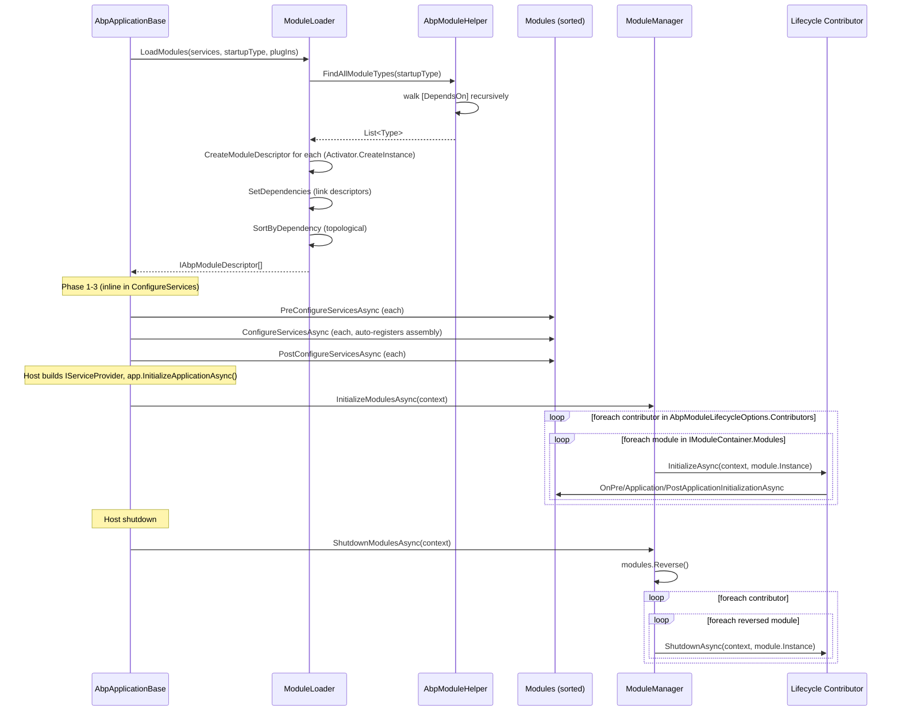
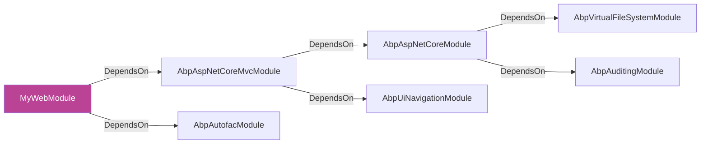

ABP's module system is the spine of every application. From the startup module the framework walks `[DependsOn(...)]` attributes recursively, materialises an `IAbpModuleDescriptor` per type, sorts the list so dependencies come first, and then runs six lifecycle hooks against the resolved list. This page traces the path from `ModuleLoader.LoadModules` to `OnApplicationShutdown` against the code in `framework/src/Volo.Abp.Core/Volo/Abp/Modularity/`.

<Info>
The companion page [Application startup](/flows/application-startup) shows where in the boot sequence each phase runs. This page focuses on *what happens inside* each phase, and in what order.
</Info>

## The six lifecycle hooks

ABP modules expose six logical phases, all defined as interfaces in `framework/src/Volo.Abp.Core/Volo/Abp/Modularity/`. The default `AbpModule` base class implements all of them with no-op virtual methods:

| Phase | Interface | When | Default contributor |
|-------|-----------|------|---------------------|
| 1 | `IPreConfigureServices` | Inside `AbpApplicationBase.ConfigureServices()` &mdash; before any module registers services. | (Inline in `ConfigureServices`) |
| 2 | `IAbpModule.ConfigureServices` | Inside `ConfigureServices()` after the assembly is auto-registered. | (Inline in `ConfigureServices`) |
| 3 | `IPostConfigureServices` | Inside `ConfigureServices()` after every module registered. | (Inline in `ConfigureServices`) |
| 4 | `IOnPreApplicationInitialization` | Inside `InitializeModulesAsync()`, container built. | `OnPreApplicationInitializationModuleLifecycleContributor` |
| 5 | `IOnApplicationInitialization` | Same scope, after every module's Pre. | `OnApplicationInitializationModuleLifecycleContributor` |
| 6 | `IOnPostApplicationInitialization` | Same scope, after every module's main Init. | `OnPostApplicationInitializationModuleLifecycleContributor` |
| 7 | `IOnApplicationShutdown` | On `ShutdownAsync()`, modules iterated in reverse. | `OnApplicationShutdownModuleLifecycleContributor` |

Phases 1-3 are driven inline by `AbpApplicationBase.ConfigureServicesAsync`. Phases 4-7 are driven by `ModuleManager`, which iterates a list of `IModuleLifecycleContributor` instances registered through `AbpModuleLifecycleOptions`.

## End-to-end sequence diagram



## Phase-by-phase trace

Every row references concrete code under `framework/src/Volo.Abp.Core/Volo/Abp/Modularity/` unless noted.

| # | File | Method | Side effect |
|---|------|--------|-------------|
| 1 | `AbpApplicationBase.cs` | `LoadModules` | Delegates to `IModuleLoader` resolved from the service collection's singleton instance. |
| 2 | `ModuleLoader.cs` | `LoadModules` | Calls `GetDescriptors` then `SortByDependency`. |
| 3 | `ModuleLoader.cs` | `FillModules` | Calls `AbpModuleHelper.FindAllModuleTypes(startupModuleType, logger)` to collect every reachable module. |
| 4 | `AbpModuleHelper.cs` | `FindAllModuleTypes` &rarr; `AddModuleAndDependenciesRecursively` | Depth-first walk over `[DependsOn]` attributes. Skips already-seen types. |
| 5 | `AbpModuleHelper.cs` | `FindDependedModuleTypes` | Pulls every `IDependedTypesProvider` (the interface behind `DependsOnAttribute`) off the type. |
| 6 | `ModuleLoader.cs` | `CreateModuleDescriptor` &rarr; `CreateAndRegisterModule` | `Activator.CreateInstance(moduleType)` and `services.AddSingleton(moduleType, module)`. |
| 7 | `AbpModuleDescriptor.cs` | `..ctor` | Captures `Type`, `Assembly`, `AllAssemblies` (via `AbpModuleHelper.GetAllAssemblies`, includes any `[AdditionalAssembly]`). |
| 8 | `ModuleLoader.cs` | `SetDependencies` | For each descriptor, calls `descriptor.AddDependency(other)` for every `FindDependedModuleTypes` hit. |
| 9 | `ModuleLoader.cs` | `SortByDependency` | `modules.SortByDependencies(m => m.Dependencies)` then `MoveItem(startupType, last)` so the startup module always runs last. |
| 10 | `AbpApplicationBase.cs` | `ConfigureServices(Async)` | Iterates the sorted list three times: pre, main, post. See [Application startup](/flows/application-startup#configureservices-sequence). |
| 11 | `AbpApplicationBase.cs` | inside `ConfigureServicesAsync` | `Services.AddAssembly(assembly)` runs every `IConventionalRegistrar` for each module's `AllAssemblies` (unless `SkipAutoServiceRegistration`). |
| 12 | `ModuleManager.cs` | `InitializeModulesAsync` | Outer loop over contributors, inner loop over modules. |
| 13 | `DefaultModuleLifecycleContributor.cs` | `OnPreApplicationInitializationModuleLifecycleContributor.InitializeAsync` | Casts `module` to `IOnPreApplicationInitialization` and awaits `OnPreApplicationInitializationAsync(context)`. |
| 14 | `DefaultModuleLifecycleContributor.cs` | `OnApplicationInitializationModuleLifecycleContributor.InitializeAsync` | Same pattern for `IOnApplicationInitialization`. |
| 15 | `DefaultModuleLifecycleContributor.cs` | `OnPostApplicationInitializationModuleLifecycleContributor.InitializeAsync` | Same pattern for `IOnPostApplicationInitialization`. |
| 16 | `ModuleManager.cs` | `ShutdownModulesAsync` | `modules.Reverse().ToList()`, then iterates contributors. |
| 17 | `DefaultModuleLifecycleContributor.cs` | `OnApplicationShutdownModuleLifecycleContributor.ShutdownAsync` | Casts to `IOnApplicationShutdown`. |

## DependsOn discovery in depth

`DependsOnAttribute` (in `Modularity/DependsOnAttribute.cs`) implements `IDependedTypesProvider` &mdash; an interface, not a sealed attribute. That indirection means any custom attribute can declare module dependencies. `AbpModuleHelper.FindDependedModuleTypes`:

```csharp
public static List<Type> FindDependedModuleTypes(Type moduleType)
{
    AbpModule.CheckAbpModuleType(moduleType);

    var dependencies = new List<Type>();

    var dependencyDescriptors = moduleType
        .GetCustomAttributes()
        .OfType<IDependedTypesProvider>();

    foreach (var descriptor in dependencyDescriptors)
        foreach (var dependedModuleType in descriptor.GetDependedTypes())
            dependencies.AddIfNotContains(dependedModuleType);

    return dependencies;
}
```

`AbpModule.CheckAbpModuleType` asserts the type is a non-abstract, non-generic class that implements `IAbpModule`; otherwise it throws `ArgumentException`.



`AddModuleAndDependenciesRecursively` performs a depth-first walk and emits debug logs through `IInitLogger` so the resolved set is visible in startup logs even before the real logger is wired up.

## Sort order: who runs first?

After every descriptor is created, `ModuleLoader.SortByDependency`:

```csharp
protected virtual List<IAbpModuleDescriptor> SortByDependency(
    List<IAbpModuleDescriptor> modules,
    Type startupModuleType)
{
    var sortedModules = modules.SortByDependencies(m => m.Dependencies);
    sortedModules.MoveItem(m => m.Type == startupModuleType, modules.Count - 1);
    return sortedModules;
}
```

| Rule | Effect |
|------|--------|
| `SortByDependencies` | Topological sort: every module appears after the modules it depends on. |
| `MoveItem(startup, last)` | Pins the startup module to the last position so any "override everything" code runs after the framework. |

The contributors then loop in the order they were registered (`AbpModuleLifecycleOptions.Contributors`), and the inner loop iterates this sorted list. This guarantees that, e.g., `AbpAutofacModule.OnApplicationInitialization` executes before `MyWebModule.OnApplicationInitialization`.

<Warning>
Cycles throw inside `SortByDependencies` (in `Volo.Abp.Collections`). If you see an `AbpException` at startup mentioning `"Cyclic dependency detected"`, look for a `[DependsOn]` pair that points at each other.
</Warning>

## Plug-in sources

`AbpApplicationCreationOptions.PlugInSources` lets a host load extra modules at runtime that the startup module does not statically reference:

```csharp
options.PlugInSources.AddFolder("./plugins");          // FolderPlugInSource
options.PlugInSources.AddFiles("./MyPlugin.dll");      // FilePlugInSource
options.PlugInSources.AddTypes(typeof(MyPluginModule)); // TypePlugInSource
```

Inside `ModuleLoader.FillModules`:

```csharp
//Plugin modules
foreach (var moduleType in plugInSources.GetAllModules(logger))
{
    if (modules.Any(m => m.Type == moduleType))
        continue;

    modules.Add(CreateModuleDescriptor(services, moduleType, isLoadedAsPlugIn: true));
}
```

The descriptor records `IsLoadedAsPlugIn = true` so downstream code (auditing, exception reporting) can flag the source.

## `AbpModuleDescriptor` shape

The descriptor &mdash; constructed once and cached on `IModuleContainer.Modules` &mdash; is the runtime model every other subsystem consumes:

```csharp
public class AbpModuleDescriptor : IAbpModuleDescriptor
{
    public Type Type { get; }
    public Assembly Assembly { get; }
    public Assembly[] AllAssemblies { get; }       // via AbpModuleHelper.GetAllAssemblies
    public IAbpModule Instance { get; }            // singleton, also in DI
    public bool IsLoadedAsPlugIn { get; }
    public IReadOnlyList<IAbpModuleDescriptor> Dependencies { get; }
}
```

`AllAssemblies` is the union of `moduleType.Assembly` and every `IAdditionalModuleAssemblyProvider` attribute on the type &mdash; that is how `[AdditionalAssembly(typeof(SomeOtherType))]` pulls in companion assemblies for conventional registration.

## Lifecycle contributors: extensibility

You can add custom hooks by implementing `IModuleLifecycleContributor` and adding the type to `AbpModuleLifecycleOptions.Contributors`. The default list is registered by `InternalServiceCollectionExtensions.AddCoreAbpServices` (in `framework/src/Volo.Abp.Core/Volo/Abp/Internal/`), called from `AbpApplicationBase`'s constructor:

```csharp
Configure<AbpModuleLifecycleOptions>(options =>
{
    options.Contributors.Add<OnPreApplicationInitializationModuleLifecycleContributor>();
    options.Contributors.Add<OnApplicationInitializationModuleLifecycleContributor>();
    options.Contributors.Add<OnPostApplicationInitializationModuleLifecycleContributor>();
    options.Contributors.Add<OnApplicationShutdownModuleLifecycleContributor>();
});
```

`ModuleManager`'s constructor resolves each contributor type from DI:

```csharp
_lifecycleContributors = options.Value
    .Contributors
    .Select(serviceProvider.GetRequiredService)
    .Cast<IModuleLifecycleContributor>()
    .ToArray();
```

So custom contributors are first-class DI citizens.

## Error semantics

| Scenario | Exception | Source |
|----------|-----------|--------|
| Phase 1/2/3 throws | `AbpInitializationException("An error occurred during {phase} phase of the module {type}...")` | `AbpApplicationBase` wraps each phase. |
| Phase 4/5/6 throws | Same wording, includes the contributor's `FullName`. | `ModuleManager.InitializeModulesAsync`. |
| Phase 7 throws | `AbpShutdownException` (same shape) | `ModuleManager.ShutdownModulesAsync`. |
| `DependsOn` references unknown module | `AbpException("Could not find a depended module ...")` | `ModuleLoader.SetDependencies`. |
| Type registered as plug-in is not an `IAbpModule` | `ArgumentException("Given type is not an ABP module: ...")` | `AbpModule.CheckAbpModuleType`. |

## Practical patterns

<CardGroup cols={2}>
  <Card title="Register options early" icon="gear">
    Use `PreConfigureServices` when you need to seed a `TypeList<>` that downstream modules read inside their `ConfigureServices` (e.g. JSON converters, MVC conventions, settings contributors).
  </Card>
  <Card title="Cross-module fix-ups">
    Use `PostConfigureServices` to mutate options *after* every module has registered defaults &mdash; e.g. removing a built-in `IAuthorizationHandler` or rewriting Swagger settings.
  </Card>
  <Card title="Start workers post-init" icon="play">
    Implement `IOnPostApplicationInitialization` to start background workers that depend on every other module being ready (see [Background job execution](/flows/background-job-execution)).
  </Card>
  <Card title="Flush on shutdown" icon="stop">
    Implement `IOnApplicationShutdown` for connection cleanup; the reverse-order iteration guarantees you run *before* your dependencies do.
  </Card>
</CardGroup>

## A worked example: tracing `MyWebModule`

Suppose `MyWebModule` declares:

```csharp
[DependsOn(
    typeof(AbpAspNetCoreMvcModule),
    typeof(MyApplicationModule),
    typeof(MyEntityFrameworkCoreModule),
    typeof(AbpAutofacModule))]
public class MyWebModule : AbpModule { ... }
```

`AbpModuleHelper.FindAllModuleTypes(typeof(MyWebModule), logger)` returns (depth-first traversal, deduplicated):

1. `MyWebModule`
2. `AbpAspNetCoreMvcModule` → `AbpAspNetCoreModule` → `AbpAuditingModule`, `AbpSecurityModule`, ... (every transitive module)
3. `MyApplicationModule` → its own dependencies
4. `MyEntityFrameworkCoreModule` → `AbpEntityFrameworkCoreModule` → `AbpDataModule` → `AbpUnitOfWorkModule`
5. `AbpAutofacModule`

After `SortByDependency`, the order in `IModuleContainer.Modules` is:

```text
AbpCoreModule (and friends with no deps)
↓
AbpDataModule, AbpUnitOfWorkModule, AbpSecurityModule, AbpAuditingModule, ...
↓
AbpEntityFrameworkCoreModule, AbpAspNetCoreModule, ...
↓
AbpAspNetCoreMvcModule, MyApplicationModule, MyEntityFrameworkCoreModule
↓
AbpAutofacModule
↓
MyWebModule  ← moved to last by MoveItem
```

When `ConfigureServicesAsync` runs, every framework module configures its services *before* `MyWebModule` gets to override anything. When `InitializeModulesAsync` runs, the same order applies: `AbpAspNetCoreModule.OnApplicationInitialization` (which registers static files and routing) executes before `MyWebModule.OnApplicationInitialization` (which calls `app.UseRouting`, `app.UseAuthentication`, `app.MapControllers`, etc.).

On shutdown, the reverse order means `MyWebModule.OnApplicationShutdown` fires first &mdash; useful for flushing app-level queues that depend on the framework being still up.

## Skipping auto-registration

```csharp
public class MySpecialModule : AbpModule
{
    public MySpecialModule()
    {
        SkipAutoServiceRegistration = true;
    }
}
```

With `SkipAutoServiceRegistration = true`, `AbpApplicationBase.ConfigureServicesAsync` does **not** call `Services.AddAssembly(asm)` for the module's `AllAssemblies`. That means:

| Effect | Consequence |
|--------|-------------|
| No conventional registration | Your `ITransientDependency` / `IScopedDependency` / `ISingletonDependency` interfaces stop being honoured for this assembly. |
| You must register manually | Inside `ConfigureServices`, call `context.Services.Add*` for every service the module exposes. |

Use this when the module's types must be registered with different lifetimes than the default conventions provide, or when you need full manual control (e.g. tightly coupled test doubles).

## Related pages

- [Application startup](/flows/application-startup) for where in the boot sequence each phase runs.
- [Modularity system](/core/modularity-system) for a file-by-file reference of `Modularity/`.
- [Dependency injection](/core/dependency-injection) for what `AddAssembly` does inside phase 2.
- [Repository layout](/overview/repository-layout) to locate `Volo.Abp.Core` in the source tree.
- [HTTP request lifecycle](/flows/http-request-lifecycle) for what `OnApplicationInitialization` typically wires (middleware order, endpoint mapping).
