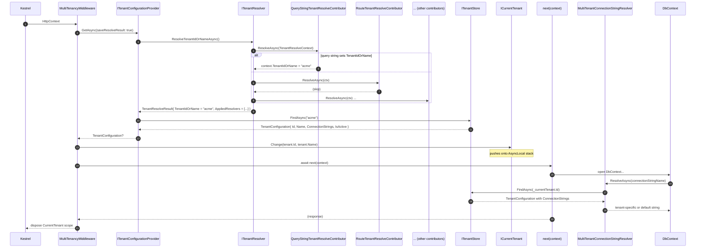

ABP's multi-tenancy story is plumbed through one middleware, one resolver, one ambient `ICurrentTenant`, and one connection-string resolver. This page traces an HTTP request from `MultiTenancyMiddleware.InvokeAsync` through the contributor chain in `ITenantResolver`, `ITenantConfigurationProvider`, `ICurrentTenant.Change`, and downstream into `MultiTenantConnectionStringResolver.ResolveAsync` so the UoW opens the **right** database connection.

<Info>
The wider HTTP pipeline is on [HTTP request lifecycle](/flows/http-request-lifecycle). Connection-string resolution is also covered in [Connection strings](/data/connection-strings).
</Info>

## Components

| Type | File | Role |
|------|------|------|
| `MultiTenancyMiddleware` | `framework/src/Volo.Abp.AspNetCore.MultiTenancy/Volo/Abp/AspNetCore/MultiTenancy/MultiTenancyMiddleware.cs` | Entry point in the HTTP pipeline. |
| `ITenantConfigurationProvider` / `TenantConfigurationProvider` | `framework/src/Volo.Abp.MultiTenancy/Volo/Abp/MultiTenancy/TenantConfigurationProvider.cs` | Orchestrates resolver + store lookup. |
| `ITenantResolver` / `TenantResolver` | `Volo/Abp/MultiTenancy/TenantResolver.cs` | Runs the ordered list of `ITenantResolveContributor`s. |
| Resolver contributors | `QueryStringTenantResolveContributor`, `RouteTenantResolveContributor`, `HeaderTenantResolveContributor`, `FormTenantResolveContributor`, `CookieTenantResolveContributor`, `DomainTenantResolveContributor`, `CurrentUserTenantResolveContributor`, `ActionTenantResolveContributor` | The first to set `context.TenantIdOrName` wins. |
| `ITenantStore` / `DefaultTenantStore` | `Volo/Abp/MultiTenancy/ConfigurationStore/DefaultTenantStore.cs` | Looks tenant rows up by id/name. |
| `ICurrentTenant` / `CurrentTenant` | `Volo/Abp/MultiTenancy/CurrentTenant.cs` | Ambient (`AsyncLocal`) accessor; `Change(tenantId, name)` returns a `IDisposable`. |
| `ITenantResolveResultAccessor` | `HttpContextTenantResolveResultAccessor.cs` | Stores which resolvers fired (for telemetry, cookie syncing). |
| `MultiTenantConnectionStringResolver` | `Volo/Abp/MultiTenancy/MultiTenantConnectionStringResolver.cs` | Overrides `DefaultConnectionStringResolver` &mdash; picks the right `ConnectionStrings` entry for the current tenant. |

## Sequence diagram



## Middleware in full

```csharp
public async override Task InvokeAsync(HttpContext context, RequestDelegate next)
{
    TenantConfiguration? tenant = null;
    try
    {
        tenant = await _tenantConfigurationProvider.GetAsync(saveResolveResult: true);
    }
    catch (Exception e)
    {
        Logger.LogException(e);
        if (await _options.MultiTenancyMiddlewareErrorPageBuilder(context, e))
            return;
    }

    if (tenant?.Id != _currentTenant.Id)
    {
        using (_currentTenant.Change(tenant?.Id, tenant?.Name))
        {
            if (_tenantResolveResultAccessor.Result != null &&
                _tenantResolveResultAccessor.Result.AppliedResolvers.Contains(QueryStringTenantResolveContributor.ContributorName))
            {
                AbpMultiTenancyCookieHelper.SetTenantCookie(context, _currentTenant.Id, _options.TenantKey);
            }

            // optional culture pick-up
            await next(context);
        }
    }
    else
    {
        await next(context);
    }
}
```

| Step | Effect |
|------|--------|
| `GetAsync(saveResolveResult: true)` | Runs the resolver chain *and* stashes `TenantResolveResult` in `ITenantResolveResultAccessor`. |
| `catch` block | If lookup throws (e.g. tenant not active), `AbpAspNetCoreMultiTenancyOptions.MultiTenancyMiddlewareErrorPageBuilder` may render a friendly page and short-circuit. |
| `tenant?.Id != _currentTenant.Id` | Avoids a pointless `Change` when the upstream layer already set the tenant (e.g. tests). |
| `_currentTenant.Change(...)` | Returns an `IDisposable`. The using-block guarantees the scope is restored even on exception. |
| Cookie sync | Only when the **query string** resolver fired &mdash; this is the "switch tenant via `?__tenant=foo`" UX path; subsequent requests carry the cookie. |
| `next(context)` | The rest of the pipeline runs with `ICurrentTenant.Id` set. |

`MultiTenancyMiddleware` also opportunistically sets `CultureInfo.CurrentCulture` from `ISettingProvider` when the request has no explicit culture &mdash; see the `TryGetRequestCultureAsync` helper for that side branch.

## Resolver chain order

`AbpTenantResolveOptions.TenantResolvers` is a `TypeList<ITenantResolveContributor>`. The default order, registered in `Volo.Abp.AspNetCore.MultiTenancy/AbpAspNetCoreMultiTenancyModule.cs`, is:

| # | Contributor | Source of tenant key |
|---|-------------|----------------------|
| 1 | `CurrentUserTenantResolveContributor` | `ClaimsPrincipal` &mdash; `tenantid` claim on the authenticated user. |
| 2 | `QueryStringTenantResolveContributor` | `?__tenant=...` query string parameter. |
| 3 | `FormTenantResolveContributor` | `__tenant` form field. |
| 4 | `HeaderTenantResolveContributor` | `__tenant` HTTP header. |
| 5 | `CookieTenantResolveContributor` | `__tenant` cookie. |
| 6 | `RouteTenantResolveContributor` | `{__tenant}` route token. |
| 7 | `DomainTenantResolveContributor` (when configured) | Subdomain pattern, e.g. `acme.app.com`. |
| 8 | `ActionTenantResolveContributor` | Manual `httpContext.Items["abp_tenant_id"]`. |

`TenantResolver.ResolveTenantIdOrNameAsync` iterates and breaks on the first contributor that calls `context.SetTenant(...)`:

```csharp
foreach (var tenantResolver in Options.TenantResolvers)
{
    await tenantResolver.ResolveAsync(context);
    result.AppliedResolvers.Add(tenantResolver.Name);

    if (context.HasResolvedTenantOrHost()) // tenant or explicit host
    {
        result.TenantIdOrName = context.TenantIdOrName;
        break;
    }
}

if (result.TenantIdOrName.IsNullOrEmpty() && !string.IsNullOrWhiteSpace(Options.FallbackTenant))
{
    result.TenantIdOrName = Options.FallbackTenant;
    result.AppliedResolvers.Add(TenantResolverNames.FallbackTenant);
}
```

`AppliedResolvers` records every contributor that ran, *including* ones that did not set a value. The middleware uses that list to decide whether to set the cookie.

<Warning>
If you place `MultiTenancyMiddleware` **before** `app.UseAuthentication()`, `CurrentUserTenantResolveContributor` cannot read the user. `AbpAspNetCoreMultiTenancyApplicationBuilderExtensions.UseMultiTenancy` logs a warning in that case &mdash; see the snippet from `AbpAspNetCoreMultiTenancyApplicationBuilderExtensions.cs`.
</Warning>

## TenantConfigurationProvider &mdash; lookup and validation

```csharp
public virtual async Task<TenantConfiguration?> GetAsync(bool saveResolveResult = false)
{
    var resolveResult = await TenantResolver.ResolveTenantIdOrNameAsync();

    if (saveResolveResult)
        TenantResolveResultAccessor.Result = resolveResult;

    TenantConfiguration? tenant = null;
    if (resolveResult.TenantIdOrName != null)
    {
        tenant = await FindTenantAsync(resolveResult.TenantIdOrName);

        if (tenant == null)
            throw new BusinessException(
                code: "Volo.AbpIo.MultiTenancy:010001",
                message: StringLocalizer["TenantNotFoundMessage"],
                details: StringLocalizer["TenantNotFoundDetails", resolveResult.TenantIdOrName]);

        if (!tenant.IsActive)
            throw new BusinessException(
                code: "Volo.AbpIo.MultiTenancy:010002",
                message: StringLocalizer["TenantNotActiveMessage"],
                details: StringLocalizer["TenantNotActiveDetails", resolveResult.TenantIdOrName]);
    }

    return tenant;
}
```

| Outcome | Effect |
|---------|--------|
| Resolver returned `null` | Returns `null` &mdash; "host" scope; `ICurrentTenant.Id` remains `null`. |
| Resolver returned a value but `FindAsync` fails | `BusinessException` `010001` &mdash; bubbles up to `MultiTenancyMiddlewareErrorPageBuilder`. |
| Tenant disabled | `BusinessException` `010002`. |
| Tenant found | `TenantConfiguration { Id, Name, ConnectionStrings }` returned. |

`FindTenantAsync` accepts both a GUID-shaped string (parses to a tenant id) and a name (normalised via `ITenantNormalizer`).

## ICurrentTenant.Change &mdash; the ambient stack

`CurrentTenant.Change` returns an `IDisposable` that pushes onto an `AsyncLocal<TenantInformation?>` stack and pops on dispose. This is what lets nested code temporarily switch tenants:

```csharp
using (_currentTenant.Change(tenantId, tenantName))
{
    // Code inside sees ICurrentTenant.Id == tenantId
    await next(context);
} // outer tenant restored
```

Patterns:

| Caller | Why it pushes a new tenant |
|--------|---------------------------|
| `MultiTenancyMiddleware` | The HTTP request is for that tenant. |
| `BackgroundJobExecuter` | Args implement `IMultiTenant`; see [Background job execution](/flows/background-job-execution). |
| `DistributedEventBusBase.ProcessFromInboxAsync` | Restore tenant on the consumer side. |
| Application code | `_currentTenant.Change(otherTenantId)` for explicit cross-tenant operations. |

## MultiTenantConnectionStringResolver &mdash; downstream of `Change`

The point of the whole flow is that any later database access must use the **right** connection. `MultiTenantConnectionStringResolver` (registered with `[Dependency(ReplaceServices = true)]` so it overrides the default) handles that:

```csharp
public override async Task<string> ResolveAsync(string? connectionStringName = null)
{
    if (_currentTenant.Id == null)
        return await base.ResolveAsync(connectionStringName); // host

    var tenant = await FindTenantConfigurationAsync(_currentTenant.Id.Value);

    if (tenant == null || tenant.ConnectionStrings.IsNullOrEmpty())
        return await base.ResolveAsync(connectionStringName);

    var tenantDefaultConnectionString = tenant.ConnectionStrings?.Default;

    if (connectionStringName == null || connectionStringName == ConnectionStrings.DefaultConnectionStringName)
        return !tenantDefaultConnectionString.IsNullOrWhiteSpace()
            ? tenantDefaultConnectionString!
            : Options.ConnectionStrings.Default!;

    // Requesting specific connection string...
    var connString = tenant.ConnectionStrings?.GetOrDefault(connectionStringName);
    if (!connString.IsNullOrWhiteSpace()) return connString!;

    // Fallback to the mapped database for the specific connection string
    var database = Options.Databases.GetMappedDatabaseOrNull(connectionStringName);
    if (database != null && database.IsUsedByTenants)
    {
        connString = tenant.ConnectionStrings?.GetOrDefault(database.DatabaseName);
        if (!connString.IsNullOrWhiteSpace()) return connString!;
    }

    if (!tenantDefaultConnectionString.IsNullOrWhiteSpace()) return tenantDefaultConnectionString!;

    return await base.ResolveAsync(connectionStringName);
}
```

| Lookup level | What is returned |
|--------------|------------------|
| Host (no tenant) | `Options.ConnectionStrings` &mdash; the global `appsettings.json` table. |
| Tenant has `ConnectionStrings[connectionStringName]` | That exact string. |
| Tenant has no specific entry, but the connection name maps to a **shared database** (`!IsUsedByTenants`) | Falls back to global. |
| Tenant has no specific entry, but the connection name maps to a **tenant database** (`IsUsedByTenants`) | Tenant's mapped-database string &rarr; tenant default &rarr; global default. |
| Tenant has only `Default` | Tenant's `Default`. |

This resolver is what `IConnectionStringResolver` (consumed by `EfCoreDatabaseApi` and friends) calls when the UoW opens its DbContext. The lookup happens **after** `CurrentTenant.Change` has set the ambient tenant, so each request's DbContext binds to the right database.

## File-by-file table

| # | Caller | File / Method | Side effect |
|---|--------|---------------|-------------|
| 1 | host | `app.UseMultiTenancy()` (in `AbpAspNetCoreMultiTenancyApplicationBuilderExtensions.cs`) | Registers `MultiTenancyMiddleware`. Logs warning if `app.UseAuthentication()` was not called first. |
| 2 | middleware | `TenantConfigurationProvider.GetAsync(true)` | Runs the resolver chain, validates, stashes result. |
| 3 | provider | `TenantResolver.ResolveTenantIdOrNameAsync` | Iterates `AbpTenantResolveOptions.TenantResolvers`. |
| 4 | provider | each `ITenantResolveContributor.ResolveAsync` | Sets `TenantResolveContext.TenantIdOrName` if it can. |
| 5 | provider | `TenantStore.FindAsync(tenantIdOrName)` | Loads `TenantConfiguration` from `IConfiguration` (default) or the tenant management module. |
| 6 | provider | throws `BusinessException` on miss or inactive | Middleware catches and may render an error page. |
| 7 | middleware | `_currentTenant.Change(tenant?.Id, tenant?.Name)` | Pushes ambient tenant on `AsyncLocal`. |
| 8 | middleware | `AbpMultiTenancyCookieHelper.SetTenantCookie` (when query-string resolver fired) | Persists the choice. |
| 9 | next | downstream UoW opens DbContext | Calls `IConnectionStringResolver.ResolveAsync`. |
| 10 | resolver | `MultiTenantConnectionStringResolver.ResolveAsync` | Returns tenant-specific or global string per the table above. |
| 11 | unwind | `Change(...).Dispose` | Restores previous tenant on `AsyncLocal`. |

## Edge cases

<AccordionGroup>
  <Accordion title="Host scope (no tenant resolved)">
    `ICurrentTenant.Id` stays `null`. `MultiTenantConnectionStringResolver` short-circuits to the base resolver, so the global `Default` connection is used. Application services can opt-in or opt-out of host-mode with `[RequiresGlobalFeature]`, `[Authorize(Policy="HostOnly")]`, or `MultiTenancySides.Host`.
  </Accordion>
  <Accordion title="Switching tenants mid-request">
    Wrap the affected code in `using (_currentTenant.Change(otherTenantId)) { ... }`. The DbContext you open inside that block will resolve `otherTenant`'s connection string. Make sure to open a new EF Core DbContext after the switch &mdash; an existing one is bound to whichever connection it was built with.
  </Accordion>
  <Accordion title="Background jobs">
    `BackgroundJobExecuter.GetJobArgsTenantId(jobArgs)` &mdash; if the job args implement `IMultiTenant`, the executer wraps the call in `CurrentTenant.Change(args.TenantId)`. See [Background job execution](/flows/background-job-execution).
  </Accordion>
  <Accordion title="Distributed events">
    Provider-specific consumer code (`RabbitMqDistributedEventBus.ProcessIncomingEventAsync` etc.) restores the tenant from the message header before dispatching. The outbox sender captures the producer's tenant.
  </Accordion>
  <Accordion title="Tenant deletion">
    `DefaultTenantStore` re-reads `IConfiguration` on every call; tenant-management modules implement caching with invalidation. After delete, in-flight `ICurrentTenant` scopes keep working &mdash; the connection lookup falls back to global on the next request.
  </Accordion>
</AccordionGroup>

## Related pages

- [Multi-tenancy overview](/multitenancy/overview) for the conceptual model.
- [Tenant resolution](/multitenancy/tenant-resolution) for contributor-by-contributor details.
- [Current tenant](/multitenancy/current-tenant) for the `ICurrentTenant` API surface.
- [Connection-string resolver](/multitenancy/connection-string-resolver) for the resolver itself.
- [HTTP request lifecycle](/flows/http-request-lifecycle) for the surrounding middleware order.
- [Connection strings](/data/connection-strings) for the host-side `AbpDbConnectionOptions` configuration.
