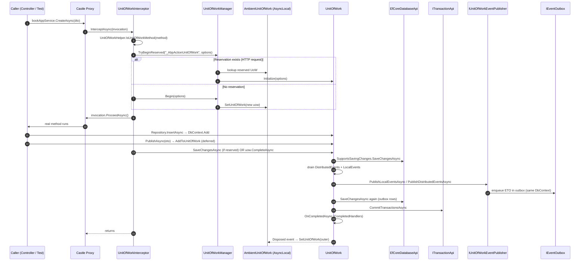
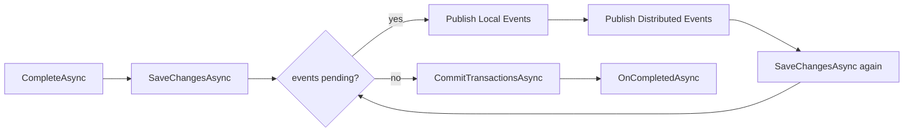

The `IUnitOfWork` abstraction is what gives ABP its "everything happens in a transaction unless you said otherwise" feel. This page traces a single business call from `[UnitOfWork]` through `UnitOfWorkInterceptor`, the `AmbientUnitOfWork` AsyncLocal, `SaveChangesAsync`, `CompleteAsync`, distributed event publishing, and final disposal. All code lives under `framework/src/Volo.Abp.Uow/Volo/Abp/Uow/`.

<Info>
For the broader request path that *uses* this UoW &mdash; including how `AbpUnitOfWorkMiddleware` reserves the UoW before the interceptor activates it &mdash; see [HTTP request lifecycle](/flows/http-request-lifecycle).
</Info>

## The objects in play

| Type | File | Role |
|------|------|------|
| `IUnitOfWork` | `IUnitOfWork.cs` | Public abstraction with `Id`, `SaveChangesAsync`, `CompleteAsync`, `RollbackAsync`, `AddOrReplaceDatabaseApi`, events. |
| `UnitOfWork` | `UnitOfWork.cs` | The default implementation; transient, holds `_databaseApis` and `_transactionApis`. |
| `IAmbientUnitOfWork` | `IAmbientUnitOfWork.cs` | Holds the *current* UoW for the async flow. |
| `AmbientUnitOfWork` | `AmbientUnitOfWork.cs` | Singleton wrapping `AsyncLocal<IUnitOfWork?>`. |
| `IUnitOfWorkManager` | `IUnitOfWorkManager.cs` | Public entry point: `Begin`, `Reserve`, `BeginReserved`, `TryBeginReserved`, `Current`. |
| `UnitOfWorkManager` | `UnitOfWorkManager.cs` | Singleton implementation; uses `IServiceScopeFactory` per UoW. |
| `UnitOfWorkAttribute` | `UnitOfWorkAttribute.cs` | Declarative knob (`IsTransactional`, `IsolationLevel`, `Timeout`, `IsDisabled`). |
| `UnitOfWorkInterceptor` | `UnitOfWorkInterceptor.cs` | The Castle interceptor that activates the UoW around a method invocation. |
| `ChildUnitOfWork` | `ChildUnitOfWork.cs` | Wrapper returned by `Begin` when an ambient UoW already exists. |

## Sequence diagram



## What `[UnitOfWork]` actually carries

The attribute is the user-facing knob:

```csharp
[AttributeUsage(AttributeTargets.Method | AttributeTargets.Class | AttributeTargets.Interface)]
public class UnitOfWorkAttribute : Attribute
{
    public bool? IsTransactional { get; set; }
    public int? Timeout { get; set; }
    public IsolationLevel? IsolationLevel { get; set; }
    public bool IsDisabled { get; set; }

    public virtual void SetOptions(AbpUnitOfWorkOptions options)
    {
        if (IsTransactional.HasValue) options.IsTransactional = IsTransactional.Value;
        if (Timeout.HasValue) options.Timeout = Timeout;
        if (IsolationLevel.HasValue) options.IsolationLevel = IsolationLevel;
    }
}
```

If you don't decorate, ABP still wraps the call: every `IApplicationService` method is considered a UoW unless `IsDisabled == true`. `UnitOfWorkHelper.IsUnitOfWorkMethod` returns `true` and yields the attribute (or null) for methods on services that implement `IUnitOfWorkEnabled` or where convention applies.

## The interceptor in full

```csharp
public override async Task InterceptAsync(IAbpMethodInvocation invocation)
{
    if (!UnitOfWorkHelper.IsUnitOfWorkMethod(invocation.Method, out var unitOfWorkAttribute))
    {
        await invocation.ProceedAsync();
        return;
    }

    using (var scope = _serviceScopeFactory.CreateScope())
    {
        var options = CreateOptions(scope.ServiceProvider, invocation, unitOfWorkAttribute);
        var unitOfWorkManager = scope.ServiceProvider.GetRequiredService<IUnitOfWorkManager>();

        if (unitOfWorkManager.TryBeginReserved(UnitOfWork.UnitOfWorkReservationName, options))
        {
            await invocation.ProceedAsync();
            if (unitOfWorkManager.Current != null)
                await unitOfWorkManager.Current.SaveChangesAsync();
            return;
        }

        using (var uow = unitOfWorkManager.Begin(options))
        {
            await invocation.ProceedAsync();
            await uow.CompleteAsync();
        }
    }
}
```

Two cases, both important:

| Case | Trigger | What runs at the end |
|------|---------|----------------------|
| Reserved | `AbpUnitOfWorkMiddleware` reserved `"_AbpActionUnitOfWork"` earlier. | `Current.SaveChangesAsync()` only &mdash; the **middleware** calls `CompleteAsync` once the request finishes. |
| Standalone | No reservation (background job, test, console). | `uow.CompleteAsync()` inside the same `using` block. |

The first case is what lets multiple application-service calls in a single request commit as **one** transaction.

### How options are computed

`CreateOptions` blends three sources: the attribute, `AbpUnitOfWorkDefaultOptions`, and `IUnitOfWorkTransactionBehaviourProvider`:

```csharp
private AbpUnitOfWorkOptions CreateOptions(IServiceProvider sp, IAbpMethodInvocation inv, UnitOfWorkAttribute? attr)
{
    var options = new AbpUnitOfWorkOptions();
    attr?.SetOptions(options);

    if (attr?.IsTransactional == null)
    {
        var defaultOptions = sp.GetRequiredService<IOptions<AbpUnitOfWorkDefaultOptions>>().Value;
        options.IsTransactional = defaultOptions.CalculateIsTransactional(
            autoValue: sp.GetRequiredService<IUnitOfWorkTransactionBehaviourProvider>().IsTransactional
                       ?? !inv.Method.Name.StartsWith("Get", StringComparison.InvariantCultureIgnoreCase)
        );
    }

    return options;
}
```

The implicit convention &mdash; methods starting with `Get` are non-transactional &mdash; comes from this fallback expression.

## `AmbientUnitOfWork`: where "Current" lives

```csharp
[ExposeServices(typeof(IAmbientUnitOfWork), typeof(IUnitOfWorkAccessor))]
public class AmbientUnitOfWork : IAmbientUnitOfWork, ISingletonDependency
{
    public IUnitOfWork? UnitOfWork => _currentUow.Value;
    private readonly AsyncLocal<IUnitOfWork?> _currentUow = new();

    public void SetUnitOfWork(IUnitOfWork? unitOfWork) => _currentUow.Value = unitOfWork;

    public IUnitOfWork? GetCurrentByChecking()
    {
        var uow = UnitOfWork;
        while (uow != null && (uow.IsReserved || uow.IsDisposed || uow.IsCompleted))
            uow = uow.Outer;
        return uow;
    }
}
```

`GetCurrentByChecking` is what `UnitOfWorkManager.Current` returns. It transparently *skips* reserved / disposed / completed UoWs by walking the `.Outer` chain &mdash; that is how `IUnitOfWorkManager.Current` stays consistent even mid-handshake.

## `UnitOfWorkManager.Begin` &mdash; nesting decision

```csharp
public IUnitOfWork Begin(AbpUnitOfWorkOptions options, bool requiresNew = false)
{
    var currentUow = Current;
    if (currentUow != null && !requiresNew)
        return new ChildUnitOfWork(currentUow);

    var unitOfWork = CreateNewUnitOfWork();
    unitOfWork.Initialize(options);
    return unitOfWork;
}
```

| Branch | Returned object | Effect of `Dispose` / `CompleteAsync` |
|--------|-----------------|---------------------------------------|
| Already in a UoW (and `!requiresNew`) | `ChildUnitOfWork` wrapping `currentUow`. | No-op on commit/rollback; outer UoW owns the transaction. |
| Top-level | Brand-new `UnitOfWork`. | Real commit/rollback; sets `IsCompleted`. |

The `ChildUnitOfWork` pattern means nested `[UnitOfWork]` annotations are safe and cheap.

## `CreateNewUnitOfWork` &mdash; per-UoW DI scope

```csharp
private IUnitOfWork CreateNewUnitOfWork()
{
    var scope = _serviceScopeFactory.CreateScope();
    var outerUow = _ambientUnitOfWork.UnitOfWork;
    var unitOfWork = scope.ServiceProvider.GetRequiredService<IUnitOfWork>();
    unitOfWork.SetOuter(outerUow);
    _ambientUnitOfWork.SetUnitOfWork(unitOfWork);

    unitOfWork.Disposed += (sender, args) =>
    {
        _ambientUnitOfWork.SetUnitOfWork(outerUow);
        scope.Dispose();
    };

    return unitOfWork;
}
```

Important details:

- Each UoW gets a **fresh DI scope**. Scoped services (`DbContext`, `IRepository<>`) bind to this scope.
- The previous UoW is captured as `outerUow` so the `Disposed` handler can restore it on the AsyncLocal.
- If `GetRequiredService<IUnitOfWork>()` throws the scope is disposed; that is the `catch { scope.Dispose(); throw; }` you can see in the source.

## `CompleteAsync` &mdash; the heart of the flow

`UnitOfWork.CompleteAsync` (in `UnitOfWork.cs`) does four things in order:

1. `SaveChangesAsync()` &mdash; each active `IDatabaseApi` that implements `ISupportsSavingChanges` flushes pending writes.
2. Drain pending event records:
   ```csharp
   LocalEvents.AddRange(GetEventsRecords(LocalEventWithPredicates));
   DistributedEvents.AddRange(GetEventsRecords(DistributedEventWithPredicates));
   ```
3. Loop while there are events: publish locals first (`PublishLocalEventsAsync`), then distributed (`PublishDistributedEventsAsync`), then `SaveChangesAsync()` again (handlers may have inserted more rows, including outbox rows). Repeat until both queues are empty.
4. `CommitTransactionsAsync` &mdash; commit all `ITransactionApi`s; `IsCompleted = true`; fire `OnCompletedAsync` (any `CompletedHandlers`).

A successful flow looks like:



`PublishDistributedEventsAsync` is the hook that routes events into the outbox when one is configured for the active `DbContext` &mdash; see [Distributed event publish](/flows/distributed-event-publish).

## Failure paths

| Failure | Effect |
|---------|--------|
| Exception inside `invocation.ProceedAsync()` | The `using` block disposes the UoW. `_isCompleting` is false, so `CompleteAsync` was never reached. Pending changes are abandoned. |
| Exception inside `SaveChangesAsync()` | Caught by `CompleteAsync`'s `try`; `_exception` recorded; re-thrown. `CommitTransactionsAsync` is not called. |
| Explicit `await uow.RollbackAsync()` | `_isRolledback = true`; `RollbackAllAsync` rolls back every `ITransactionApi`. Subsequent `SaveChangesAsync`/`CompleteAsync` no-op. |
| Exception inside a `CompletedHandlers` callback | Wrapped and re-thrown; the caller sees `CompleteAsync` fail *after* the transaction has been committed. |
| UoW disposed without `CompleteAsync` (background path) | `Dispose` fires the `Failed` event; cancels any open transactions through `ISupportsRollback`. |

The `Failed` and `Disposed` events both fire from `Dispose` so subscribers can clean up. The middleware does not subscribe &mdash; the framework relies on the outer `using` to do the right thing.

## Multiple `IDatabaseApi`s per UoW

`UnitOfWork` keeps `Dictionary<string, IDatabaseApi> _databaseApis`. EF Core's `EfCoreDatabaseApi` is the canonical implementation; MongoDB and Dapper modules add their own. `FindDatabaseApi(string key)` and `AddDatabaseApi(string key, IDatabaseApi)` let providers register on demand the first time the user touches a connection.

That means one logical UoW can span **multiple databases** &mdash; each gets its own `SaveChangesAsync`, and `CommitTransactionsAsync` either uses `System.Transactions.TransactionScope` (when configured) or commits per-API non-atomically.

## Reserved-UoW handshake (full trace)

For HTTP requests the dance is subtle:

| # | File / Method | What happens |
|---|---------------|--------------|
| 1 | `AbpUnitOfWorkMiddleware.InvokeAsync` | `_unitOfWorkManager.Reserve("_AbpActionUnitOfWork")` &mdash; new `UnitOfWork` with `IsReserved = true`, pushed onto AsyncLocal. |
| 2 | `Reserve` &rarr; `CreateNewUnitOfWork` &rarr; `unitOfWork.Reserve(reservationName)` | Sets `IsReserved=true`, no options yet. |
| 3 | Controller called &rarr; `UnitOfWorkInterceptor.InterceptAsync` | Computes options; `TryBeginReserved("_AbpActionUnitOfWork", options)`. |
| 4 | `UnitOfWorkManager.TryBeginReserved` | Walks the `.Outer` chain to find the reserved UoW; calls `uow.Initialize(options)`; returns `true`. |
| 5 | `UnitOfWork.Initialize` | Sets `IsReserved = false`, stores options, normalises them via `_defaultOptions.Normalize(...)`. |
| 6 | Interceptor calls `Current.SaveChangesAsync()` | Flushes EF Core changes only (no event publish, no commit). |
| 7 | Control returns to middleware | `await uow.CompleteAsync(token)` runs the full save/publish/commit dance. |

`UnitOfWork.UnitOfWorkReservationName == "_AbpActionUnitOfWork"` (constant in `UnitOfWork.cs`). The middleware uses *that* exact string &mdash; mismatched names mean two separate UoWs and no transactional sharing.

## Public API quick reference

| API | Use when |
|-----|----------|
| `[UnitOfWork]` | Declarative &mdash; lets the interceptor pick options. |
| `[UnitOfWork(isTransactional: true, IsolationLevel = ReadCommitted)]` | Fine-tune transaction semantics. |
| `[UnitOfWork(IsDisabled = true)]` | Tell the interceptor to skip wrapping. |
| `using var uow = _uowManager.Begin();` | Explicit UoW in code that is not behind a proxy (Blazor, background workers). |
| `using var uow = _uowManager.Begin(requiresNew: true);` | Force a fresh top-level UoW even if one is ambient (e.g. inbox processing &mdash; see `InboxProcessor.cs`). |
| `_uowManager.Current?.OnCompleted(async () => ...)` | Schedule work that should only run if the UoW commits. |
| `_uowManager.Current?.AddOrReplaceDistributedEvent(...)` | Defer event publication until commit (the path `IDistributedEventBus.PublishAsync` takes). |

<Warning>
`UnitOfWork` is registered as **transient**, but `UnitOfWorkManager`, `AmbientUnitOfWork`, and `IUnitOfWorkEventPublisher` are singletons. Treat `IUnitOfWork` as a per-scope object &mdash; never cache a reference across requests.
</Warning>

## Related pages

- [HTTP request lifecycle](/flows/http-request-lifecycle) for the reserved-UoW handshake.
- [Distributed event publish](/flows/distributed-event-publish) for what `PublishDistributedEventsAsync` does.
- [Volo.Abp.Data overview](/data/unit-of-work) for the full UoW reference.
- [Data filtering](/data/data-filtering) &mdash; soft-delete and tenant filters run inside the same UoW.
- [Dynamic proxy and aspects](/core/dynamic-proxy-and-aspects) for how `AbpInterceptor` is wired.
