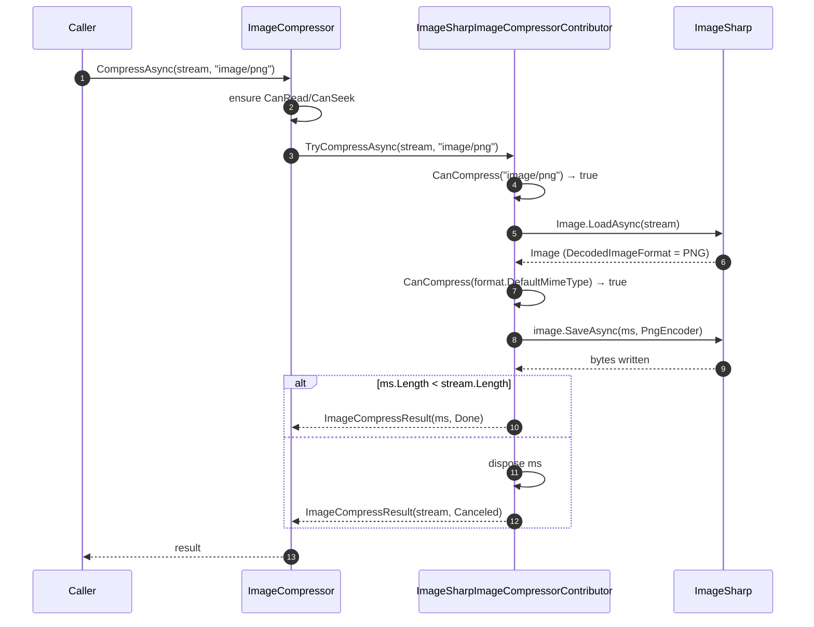

`Volo.Abp.Imaging.ImageSharp` is the pure-managed provider for ABP's imaging abstraction. It binds to [`SixLabors.ImageSharp`](https://github.com/SixLabors/ImageSharp), supplies **both** a resizer and a compressor, and covers the widest format matrix of any provider in the box. It's the recommended default unless you need either Magick.NET's format breadth (GIF, TIFF compression) or SkiaSharp's native speed.

See [`imaging/overview`](/imaging/overview) for how contributors plug into `IImageResizer` / `IImageCompressor`.

## Files in this package

| File | Role |
| --- | --- |
| `AbpImagingImageSharpModule.cs` | ABP module — empty body; depends on `AbpImagingAbstractionsModule`. Contributors auto-register via `ITransientDependency`. |
| `ImageSharpImageResizerContributor.cs` | `IImageResizerContributor` — decodes with `Image.LoadAsync`, calls `image.Mutate(x => x.Resize(...))`, re-encodes with the original format. |
| `ImageSharpImageCompressorContributor.cs` | `IImageCompressorContributor` — re-encodes with format-specific encoder options and **only returns** the result if it's smaller than the input. |
| `ImageSharpCompressOptions.cs` | Encoder configuration — `JpegEncoder`, `PngEncoder`, `WebpEncoder`, `DefaultQuality`. |

## Module

`framework/src/Volo.Abp.Imaging.ImageSharp/Volo/Abp/Imaging/AbpImagingImageSharpModule.cs`:

```csharp
[DependsOn(typeof(AbpImagingAbstractionsModule))]
public class AbpImagingImageSharpModule : AbpModule
{
}
```

No `ConfigureServices` override needed — both contributors are `ITransientDependency` and get picked up by the abstraction's `IEnumerable<IImageResizerContributor>` / `IEnumerable<IImageCompressorContributor>` injection.

To wire it up:

```csharp
[DependsOn(typeof(AbpImagingImageSharpModule))]
public class MyModule : AbpModule { }
```

## The resizer

`framework/src/Volo.Abp.Imaging.ImageSharp/Volo/Abp/Imaging/ImageSharpImageResizerContributor.cs`:

```csharp
public class ImageSharpImageResizerContributor : IImageResizerContributor, ITransientDependency
{
    public virtual async Task<ImageResizeResult<Stream>> TryResizeAsync(
        Stream stream, ImageResizeArgs resizeArgs,
        string? mimeType = null, CancellationToken cancellationToken = default)
    {
        if (!string.IsNullOrWhiteSpace(mimeType) && !CanResize(mimeType))
            return new ImageResizeResult<Stream>(stream, ImageProcessState.Unsupported);

        using var image = await Image.LoadAsync(stream, cancellationToken);

        if (!CanResize(image.Metadata.DecodedImageFormat!.DefaultMimeType))
            return new ImageResizeResult<Stream>(stream, ImageProcessState.Unsupported);

        if (ResizeModeMap.TryGetValue(resizeArgs.Mode, out var resizeMode))
        {
            image.Mutate(x => x.Resize(new ResizeOptions
            {
                Size = GetSize(resizeArgs),
                Mode = resizeMode
            }));
        }
        else
        {
            throw new NotSupportedException("Resize mode " + resizeArgs.Mode + "is not supported!");
        }

        var memoryStream = new MemoryStream();
        try
        {
            await image.SaveAsync(memoryStream, image.Metadata.DecodedImageFormat,
                cancellationToken: cancellationToken);
            memoryStream.Position = 0;
            return new ImageResizeResult<Stream>(memoryStream, ImageProcessState.Done);
        }
        catch
        {
            await memoryStream.DisposeAsync();
            throw;
        }
    }
}
```

Behavior worth noting:

- **MIME pre-check** (`CanResize(mimeType)`) skips work for files the contributor doesn't claim.
- **Format double-check** — even when a `mimeType` is supplied, the actually-decoded `Image.Metadata.DecodedImageFormat.DefaultMimeType` is re-validated. This protects against a mis-typed upload (e.g. a `.png` file actually containing JPEG bytes).
- **Format preservation** — the resized image is re-encoded with `image.Metadata.DecodedImageFormat`, so JPEGs stay JPEGs. There is no format conversion path here.
- **Stream lifetime** — the input `stream` is read but never disposed by the contributor (the coordinator owns it). The output `MemoryStream` is positioned at 0 ready to read.
- **Exceptions** — any failure during `SaveAsync` disposes the output `MemoryStream` and rethrows. Failures during `Image.LoadAsync` propagate normally; an `InvalidImageContentException` from ImageSharp will bubble up to the caller.

### Supported formats

```csharp
protected virtual bool CanResize(string? mimeType)
{
    return mimeType switch
    {
        MimeTypes.Image.Jpeg => true,
        MimeTypes.Image.Png  => true,
        MimeTypes.Image.Gif  => true,
        MimeTypes.Image.Bmp  => true,
        MimeTypes.Image.Tiff => true,
        MimeTypes.Image.Webp => true,
        _ => false
    };
}
```

`MimeTypes.Image.*` constants come from `Volo.Abp.Http`.

### Resize mode mapping

```csharp
protected Dictionary<ImageResizeMode, ResizeMode> ResizeModeMap = new()
{
    { ImageResizeMode.None,    default },
    { ImageResizeMode.Stretch, ResizeMode.Stretch },
    { ImageResizeMode.BoxPad,  ResizeMode.BoxPad },
    { ImageResizeMode.Min,     ResizeMode.Min },
    { ImageResizeMode.Max,     ResizeMode.Max },
    { ImageResizeMode.Crop,    ResizeMode.Crop },
    { ImageResizeMode.Pad,     ResizeMode.Pad }
};
```

The ABP `ImageResizeMode` enum is intentionally a 1:1 mirror of ImageSharp's `ResizeMode`. `ImageResizeMode.None` maps to `default(ResizeMode) == ResizeMode.Crop` in current ImageSharp — but the resizer also passes a zero-component `Size` for missing dimensions, so the behavior is "resize to whatever was specified, with the unspecified axis computed from aspect ratio".

`ImageResizeMode.Default` is **not** in this map. By the time the contributor sees the args, the coordinator has already replaced `Default` with `ImageResizeOptions.DefaultResizeMode`. If a custom mode somehow gets through, the contributor throws `NotSupportedException`.

### Size handling

```csharp
private static Size GetSize(ImageResizeArgs resizeArgs)
{
    var size = new Size();
    if (resizeArgs.Width  > 0) size.Width  = (int)resizeArgs.Width;
    if (resizeArgs.Height > 0) size.Height = (int)resizeArgs.Height;
    return size;
}
```

A zero in `Width` or `Height` keeps that axis at the `Size` default (`0`). ImageSharp interprets a zero-axis as "fit by the other axis preserving aspect ratio". So passing `new ImageResizeArgs(width: 1024)` resizes to 1024 wide and proportionally tall.

### Byte array overload

The `byte[]` overload delegates to the stream overload via a temporary `MemoryStream`:

```csharp
using var ms = new MemoryStream(bytes);
var result = await TryResizeAsync(ms, resizeArgs, mimeType, cancellationToken);
if (result.State != ImageProcessState.Done)
    return new ImageResizeResult<byte[]>(bytes, result.State);

var newBytes = await result.Result.GetAllBytesAsync(cancellationToken);
await result.Result.DisposeAsync();
return new ImageResizeResult<byte[]>(newBytes, result.State);
```

Note that on `Unsupported`/`Canceled` the **input bytes** are returned, not a derived copy.

## The compressor

`framework/src/Volo.Abp.Imaging.ImageSharp/Volo/Abp/Imaging/ImageSharpImageCompressorContributor.cs`:

```csharp
public class ImageSharpImageCompressorContributor : IImageCompressorContributor, ITransientDependency
{
    protected ImageSharpCompressOptions Options { get; }

    public ImageSharpImageCompressorContributor(IOptions<ImageSharpCompressOptions> options)
    {
        Options = options.Value;
    }

    public virtual async Task<ImageCompressResult<Stream>> TryCompressAsync(
        Stream stream, string? mimeType = null,
        CancellationToken cancellationToken = default)
    {
        if (!string.IsNullOrWhiteSpace(mimeType) && !CanCompress(mimeType))
            return new ImageCompressResult<Stream>(stream, ImageProcessState.Unsupported);

        using var image = await Image.LoadAsync(stream, cancellationToken);

        if (!CanCompress(image.Metadata.DecodedImageFormat!.DefaultMimeType))
            return new ImageCompressResult<Stream>(stream, ImageProcessState.Unsupported);

        var memoryStream = await GetStreamFromImageAsync(image, image.Metadata.DecodedImageFormat, cancellationToken);

        if (memoryStream.Length < stream.Length)
            return new ImageCompressResult<Stream>(memoryStream, ImageProcessState.Done);

        await memoryStream.DisposeAsync();
        return new ImageCompressResult<Stream>(stream, ImageProcessState.Canceled);
    }
}
```

The crucial line is the size comparison:

```csharp
if (memoryStream.Length < stream.Length)
    return new ImageCompressResult<Stream>(memoryStream, ImageProcessState.Done);
```

If re-encoding produced a **larger** payload than the input — which happens when the input is already aggressively compressed or already uses the same encoder settings — the contributor returns `Canceled` with the original stream. The coordinator sees `Canceled` (≠ `Unsupported`) and returns it to the caller, stopping the chain. Callers should treat `Canceled` the same as "use the original bytes".

### Supported formats

```csharp
protected virtual bool CanCompress(string? mimeType)
{
    return mimeType switch
    {
        MimeTypes.Image.Jpeg => true,
        MimeTypes.Image.Png  => true,
        MimeTypes.Image.Webp => true,
        _ => false
    };
}
```

GIF, BMP and TIFF can be resized but **not** compressed by this contributor. For GIF compression use Magick.NET ([`imaging/magicknet`](/imaging/magicknet)).

### Encoder selection

```csharp
protected virtual IImageEncoder GetEncoder(IImageFormat format)
{
    switch (format.DefaultMimeType)
    {
        case MimeTypes.Image.Jpeg: return Options.JpegEncoder;
        case MimeTypes.Image.Png:  return Options.PngEncoder;
        case MimeTypes.Image.Webp: return Options.WebpEncoder;
        default: throw new NotSupportedException($"No encoder available for the given format: {format.Name}");
    }
}
```

The contributor never converts formats — input MIME determines the encoder.

## Compress options

`framework/src/Volo.Abp.Imaging.ImageSharp/Volo/Abp/Imaging/ImageSharpCompressOptions.cs`:

```csharp
public class ImageSharpCompressOptions
{
    public IImageEncoder JpegEncoder { get; set; }
    public IImageEncoder PngEncoder  { get; set; }
    public IImageEncoder WebpEncoder { get; set; }
    public int DefaultQuality { get; set; } = 75;

    public ImageSharpCompressOptions()
    {
        JpegEncoder = new JpegEncoder { Quality = DefaultQuality };

        PngEncoder = new PngEncoder
        {
            CompressionLevel = PngCompressionLevel.BestCompression,
            SkipMetadata = true
        };

        WebpEncoder = new WebpEncoder { Quality = DefaultQuality };
    }
}
```

The defaults:

| Encoder | Setting | Default |
| --- | --- | --- |
| `JpegEncoder` | `Quality` | 75 |
| `PngEncoder` | `CompressionLevel` | `PngCompressionLevel.BestCompression` (the slowest, highest-ratio level) |
| `PngEncoder` | `SkipMetadata` | `true` (drops EXIF/XMP/iTXt for smaller output) |
| `WebpEncoder` | `Quality` | 75 |

Override the entire encoder instance if you need finer control:

```csharp
Configure<ImageSharpCompressOptions>(options =>
{
    options.JpegEncoder = new JpegEncoder
    {
        Quality = 85,
        Interleaved = false,
        ColorType = JpegEncodingColor.YCbCrRatio420
    };

    options.WebpEncoder = new WebpEncoder
    {
        Quality = 80,
        FileFormat = WebpFileFormatType.Lossy,
        Method = WebpEncodingMethod.BestQuality
    };

    options.PngEncoder = new PngEncoder
    {
        CompressionLevel = PngCompressionLevel.BestCompression,
        FilterMethod = PngFilterMethod.Adaptive,
        SkipMetadata = true,
        ColorType = PngColorType.Palette
    };
});
```

`DefaultQuality = 75` is referenced by both the default `JpegEncoder` and `WebpEncoder` constructors. Reassigning `DefaultQuality` after the options instance is created does **not** retroactively update the encoders — assign the encoder instances directly if you need different quality.

<Tip>
For lossless re-encoding (no JPEG re-compression), set `JpegEncoder = new JpegEncoder { Quality = 100 }` plus `Interleaved = false` — but be aware ImageSharp's JPEG encoder is still re-encoding, not stream-copying. To strictly preserve pixel data on JPEG, prefer Magick.NET's `Lossless = true` compressor.
</Tip>

## Encoding helper

```csharp
protected virtual async Task<Stream> GetStreamFromImageAsync(
    Image image, IImageFormat format, CancellationToken cancellationToken = default)
{
    var memoryStream = new MemoryStream();
    try
    {
        await image.SaveAsync(memoryStream, GetEncoder(format), cancellationToken: cancellationToken);
        memoryStream.Position = 0;
        return memoryStream;
    }
    catch
    {
        await memoryStream.DisposeAsync();
        throw;
    }
}
```

Standard write-then-rewind pattern. Override `GetStreamFromImageAsync` in a derived contributor if you need to add EXIF rewriting, ICC profile injection, or anything else between save and return.

## End-to-end



## Sample usage

```csharp
public class AvatarPipeline : ITransientDependency
{
    private readonly IImageResizer _resizer;
    private readonly IImageCompressor _compressor;

    public AvatarPipeline(IImageResizer resizer, IImageCompressor compressor)
    {
        _resizer = resizer;
        _compressor = compressor;
    }

    public async Task<byte[]> ProduceAvatarAsync(byte[] uploaded, string mimeType)
    {
        var resized = await _resizer.ResizeAsync(
            uploaded,
            new ImageResizeArgs(width: 256, height: 256, mode: ImageResizeMode.Crop),
            mimeType);

        var bytes = resized.State == ImageProcessState.Done ? resized.Result : uploaded;

        var compressed = await _compressor.CompressAsync(bytes, mimeType);
        return compressed.State == ImageProcessState.Done ? compressed.Result : bytes;
    }
}
```

If only the ImageSharp module is registered, both calls resolve through the ImageSharp contributors. With `[CompressImage]` + `[ResizeImage]` on a controller action, the same pipeline runs against `IFormFile` before the action body executes.

## Operational notes

- **Managed allocations.** ImageSharp uses `ArrayPool<byte>` internally, but resizing large images still allocates pixel buffers proportional to image dimensions. For thumbnails of multi-megapixel uploads keep an eye on the LOH.
- **Animated GIFs.** Resize handles only the first frame's dimensions correctly in most cases — animation metadata is preserved by ImageSharp but the per-frame resize may distort timing. For animated GIF pipelines, Magick.NET is a better fit.
- **EXIF preservation.** PNG metadata is dropped (`SkipMetadata = true` default). JPEG metadata is preserved unless you override the encoder.
- **Color profiles.** ImageSharp respects embedded ICC profiles when decoding. Re-encoding preserves them by default.
- **No SIMD knob.** ImageSharp picks SIMD acceleration automatically based on runtime support; there is nothing to configure in `ImageSharpCompressOptions` for it.

## Cross-references

<CardGroup cols={2}>
  <Card title="Imaging overview" href="/imaging/overview">
    Contributors, contributor chain, ASP.NET Core action filters, provider stacking.
  </Card>
  <Card title="SkiaSharp provider" href="/imaging/skiasharp">
    Resize-only provider with native Skia under the hood.
  </Card>
  <Card title="Magick.NET provider" href="/imaging/magicknet">
    Magick++ for the broadest format coverage and lossless compression.
  </Card>
  <Card title="BLOB storing" href="/blob/blob-storing-overview">
    Pre-process uploads with the resizer/compressor before pushing to a BLOB container.
  </Card>
</CardGroup>
