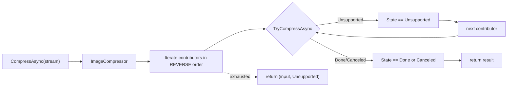

ABP's imaging subsystem (`framework/src/Volo.Abp.Imaging.*`) is a thin, provider-agnostic abstraction over the three popular .NET image libraries — **ImageSharp**, **SkiaSharp** and **Magick.NET**. It exposes two narrow contracts (`IImageResizer`, `IImageCompressor`) that orchestrate a chain of provider-supplied contributors, plus ASP.NET Core action filters (`[ResizeImage]`, `[CompressImage]`) that apply those operations to inbound `IFormFile`/`Stream`/`byte[]`/`IRemoteStreamContent` parameters before action execution.

The subsystem was designed for the **BLOB storing module's image pipelines** and for the avatar/asset workflows in the application modules (CMS Kit, Identity profile pictures), but it stands alone — anything that wants to resize or compress images can take a dependency on `Volo.Abp.Imaging.Abstractions` and let the host pick a provider.

## Package map

```mermaid
flowchart TB
  subgraph Abs["Volo.Abp.Imaging.Abstractions"]
    IR["IImageResizer<br/>ImageResizer"]
    IC["IImageCompressor<br/>ImageCompressor"]
    IRC["IImageResizerContributor"]
    ICC["IImageCompressorContributor"]
    Args["ImageResizeArgs<br/>ImageResizeMode<br/>ImageResizeOptions"]
    Res["ImageResizeResult&lt;T&gt;<br/>ImageCompressResult&lt;T&gt;<br/>ImageProcessState"]
  end

  subgraph AspNet["Volo.Abp.Imaging.AspNetCore"]
    Resize["[ResizeImage]<br/>ResizeImageAttribute"]
    Compress["[CompressImage]<br/>CompressImageAttribute"]
  end

  subgraph ImageSharp["Volo.Abp.Imaging.ImageSharp"]
    ISR["ImageSharpImageResizerContributor"]
    ISC["ImageSharpImageCompressorContributor"]
    ISO["ImageSharpCompressOptions"]
  end

  subgraph SkiaSharp["Volo.Abp.Imaging.SkiaSharp"]
    SKR["SkiaSharpImageResizerContributor"]
    SKO["SkiaSharpResizerOptions"]
  end

  subgraph MagickNet["Volo.Abp.Imaging.MagickNet"]
    MGR["MagickImageResizerContributor"]
    MGC["MagickImageCompressorContributor"]
    MGO["MagickNetCompressOptions"]
  end

  IR --> IRC
  IC --> ICC
  Resize --> IC
  Compress --> IC
  Resize --> IR
  ISR -.implements.-> IRC
  ISC -.implements.-> ICC
  SKR -.implements.-> IRC
  MGR -.implements.-> IRC
  MGC -.implements.-> ICC
```



## Packages at a glance

| Package | Module | Purpose |
| --- | --- | --- |
| `Volo.Abp.Imaging.Abstractions` | `AbpImagingAbstractionsModule` | Interfaces, `ImageResizer`, `ImageCompressor`, args/result/option types. Depends only on `AbpThreadingModule`. |
| `Volo.Abp.Imaging.AspNetCore` | `AbpImagingAspNetCoreModule` | `[ResizeImage]` and `[CompressImage]` MVC action filters. |
| `Volo.Abp.Imaging.ImageSharp` | `AbpImagingImageSharpModule` | Contributors backed by [SixLabors.ImageSharp](https://github.com/SixLabors/ImageSharp). Resizer **and** compressor. |
| `Volo.Abp.Imaging.SkiaSharp` | `AbpImagingSkiaSharpModule` | Resizer backed by [SkiaSharp](https://github.com/mono/SkiaSharp). **No compressor.** |
| `Volo.Abp.Imaging.MagickNet` | `AbpImagingMagickNetModule` | Contributors backed by [Magick.NET](https://github.com/dlemstra/Magick.NET). Resizer **and** compressor. |

All provider modules depend only on `AbpImagingAbstractionsModule`. They register their `IImageResizerContributor` / `IImageCompressorContributor` implementations as `ITransientDependency` so the abstraction layer's `IEnumerable<…Contributor>` injection picks them up automatically.

<Note>
The brief mentioned `IImageFormatConverter` and `IImageInspector` interfaces — those do **not** exist in the current codebase. The abstraction layer ships exactly two operations: **resize** and **compress**. Provider-specific APIs (format conversion, metadata inspection, watermarking) are reachable by injecting the provider's native types directly inside a custom contributor.
</Note>

## The two contracts

`framework/src/Volo.Abp.Imaging.Abstractions/Volo/Abp/Imaging/IImageResizer.cs`:

```csharp
public interface IImageResizer
{
    Task<ImageResizeResult<Stream>> ResizeAsync(
        Stream stream, ImageResizeArgs resizeArgs,
        string? mimeType = null, CancellationToken cancellationToken = default);

    Task<ImageResizeResult<byte[]>> ResizeAsync(
        byte[] bytes, ImageResizeArgs resizeArgs,
        string? mimeType = null, CancellationToken cancellationToken = default);
}
```

`framework/src/Volo.Abp.Imaging.Abstractions/Volo/Abp/Imaging/IImageCompressor.cs`:

```csharp
public interface IImageCompressor
{
    Task<ImageCompressResult<Stream>> CompressAsync(
        Stream stream, string? mimeType = null, CancellationToken cancellationToken = default);

    Task<ImageCompressResult<byte[]>> CompressAsync(
        byte[] bytes, string? mimeType = null, CancellationToken cancellationToken = default);
}
```

Both operations come in `Stream` and `byte[]` flavors. The `mimeType` hint is optional but should be supplied when known (e.g. from `IFormFile.ContentType`) — contributors use it as a fast-path before attempting to decode.

### Result types

```csharp
public abstract class ImageProcessResult<T>
{
    public T Result { get; }
    public ImageProcessState State { get; }
}

public enum ImageProcessState : byte
{
    Done = 1,
    Canceled = 2,
    Unsupported = 3,
}

public class ImageResizeResult<T>   : ImageProcessResult<T> { }
public class ImageCompressResult<T> : ImageProcessResult<T> { }
```

`State` semantics:

| State | Meaning |
| --- | --- |
| `Done` | The contributor processed the input. `Result` is the new image. |
| `Canceled` | The contributor processed the input but rejected the output. For compressors this means the "compressed" result was larger than the input — the original is returned. |
| `Unsupported` | The contributor can't handle this MIME type/format. The resizer/compressor falls through to the next contributor. |

`State` is the way callers tell apart "we changed the bytes for you" from "we left them alone" — important for HTTP responses, because re-uploading the un-changed bytes wastes bandwidth.

### Resize args

```csharp
public class ImageResizeArgs
{
    public uint Width  { get; set; }
    public uint Height { get; set; }
    public ImageResizeMode Mode { get; set; } = ImageResizeMode.Default;

    public ImageResizeArgs(uint? width = null, uint? height = null, ImageResizeMode? mode = null);
}
```

`ImageResizeMode`:

| Value | Behavior |
| --- | --- |
| `None` | Resize to the target width/height without enforcing an aspect ratio guarantee. Missing dimension is computed from the source ratio. |
| `Stretch` | Scale to exact target size; aspect ratio is **not** preserved. |
| `BoxPad` | Center the image in a box of target size, padding transparent if the image is smaller. |
| `Min` | Constrain to ≤ target dimensions while preserving aspect ratio. |
| `Max` | Cover the target box while preserving aspect ratio (the larger axis fills, the smaller axis grows past target). |
| `Crop` | Fill target size, cropping overflow from the center. |
| `Pad` | Fit inside the target box preserving aspect ratio, then pad to the exact target size with transparent. |
| `Default` | Sentinel meaning "use the host-configured default". |

The sentinel is resolved by `ImageResizer.ChangeDefaultResizeMode`:

```csharp
protected virtual void ChangeDefaultResizeMode(ImageResizeArgs resizeArgs)
{
    if (resizeArgs.Mode == ImageResizeMode.Default)
        resizeArgs.Mode = ImageResizeOptions.DefaultResizeMode;
}
```

Configure the default once per host:

```csharp
Configure<ImageResizeOptions>(options =>
{
    options.DefaultResizeMode = ImageResizeMode.Crop;
});
```

## How the chain works



`ImageResizer` and `ImageCompressor` both call `Contributors.Reverse()` once (in the constructor) and **again** at iteration time. The double-reverse is intentional: the last-registered contributor runs first.

```csharp
public ImageCompressor(IEnumerable<IImageCompressorContributor> contributors, ICancellationTokenProvider ctp)
{
    ImageCompressorContributors = contributors.Reverse();
    CancellationTokenProvider = ctp;
}

public virtual async Task<ImageCompressResult<Stream>> CompressAsync(Stream stream, ...)
{
    // ... seek/read guards ...
    foreach (var contrib in ImageCompressorContributors.Reverse())
    {
        var result = await contrib.TryCompressAsync(stream, mimeType, ...);
        SeekToBegin(stream);
        if (result.State == ImageProcessState.Unsupported) continue;
        return result;
    }
    return new ImageCompressResult<Stream>(stream, ImageProcessState.Unsupported);
}
```

If **no contributor** claims support, the coordinator returns the original input wrapped in `Unsupported`. Callers must inspect `result.State` before assuming the output bytes are different from the input bytes.

### Stream readiness

Both coordinators normalize the input stream before delegating:

```csharp
if (!stream.CanRead)
    return new ImageCompressResult<Stream>(stream, ImageProcessState.Unsupported);

if (!stream.CanSeek)
{
    var ms = new MemoryStream();
    await stream.CopyToAsync(ms, ctp.FallbackToProvider(cancellationToken));
    SeekToBegin(ms);
    stream = ms;
}
```

Non-seekable streams (HTTP request bodies, gRPC streams) are buffered into a `MemoryStream` first. Contributors can therefore assume `stream.Position == 0` and `stream.CanSeek == true`. After each contributor call, the coordinator seeks back to position 0 — so the next contributor gets a clean stream too.

### Cancellation token fallback

The coordinator uses `ICancellationTokenProvider.FallbackToProvider(cancellationToken)`. If the caller supplies `CancellationToken.None`, the provider supplies one from the ambient request scope (`HttpContext.RequestAborted` in ASP.NET Core, etc.). This is why both abstractions packages depend on `AbpThreadingModule`.

## Contributor contracts

```csharp
public interface IImageResizerContributor
{
    Task<ImageResizeResult<Stream>> TryResizeAsync(Stream stream, ImageResizeArgs args,
        string? mimeType = null, CancellationToken cancellationToken = default);
    Task<ImageResizeResult<byte[]>> TryResizeAsync(byte[]  bytes,  ImageResizeArgs args,
        string? mimeType = null, CancellationToken cancellationToken = default);
}

public interface IImageCompressorContributor
{
    Task<ImageCompressResult<Stream>> TryCompressAsync(Stream stream,
        string? mimeType = null, CancellationToken cancellationToken = default);
    Task<ImageCompressResult<byte[]>> TryCompressAsync(byte[]  bytes,
        string? mimeType = null, CancellationToken cancellationToken = default);
}
```

Contributors must:

- Return `Unsupported` when the MIME type or detected format is outside their support matrix — without throwing.
- Not consume the stream irrecoverably on an unsupported result (the coordinator seeks back to 0 anyway, but contributors should still avoid double-read patterns).
- Honor the cancellation token they receive.
- Return a result of the same type signature (`Stream`/`byte[]`) as their input. The coordinator does not convert between the two.

## Provider support matrix

Supported MIME types by contributor (lifted from each contributor's `CanResize` / `CanCompress`):

### Resizers

| Provider | JPEG | PNG | GIF | BMP | TIFF | WebP |
| --- | --- | --- | --- | --- | --- | --- |
| `ImageSharpImageResizerContributor` | ✅ | ✅ | ✅ | ✅ | ✅ | ✅ |
| `SkiaSharpImageResizerContributor`  | ✅ | ✅ |  |  |  | ✅ |
| `MagickImageResizerContributor`     | ✅ | ✅ | ✅ | ✅ | ✅ | ✅ |

### Compressors

| Provider | JPEG | PNG | GIF | WebP |
| --- | --- | --- | --- | --- |
| `ImageSharpImageCompressorContributor` | ✅ | ✅ |  | ✅ |
| `MagickImageCompressorContributor`     | ✅ | ✅ | ✅ |  |
| SkiaSharp                              | — | — | — | — |

SkiaSharp ships only a resizer in the current codebase.

## Provider stacking

You can reference more than one provider module — the coordinator chain just gets longer. Common combinations:

| Combo | Result |
| --- | --- |
| ImageSharp only | Pure-managed code, widest format support, one provider for both ops. |
| Magick.NET only | Native ImageMagick under the hood, broadest format coverage in the world; resize and compress. |
| SkiaSharp + ImageSharp | SkiaSharp first for resize (last-registered wins); ImageSharp covers GIF/BMP/TIFF and compression. |
| SkiaSharp + Magick.NET | SkiaSharp resizer for hot-path JPEG/PNG/WebP, Magick.NET for GIF & compression. |

Because of the **reverse-iteration** rule, the **last module loaded** is asked first. Use `[DependsOn(...)]` ordering or `Configure<AbpImagingAbstractionsModule>` to tweak this if you want a specific contributor to win.

<Tip>
If you need to pin a particular provider for a particular call path, bypass the chain and inject the contributor type directly:

```csharp
public class ThumbnailService : ITransientDependency
{
    private readonly ImageSharpImageResizerContributor _resizer;
    public ThumbnailService(ImageSharpImageResizerContributor resizer) => _resizer = resizer;
}
```

Concrete contributors are registered as themselves by `ITransientDependency` and are directly resolvable.
</Tip>

## ASP.NET Core integration

`framework/src/Volo.Abp.Imaging.AspNetCore/` adds two action filters that you put on controller actions:

```csharp
public class CompressImageAttribute : ActionFilterAttribute
{
    public string[] Parameters { get; }
    public CompressImageAttribute(params string[] parameters);
}

public class ResizeImageAttribute : ActionFilterAttribute
{
    public uint? Width  { get; }
    public uint? Height { get; }
    public ImageResizeMode Mode { get; set; }
    public string[] Parameters { get; }
    public ResizeImageAttribute(uint width, uint height, params string[] parameters);
    public ResizeImageAttribute(uint size, params string[] parameters); // square
}
```

Both filters override `OnActionExecutionAsync`, pick the action arguments matching `Parameters` (or **all** of them if `Parameters` is empty), and mutate them in place before `await next()`. They handle four input shapes:

```csharp
object? compressedValue = value switch
{
    IFormFile           file  => await CompressImageAsync(file,  imageCompressor),
    IRemoteStreamContent rsc  => await CompressImageAsync(rsc,   imageCompressor),
    Stream              stream => await CompressImageAsync(stream, imageCompressor),
    IEnumerable<byte>   bytes  => await CompressImageAsync(bytes.ToArray(), imageCompressor),
    _ => null
};
if (compressedValue != null)
    context.ActionArguments[key] = compressedValue;
```

Each branch:

- Checks `ContentType.StartsWith("image/")` before doing anything.
- Calls the coordinator with the MIME type.
- Skips replacement if `result.State != Done` (so an `Unsupported` or `Canceled` result leaves the original argument intact).
- For `IFormFile`, builds a new `FormFile` carrying the original `Headers`, `Name`, and `FileName`.
- For `IRemoteStreamContent`, **disposes the original** before wrapping the new stream in `RemoteStreamContent(result.Result, fileName, contentType)`.
- For raw `Stream`, **disposes the original** before returning the compressed/resized stream.
- For `byte[]`, returns the new array unconditionally.

### Usage

```csharp
[HttpPost("upload-avatar")]
[ResizeImage(width: 256, height: 256, "file")]
[CompressImage("file")]
public async Task<string> UploadAvatar(IFormFile file)
{
    // file is now resized to 256x256 and compressed by the time we get here
    return await _blobs.SaveAsync(file);
}
```

The filters run in attribute order — resize first (smaller pixel count), then compress (better ratio on the smaller image).

The default `Mode` for `ResizeImageAttribute` is the `default(ImageResizeMode) == ImageResizeMode.None` — which means **no aspect-ratio enforcement**. If you want square cropping, set it:

```csharp
[ResizeImage(256, 256, "file") { Mode = ImageResizeMode.Crop }]
```

Or globally via `ImageResizeOptions.DefaultResizeMode` so that any `ImageResizeMode.Default` falls into the chosen mode.

## Wiring guide

The minimal sequence to use the resizer in a non-ASP.NET host:

```csharp
[DependsOn(
    typeof(AbpImagingAbstractionsModule),
    typeof(AbpImagingImageSharpModule))]
public class MyImagingModule : AbpModule { }
```

Then inject:

```csharp
public class ThumbnailGenerator : ITransientDependency
{
    private readonly IImageResizer _resizer;
    public ThumbnailGenerator(IImageResizer resizer) => _resizer = resizer;

    public async Task<byte[]> Thumb(byte[] bytes)
    {
        var result = await _resizer.ResizeAsync(
            bytes,
            new ImageResizeArgs(width: 256, height: 256, mode: ImageResizeMode.Crop),
            mimeType: "image/jpeg");

        return result.State == ImageProcessState.Done ? result.Result : bytes;
    }
}
```

For ASP.NET Core also depend on `AbpImagingAspNetCoreModule` so the action filters can resolve `IImageCompressor` / `IImageResizer` via `HttpContext.RequestServices`.

## Provider deep-dives

<CardGroup cols={3}>
  <Card title="ImageSharp" href="/imaging/imagesharp">
    Pure-managed, widest format coverage. Resizer + compressor.
  </Card>
  <Card title="SkiaSharp" href="/imaging/skiasharp">
    Native Skia bindings — fastest resize, no compressor.
  </Card>
  <Card title="Magick.NET" href="/imaging/magicknet">
    Magick++ bindings — best fidelity, custom resize math per mode.
  </Card>
</CardGroup>

## Cross-references

<CardGroup cols={2}>
  <Card title="BLOB storing overview" href="/blob/blob-storing-overview">
    BLOB pipelines often resize/compress before storage. The imaging API is the canonical pre-processor.
  </Card>
  <Card title="ASP.NET Core integration" href="/aspnetcore/overview">
    Action filters depend on the MVC pipeline. `RemoteStreamContent` lives in `Volo.Abp.Http`.
  </Card>
  <Card title="Emailing" href="/comm/emailing">
    Email senders that include inline images can resize attachments through `IImageResizer` before sending.
  </Card>
  <Card title="Modularity" href="/core/modularity-system">
    Provider modules plug into the abstraction via DI and the contributor chain — no `Configure<>` calls needed.
  </Card>
</CardGroup>
