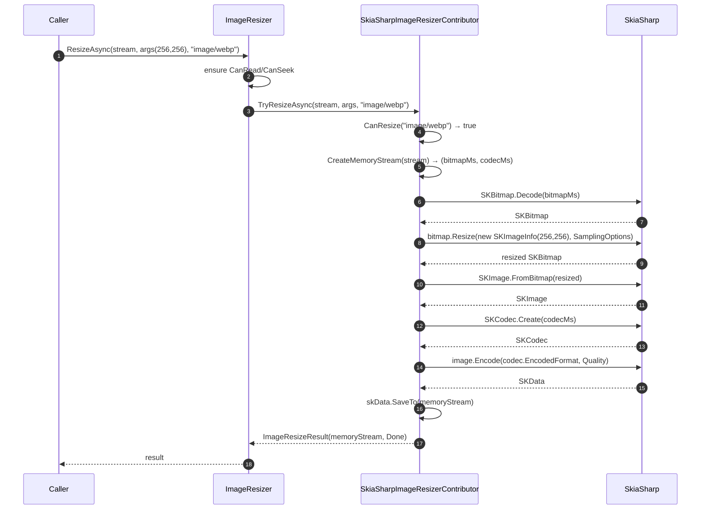

`Volo.Abp.Imaging.SkiaSharp` provides a resizer backed by [SkiaSharp](https://github.com/mono/SkiaSharp), the .NET binding for Google's Skia graphics library. It's the fastest of the three providers for JPEG/PNG/WebP resize because the heavy lifting happens in native code — but the package ships **only** a resizer. There is no SkiaSharp compressor in the current codebase.

Use it when:

- Throughput on JPEG/PNG/WebP resize matters more than format coverage.
- You already have SkiaSharp in the host (e.g. for PDF rendering or chart drawing).
- You're happy to pair it with another provider for compression and for GIF/BMP/TIFF resize.

See [`imaging/overview`](/imaging/overview) for how contributors plug into `IImageResizer`.

## Files in this package

| File | Role |
| --- | --- |
| `AbpImagingSkiaSharpModule.cs` | ABP module — empty body; depends on `AbpImagingAbstractionsModule`. The contributor auto-registers via `ITransientDependency`. |
| `SkiaSharpImageResizerContributor.cs` | `IImageResizerContributor` — decodes with `SKBitmap.Decode`, resizes with `SKBitmap.Resize`, re-encodes via the source codec to preserve format. |
| `SkiaSharpResizerOptions.cs` | `SKSamplingOptions` and `Quality` settings for the resizer. |

## Module

`framework/src/Volo.Abp.Imaging.SkiaSharp/Volo/Abp/Imaging/AbpImagingSkiaSharpModule.cs`:

```csharp
[DependsOn(typeof(AbpImagingAbstractionsModule))]
public class AbpImagingSkiaSharpModule : AbpModule
{
}
```

Empty body. The contributor is auto-discovered via `ITransientDependency`.

To use:

```csharp
[DependsOn(typeof(AbpImagingSkiaSharpModule))]
public class MyModule : AbpModule { }
```

If you also need GIF/BMP/TIFF resize **or** any compression, also depend on `AbpImagingImageSharpModule` or `AbpImagingMagickNetModule`.

## The resizer

`framework/src/Volo.Abp.Imaging.SkiaSharp/Volo/Abp/Imaging/SkiaSharpImageResizerContributor.cs`:

```csharp
public class SkiaSharpImageResizerContributor : IImageResizerContributor, ITransientDependency
{
    protected SkiaSharpResizerOptions Options { get; }

    public SkiaSharpImageResizerContributor(IOptions<SkiaSharpResizerOptions> options)
    {
        Options = options.Value;
    }

    public virtual async Task<ImageResizeResult<Stream>> TryResizeAsync(
        Stream stream, ImageResizeArgs resizeArgs,
        string? mimeType = null, CancellationToken cancellationToken = default)
    {
        if (!mimeType.IsNullOrWhiteSpace() && !CanResize(mimeType))
            return new ImageResizeResult<Stream>(stream, ImageProcessState.Unsupported);

        var (memoryBitmapStream, memorySkCodecStream) = await CreateMemoryStream(stream);

        using var original = SKBitmap.Decode(memoryBitmapStream);
        using var resized  = original.Resize(
            new SKImageInfo((int)resizeArgs.Width, (int)resizeArgs.Height),
            Options.SKSamplingOptions);
        using var image    = SKImage.FromBitmap(resized);
        using var codec    = SKCodec.Create(memorySkCodecStream);

        var memoryStream = new MemoryStream();
        using var skData = image.Encode(codec.EncodedFormat, Options.Quality);
        skData.SaveTo(memoryStream);

        return new ImageResizeResult<Stream>(memoryStream, ImageProcessState.Done);
    }
}
```

Things to notice:

- **Two stream copies.** SkiaSharp needs both the raw bytes (to decode the bitmap) and the codec info (to know the source format). `SKBitmap.Decode` consumes its stream, so the contributor makes two memory copies — `memoryBitmapStream` for `SKBitmap.Decode`, `memorySkCodecStream` for `SKCodec.Create`. For large uploads this means **3×** memory usage during the operation.
- **No format detection on the second pass.** Unlike ImageSharp, this contributor doesn't re-validate the format from the decoded bytes. If the caller-supplied `mimeType` is empty it skips the check entirely.
- **Source-format preservation.** `image.Encode(codec.EncodedFormat, …)` re-encodes using the **same** format Skia detected on input. JPEG → JPEG, PNG → PNG, WebP → WebP.
- **Quality knob applies always.** `Options.Quality` is passed even for PNG. For lossless formats Skia ignores the value, but the call signature still requires it.
- **No `ImageResizeMode` handling.** The contributor unconditionally calls `original.Resize(new SKImageInfo(width, height))` — i.e. it **stretches** to the exact target dimensions. The ABP `ImageResizeMode` is ignored. If you need aspect-ratio-preserving resize through Skia, override `TryResizeAsync` and compute the size yourself.

<Warning>
The SkiaSharp contributor ignores `ImageResizeArgs.Mode`. Width and height are both required, and the image is stretched to fit. If your app relies on `Crop` / `Pad` / `Min` / `Max` semantics, **don't** use SkiaSharp as the only provider. Either subclass with mode handling, or chain with another provider that runs first (remember contributors run in last-registered-first order).
</Warning>

### Supported formats

```csharp
protected virtual bool CanResize(string? mimeType)
{
    return mimeType switch
    {
        MimeTypes.Image.Jpeg => true,
        MimeTypes.Image.Png  => true,
        MimeTypes.Image.Webp => true,
        _ => false
    };
}
```

Three formats — the ones with mature SkiaSharp codec support. GIF, BMP, TIFF go through other providers.

### Byte array overload

```csharp
public virtual async Task<ImageResizeResult<byte[]>> TryResizeAsync(
    byte[] bytes, ImageResizeArgs resizeArgs,
    string? mimeType = null, CancellationToken cancellationToken = default)
{
    if (!mimeType.IsNullOrWhiteSpace() && !CanResize(mimeType))
        return new ImageResizeResult<byte[]>(bytes, ImageProcessState.Unsupported);

    using var memoryStream = new MemoryStream(bytes);
    var result = await TryResizeAsync(memoryStream, resizeArgs, mimeType, cancellationToken);

    if (result.State != ImageProcessState.Done)
        return new ImageResizeResult<byte[]>(bytes, result.State);

    var newBytes = await result.Result.GetAllBytesAsync(cancellationToken);
    result.Result.Dispose();
    return new ImageResizeResult<byte[]>(newBytes, result.State);
}
```

Standard pattern — wrap the bytes in a `MemoryStream`, delegate to the stream overload, copy out the bytes, dispose. Note that `result.Result.Dispose()` (not `DisposeAsync`) is used; both are equivalent for `MemoryStream`.

### Stream duplication helper

```csharp
protected virtual async Task<(MemoryStream, MemoryStream)> CreateMemoryStream(Stream stream)
{
    var streamPosition = stream.Position;

    var memoryBitmapStream = new MemoryStream();
    var memorySkCodecStream = new MemoryStream();

    await stream.CopyToAsync(memoryBitmapStream);
    stream.Position = streamPosition;
    await stream.CopyToAsync(memorySkCodecStream);
    stream.Position = streamPosition;

    memoryBitmapStream.Position = 0;
    memorySkCodecStream.Position = 0;

    return (memoryBitmapStream, memorySkCodecStream);
}
```

The helper:

- Saves and restores the source position so the caller's seek state isn't disturbed.
- Returns both copies positioned at 0, ready for decode.
- Does **not** observe the cancellation token — the two `CopyToAsync` calls run to completion. For very large uploads consider overriding this to thread the token.

## Resizer options

`framework/src/Volo.Abp.Imaging.SkiaSharp/Volo/Abp/Imaging/SkiaSharpResizerOptions.cs`:

```csharp
public class SkiaSharpResizerOptions
{
    public SKSamplingOptions SKSamplingOptions { get; set; }
    public int Quality { get; set; }

    public SkiaSharpResizerOptions()
    {
        SKSamplingOptions = SKSamplingOptions.Default;
        Quality = 75;
    }
}
```

| Property | Default | Affects |
| --- | --- | --- |
| `SKSamplingOptions` | `SKSamplingOptions.Default` | Sampling filter used by `SKBitmap.Resize`. Quality vs. speed trade-off. |
| `Quality` | `75` | JPEG and WebP encode quality (0–100). Ignored by PNG. |

`SKSamplingOptions` is a SkiaSharp type. Common choices:

```csharp
Configure<SkiaSharpResizerOptions>(options =>
{
    // Highest quality but slowest — cubic filter with mitchell coefficients
    options.SKSamplingOptions = new SKSamplingOptions(SKCubicResampler.Mitchell);

    // Linear (fast, OK for upscales)
    options.SKSamplingOptions = new SKSamplingOptions(SKFilterMode.Linear, SKMipmapMode.None);

    // High quality with mipmaps (good for downscales)
    options.SKSamplingOptions = new SKSamplingOptions(SKFilterMode.Linear, SKMipmapMode.Linear);

    options.Quality = 85;
});
```

## End-to-end



## Sample usage

Pinning SkiaSharp as the sole resizer, paired with ImageSharp for compression:

```csharp
[DependsOn(
    typeof(AbpImagingSkiaSharpModule),
    typeof(AbpImagingImageSharpModule))]
public class MyModule : AbpModule { }
```

The contributor chain (last-registered-first) makes the resolution depend on module load order. To force SkiaSharp to resize first regardless of order, you can inject the contributor directly:

```csharp
public class FastThumb : ITransientDependency
{
    private readonly SkiaSharpImageResizerContributor _skia;
    public FastThumb(SkiaSharpImageResizerContributor skia) => _skia = skia;

    public async Task<byte[]> MakeAsync(byte[] bytes, string mimeType)
    {
        var r = await _skia.TryResizeAsync(bytes, new ImageResizeArgs(256, 256), mimeType);
        return r.State == ImageProcessState.Done ? r.Result : bytes;
    }
}
```

## Capability comparison

| Capability | SkiaSharp resizer | ImageSharp resizer | Magick.NET resizer |
| --- | --- | --- | --- |
| JPEG / PNG / WebP | ✅ | ✅ | ✅ |
| GIF | ❌ | ✅ | ✅ |
| BMP / TIFF | ❌ | ✅ | ✅ |
| Honors `ImageResizeMode` | ❌ (stretch only) | ✅ | ✅ |
| Native code | ✅ | ❌ (pure managed) | ✅ |
| Aspect-ratio preservation | manual | mode-driven | mode-driven |
| Quality knob | ✅ (JPEG/WebP) | encoder-specific | encoder-specific |

## Operational notes

- **Native dependency.** SkiaSharp requires `libSkiaSharp` to be present at runtime — the NuGet package ships native binaries for win-x64/linux-x64/osx etc. Container images need the right base for glibc compatibility (`mcr.microsoft.com/dotnet/aspnet:8.0` works; `:alpine` variants may need `libSkiaSharp` rebuilt for musl).
- **Memory.** As noted, the contributor holds three copies of the input (raw bytes × 2 + decoded bitmap) during processing. Cap the upload size at the controller level for predictable memory behavior.
- **Cancellation.** `SKBitmap.Decode`, `Resize` and `Encode` are synchronous and **not cancellable**. The token only short-circuits at the `CopyToAsync` boundaries.
- **No EXIF preservation.** SkiaSharp re-encodes through `SKData` — EXIF metadata is dropped. Use ImageSharp or Magick.NET if preserving rotation/orientation matters.
- **Sampling defaults.** `SKSamplingOptions.Default` is a reasonable middle-of-the-road choice. For photo thumbnails consider mitchell-cubic; for icons/UI assets pick `SKFilterMode.Nearest`.

## Cross-references

<CardGroup cols={2}>
  <Card title="Imaging overview" href="/imaging/overview">
    Coordinator chain, action filters, provider stacking semantics.
  </Card>
  <Card title="ImageSharp provider" href="/imaging/imagesharp">
    Pure-managed resizer + compressor with full mode support and broader format coverage.
  </Card>
  <Card title="Magick.NET provider" href="/imaging/magicknet">
    Magick++-based; supports all formats, lossless compression, and implements every resize mode explicitly.
  </Card>
  <Card title="BLOB storing" href="/blob/blob-storing-overview">
    Pre-process uploads before storage using `IImageResizer`.
  </Card>
</CardGroup>
