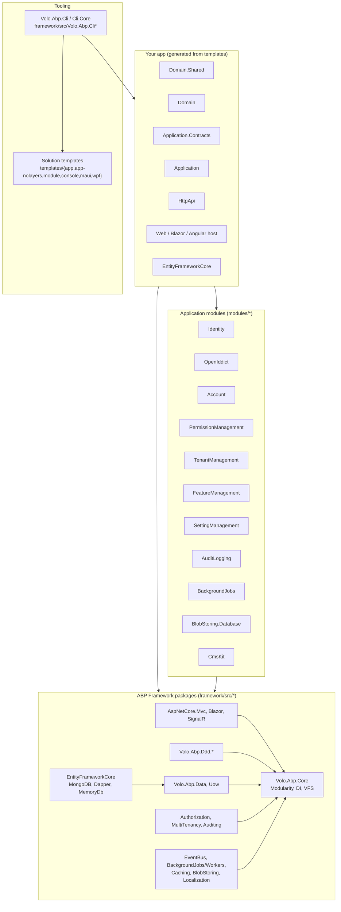

The ABP Framework is an opinionated, modular application framework built on top of ASP.NET Core that provides DDD-style layering, multi-tenancy, modularity, cross-cutting concerns (auditing, authorization, caching, event bus, background jobs, BLOB storing) and a large ecosystem of pre-built application modules, Angular/Blazor UI libraries, CLI tooling and Visual Studio solution templates. This wiki is an internal reference for the entire `abpframework/abp` monorepo and is optimized for coding agents that need to navigate and modify the codebase — every page links to concrete files under `framework/src/`, `modules/`, `templates/`, `npm/ng-packs/` or `tools/`.

## Architecture at a glance

## Repository map

The repository root is laid out as a meta-monorepo of dotnet solutions plus an Angular/Nx workspace. Use this map to find where each top-level concern lives.

| Path | Contents | Wiki page |
| --- | --- | --- |
| `framework/src/` | 169 NuGet packages — the framework itself (Core, DDD, Data, AspNetCore.*, EventBus, BackgroundJobs, BlobStoring providers, Caching, MultiTenancy, Authorization, Cli, etc.). | [Repository layout](/overview/repository-layout) |
| `framework/test/` | Test base assemblies plus per-package unit and integration test projects. | [TestBase](/ops/test-base) |
| `modules/` | 18 pre-built application modules (`account`, `audit-logging`, `background-jobs`, `basic-theme`, `blob-storing-database`, `blogging`, `client-simulation`, `cms-kit`, `docs`, `feature-management`, `identity`, `identityserver`, `openiddict`, `permission-management`, `setting-management`, `tenant-management`, `users`, `virtual-file-explorer`). | [Application modules](/modules/overview) |
| `templates/` | Solution templates (`app`, `app-nolayers`, `module`, `console`, `maui`, `wpf`) with `aspnet-core` and `angular` sub-trees. | [Solution templates](/templates/overview) |
| `npm/ng-packs/` | Nx workspace producing `@abp/ng.*` Angular packages (core, account, identity, permission-management, …). | [Angular UI](/angular/overview) |
| `npm/packs/` | Pure JS/CSS NPM packages bundled by the MVC UI. | [Bundling](/aspnetcore/mvc-ui-bundling) |
| `studio/source-codes/`, `source-code/` | Source-code redistributions of selected modules (for ABP Studio "Get Source"). | [Solution structure](/overview/solution-structure) |
| `tools/` | Standalone helper utilities — `github-changelog-generator`, `localization-key-synchronizer`, `nuget`, `smtp-prober-email-sender.exe`. | [CLI & Tooling](/cli/overview) |
| `build/`, `deploy/`, `nupkg/` | PowerShell scripts to build, test, NuGet-pack, NPM-publish and release the framework. | [Build scripts](/ops/build-scripts) |
| `apiSpec/`, `lowcode/`, `ai-rules/` | ABP Studio API spec extraction stubs, low-code schema, AI rule packs consumed by ABP Studio. | [Glossary](/overview/glossary) |
| `docs/`, `abp_io/` | Marketing/documentation site assets (not the framework code). | n/a |

## Subsystem map

<CardGroup cols={2}>
  <Card title="Core & Modularity" icon="cube" href="/core/overview">
    `framework/src/Volo.Abp.Core` — `AbpApplicationBase`, `IAbpModule`, DI, Virtual File System, exception handling.
  </Card>
  <Card title="Domain-Driven Design" icon="layer-group" href="/ddd/overview">
    Domain.Shared / Domain / Application.Contracts / Application layering, entities, repositories, DTOs.
  </Card>
  <Card title="Data Access" icon="database" href="/data/overview">
    Unit of Work, EF Core providers (SqlServer, PostgreSql, MySQL, Sqlite, Oracle), MongoDB, Dapper, MemoryDb.
  </Card>
  <Card title="ASP.NET Core" icon="globe" href="/aspnetcore/overview">
    `Volo.Abp.AspNetCore.*` — MVC, Razor Pages, Blazor (Server, WASM, MauiBlazor), SignalR, Serilog, Swashbuckle.
  </Card>
  <Card title="Authentication & Authorization" icon="lock" href="/auth/overview">
    JWT Bearer / OAuth / OIDC integrations, IdentityModel client, permissions, claim contributors, LDAP, GDPR.
  </Card>
  <Card title="Multi-Tenancy" icon="building" href="/multitenancy/overview">
    `CurrentTenant`, `TenantResolver`, connection-string resolver, ASP.NET Core middleware and MVC UI.
  </Card>
  <Card title="Event Bus & Messaging" icon="bolt" href="/eventbus/overview">
    Local & distributed event bus with RabbitMQ, Kafka, Azure Service Bus, Dapr and Rebus providers.
  </Card>
  <Card title="Background Jobs & Workers" icon="gears" href="/background/overview">
    `IBackgroundJobManager`, `IBackgroundWorkerManager` and Hangfire, Quartz, RabbitMQ, TickerQ providers, plus distributed locking.
  </Card>
  <Card title="Caching & BLOB Storing" icon="hard-drive" href="/caching/overview">
    `IDistributedCache` + Redis; `IBlobContainer` with Azure, AWS S3, Google, Aliyun, Bunny, MinIO, FileSystem, Memory.
  </Card>
  <Card title="Cross-Cutting Concerns" icon="hexagon-nodes" href="/crosscut/auditing">
    Auditing, Validation, Features/GlobalFeatures, Settings, Localization, Multi-Lingual Objects, JSON, GUIDs, Timing.
  </Card>
  <Card title="Text Templating & Imaging" icon="image" href="/texttemplating/overview">
    Razor/Scriban template engines and ImageSharp/SkiaSharp/MagickNet image processors.
  </Card>
  <Card title="Communication" icon="envelope" href="/comm/emailing">
    `IEmailSender` (+ MailKit), `ISmsSender` (+ Aliyun, Tencent Cloud), `IHttpClientProxy`, remote services.
  </Card>
  <Card title="AI & Integrations" icon="microchip" href="/ai/abstractions">
    AI abstractions, Dapr sidecar, Autofac container, AutoMapper, Mapperly, Castle Core.
  </Card>
  <Card title="UI Stacks" icon="display" href="/ui/overview">
    UI navigation menus, MVC Razor pages, Blazor (Web/Server/WASM/MauiBlazor), Blazorise, MAUI client, minification.
  </Card>
  <Card title="Application Modules" icon="puzzle-piece" href="/modules/overview">
    18 plug-in modules — Identity, Account, OpenIddict, CmsKit, Docs, Blogging and more.
  </Card>
  <Card title="Angular UI" icon="angular" href="/angular/overview">
    `@abp/ng.*` packages under `npm/ng-packs/packages/` — core, account, identity, theme-shared, schematics.
  </Card>
  <Card title="CLI & Tooling" icon="terminal" href="/cli/overview">
    `abp` CLI commands (`new`, `add-module`, `install-libs`, `generate-proxy`, `bundle`, `update`, `switch-to-*`).
  </Card>
  <Card title="Solution Templates" icon="folder-tree" href="/templates/overview">
    `app`, `app-nolayers`, `module`, `console`, `maui`, `wpf` — used by `abp new`.
  </Card>
  <Card title="Key Flows" icon="diagram-project" href="/flows/application-startup">
    End-to-end traces: app startup, module loading, HTTP request, UoW, distributed events, background job, auth, seeding.
  </Card>
  <Card title="Build, Test & Deploy" icon="hammer" href="/ops/build-scripts">
    PowerShell build/test/deploy scripts, perf-test harness, NuGet/NPM publishing pipelines.
  </Card>
</CardGroup>

## Where to start

<Tip>
  **Coming in cold?** Read [Architecture](/overview/architecture) for the layering model, then [Module loading lifecycle](/flows/module-loading-lifecycle) and [HTTP request lifecycle](/flows/http-request-lifecycle). The single most important entry point is `framework/src/Volo.Abp.Core/Volo/Abp/AbpApplicationBase.cs`; the canonical hosting entry point lives in any template, e.g. `templates/app/aspnet-core/src/MyCompanyName.MyProjectName.Web/Program.cs`.
</Tip>

<Note>
  **Looking for a specific module?** The framework split is consistent: `framework/src/Volo.Abp.<Feature>` for cross-cutting framework code and `modules/<feature>/src/Volo.Abp.<Feature>.{Domain.Shared,Domain,Application.Contracts,Application,HttpApi,HttpApi.Client,Web,Blazor,EntityFrameworkCore,MongoDB,Installer}` for application modules. Browse [Application modules](/modules/overview).
</Note>
