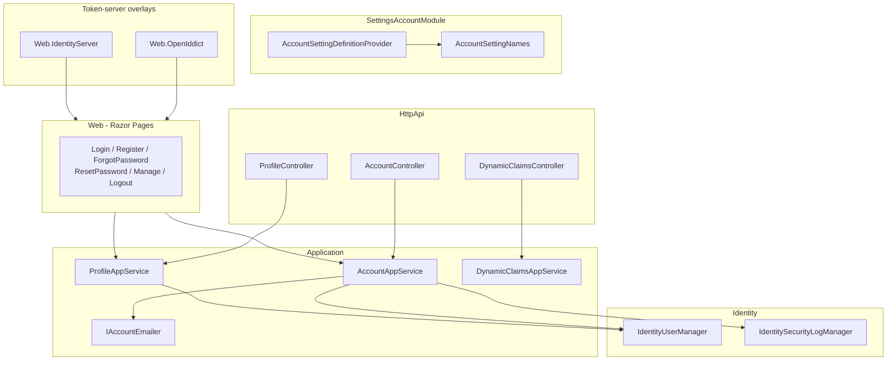

The Account module is the user-facing front for the [Identity module](/modules/identity). Identity gives you `IdentityUser`/`IdentityRole` aggregates and the management APIs; Account gives you the **`/api/account` HTTP API** (register, password reset, profile) and the **Razor Pages** users see in a browser (`/Account/Login`, `/Account/Register`, `/Account/Manage`, `/Account/ForgotPassword`, ...). It does not introduce its own aggregate roots — it composes the Identity domain services and emits the security log entries.

Account ships in two flavors depending on which token server you use: `Volo.Abp.Account.Web.OpenIddict` (recommended for new apps) and `Volo.Abp.Account.Web.IdentityServer` (legacy). The shared `Volo.Abp.Account.Web` package carries the local-login pages; the OpenIddict / IdentityServer companions add the consent screen and the protocol-specific login handling.

## Projects

`modules/account/src/` ships nine projects:

| Project | Purpose |
| --- | --- |
| `Volo.Abp.Account.Application.Contracts` | `IAccountAppService`, `IProfileAppService`, `IDynamicClaimsAppService` interfaces, DTOs, `AccountSettingNames`, `AccountRemoteServiceConsts`, localization |
| `Volo.Abp.Account.Application` | `AccountAppService`, `ProfileAppService`, `DynamicClaimsAppService`, `AccountSettingDefinitionProvider`, `Emailing/IAccountEmailer` |
| `Volo.Abp.Account.HttpApi` | `AccountController`, `ProfileController`, `DynamicClaimsController` — mount the app services under `/api/account` |
| `Volo.Abp.Account.HttpApi.Client` | Dynamic C# proxy for the HTTP API |
| `Volo.Abp.Account.Web` | Razor Pages: `Login`, `Register`, `ForgotPassword`, `ResetPassword`, `Manage`, `Logout`, `AccessDenied`, `LoggedOut`, `PasswordResetLinkSent`, profile-management view components |
| `Volo.Abp.Account.Web.OpenIddict` | OpenIddict-specific pages (consent / device flow / login model) |
| `Volo.Abp.Account.Web.IdentityServer` | IdentityServer-specific pages (consent / login model) |
| `Volo.Abp.Account.Blazor` | Profile-management Blazor components |
| `Volo.Abp.Account.Installer` | NuGet installer shim used by the ABP CLI |

<Note>
  There is no `Account.Domain` / `Account.Domain.Shared` / `Account.EntityFrameworkCore` / `Account.MongoDB` — Account stores no entities of its own. All persistence happens through the [Identity module](/modules/identity), [Permission Management](/modules/permission-management), and [Setting Management](/modules/setting-management).
</Note>

## Layering



## Application services

### `IAccountAppService`

[`IAccountAppService.cs`](https://github.com/abpframework/abp/blob/dev/modules/account/src/Volo.Abp.Account.Application.Contracts/Volo/Abp/Account/IAccountAppService.cs):

```csharp
public interface IAccountAppService : IApplicationService
{
    Task<IdentityUserDto> RegisterAsync(RegisterDto input);
    Task SendPasswordResetCodeAsync(SendPasswordResetCodeDto input);
    Task<bool> VerifyPasswordResetTokenAsync(VerifyPasswordResetTokenInput input);
    Task ResetPasswordAsync(ResetPasswordDto input);
}
```

The implementation in [`AccountAppService`](https://github.com/abpframework/abp/blob/dev/modules/account/src/Volo.Abp.Account.Application/Volo/Abp/Account/AccountAppService.cs) is a thin DDD facade over the Identity domain services:

```csharp expandable
public class AccountAppService : ApplicationService, IAccountAppService
{
    protected IIdentityRoleRepository RoleRepository { get; }
    protected IdentityUserManager UserManager { get; }
    protected IAccountEmailer AccountEmailer { get; }
    protected IdentitySecurityLogManager IdentitySecurityLogManager { get; }
    protected IOptions<IdentityOptions> IdentityOptions { get; }

    public virtual async Task<IdentityUserDto> RegisterAsync(RegisterDto input)
    {
        await CheckSelfRegistrationAsync();
        await IdentityOptions.SetAsync();

        var user = new IdentityUser(GuidGenerator.Create(), input.UserName,
                                    input.EmailAddress, CurrentTenant.Id);
        input.MapExtraPropertiesTo(user);

        (await UserManager.CreateAsync(user, input.Password)).CheckErrors();
        // ... add default roles, emit security log ...
    }
}
```

`CheckSelfRegistrationAsync` consults the `Abp.Account.IsSelfRegistrationEnabled` setting (see Settings below). `IAccountEmailer` lives in `Volo.Abp.Account.Application/Emailing/` and sends the password-reset and e-mail-confirmation messages via [Volo.Abp.Emailing](/comm/emailing).

### `IProfileAppService`

[`ProfileAppService`](https://github.com/abpframework/abp/blob/dev/modules/account/src/Volo.Abp.Account.Application/Volo/Abp/Account/ProfileAppService.cs) is `[Authorize]` and covers user-self-service:

| Method | DTO | Notes |
| --- | --- | --- |
| `GetAsync()` | `ProfileDto` | Returns the current user's profile + extra properties |
| `UpdateAsync(UpdateProfileDto)` | `ProfileDto` | Honors `Abp.Identity.User.IsUserNameUpdateEnabled` / `IsEmailUpdateEnabled` |
| `ChangePasswordAsync(ChangePasswordInput)` | — | Delegates to `UserManager.ChangePasswordAsync` |

### `IDynamicClaimsAppService`

`DynamicClaimsAppService` refreshes the cached claim set used by [`IdentityDynamicClaimsPrincipalContributor`](/modules/identity#dynamic-claims) for the current user. The endpoint lets the SPA invalidate its locally cached profile after a server-side change.

## HTTP API

Routes are declared in `Volo.Abp.Account.HttpApi/Volo/Abp/Account/AccountController.cs` and `ProfileController.cs`. All paths are mounted under `/api/account`:

| Method | Path | App-service call |
| --- | --- | --- |
| POST | `/api/account/register` | `IAccountAppService.RegisterAsync` |
| POST | `/api/account/send-password-reset-code` | `SendPasswordResetCodeAsync` |
| POST | `/api/account/verify-password-reset-token` | `VerifyPasswordResetTokenAsync` |
| POST | `/api/account/reset-password` | `ResetPasswordAsync` |
| GET  | `/api/account/my-profile` | `IProfileAppService.GetAsync` |
| PUT  | `/api/account/my-profile` | `UpdateAsync` |
| POST | `/api/account/my-profile/change-password` | `ChangePasswordAsync` |
| GET  | `/api/account/my-profile/refresh-dynamic-claims` | `IDynamicClaimsAppService.RefreshAsync` |

`AccountRemoteServiceConsts.RemoteServiceName` (`"AbpAccount"`) is the identifier used by the [HTTP client proxy](/comm/http-client) system to address the API.

## Settings

[`AccountSettingNames`](https://github.com/abpframework/abp/blob/dev/modules/account/src/Volo.Abp.Account.Application.Contracts/Volo/Abp/Account/Settings/AccountSettingNames.cs):

```csharp
public class AccountSettingNames
{
    public const string IsSelfRegistrationEnabled = "Abp.Account.IsSelfRegistrationEnabled";
    public const string EnableLocalLogin = "Abp.Account.EnableLocalLogin";
}
```

[`AccountSettingDefinitionProvider`](https://github.com/abpframework/abp/blob/dev/modules/account/src/Volo.Abp.Account.Application/Volo/Abp/Account/Settings/AccountSettingDefinitionProvider.cs) registers both as `isVisibleToClients: true` (so they're available to the SPA) with default value `"true"`. `IsSelfRegistrationEnabled` gates `AccountAppService.RegisterAsync`; `EnableLocalLogin` lets a deployment force users into an external IdP only.

<Tip>
  Account-related Identity settings (password rules, lockout, e-mail confirmation requirements) live on the Identity module — see [Identity settings](/modules/identity#settings-and-options) and the [Settings system](/crosscut/settings).
</Tip>

## Razor Pages

`Volo.Abp.Account.Web/Pages/Account/` contains the user-facing pages:

| Page | File | Purpose |
| --- | --- | --- |
| Login | `Login.cshtml(.cs)` | Username/password, external login buttons (driven by ASP.NET Identity's `SignInManager.GetExternalAuthenticationSchemesAsync()`) |
| Register | `Register.cshtml(.cs)` | Calls `IAccountAppService.RegisterAsync` |
| ForgotPassword | `ForgotPassword.cshtml(.cs)` | Issues a reset code via `SendPasswordResetCodeAsync` |
| PasswordResetLinkSent | `PasswordResetLinkSent.cshtml(.cs)` | Confirmation screen |
| ResetPassword | `ResetPassword.cshtml(.cs)` | Consumes the token from `IAccountAppService.ResetPasswordAsync` |
| ResetPasswordConfirmation | `ResetPasswordConfirmation.cshtml(.cs)` | Success page |
| Manage | `Manage.cshtml(.cs)` | Profile + password edit; cooperates with `Volo.Abp.Account.Web/ProfileManagement/` view components |
| Logout | `Logout.cshtml(.cs)` | Signs out and emits a security log entry |
| LoggedOut | `LoggedOut.cshtml(.cs)` | Post-logout page (with optional auto-redirect) |
| AccessDenied | `AccessDenied.cshtml(.cs)` | Mapped to ASP.NET Identity's access-denied callback |

`AccountPageModel.cs` is the base class for all these pages — it pulls in the localization resource, the `IdentitySecurityLogManager`, and `SignInManager<IdentityUser>` once.

### Profile-management framework

`Volo.Abp.Account.Web/ProfileManagement/` defines an extensible tabbed profile-management UI: contributors implement `IProfileManagementPageContributor`, register themselves through `ProfileManagementPageOptions`, and add their own Razor view components into the **My Account → Manage** page. The same hook exists in the Blazor port (`Volo.Abp.Account.Blazor/ProfileManagement/`).

## Token-server overlays

<Tabs>
  <Tab title="OpenIddict (recommended)">
    `Volo.Abp.Account.Web.OpenIddict` overrides `Pages/Account/OpenIddictSupportedLoginModel.cs` to implement OpenIddict's grant flows (authorization-code, device, refresh-token) on top of the shared `Login.cshtml.cs`. It also publishes the **Consent** page that the OpenIddict authorization endpoint redirects to when prompt=consent is requested. See [OpenIddict module](/modules/openiddict) for the protocol side.
  </Tab>
  <Tab title="IdentityServer (legacy)">
    `Volo.Abp.Account.Web.IdentityServer` hosts `Pages/Consent.cshtml(.cs)` and the IdentityServer-aware login model. It is only used by older solutions still on IdentityServer4 — see [IdentityServer module](/modules/identityserver).
  </Tab>
</Tabs>

A solution picks exactly **one** of the two overlays — both depend on `AbpAccountWebModule` and are mutually exclusive.

## Account-related options

`Volo.Abp.Account.Web/AbpAccountOptions.cs` is the central knob for tenant-switch URL, post-login redirect rules, profile-management page contributors, and the list of windows for two-factor providers:

```csharp
public class AbpAccountOptions
{
    public string TenantAdminUserName { get; set; } = "admin";
    public string WindowsAuthenticationSchemeName { get; set; }
    // ... and additional knobs for redirect rules
}
```

## Security log integration

Every login, logout, password change, and lockout writes an `IdentitySecurityLog` row through `IdentitySecurityLogManager`. Actions are stored as the strings declared in `IdentitySecurityLogActionConsts` (e.g. `LoginSucceeded`, `LoginFailed`, `Logout`, `ChangePassword`, `Lockout`). The rows are listed by the Identity module's `Identity/SecurityLogs` page.

## Extension points

<CardGroup cols={2}>
  <Card title="Replace IAccountAppService" icon="screwdriver-wrench">
    Subclass `AccountAppService`, register with `[Dependency(ReplaceServices = true)]` — useful to add CAPTCHA, custom registration validation, etc.
  </Card>
  <Card title="Custom IAccountEmailer" icon="envelope">
    The default uses the [emailing module](/comm/emailing). Replace it to integrate transactional-mail SaaS providers.
  </Card>
  <Card title="Profile-page contributor" icon="user-pen">
    Implement `IProfileManagementPageContributor` to add a tab into `/Account/Manage` (or its Blazor counterpart).
  </Card>
  <Card title="Pluggable login providers" icon="key">
    External providers are picked up via ASP.NET Identity's authentication schemes — register them with `AddOAuth("Google", ...)` in your host module.
  </Card>
</CardGroup>

## Related pages

- [Identity module](/modules/identity) — the underlying user / role / OU domain.
- [OpenIddict module](/modules/openiddict) — token server used by `Web.OpenIddict`.
- [IdentityServer module](/modules/identityserver) — token server used by `Web.IdentityServer`.
- [Angular Account](/angular/account) — Angular counterparts for these screens.
- [Authentication flow](/flows/authentication-flow) — full sign-in pipeline diagram including Account, Identity, and the token server.
- [Settings](/crosscut/settings) — how `Abp.Account.*` settings resolve at runtime.
