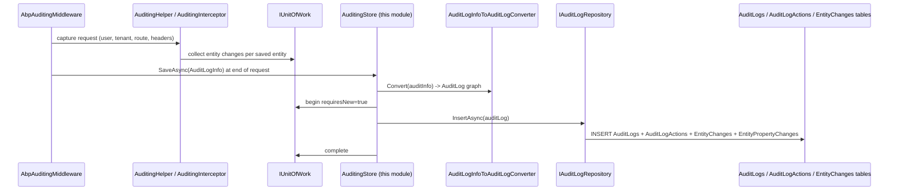

The Audit Logging module is the **persistence side** of [Volo.Abp.Auditing](/crosscut/auditing). The cross-cutting auditing infrastructure captures everything that happens during an HTTP request — which service / method ran, with what parameters, by which user, on which tenant, how long it took, what entities changed and from what value to what value — into an `AuditLogInfo` graph and hands it to `IAuditingStore`. The default in-core `SimpleLogAuditingStore` writes that graph to `ILogger`; this module replaces it with `AuditingStore`, which persists the same graph into the `AuditLog`, `AuditLogAction`, `EntityChange`, and `EntityPropertyChange` tables so an admin UI can query, filter, export, and replay it.

<Note>
  This module ships **only** the Domain.Shared / Domain / EntityFrameworkCore / MongoDB / Installer projects. There is no Application / HttpApi / Web in the open-source repo — admin UI on top of the audit log lives in the commercial **AuditLogging.Pro** module. The free build exposes the data through your own queries against `IAuditLogRepository`.
</Note>

## Projects

`modules/audit-logging/src/` ships five projects:

| Project | Purpose |
| --- | --- |
| `Volo.Abp.AuditLogging.Domain.Shared` | Constants (`AuditLogConsts`, `AuditLogActionConsts`, `EntityChangeConsts`, `EntityPropertyChangeConsts`, `AuditLogExcelFileConsts`), `AuditLoggingResource` localization, `AuditLoggingModuleExtensionConfiguration` |
| `Volo.Abp.AuditLogging.Domain` | `AuditLog`, `AuditLogAction`, `EntityChange`, `EntityPropertyChange`, `EntityChangeWithUsername`, `AuditLogExcelFile`, repository interfaces, `AuditingStore`, `AuditLogInfoToAuditLogConverter`, `AuditLogEntityTypeFullNameConverter` |
| `Volo.Abp.AuditLogging.EntityFrameworkCore` | EF Core repositories (`EfCoreAuditLogRepository`, `EfCoreAuditLogExcelFileRepository`), `AbpAuditLoggingDbContext`, model-builder extensions, queryable extensions |
| `Volo.Abp.AuditLogging.MongoDB` | MongoDB repositories, `AuditLoggingMongoDbContext` |
| `Volo.Abp.AuditLogging.Installer` | NuGet installer shim used by the ABP CLI |

## Layering

```mermaid
graph TD
  subgraph Auditing[Volo.Abp.Auditing - core]
    AAH[AbpAuditingMiddleware<br/>AuditingHelper]
    AuditInfo[AuditLogInfo<br/>AuditLogActionInfo<br/>EntityChangeInfo<br/>EntityPropertyChangeInfo]
    IAuditingStore[IAuditingStore]
  end
  subgraph Domain
    Store[AuditingStore<br/>impl of IAuditingStore]
    Conv[AuditLogInfoToAuditLogConverter<br/>AuditLogEntityTypeFullNameConverter]
    Agg[AuditLog<br/>AuditLogAction<br/>EntityChange<br/>EntityPropertyChange<br/>AuditLogExcelFile]
    Repo[IAuditLogRepository<br/>IAuditLogExcelFileRepository]
  end
  subgraph Data
    EF[EF Core repositories]
    Mongo[MongoDB repositories]
  end

  AAH --> AuditInfo
  AuditInfo --> IAuditingStore
  IAuditingStore <-.implements.- Store
  Store --> Conv
  Conv --> Agg
  Store --> Repo
  Repo -.implements.- EF
  Repo -.implements.- Mongo
```

## Aggregate roots

### `AuditLog`

[`AuditLog.cs`](https://github.com/abpframework/abp/blob/dev/modules/audit-logging/src/Volo.Abp.AuditLogging.Domain/Volo/Abp/AuditLogging/AuditLog.cs):

```csharp
[DisableAuditing]
public class AuditLog : AggregateRoot<Guid>, IMultiTenant
{
    public virtual string ApplicationName { get; set; }
    public virtual Guid? UserId { get; protected set; }
    public virtual string UserName { get; protected set; }
    public virtual Guid? TenantId { get; protected set; }
    public virtual string TenantName { get; protected set; }
    public virtual Guid? ImpersonatorUserId { get; protected set; }
    public virtual string ImpersonatorUserName { get; protected set; }
    public virtual Guid? ImpersonatorTenantId { get; protected set; }
    public virtual string ImpersonatorTenantName { get; protected set; }
    public virtual DateTime ExecutionTime { get; protected set; }
    public virtual int ExecutionDuration { get; protected set; }   // ms
    public virtual string ClientIpAddress { get; protected set; }
    public virtual string ClientName { get; protected set; }
    public virtual string ClientId { get; set; }
    public virtual string CorrelationId { get; set; }
    public virtual string BrowserInfo { get; protected set; }
    public virtual string HttpMethod { get; protected set; }
    public virtual string Url { get; protected set; }
    public virtual ICollection<AuditLogAction> Actions { get; protected set; }
    public virtual ICollection<EntityChange> EntityChanges { get; protected set; }
    public virtual string Exceptions { get; protected set; }
    public virtual string Comments { get; protected set; }
    public virtual int? HttpStatusCode { get; set; }
    public virtual ExtraPropertyDictionary ExtraProperties { get; protected set; }
}
```

One `AuditLog` row per HTTP request (or background-worker invocation). The class itself carries `[DisableAuditing]` so it doesn't recursively try to audit its own writes.

### `AuditLogAction`

[`AuditLogAction.cs`](https://github.com/abpframework/abp/blob/dev/modules/audit-logging/src/Volo.Abp.AuditLogging.Domain/Volo/Abp/AuditLogging/AuditLogAction.cs):

```csharp
public class AuditLogAction : Entity<Guid>, IMultiTenant, IHasExtraProperties
{
    public virtual Guid? TenantId { get; protected set; }
    public virtual Guid AuditLogId { get; protected set; }
    public virtual string ServiceName { get; protected set; }    // assembly-qualified service name
    public virtual string MethodName { get; protected set; }
    public virtual string Parameters { get; protected set; }     // serialized JSON args
    public virtual DateTime ExecutionTime { get; protected set; }
    public virtual int ExecutionDuration { get; protected set; }
}
```

A single audited request may contain **multiple** actions — e.g. a controller method that calls two app-service methods produces three `AuditLogAction` rows hanging off one `AuditLog`. Length-bounded columns are truncated via `*Consts.MaxXxxLength` at construction time.

### `EntityChange`

[`EntityChange.cs`](https://github.com/abpframework/abp/blob/dev/modules/audit-logging/src/Volo.Abp.AuditLogging.Domain/Volo/Abp/AuditLogging/EntityChange.cs):

```csharp
public class EntityChange : Entity<Guid>, IMultiTenant, IHasExtraProperties
{
    public virtual Guid AuditLogId { get; protected set; }
    public virtual Guid? TenantId { get; protected set; }
    public virtual DateTime ChangeTime { get; protected set; }
    public virtual EntityChangeType ChangeType { get; protected set; } // Created / Updated / Deleted
    public virtual Guid? EntityTenantId { get; protected set; }
    public virtual string EntityId { get; protected set; }
    public virtual string EntityTypeFullName { get; protected set; }
    public virtual ICollection<EntityPropertyChange> PropertyChanges { get; protected set; }
}
```

`EntityChangeType` is the `Created` / `Updated` / `Deleted` discriminator. `EntityTypeFullName` is the assembly-qualified entity name run through [`AuditLogEntityTypeFullNameConverter`](https://github.com/abpframework/abp/blob/dev/modules/audit-logging/src/Volo.Abp.AuditLogging.Domain/Volo/Abp/AuditLogging/AuditLogEntityTypeFullNameConverter.cs) so renames in your codebase don't lose history (the converter normalizes legacy names).

### `EntityPropertyChange`

```csharp
public class EntityPropertyChange : Entity<Guid>, IMultiTenant
{
    public virtual Guid? TenantId { get; protected set; }
    public virtual Guid EntityChangeId { get; protected set; }
    public virtual string NewValue { get; protected set; }
    public virtual string OriginalValue { get; protected set; }
    public virtual string PropertyName { get; protected set; }
    public virtual string PropertyTypeFullName { get; protected set; }
}
```

One row per changed property — useful for **field-level** diff history. Values longer than `EntityPropertyChangeConsts.MaxValueLength` are truncated.

### `EntityChangeWithUsername`

A read-projection (not a separate aggregate) that joins `EntityChange` with `AuditLog.UserName`. The repository exposes it via `GetEntityChangeWithUsernameAsync(Guid entityChangeId)`.

### `AuditLogExcelFile`

Used by AuditLogging.Pro's "export to Excel" feature — the OSS repo stores the binary blob and metadata for an export job; the actual export logic lives in the Pro module.

<Info>
  `SecurityLog` (mentioned alongside the audit log in many ABP docs) is not in this module — it's part of the [Identity module](/modules/identity) (`IdentitySecurityLog`). The two share intent (post-mortem who-did-what) but have different storage and different writers (`IdentitySecurityLogManager` vs. `IAuditingStore`).
</Info>

## Repositories

[`IAuditLogRepository`](https://github.com/abpframework/abp/blob/dev/modules/audit-logging/src/Volo.Abp.AuditLogging.Domain/Volo/Abp/AuditLogging/IAuditLogRepository.cs) supplies the rich query API a UI / dashboard needs:

| Method | Purpose |
| --- | --- |
| `GetListAsync(sorting, paging, startTime, endTime, httpMethod, url, clientId, userId, userName, applicationName, clientIpAddress, correlationId, minExecutionDuration, maxExecutionDuration, hasException, httpStatusCode, includeDetails, ct)` | Paginated, filterable audit log search |
| `GetCountAsync(...)` | Matching count for paging |
| `GetAverageExecutionDurationPerDayAsync(start, end, ct)` | Time-series chart data |
| `GetEntityChange(entityChangeId, ct)` | Single entity-change row |
| `GetEntityChangeListAsync(sorting, paging, auditLogId, startTime, endTime, changeType, entityId, entityTypeFullName, includeDetails, ct)` | Entity-change search |
| `GetEntityChangeCountAsync(...)` | Matching count |
| `GetEntityChangeWithUsernameAsync(entityChangeId, ct)` | Single change projected with user name |
| `GetEntityChangesWithUsernameAsync(entityId, entityTypeFullName, ct)` | All changes for a specific entity — drives the "history" tab in admin UIs |

`IAuditLogExcelFileRepository` is a minimal CRUD interface for the Pro export feature.

EF Core implementations: `EfCoreAuditLogRepository`, `EfCoreAuditLogExcelFileRepository`. MongoDB: `MongoAuditLogRepository`, `MongoAuditLogExcelFileRepository`.

## The auditing store

[`AuditingStore`](https://github.com/abpframework/abp/blob/dev/modules/audit-logging/src/Volo.Abp.AuditLogging.Domain/Volo/Abp/AuditLogging/AuditingStore.cs) is the `IAuditingStore` ABP picks up once the module is referenced:

```csharp
public class AuditingStore : IAuditingStore, ITransientDependency
{
    public ILogger<AuditingStore> Logger { get; set; }
    protected IAuditLogRepository AuditLogRepository { get; }
    protected IUnitOfWorkManager UnitOfWorkManager { get; }
    protected AbpAuditingOptions Options { get; }
    protected IAuditLogInfoToAuditLogConverter Converter { get; }

    public virtual async Task SaveAsync(AuditLogInfo auditInfo)
    {
        if (!Options.HideErrors) { await SaveLogAsync(auditInfo); return; }
        try { await SaveLogAsync(auditInfo); }
        catch (Exception ex)
        {
            Logger.LogWarning("Could not save the audit log object: " + Environment.NewLine + auditInfo);
            Logger.LogException(ex, LogLevel.Error);
        }
    }

    protected virtual async Task SaveLogAsync(AuditLogInfo auditInfo)
    {
        using (var uow = UnitOfWorkManager.Begin(true))
        {
            await AuditLogRepository.InsertAsync(await Converter.ConvertAsync(auditInfo));
            await uow.CompleteAsync();
        }
    }
}
```

Key behaviors:

- A **fresh unit of work** is opened (`UnitOfWorkManager.Begin(true)` requires a new transaction). The audit log writes its row even if the original transaction is rolling back — otherwise failed requests would leave no trace.
- If `AbpAuditingOptions.HideErrors == true` (the default in production), exceptions during persistence are swallowed and logged so a misbehaving audit store can't break the application.
- The graph translation happens through [`AuditLogInfoToAuditLogConverter`](https://github.com/abpframework/abp/blob/dev/modules/audit-logging/src/Volo.Abp.AuditLogging.Domain/Volo/Abp/AuditLogging/AuditLogInfoToAuditLogConverter.cs) — a pluggable component (replaceable via `IAuditLogInfoToAuditLogConverter`) that maps `AuditLogInfo` ⇒ `AuditLog`, `AuditLogActionInfo` ⇒ `AuditLogAction`, etc., applying the length truncations.

## End-to-end request flow



`AbpAuditingMiddleware` and the audited-method interceptor live in the [Volo.Abp.Auditing](/crosscut/auditing) cross-cutting package; this module's only job is to terminate that pipeline in a database.

## Persistence

<Tabs>
  <Tab title="Entity Framework Core">
    [`AbpAuditLoggingDbContext`](https://github.com/abpframework/abp/blob/dev/modules/audit-logging/src/Volo.Abp.AuditLogging.EntityFrameworkCore/Volo/Abp/AuditLogging/EntityFrameworkCore/AbpAuditLoggingDbContext.cs) is dedicated. Tables are `AbpAuditLogs`, `AbpAuditLogActions`, `AbpEntityChanges`, `AbpEntityPropertyChanges`, `AbpAuditLogExcelFiles`. Indexes target the most common queries: `(ExecutionTime, UserName)`, `(EntityTypeFullName, EntityId)`, `(CorrelationId)`. You can embed the schema into an application `DbContext` via `ConfigureAuditLogging(...)` instead of keeping a separate database.
  </Tab>
  <Tab title="MongoDB">
    [`AuditLoggingMongoDbContext`](https://github.com/abpframework/abp/blob/dev/modules/audit-logging/src/Volo.Abp.AuditLogging.MongoDB/Volo/Abp/AuditLogging/MongoDB/AuditLoggingMongoDbContext.cs) registers collections `AbpAuditLogs` and `AbpAuditLogExcelFiles`. `EntityChanges` are stored as embedded BSON sub-documents inside the parent `AuditLog` document — the MongoDB shape matches the aggregate boundary better than the relational normalization.
  </Tab>
</Tabs>

## Object extending

[`AuditLoggingModuleExtensionConfiguration`](https://github.com/abpframework/abp/blob/dev/modules/audit-logging/src/Volo.Abp.AuditLogging.Domain.Shared/Volo/Abp/ObjectExtending/AuditLoggingModuleExtensionConfiguration.cs) lets you add custom columns to `AuditLog`, `AuditLogAction`, `EntityChange` via the [Object extending](/ddd/object-extending) infrastructure — useful when you want to capture business-specific data (e.g. `BranchOfficeId`) on every request.

## Truncation rules

Audit logs are write-heavy — a single bad day can fill terabytes. The Domain.Shared constants cap every variable-length column to keep rows bounded:

| Const | Default | Applies to |
| --- | --- | --- |
| `AuditLogConsts.MaxBrowserInfoLength` | 256 | `AuditLog.BrowserInfo` |
| `AuditLogConsts.MaxClientNameLength` | 128 | `AuditLog.ClientName` |
| `AuditLogConsts.MaxUrlLength` | 256 | `AuditLog.Url` |
| `AuditLogActionConsts.MaxServiceNameLength` | 256 | `AuditLogAction.ServiceName` |
| `AuditLogActionConsts.MaxMethodNameLength` | 128 | `AuditLogAction.MethodName` |
| `AuditLogActionConsts.MaxParametersLength` | 2000 | `AuditLogAction.Parameters` (oversized payloads stored as `""`) |
| `EntityChangeConsts.MaxEntityTypeFullNameLength` | 192 | `EntityChange.EntityTypeFullName` |
| `EntityPropertyChangeConsts.MaxPropertyNameLength` | 96 | `EntityPropertyChange.PropertyName` |
| `EntityPropertyChangeConsts.MaxValueLength` | 512 | `OriginalValue` / `NewValue` |

<Warning>
  Even with these caps you should plan a retention policy — daily partitions, a periodic archival job, or a TTL index on MongoDB. ABP does not auto-purge audit data.
</Warning>

## Extension points

<CardGroup cols={2}>
  <Card title="Replace IAuditingStore" icon="screwdriver-wrench">
    Subclass `AuditingStore` to write to a different sink (e.g. Elasticsearch, Splunk) while keeping the rest of the pipeline.
  </Card>
  <Card title="Custom converter" icon="arrows-rotate">
    Implement `IAuditLogInfoToAuditLogConverter` to enrich or redact fields before persistence (e.g. mask credit-card numbers in `Parameters`).
  </Card>
  <Card title="Extend entities" icon="puzzle-piece">
    Add columns via `ObjectExtensionManager.Instance.ConfigureAuditLogging(...)`.
  </Card>
  <Card title="Filter what's logged" icon="filter">
    Use `AbpAuditingOptions.IgnoredTypes` and `IAuditingHelper.IsEntityHistoryEnabled` (in the [Auditing cross-cutting](/crosscut/auditing) layer) to skip noisy entities.
  </Card>
</CardGroup>

## Related pages

- [Auditing (cross-cutting)](/crosscut/auditing) — captures `AuditLogInfo` and hands it to `IAuditingStore`.
- [Unit of Work](/data/unit-of-work) — `AuditingStore` opens a fresh `requiresNew` UoW.
- [Identity module](/modules/identity) — separate `IdentitySecurityLog` aggregate for auth-specific events.
- [Object extending](/ddd/object-extending) — adding columns to audit entities.
- [Distributed event bus](/eventbus/distributed-event-bus) — alternative sink for entity-change events.
