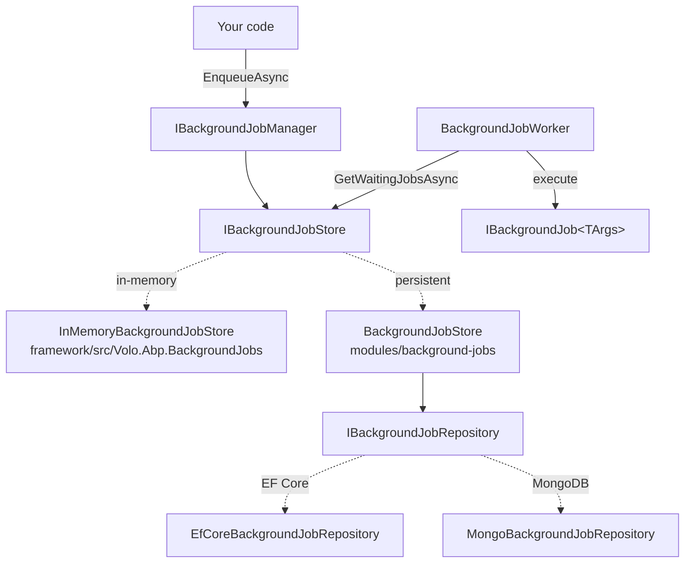

The `modules/background-jobs/` module turns ABP's [background job system](/background/background-jobs) into a **durable, restart-safe queue**. The framework itself ships an in-process `InMemoryBackgroundJobStore` under `framework/src/Volo.Abp.BackgroundJobs/`, which is perfect for development but loses every queued job on application restart. This module replaces that store with a real database — EF Core or MongoDB — and persists each scheduled job as a `BackgroundJobRecord` aggregate so the default worker (or [Hangfire](/background/hangfire), [Quartz](/background/quartz), [RabbitMQ](/background/rabbitmq-jobs) job manager) can pick it up after a crash.

This page deep-dives the module: its single aggregate, repository, store implementation, EF Core/Mongo persistence, and how it relates to the framework-level abstractions.

## Projects

`modules/background-jobs/src/` contains five projects:

| Project | Purpose |
| --- | --- |
| `Volo.Abp.BackgroundJobs.Domain.Shared` | Constants, DB property names, localization resource |
| `Volo.Abp.BackgroundJobs.Domain` | `BackgroundJobRecord` aggregate, `IBackgroundJobRepository`, `BackgroundJobStore` implementation of `IBackgroundJobStore`, Mapperly mappers |
| `Volo.Abp.BackgroundJobs.EntityFrameworkCore` | `IBackgroundJobsDbContext`, `BackgroundJobsDbContext`, `EfCoreBackgroundJobRepository`, model-creating extensions |
| `Volo.Abp.BackgroundJobs.MongoDB` | `IBackgroundJobsMongoDbContext`, `BackgroundJobsMongoDbContext`, `MongoBackgroundJobRepository` |
| `Volo.Abp.BackgroundJobs.Installer` | NuGet metadata for `abp install-module` |

There is **no** Application, HttpApi, or Web project — jobs are scheduled in-process via `IBackgroundJobManager`, not from a UI.

<Info>
  The module participates only in the `Domain` layer. Consumers add `[DependsOn(typeof(AbpBackgroundJobsEntityFrameworkCoreModule))]` (or the Mongo variant) to their EF/Mongo module, and the `BackgroundJobStore` is auto-registered as `IBackgroundJobStore` via `ITransientDependency`.
</Info>

## How it relates to the framework



The contract `IBackgroundJobStore` is defined in the framework (`Volo.Abp.BackgroundJobs.IBackgroundJobStore`). Both the in-memory store and this module's `BackgroundJobStore` implement it. Whichever module you depend on **last** wins the DI registration — typically you depend on `AbpBackgroundJobsEntityFrameworkCoreModule`, which transitively pulls `AbpBackgroundJobsDomainModule`, which overrides the in-memory registration.

## The `BackgroundJobRecord` aggregate

A single aggregate represents every queued job:

```csharp
namespace Volo.Abp.BackgroundJobs;

public class BackgroundJobRecord : AggregateRoot<Guid>, IHasCreationTime
{
    public virtual string ApplicationName { get; set; }
    public virtual string JobName { get; set; }       // AssemblyQualifiedName of the job type
    public virtual string JobArgs { get; set; }       // Serialized arguments
    public virtual short TryCount { get; set; }
    public virtual DateTime CreationTime { get; set; }
    public virtual DateTime NextTryTime { get; set; }
    public virtual DateTime? LastTryTime { get; set; }
    public virtual bool IsAbandoned { get; set; }
    public virtual BackgroundJobPriority Priority { get; set; }
}
```

| Field | Meaning |
| --- | --- |
| `ApplicationName` | Lets multiple apps share one database — each picks up only its own rows. Set via `AbpBackgroundJobOptions.ApplicationName`. |
| `JobName` | Resolved by `BackgroundJobConfiguration` from the args type — typically the job class' AQN. |
| `JobArgs` | JSON-serialized arguments (via the [Json serialization](/crosscut/serialization-and-json) infrastructure). |
| `TryCount` | Incremented each time the worker picks it up; once it exceeds `AbpBackgroundJobWorkerOptions.DefaultFirstWaitDuration` × retry policy, `IsAbandoned` is set. |
| `NextTryTime` | The earliest UTC time the worker will retry. The default worker computes this as exponential back-off. |
| `IsAbandoned` | Permanently failed jobs are kept for audit but never re-executed. |
| `Priority` | `BackgroundJobPriority` enum — `Low`, `BelowNormal`, `Normal`, `AboveNormal`, `High`. Higher priority is fetched first. |

### `BackgroundJobInfo` ↔ `BackgroundJobRecord` mapping

The framework operates on a `BackgroundJobInfo` DTO. `BackgroundJobsDomainMapperlyMappers` (Mapperly-generated) bridges the two, so the store never leaks `BackgroundJobRecord` outside its boundary.

## The repository

```csharp
public interface IBackgroundJobRepository : IBasicRepository<BackgroundJobRecord, Guid>
{
    Task<List<BackgroundJobRecord>> GetWaitingListAsync(
        [CanBeNull] string applicationName,
        int maxResultCount,
        CancellationToken cancellationToken = default);
}
```

The single specialised query — `GetWaitingListAsync` — drives the worker loop. The EF Core implementation:

```csharp
protected virtual async Task<IQueryable<BackgroundJobRecord>> GetWaitingListQueryAsync(
    [CanBeNull] string applicationName, int maxResultCount)
{
    var now = Clock.Now;
    return (await GetDbSetAsync())
        .Where(t => t.ApplicationName == applicationName)
        .Where(t => !t.IsAbandoned && t.NextTryTime <= now)
        .OrderByDescending(t => t.Priority)
        .ThenBy(t => t.TryCount)
        .ThenBy(t => t.NextTryTime)
        .Take(maxResultCount);
}
```

Three ordering keys — priority first, then fewest-tried (fairness), then oldest-due — produce the queue contract every ABP background worker expects.

<Note>
  `IClock` is injected so the worker honors the configured time zone via [time handling](/crosscut/timing). Tests can mock `IClock` to make `GetWaitingListAsync` deterministic.
</Note>

## The store

`BackgroundJobStore` is a thin translator that delegates to the repository and maps DTOs:

```csharp
public class BackgroundJobStore : IBackgroundJobStore, ITransientDependency
{
    protected IBackgroundJobRepository BackgroundJobRepository { get; }
    protected IObjectMapper<AbpBackgroundJobsDomainModule> ObjectMapper { get; }

    public virtual async Task InsertAsync(BackgroundJobInfo jobInfo)
        => await BackgroundJobRepository.InsertAsync(
            ObjectMapper.Map<BackgroundJobInfo, BackgroundJobRecord>(jobInfo));

    public virtual async Task<List<BackgroundJobInfo>> GetWaitingJobsAsync(
        string applicationName, int maxResultCount)
        => ObjectMapper.Map<List<BackgroundJobRecord>, List<BackgroundJobInfo>>(
            await BackgroundJobRepository.GetWaitingListAsync(applicationName, maxResultCount));

    public virtual async Task UpdateAsync(BackgroundJobInfo jobInfo)
    {
        var record = await BackgroundJobRepository.FindAsync(jobInfo.Id);
        if (record == null) return;
        ObjectMapper.Map(jobInfo, record);
        await BackgroundJobRepository.UpdateAsync(record);
    }

    public virtual async Task DeleteAsync(Guid jobId)
        => await BackgroundJobRepository.DeleteAsync(jobId);
}
```

Each method is virtual — override `UpdateAsync` to add custom logging, or wrap `GetWaitingJobsAsync` with a distributed lock if you run multiple worker hosts against the same database (see [distributed locking](/background/distributed-locking)).

## EF Core persistence

### Model

`BackgroundJobsDbContextModelCreatingExtensions.ConfigureBackgroundJobs` is called from your application's `OnModelCreating`:

```csharp
builder.Entity<BackgroundJobRecord>(b =>
{
    b.ToTable(AbpBackgroundJobsDbProperties.DbTablePrefix + "BackgroundJobs",
              AbpBackgroundJobsDbProperties.DbSchema);
    b.ConfigureByConvention();

    b.Property(x => x.ApplicationName).IsRequired(false)
        .HasMaxLength(BackgroundJobRecordConsts.MaxApplicationNameLength);
    b.Property(x => x.JobName).IsRequired()
        .HasMaxLength(BackgroundJobRecordConsts.MaxJobNameLength);
    b.Property(x => x.JobArgs).IsRequired()
        .HasMaxLength(BackgroundJobRecordConsts.MaxJobArgsLength);
    b.Property(x => x.TryCount).HasDefaultValue(0);
    b.Property(x => x.IsAbandoned).HasDefaultValue(false);
    b.Property(x => x.Priority).HasDefaultValue(BackgroundJobPriority.Normal)
        .HasSentinel(BackgroundJobPriority.Normal);

    b.HasIndex(x => new { x.IsAbandoned, x.NextTryTime });
});
```

The composite index `(IsAbandoned, NextTryTime)` is the one the polling query hits — without it, large queues (≥ 10k rows) degrade quickly.

<Tip>
  `AbpBackgroundJobsDbProperties.DbTablePrefix` defaults to `"Abp"`, so the table name is `AbpBackgroundJobs`. Override it in your `PreConfigure` callback to align with a custom prefix policy.
</Tip>

### Wire-up

<Tabs>
  <Tab title="EF Core">
    ```csharp
    [DependsOn(
        typeof(AbpBackgroundJobsEntityFrameworkCoreModule),
        typeof(AbpEntityFrameworkCoreSqlServerModule)
    )]
    public class MyEntityFrameworkCoreModule : AbpModule
    {
        public override void ConfigureServices(ServiceConfigurationContext context)
        {
            context.Services.AddAbpDbContext<MyDbContext>(options =>
            {
                options.AddDefaultRepositories(includeAllEntities: true);
            });
        }
    }

    public class MyDbContext : AbpDbContext<MyDbContext>
    {
        protected override void OnModelCreating(ModelBuilder builder)
        {
            base.OnModelCreating(builder);
            builder.ConfigureBackgroundJobs();   // ← extension method
        }
    }
    ```
  </Tab>
  <Tab title="MongoDB">
    ```csharp
    [DependsOn(typeof(AbpBackgroundJobsMongoDbModule))]
    public class MyMongoDbModule : AbpModule { }

    public class MyMongoDbContext : AbpMongoDbContext, IBackgroundJobsMongoDbContext
    {
        public IMongoCollection<BackgroundJobRecord> BackgroundJobs
            => Collection<BackgroundJobRecord>();

        protected override void CreateModel(IMongoModelBuilder modelBuilder)
        {
            base.CreateModel(modelBuilder);
            modelBuilder.ConfigureBackgroundJobs();
        }
    }
    ```
  </Tab>
</Tabs>

## MongoDB persistence

The Mongo repository serializes `BackgroundJobRecord` to a single collection (default name `AbpBackgroundJobs`). The waiting-list query becomes:

```csharp
return await (await GetMongoQueryableAsync(cancellationToken))
    .Where(t => t.ApplicationName == applicationName)
    .Where(t => !t.IsAbandoned && t.NextTryTime <= Clock.Now)
    .OrderByDescending(t => t.Priority)
    .ThenBy(t => t.TryCount)
    .ThenBy(t => t.NextTryTime)
    .Take(maxResultCount)
    .ToListAsync(GetCancellationToken(cancellationToken));
```

Mongo has no index helpers in the model builder by default — add a compound index on `(IsAbandoned, NextTryTime)` in your initial migration script for the same scalability win EF Core gets.

## Choosing between in-memory and database

| Scenario | Recommended store |
| --- | --- |
| Local development, integration tests | In-memory (default, no module needed) |
| Single-host production, jobs survive restart | This module + EF Core/Mongo |
| Multiple worker hosts | This module + a [distributed lock](/background/distributed-locking) around `GetWaitingJobsAsync`, **or** use [Hangfire](/background/hangfire)/[Quartz](/background/quartz) instead |
| Cross-service async messaging | Use [RabbitMQ background jobs](/background/rabbitmq-jobs) instead — the queue is the broker |

<Warning>
  The default `BackgroundJobWorker` does **not** lock rows during fetch. If you run more than one worker host against the same SQL database, two hosts may pick up the same job and execute it twice. Either run a single worker host, override `BackgroundJobStore.GetWaitingJobsAsync` to use a `SELECT ... FOR UPDATE SKIP LOCKED` query, or switch to Hangfire/Quartz which include row-level locking.
</Warning>

## Extension points

<CardGroup cols={2}>
  <Card title="Replace the store" icon="database">
    Implement `IBackgroundJobStore` and register with `[Dependency(ReplaceServices = true)]` — the module-provided `BackgroundJobStore` will be replaced.
  </Card>
  <Card title="Custom retry policy" icon="rotate">
    The retry interval is computed by the framework's `BackgroundJobWorker`, not by this module. See [background workers](/background/background-workers) for the override points.
  </Card>
  <Card title="Per-application partitioning" icon="layer-group">
    Set `AbpBackgroundJobOptions.ApplicationName` to different values per host to share the database without sharing the queue.
  </Card>
  <Card title="Object extensions" icon="puzzle-piece">
    `ApplyObjectExtensionMappings()` and `TryConfigureObjectExtensions<BackgroundJobsDbContext>()` are called in the EF model, so you can add extra columns to `AbpBackgroundJobs` via the [object extensions](/ddd/object-extending) system.
  </Card>
</CardGroup>

## Operational checklist

| Concern | Action |
| --- | --- |
| Table grows unbounded with abandoned rows | Add a scheduled cleanup job to delete `IsAbandoned == true` rows older than N days. The module does not auto-prune. |
| Worker host crashes mid-job | The job remains in the table with the original `NextTryTime` — it's re-picked up on next poll. There is no "lost" state. |
| Time-zone drift between worker and DB | `BackgroundJobRecord.NextTryTime` is UTC if `AbpClockOptions.Kind == DateTimeKind.Utc` — match that across all workers. See [time handling](/crosscut/timing). |
| Per-tenant job priority | All jobs share the same queue. If you need stricter isolation, partition by `ApplicationName` per tenant (`{appname}-{tenantId}`) and run one worker host per partition. |
| Audit log noise | The module's writes are visible to [audit logging](/modules/audit-logging) — disable auditing on `BackgroundJobRecord` if the volume is too noisy. |

## Inspecting the queue

`BackgroundJobRecord` is just a row — every SQL/Mongo tool can inspect the queue in place. Useful queries during incidents:

```sql
-- Top 20 waiting jobs by priority, oldest first
SELECT TOP 20 Id, JobName, TryCount, NextTryTime, Priority
FROM AbpBackgroundJobs
WHERE IsAbandoned = 0 AND NextTryTime <= GETUTCDATE()
ORDER BY Priority DESC, NextTryTime ASC;

-- Count of abandoned jobs grouped by JobName (where retries gave up)
SELECT JobName, COUNT(*) AS Abandoned
FROM AbpBackgroundJobs
WHERE IsAbandoned = 1
GROUP BY JobName
ORDER BY Abandoned DESC;

-- Manually un-abandon a stuck job after the underlying issue is fixed
UPDATE AbpBackgroundJobs SET IsAbandoned = 0, TryCount = 0,
    NextTryTime = GETUTCDATE() WHERE Id = '...';
```

Because the table is owned by the application module, you can query it from the same DbContext with `IBackgroundJobRepository` injected into a one-off `IDomainService` — handy for building a "queued jobs" admin panel on top of the module.

## Cross-references

- [Background jobs (framework)](/background/background-jobs) — the `IBackgroundJobManager` / `IBackgroundJobExecuter` / `IBackgroundJob<TArgs>` contracts that this module persists.
- [Background workers](/background/background-workers) — the polling worker that drains the queue this module fills.
- [Hangfire](/background/hangfire), [Quartz](/background/quartz), [RabbitMQ](/background/rabbitmq-jobs) — alternative back-ends that replace the entire `IBackgroundJobManager`, making this module unnecessary.
- [Modules overview](/modules/overview) — module catalog index.
