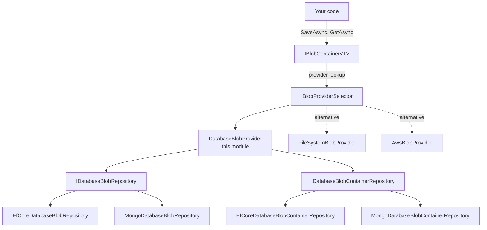

`modules/blob-storing-database/` is the **database-backed provider** for ABP's [BLOB Storing abstraction](/blob/blob-storing-overview). Where the file-system provider writes bytes to disk and the S3/Azure providers send them to object storage, this module persists every BLOB as a `byte[]` column in your relational database (EF Core) or as a binary field in a MongoDB collection. That makes it the simplest provider to operate — backups, multi-tenant isolation, and transactional consistency come for free with your existing database — at the cost of bloating that database with binary data.

This page walks the two aggregate roots (`DatabaseBlobContainer`, `DatabaseBlob`), the `DatabaseBlobProvider` adapter, the EF Core / MongoDB persistence, and the trade-offs of picking database storage over file-system / cloud blob stores.

## Projects

| Project | Purpose |
| --- | --- |
| `Volo.Abp.BlobStoring.Database.Domain.Shared` | Constants — `DatabaseBlobConsts.MaxNameLength`, `MaxContentLength`, `DatabaseContainerConsts.MaxNameLength`, error codes, localization resource |
| `Volo.Abp.BlobStoring.Database.Domain` | `DatabaseBlob` + `DatabaseBlobContainer` aggregates, repository interfaces, `DatabaseBlobProvider` (implements `BlobProviderBase`), `UseDatabase()` configuration extension |
| `Volo.Abp.BlobStoring.Database.EntityFrameworkCore` | `IBlobStoringDbContext`, `BlobStoringDbContext`, `EfCoreDatabaseBlobRepository`, `EfCoreDatabaseBlobContainerRepository` |
| `Volo.Abp.BlobStoring.Database.MongoDB` | `IBlobStoringMongoDbContext`, `BlobStoringMongoDbContext`, Mongo repositories |
| `Volo.Abp.BlobStoring.Database.Installer` | NuGet metadata for `abp install-module` |

There are no Application, HttpApi, or UI projects — BLOBs are read and written via the `IBlobContainer<T>` API, which is provided by the framework.

<Info>
  The `Volo.Abp.BlobStoring.Database.Domain` module depends only on `Volo.Abp.BlobStoring` (the abstraction) and the standard Volo.Abp.Ddd.Domain stack — no Identity, no tenant management, no audit logging coupling.
</Info>

## Position in the BLOB stack



Every BLOB write travels: your code → `IBlobContainer<T>` → `IBlobProviderSelector` picks the configured provider → `DatabaseBlobProvider` looks up (or creates) the container → writes a `DatabaseBlob` row keyed by `(ContainerId, Name)`.

## The aggregates

### `DatabaseBlobContainer`

A logical bucket. One row per container name per tenant.

```csharp
public class DatabaseBlobContainer : AggregateRoot<Guid>, IMultiTenant
{
    public virtual Guid? TenantId { get; protected set; }
    public virtual string Name { get; protected set; }

    public DatabaseBlobContainer(Guid id, [NotNull] string name, Guid? tenantId = null)
        : base(id)
    {
        Name = Check.NotNullOrWhiteSpace(name, nameof(name), DatabaseContainerConsts.MaxNameLength);
        TenantId = tenantId;
    }
}
```

### `DatabaseBlob`

A single BLOB. Holds the binary payload directly as a `byte[]`.

```csharp
public class DatabaseBlob : AggregateRoot<Guid>, IMultiTenant
{
    public virtual Guid ContainerId { get; protected set; }
    public virtual Guid? TenantId { get; protected set; }
    public virtual string Name { get; protected set; }

    [DisableAuditing]                                  // ← keeps payloads out of the audit log
    public virtual byte[] Content { get; protected set; }

    public virtual void SetContent(byte[] content)
        => Content = CheckContentLength(content);

    protected virtual byte[] CheckContentLength(byte[] content)
    {
        Check.NotNull(content, nameof(content));
        if (content.Length >= DatabaseBlobConsts.MaxContentLength)
            throw new AbpException($"Blob content size cannot be more than {DatabaseBlobConsts.MaxContentLength} Bytes.");
        return content;
    }
}
```

| Notable detail | Why |
| --- | --- |
| `[DisableAuditing]` on `Content` | Without this, every save would copy multi-megabyte payloads into the [audit log](/crosscut/auditing) `EntityChange` table. |
| `CheckContentLength` | Protects against accidentally streaming a giant file into RAM. The constant defaults to `int.MaxValue` but can be tuned per-deployment via the constant if you fork the module. |
| `IMultiTenant` | `IBlobProviderSelector` is tenant-aware — each tenant sees only its own containers. |

| Aggregate | Identifier | Table | Multi-tenant |
| --- | --- | --- | --- |
| `DatabaseBlobContainer` | `Guid` | `AbpBlobContainers` | Yes |
| `DatabaseBlob` | `Guid` | `AbpBlobs` (large `varbinary(max)` column) | Yes |

## The provider

`DatabaseBlobProvider` derives from `BlobProviderBase` (defined in `Volo.Abp.BlobStoring`) and implements the four primitives:

```csharp
public class DatabaseBlobProvider : BlobProviderBase, ITransientDependency
{
    public async override Task SaveAsync(BlobProviderSaveArgs args)
    {
        var container = await GetOrCreateContainerAsync(args.ContainerName, args.CancellationToken);
        var blob = await DatabaseBlobRepository.FindAsync(container.Id, args.BlobName, args.CancellationToken);

        var content = await args.BlobStream.GetAllBytesAsync(args.CancellationToken);

        if (blob != null)
        {
            if (!args.OverrideExisting)
                throw new BlobAlreadyExistsException(/* ... */);

            blob.SetContent(content);
            await DatabaseBlobRepository.UpdateAsync(blob, autoSave: true);
        }
        else
        {
            blob = new DatabaseBlob(GuidGenerator.Create(), container.Id, args.BlobName, content, CurrentTenant.Id);
            await DatabaseBlobRepository.InsertAsync(blob, autoSave: true);
        }
    }

    public async override Task<Stream> GetOrNullAsync(BlobProviderGetArgs args)
    {
        var container = await DatabaseBlobContainerRepository.FindAsync(args.ContainerName, args.CancellationToken);
        if (container == null) return null;

        var blob = await DatabaseBlobRepository.FindAsync(container.Id, args.BlobName, args.CancellationToken);
        return blob == null ? null : new MemoryStream(blob.Content);
    }

    // DeleteAsync, ExistsAsync — same pattern: resolve container then repo
}
```

| Method | Behavior |
| --- | --- |
| `SaveAsync` | Auto-creates the container on first write; throws `BlobAlreadyExistsException` if `OverrideExisting == false`. |
| `GetOrNullAsync` | Returns a `MemoryStream` wrapping the loaded byte array — the entire BLOB is held in memory. |
| `DeleteAsync` | Returns `false` if the container does not exist. |
| `ExistsAsync` | Cheap container lookup followed by a `(ContainerId, Name)` repository check. |

<Warning>
  `GetOrNullAsync` materializes the **entire** BLOB into a `MemoryStream`. For files over a few MB this defeats the purpose of streaming I/O. If you need to serve large files, prefer the file-system or cloud providers — see the [BLOB storing overview](/blob/blob-storing-overview) for the matrix.
</Warning>

## Configuring containers to use the database provider

```csharp
[DependsOn(typeof(AbpBlobStoringDatabaseDomainModule))]
public class MyDomainModule : AbpModule
{
    public override void ConfigureServices(ServiceConfigurationContext context)
    {
        Configure<AbpBlobStoringOptions>(options =>
        {
            // All containers without their own override → database provider
            options.Containers.ConfigureDefault(container =>
            {
                container.UseDatabase();
            });

            // Or a specific typed container
            options.Containers.Configure<AvatarContainer>(container =>
            {
                container.UseDatabase();
            });
        });
    }
}
```

`UseDatabase()` is the one-line configuration extension:

```csharp
public static BlobContainerConfiguration UseDatabase(this BlobContainerConfiguration containerConfiguration)
{
    containerConfiguration.ProviderType = typeof(DatabaseBlobProvider);
    return containerConfiguration;
}
```

## Wiring EF Core or MongoDB

<Tabs>
  <Tab title="EF Core">
    ```csharp
    [DependsOn(
        typeof(AbpBlobStoringDatabaseEntityFrameworkCoreModule),
        typeof(AbpEntityFrameworkCoreSqlServerModule)
    )]
    public class MyEntityFrameworkCoreModule : AbpModule { }

    public class MyDbContext : AbpDbContext<MyDbContext>
    {
        public DbSet<DatabaseBlobContainer> BlobContainers { get; set; }
        public DbSet<DatabaseBlob> Blobs { get; set; }

        protected override void OnModelCreating(ModelBuilder builder)
        {
            base.OnModelCreating(builder);
            builder.ConfigureBlobStoring();
        }
    }
    ```
    Or, if you would rather keep BLOBs in a separate database, the module ships its own `BlobStoringDbContext` you can register independently and point at a different connection string via [connection string management](/data/connection-strings).
  </Tab>
  <Tab title="MongoDB">
    ```csharp
    [DependsOn(typeof(AbpBlobStoringDatabaseMongoDbModule))]
    public class MyMongoDbModule : AbpModule { }

    public class MyMongoDbContext : AbpMongoDbContext, IBlobStoringMongoDbContext
    {
        public IMongoCollection<DatabaseBlobContainer> BlobContainers
            => Collection<DatabaseBlobContainer>();
        public IMongoCollection<DatabaseBlob> Blobs => Collection<DatabaseBlob>();

        protected override void CreateModel(IMongoModelBuilder modelBuilder)
        {
            base.CreateModel(modelBuilder);
            modelBuilder.ConfigureBlobStoring();
        }
    }
    ```
  </Tab>
</Tabs>

## Multi-tenancy

Both aggregates implement `IMultiTenant`, and the provider passes `CurrentTenant.Id` into every new `DatabaseBlobContainer` / `DatabaseBlob`. The framework's [data filters](/data/data-filtering) automatically scope queries by `TenantId`, so each tenant gets a private namespace of containers and BLOBs — even if they share a database with the host.

If you store BLOBs in a [separate tenant database](/multitenancy/connection-string-resolver), point the `BlobStoringDbContext` connection string at the tenant DB. The `EfCoreDatabaseBlobRepository` uses the standard `IDbContextProvider<IBlobStoringDbContext>`, so the per-tenant connection string resolution from [connection string management](/data/connection-strings) just works.

## Trade-off matrix

| Concern | Database provider (this module) | File-system | S3 / Azure |
| --- | --- | --- | --- |
| Backups | Included with DB backup | Separate filesystem backup | Cloud-managed |
| Transactional consistency | ✅ same `Uow` as your aggregates | ❌ two-phase write | ❌ two-phase write |
| Cost at scale | Database storage is expensive | Cheap disk | Cheapest |
| Throughput for large files | Poor — one row, one round-trip | Good — `FileStream` | Best — streamed PUT |
| Multi-tenant isolation | Free via `IMultiTenant` filter | Manual path layout | Manual prefix layout |
| CDN-friendly | ❌ requires an app endpoint | ⚠️ via a static handler | ✅ native |

<Tip>
  A common pattern is to use the **database provider for small, transactional BLOBs** (avatars, signatures, generated PDFs ≤ 1 MB) while pointing larger containers — generated reports, video uploads — at S3 with `containerConfiguration.UseAws(...)`.
</Tip>

## Extension points

<CardGroup cols={2}>
  <Card title="Replace the provider" icon="database">
    Subclass `DatabaseBlobProvider`, override `SaveAsync` / `GetOrNullAsync`, and register with `[ExposeServices(typeof(DatabaseBlobProvider))]` and `[Dependency(ReplaceServices = true)]`.
  </Card>
  <Card title="Custom max content length" icon="ruler">
    The check in `DatabaseBlob.CheckContentLength` uses `DatabaseBlobConsts.MaxContentLength`. Override the aggregate (subclass `DatabaseBlob` and replace via [object extensions](/ddd/object-extending)) for stricter per-deployment limits.
  </Card>
  <Card title="Streaming GETs" icon="stream">
    Implement a custom provider that opens a `SqlDataReader` with `CommandBehavior.SequentialAccess` to stream large `varbinary(max)` rows instead of buffering them.
  </Card>
  <Card title="Compress on write" icon="file-zipper">
    Override `SaveAsync` to GZip the input stream before persistence; decompress in `GetOrNullAsync`. The stored bytes remain transparent to consumers.
  </Card>
</CardGroup>

## Operational checklist

| Concern | Action |
| --- | --- |
| Database backup size | A 50 GB CMS-attached BLOB store turns into a 50 GB backup nightly. Either move large containers to S3 (`UseAws`) or set up a partial backup that excludes the `AbpBlobs` table. |
| Transaction log bloat | Each `SaveAsync` flushes a multi-MB `varbinary` row into the WAL/redo log. Tune `MaxContentLength` down to a hard ceiling (e.g. 5 MB) to keep individual writes bounded. |
| Per-tenant private blobs | The `IMultiTenant` filter does the work — your tenant cannot see another tenant's container by guessing the name. Stop relying on container names for security. |
| Backup-restore consistency | Because the BLOB lives in the same DB as the metadata, restoring a single snapshot brings the system back to a consistent state — unlike file-system providers. |
| Streaming downloads | Replace `IBlobContainer<T>.GetAsync` callers with `GetAsync(...).CopyToAsync(Response.Body)` so the framework doesn't buffer the `MemoryStream` twice. |

## Cross-references

- [BLOB Storing overview](/blob/blob-storing-overview) — the `IBlobContainer<T>` / `IBlobProvider` abstraction every provider implements.
- [BLOB providers](/blob/blob-storing-overview) — file-system, S3, Azure, MinIO and Aliyun alternatives.
- [Connection string management](/data/connection-strings) — point this module's `DbContext` at a dedicated BLOB database.
- [Multi-tenancy](/multitenancy/overview) — tenant isolation of containers and blobs.
- [Modules overview](/modules/overview) — module catalog index.
