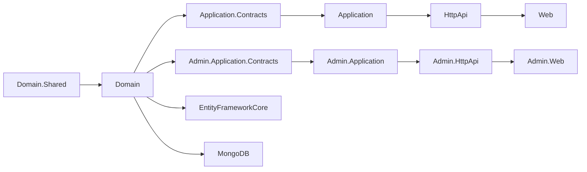
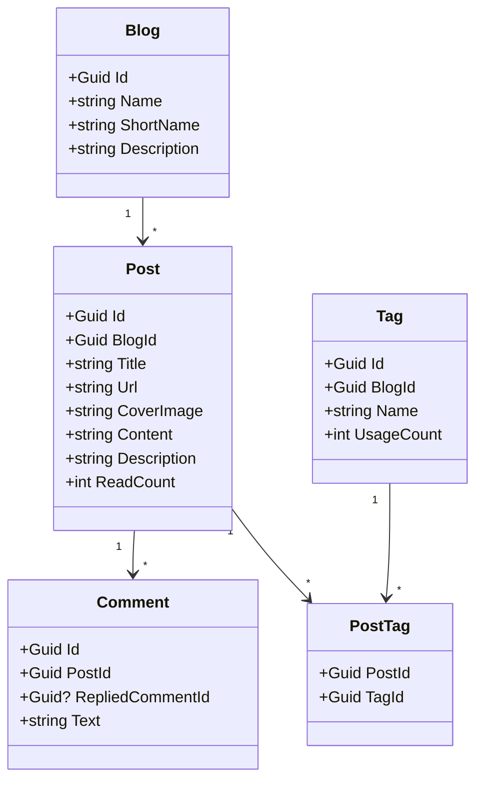
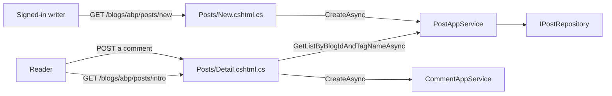

`modules/blogging/` is the **original** blogging engine ABP shipped before [CMS Kit](/modules/cms-kit). It's a self-contained module with its own `Blog`, `Post`, `Comment`, and `Tag` aggregates, a full Razor Pages UI under `/blogs/{blogShortName}`, plus an admin surface for managing blogs and their authors. New solutions are nudged toward CMS Kit's `Blog`/`BlogPost` aggregates because of CMS Kit's richer feature toggles and shared user/comment/reaction infrastructure, but the legacy module remains supported, is still tagged in every release, and is the right pick for a self-hosted developer blog where you don't want the rest of CMS Kit's surface.

This page documents the legacy module end to end: project layout, aggregates, app services, the admin surface, the public Razor UI, and the conditions under which to prefer it over CMS Kit.

## Projects

`modules/blogging/src/` ships sixteen projects in the standard ABP layout, split into a **public** stack and an **admin** stack:

| Project | Purpose |
| --- | --- |
| `Volo.Blogging.Domain.Shared` | Constants (`BloggingConsts`), `BloggingRemoteServiceConsts.ModuleName = "blogging"`, error codes, localization resource |
| `Volo.Blogging.Domain` | `Blog`, `Post`, `Comment`, `Tag`, `PostTag` aggregates; `IBlogRepository`, `IPostRepository`, `ICommentRepository`, `ITagRepository`; `BlogUser` read-model and `BlogUserSynchronizer` |
| `Volo.Blogging.Application.Contracts` + `Application.Contracts.Shared` | Reader DTOs (`PostWithDetailsDto`, `BlogDto`, `CommentWithDetailsDto`, `TagDto`), `IBlogAppService`, `IPostAppService`, `ICommentAppService`, `ITagAppService`, `IFileAppService`, `IMemberAppService`, `BloggingPermissions`, `BloggingFeatures` |
| `Volo.Blogging.Application` | App-service implementations + `PostsCache` invalidation |
| `Volo.Blogging.HttpApi` | Public auto-API controllers — `BlogsController`, `PostsController`, `CommentsController`, `TagsController`, `BlogFilesController` |
| `Volo.Blogging.HttpApi.Client` | Dynamic C# proxies |
| `Volo.Blogging.Web` | Razor Pages — `/blogs/{blogShortName}`, `/blogs/{blogShortName}/posts/{url}`, `/blogs/{blogShortName}/posts/new`, edit page, member page, tag filter, comment thread |
| `Volo.Blogging.Admin.Application.Contracts` | `IBlogManagementAppService`, `BlogManagementPermissions` |
| `Volo.Blogging.Admin.Application` | `BlogManagementAppService` — CRUD for blogs |
| `Volo.Blogging.Admin.HttpApi` | `BlogManagementController` |
| `Volo.Blogging.Admin.HttpApi.Client` | Dynamic proxies for the admin API |
| `Volo.Blogging.Admin.Web` | `/Blogging/Admin/Blogs` Razor Pages |
| `Volo.Blogging.EntityFrameworkCore`, `Volo.Blogging.MongoDB` | Persistence |
| `Volo.Blogging.Installer` | NuGet metadata for `abp install-module` |



## Aggregates



### `Blog`

```csharp
public class Blog : FullAuditedAggregateRoot<Guid>
{
    [NotNull] public virtual string Name { get; protected set; }
    [NotNull] public virtual string ShortName { get; protected set; }   // URL slug
    [CanBeNull] public virtual string Description { get; set; }

    public Blog(Guid id, [NotNull] string name, [NotNull] string shortName)
    {
        Id = id;
        Name = Check.NotNullOrWhiteSpace(name, nameof(name));
        ShortName = Check.NotNullOrWhiteSpace(shortName, nameof(shortName));
    }
}
```

`ShortName` is the URL fragment — `/blogs/{ShortName}/...`.

### `Post`

```csharp
public class Post : FullAuditedAggregateRoot<Guid>
{
    public virtual Guid BlogId { get; protected set; }
    [NotNull] public virtual string Url { get; protected set; }         // per-blog unique slug
    [NotNull] public virtual string CoverImage { get; set; }
    [NotNull] public virtual string Title { get; protected set; }
    [CanBeNull] public virtual string Content { get; set; }
    [CanBeNull] public virtual string Description { get; set; }
    public virtual int ReadCount { get; protected set; }
    public virtual Collection<PostTag> Tags { get; protected set; }

    public virtual Post IncreaseReadCount() { ReadCount++; return this; }
    public virtual void AddTag(Guid tagId) => Tags.Add(new PostTag(Id, tagId));
    public virtual void RemoveTag(Guid tagId) => Tags.RemoveAll(t => t.TagId == tagId);
}
```

Each post owns its `PostTag` collection — a value object child entity. Tag re-use is at the aggregate boundary via `Guid tagId`.

### `Comment`

A flat thread with replies; comments link to a `Post` and may reference a parent comment.

```csharp
public class Comment : FullAuditedAggregateRoot<Guid>
{
    public virtual Guid PostId { get; protected set; }
    public virtual Guid? RepliedCommentId { get; protected set; }
    public virtual string Text { get; protected set; }
}
```

### `Tag`

`Tag` is scoped to a blog (`BlogId`) so two blogs can have a `dotnet` tag without colliding. `UsageCount` is maintained on add/remove and decremented when a post is deleted.

### `BlogUser` and synchronization

`BlogUser` is a local read-model of users — same idea as CMS Kit's `CmsUser`. `BlogUserSynchronizer` listens to Identity events and keeps the local copy fresh.

```csharp
public class BlogUser : Entity<Guid>, IUpdateUserData
{
    public string UserName { get; protected set; }
    public string Name { get; protected set; }
    public string Surname { get; protected set; }
    public string Email { get; protected set; }
    public bool EmailConfirmed { get; protected set; }
    public string PhoneNumber { get; protected set; }
    public bool PhoneNumberConfirmed { get; protected set; }
}
```

`IBlogUserLookupService` is the read-only accessor; `BlogUserSynchronizer` is the writer. See the [Users module](/modules/users) for the `IUserData` / `IUpdateUserData` contracts.

## Public application services

| App service | Controller | Base route | Notable operations |
| --- | --- | --- | --- |
| `IBlogAppService` | `BlogsController` | `api/blogging/blogs` | `GetListAsync`, `GetByShortNameAsync` |
| `IPostAppService` | `PostsController` | `api/blogging/posts` | `GET {blogId}/all`, `GET {blogId}/all/by-time`, `GET {blogId}/latest/{count}`, `GET user/{userId}`, `POST read`, `POST/PUT/DELETE {id}` |
| `ICommentAppService` | `CommentsController` | `api/blogging/comments` | List comments by post, post a reply, edit, delete |
| `ITagAppService` | `TagsController` | `api/blogging/tags` | List popular tags for a blog |
| `IFileAppService` | `BlogFilesController` | `api/blogging/files` | Upload cover images and inline images (BLOB upload) |
| `IMemberAppService` | (no public controller — used by Razor pages) | — | Look up author profile by user-id |

```csharp
[Area(BloggingRemoteServiceConsts.ModuleName)]
[Route("api/blogging/posts")]
public class PostsController : BloggingController, IPostAppService
{
    [HttpGet, Route("{blogId}/all")]
    public Task<ListResultDto<PostWithDetailsDto>> GetListByBlogIdAndTagNameAsync(Guid blogId, string tagName) => ...;

    [HttpPost, Route("read")]
    public Task IncreaseReadCountAsync(Guid id) => ...;
}
```

### Read-count caching

`PostAppService` injects `IDistributedCache<List<PostCacheItem>>` (`PostsCache`) and `ILocalEventBus`. `PostCacheInvalidator` listens for `PostChangedEvent` and evicts the cache. The pattern is documented at [Distributed cache](/caching/distributed-cache).

## Admin application service

A single management service handles author-side blog CRUD:

| App service | Controller | Base route |
| --- | --- | --- |
| `IBlogManagementAppService` | `BlogManagementController` | `api/blogging/admin/blogs` |

Operations: `GetListAsync`, `GetAsync(id)`, `CreateAsync(CreateBlogDto)`, `UpdateAsync(Guid, UpdateBlogDto)`, `DeleteAsync(id)` — gated by `BlogManagementPermissions.Blogs.{Default,Create,Update,Delete}`.

`Volo.Blogging.Admin.Web` exposes `/Blogging/Admin/Blogs` Razor pages: list, create modal, edit modal, delete confirmation.

## Public Razor UI

The reader-facing UI lives in `Volo.Blogging.Web/Pages/Blogs`:

| Page | URL | Page model |
| --- | --- | --- |
| Blog landing | `/blogs/{blogShortName}` | `Index.cshtml.cs` |
| Post detail + comments | `/blogs/{blogShortName}/posts/{url}` | `Posts/Detail.cshtml.cs` |
| New post (writers) | `/blogs/{blogShortName}/posts/new` | `Posts/New.cshtml.cs` |
| Edit post (writers) | `/blogs/{blogShortName}/posts/edit/{id}` | `Posts/Edit.cshtml.cs` |
| Member profile | `/blogs/{blogShortName}/members/{userId}` | `Members/Index.cshtml.cs` |

Each page uses the active [theme](/aspnetcore/mvc-ui-themes) for layout and the [bundling system](/aspnetcore/mvc-ui-bundling) to merge the blogging module's stylesheets with the host's.



## Permissions and features

- **`BloggingPermissions`** — `Blogging.Comments.Create`, `Blogging.Comments.Update`, `Blogging.Comments.Delete`, `Blogging.Posts.Create`, `Blogging.Posts.Update`, `Blogging.Posts.Delete`. See [permission management](/modules/permission-management) for the grant store.
- **`BlogManagementPermissions`** — `BlogManagement.Blogs.{Default,Create,Update,Delete}`.
- **`BloggingFeatures`** — `Blogging.SubBloggings`. The default value is set at the application's feature definition provider so a tenant must have the feature enabled to use the blog UI. See [feature management](/modules/feature-management).

## Persistence

| Aggregate | Table prefix `Blg` | Notable indexes |
| --- | --- | --- |
| `Blog` | `BlgBlogs` | `ShortName` unique |
| `Post` | `BlgPosts` | `(BlogId, Url)` unique |
| `PostTag` | `BlgPostTags` | composite primary key `(PostId, TagId)` |
| `Tag` | `BlgTags` | `(BlogId, Name)` unique |
| `Comment` | `BlgComments` | `PostId`, `RepliedCommentId` |
| `BlogUser` | `BlgUsers` | `UserName` unique |

MongoDB persistence mirrors the same documents — one collection per aggregate.

## Legacy vs. CMS Kit blogging

<CardGroup cols={2}>
  <Card title="Pick this module when..." icon="circle-check">
    - You want a turn-key reader UI under `/blogs/...` without writing Razor.
    - You don't need pages, polls, reactions, ratings, marked items.
    - You want one self-contained module to maintain.
  </Card>
  <Card title="Pick CMS Kit when..." icon="circle-arrow-right">
    - You need `BlogPost` to share commenting, reactions, tagging with other entity types (`Product`, `Question`).
    - You want global feature toggles to compile-out unused surface.
    - You want a richer `BlogPostStatus` (`Draft`/`Published`) state machine.
  </Card>
</CardGroup>

The two modules can coexist — different routes (`/blogs/...` vs `/cms-kit/blogs/...`), different tables (`Blg*` vs `Cms*`) — but you typically pick one.

## Wire-up example

```csharp
[DependsOn(
    typeof(BloggingWebModule),
    typeof(BloggingAdminWebModule),
    typeof(BloggingHttpApiModule),
    typeof(BloggingAdminHttpApiModule),
    typeof(BloggingApplicationModule),
    typeof(BloggingAdminApplicationModule),
    typeof(BloggingEntityFrameworkCoreModule)
)]
public class MyHostModule : AbpModule
{
    public override void ConfigureServices(ServiceConfigurationContext context)
    {
        Configure<RazorPagesOptions>(options =>
        {
            options.Conventions.AddPageRoute("/Blogs/Index", "/blogs/{blogShortName}");
        });
    }
}

public class MyDbContext : AbpDbContext<MyDbContext>
{
    protected override void OnModelCreating(ModelBuilder builder)
    {
        base.OnModelCreating(builder);
        builder.ConfigureBlogging();
    }
}
```

## Extension points

<CardGroup cols={2}>
  <Card title="Custom comment moderation" icon="comment-slash">
    Subclass `CommentAppService.CreateAsync` to inject a profanity filter or a webhook to an external moderation service before persistence.
  </Card>
  <Card title="Markdown vs. HTML content" icon="code">
    `Post.Content` is a `string` — the renderer choice lives in `Posts/Detail.cshtml`. Override the page model to swap in a [Markdig](https://github.com/xoofx/markdig) pipeline.
  </Card>
  <Card title="Cover image storage" icon="image">
    `IFileAppService` writes uploaded files to the `blogging` BLOB container by default. Configure the container with the [Database BLOB provider](/modules/blob-storing-database) or S3.
  </Card>
  <Card title="Read-count denormalisation" icon="eye">
    `Post.IncreaseReadCount` is called from a [POST endpoint](#public-application-services). For high traffic, replace with an `IDistributedEventBus` event and aggregate counts in a background worker.
  </Card>
</CardGroup>

## Cross-references

- [CMS Kit module](/modules/cms-kit) — the spiritual successor with shared aggregates across blogs/pages/comments.
- [Modules overview](/modules/overview) — module catalog index.
- [Distributed cache](/caching/distributed-cache) — backs `PostsCache`.
- [BLOB Storing overview](/blob/blob-storing-overview) — cover image and inline image storage.
- [Permission management](/modules/permission-management), [Feature management](/modules/feature-management) — gate the API and Razor UI.
- [Users module](/modules/users) — `IUserData` contract that `BlogUser` implements.
- [MVC UI themes](/aspnetcore/mvc-ui-themes), [MVC UI bundling](/aspnetcore/mvc-ui-bundling) — host integration.
