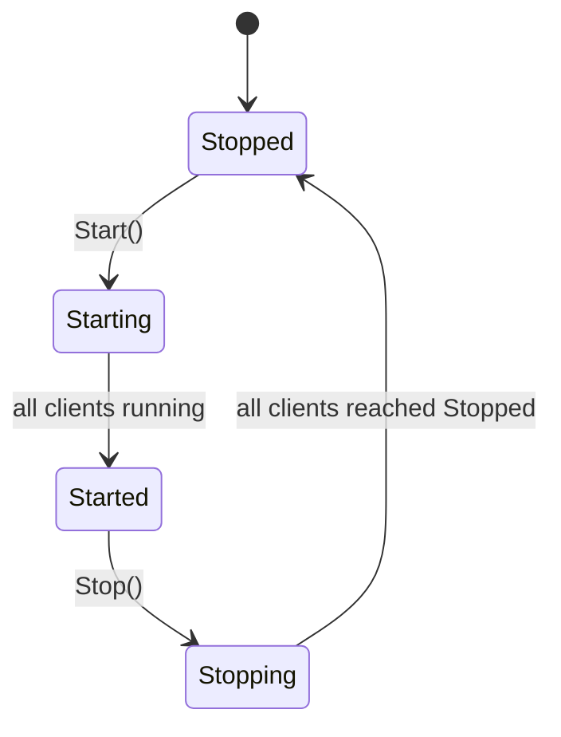

`modules/client-simulation/` is a **load-testing harness baked into the application**. Where you'd normally reach for k6, Locust, or JMeter, ABP ships a minimal in-process equivalent that spawns N background threads, each running an opinionated `Scenario` made of typed `ScenarioStep` instances against your own typed `HttpClient` services. The point isn't to replace a real load generator — it's to give you a one-click way to verify that **distributed concerns work** before a real load test: the cache survives concurrent invalidations, the distributed lock serialises writers, the OpenIddict token cache is shared, the background-job queue doesn't deadlock. Open the Razor page, press **Start**, watch the live stats; press **Stop** when you've seen what you need.

This page covers the entire module: the `Simulation` singleton, the `IClient` thread, the `Scenario` / `ScenarioStep` programming model, the snapshot DTOs that drive the live UI, and the two Razor pages.

## Architectural shape

```mermaid
flowchart TD
  options[ClientSimulationOptions<br/>ScenarioConfiguration list]
  sim[Simulation singleton] --> mgr[manage clients]
  sim -->|reads| options
  mgr -->|create N| client[IClient instances]
  client -->|owns| thread[Thread]
  thread -->|loop ProceedAsync| scenario[Scenario]
  scenario -->|steps[i]| step[ScenarioStep]
  step -->|ExecuteAsync| svc[Typed HTTP client / API]
  scenario -.snapshot.-> snap[SimulationSnapshot]
  ui[Razor /ClientSimulation page] -->|polls SimulationArea| sim
  ui -->|OnPostStart / OnPostStop| sim
```

Two key insights:

1. **Threads, not Tasks.** Each `IClient` runs on its own `Thread` and synchronously awaits scenario steps via `AsyncHelper.RunSync`. This deliberately consumes a thread per simulated client so the host's thread-pool pressure mirrors that of a "real" stressed server.
2. **Snapshots, not live state.** The UI never reads mutable state directly — `Simulation.CreateSnapshot()` produces immutable DTOs, which is what the Razor page renders. This keeps the UI safe from race conditions while the simulation runs.

## Projects

`modules/client-simulation/src/` contains two projects:

| Project | Purpose |
| --- | --- |
| `Volo.ClientSimulation` | Core engine — `Simulation`, `IClient` / `Client`, `Scenario`, `ScenarioStep`, `ScenarioConfiguration`, `SleepScenarioStep`, options, state enums, snapshot DTOs |
| `Volo.ClientSimulation.Web` | Razor Pages UI — `/ClientSimulation` (Start/Stop console), `/ClientSimulation/SimulationArea` (auto-polled stats table) |

`ClientSimulationModule` depends on `AbpHttpClientIdentityModelModule` so scenarios can authenticate against an OpenIddict / IdentityServer via the OIDC client-credentials flow before issuing HTTP calls.

## The options

```csharp
public class ClientSimulationOptions
{
    public List<ScenarioConfiguration> Scenarios { get; } = new();
}

public class ScenarioConfiguration
{
    public Type ScenarioType { get; }
    public int ClientCount { get; }

    public ScenarioConfiguration(Type scenarioType, int clientCount = 1)
    {
        ScenarioType = scenarioType;
        ClientCount = clientCount;
    }
}
```

You configure one or more scenarios at start-up, each with its own concurrency level:

```csharp
public class MyLoadTestModule : AbpModule
{
    public override void ConfigureServices(ServiceConfigurationContext context)
    {
        Configure<ClientSimulationOptions>(options =>
        {
            options.Scenarios.Add(new ScenarioConfiguration(typeof(ListBookScenario), clientCount: 25));
            options.Scenarios.Add(new ScenarioConfiguration(typeof(CreateBookScenario), clientCount: 5));
        });
    }
}
```

When `Simulation.Start()` runs it spawns 25 + 5 = 30 client threads. Each gets its **own** `ServiceProvider` scope so transient dependencies are independent per client.

## The `Simulation` singleton

```csharp
public class Simulation : ISingletonDependency, IDisposable
{
    public SimulationState State { get; private set; }    // Stopped / Starting / Started / Stopping
    public List<IClient> Clients { get; }

    protected IServiceScopeFactory ServiceScopeFactory { get; }
    protected IServiceScope ServiceScope { get; private set; }

    public virtual void Start()
    {
        lock (SyncObj)
        {
            if (State != SimulationState.Stopped) throw new UserFriendlyException(...);

            State = SimulationState.Starting;
            DisposeResources();
            ServiceScope = ServiceScopeFactory.CreateScope();

            foreach (var scenarioConfiguration in Options.Scenarios)
            {
                for (int i = 0; i < scenarioConfiguration.ClientCount; i++)
                {
                    var scenario = (Scenario)ServiceScope.ServiceProvider
                        .GetRequiredService(scenarioConfiguration.ScenarioType);

                    var client = ServiceScope.ServiceProvider.GetRequiredService<IClient>();
                    client.Stopped += Client_OnStopped;
                    client.Initialize(scenario);
                    Clients.Add(client);
                }
            }

            foreach (var client in Clients) client.Start();
            State = SimulationState.Started;
        }
    }

    public virtual void Stop()
    {
        lock (SyncObj)
        {
            if (State != SimulationState.Started) throw new UserFriendlyException(...);
            State = SimulationState.Stopping;
            foreach (var client in Clients) client.Stop();
        }
    }

    public virtual SimulationSnapshot CreateSnapshot() { ... }
}
```

State machine:



Three locking invariants:

- All public methods take `SyncObj` — Start, Stop, Snapshot can never interleave.
- Each `Client_OnStopped` re-checks the global state under the lock; the simulation flips to `Stopped` only when **every** client confirms it has exited its run loop.
- `Disposable` — releasing the singleton releases the scope so transient HTTP clients, typed HTTP clients, and per-scope distributed-lock handles are cleaned up.

## The client thread

```csharp
public class Client : IClient, ITransientDependency
{
    public event EventHandler Stopped;
    public ClientState State { get; private set; }    // Stopped / Running / Stopping

    protected Scenario Scenario { get; private set; }
    protected Thread ClientThread;

    public void Initialize(Scenario scenario) { ... Scenario = scenario; }

    public void Start()
    {
        lock (SyncLock)
        {
            if (State != ClientState.Stopped) throw new UserFriendlyException(...);
            State = ClientState.Running;
            Scenario.Reset();
            ClientThread = new Thread(Run);
            ClientThread.Start();
        }
    }

    private void Run()
    {
        while (true)
        {
            lock (SyncLock)
            {
                if (State != ClientState.Running)
                {
                    State = ClientState.Stopped;
                    ClientThread = null;
                    Stopped.InvokeSafely(this);
                    break;
                }
            }

            AsyncHelper.RunSync(() => Scenario.ProceedAsync());
        }
    }
}
```

The run loop is **just** "check the flag, advance one step, repeat". `Scenario.ProceedAsync` decides which step to call next.

## Scenarios and steps

A `Scenario` is a list of steps executed sequentially — when the last one finishes, execution wraps back to the first.

```csharp
public abstract class Scenario : ITransientDependency
{
    protected List<ScenarioStep> Steps { get; } = new();
    protected int CurrentStepIndex { get; set; }
    protected ScenarioExecutionContext ExecutionContext { get; }

    public virtual async Task ProceedAsync()
    {
        CheckStepCount();
        await Steps[CurrentStepIndex].RunAsync(ExecutionContext);
        CurrentStepIndex++;
        if (CurrentStepIndex >= Steps.Count) CurrentStepIndex = 0;
    }

    protected void AddStep(ScenarioStep step) => Steps.Add(step);
}
```

Each step records metrics around its body:

```csharp
public abstract class ScenarioStep
{
    protected int ExecutionCount, SuccessCount, FailCount;
    protected double TotalExecutionDuration, MinExecutionDuration, MaxExecutionDuration, LastExecutionDuration;

    public async Task RunAsync(ScenarioExecutionContext context)
    {
        await BeforeExecuteAsync(context);
        var stopwatch = Stopwatch.StartNew();
        try
        {
            await ExecuteAsync(context);
            SuccessCount++;
            LastExecutionDuration = stopwatch.Elapsed.TotalMilliseconds;
            TotalExecutionDuration += LastExecutionDuration;
            if (MinExecutionDuration > LastExecutionDuration) MinExecutionDuration = LastExecutionDuration;
            if (MaxExecutionDuration < LastExecutionDuration) MaxExecutionDuration = LastExecutionDuration;
        }
        catch (Exception ex)
        {
            FailCount++;
            context.ServiceProvider.GetService<ILogger<ScenarioStep>>().LogException(ex);
        }
        finally { ExecutionCount++; }
    }

    protected abstract Task ExecuteAsync(ScenarioExecutionContext context);
    protected virtual Task BeforeExecuteAsync(ScenarioExecutionContext context) => Task.CompletedTask;
}
```

| Metric | Aggregation |
| --- | --- |
| `ExecutionCount` | Incremented unconditionally in `finally` |
| `SuccessCount` | Incremented only when `ExecuteAsync` does not throw |
| `FailCount` | Incremented in `catch` — also logs the exception |
| `LastExecutionDuration`, `MinExecutionDuration`, `MaxExecutionDuration` | Tracked per success |
| `TotalExecutionDuration` / `SuccessCount` | The "avg" reported in snapshots |

### The execution context

`ScenarioExecutionContext` is the per-client scratchpad threaded through every step:

```csharp
public class ScenarioExecutionContext
{
    public IServiceProvider ServiceProvider { get; }
    public Dictionary<string, object> Properties { get; }

    public virtual void Reset() => Properties.Clear();
}
```

`Properties` is what you'd use to carry an authentication token, a created entity's id, or a paging cursor between steps inside the same scenario.

### The built-in `SleepScenarioStep`

```csharp
public class SleepScenarioStep : ScenarioStep
{
    public string Name { get; }
    public int Duration { get; }

    public SleepScenarioStep(string name, int duration = 1000) { ... }

    protected override Task ExecuteAsync(ScenarioExecutionContext context)
        => Task.Delay(Duration);

    public override string GetDisplayText() => base.GetDisplayText() + $" ({Name})";
}
```

Used to throttle scenarios — e.g. "GET, sleep 500ms, GET again" approximates a human user. Without sleeps, each client thread enters a tight loop and you're measuring raw throughput, which is what you want sometimes but not always.

## Authoring a scenario

```csharp
public class ListAndCreateBookScenario : Scenario
{
    public ListAndCreateBookScenario(IServiceProvider serviceProvider) : base(serviceProvider)
    {
        AddStep(new ListBooksStep());
        AddStep(new SleepScenarioStep("after-list", 200));
        AddStep(new CreateBookStep());
        AddStep(new SleepScenarioStep("after-create", 1000));
    }
}

public class ListBooksStep : ScenarioStep
{
    protected override async Task ExecuteAsync(ScenarioExecutionContext context)
    {
        var client = context.ServiceProvider.GetRequiredService<IBookAppService>();
        var page = await client.GetListAsync(new PagedAndSortedResultRequestDto { MaxResultCount = 25 });
        context.Properties["lastListCount"] = page.TotalCount;
    }
}

public class CreateBookStep : ScenarioStep
{
    protected override async Task ExecuteAsync(ScenarioExecutionContext context)
    {
        var client = context.ServiceProvider.GetRequiredService<IBookAppService>();
        await client.CreateAsync(new CreateBookDto { Name = $"sim-{Guid.NewGuid():N}" });
    }
}
```

`IBookAppService` is your normal ABP application service — when the host runs the scenario, the resolved instance is the dynamic HTTP proxy (because `ClientSimulationModule` depends on `AbpHttpClientIdentityModelModule`, which sets up authenticated typed `HttpClient`s).

## Snapshots and aggregation

Three snapshot DTO types form the live view:

| DTO | Carries |
| --- | --- |
| `SimulationSnapshot` | `State`, `Clients` (per-thread), `Scenarios` (aggregated summaries) |
| `ClientSnapshot` | `State`, `Scenario` (a `ScenarioSnapshot`) |
| `ScenarioSnapshot` | `DisplayText`, `Steps` (`List<ScenarioStepSnapshot>`), `CurrentStep` |
| `ScenarioStepSnapshot` | `ExecutionCount`, `SuccessCount`, `FailCount`, `Min/Max/Avg/LastExecutionDuration` |
| `ScenarioSummarySnapshot`, `ScenarioStepSummarySnapshot` | Roll-ups *across all clients of the same scenario type* |

`SimulationSnapshot.CreateSummaries()` does the roll-up:

```csharp
foreach (var client in Clients)
{
    var scenarioSummary = scenarioDictionary.GetOrAdd(client.Scenario.DisplayText, ...);
    foreach (var scenarioStep in client.Scenario.Steps)
    {
        var stepSummary = scenarioSummary.Steps.FirstOrDefault(s => s.DisplayText == scenarioStep.DisplayText) ?? add new;
        stepSummary.ExecutionCount += scenarioStep.ExecutionCount;
        stepSummary.SuccessCount   += scenarioStep.SuccessCount;
        stepSummary.FailCount      += scenarioStep.FailCount;
        stepSummary.TotalExecutionDuration += scenarioStep.TotalExecutionDuration;
        // Min/Max merged, Avg recomputed
        stepSummary.AvgExecutionDuration = stepSummary.SuccessCount == 0
            ? 0.0 : stepSummary.TotalExecutionDuration / stepSummary.SuccessCount;
    }
}
```

That's exactly what the UI table shows: one row per (scenario, step) pair with the merged counts and durations across all client threads.

## The Razor UI

```
modules/client-simulation/src/Volo.ClientSimulation.Web/Pages/ClientSimulation/
├── Index.cshtml(.cs)         # outer page (cards, header, container)
├── SimulationArea.cshtml(.cs)# polled fragment with stats + start/stop buttons
├── SimulationArea.js         # client-side polling loop (setInterval → GET partial)
└── SimulationArea.scss/.css  # styles
```

`Index.cshtml.cs` is a no-op `Task.FromResult(Page())`. The interesting page model is `SimulationAreaModel`:

```csharp
public class SimulationAreaModel : PageModel
{
    public SimulationSnapshot Snapshot { get; private set; }
    protected Simulation Simulation { get; }

    public virtual Task<IActionResult> OnGetAsync()
    {
        Snapshot = Simulation.CreateSnapshot();
        return Task.FromResult<IActionResult>(Page());
    }

    public virtual async Task<IActionResult> OnPostStartAsync()
    {
        Simulation.Start();
        return new NoContentResult();
    }

    public virtual async Task<IActionResult> OnPostStopAsync()
    {
        Simulation.Stop();
        return new NoContentResult();
    }
}
```

`SimulationArea.js` polls the GET endpoint every second (or two) and re-renders the table from the returned partial. The whole UI is one Razor partial — there is no SignalR or WebSocket dependency.

## Wire-up example

```csharp
[DependsOn(typeof(ClientSimulationWebModule),
           typeof(BookStoreHttpApiClientModule))]
public class BookStoreLoadTestModule : AbpModule
{
    public override void ConfigureServices(ServiceConfigurationContext context)
    {
        Configure<ClientSimulationOptions>(options =>
        {
            options.Scenarios.Add(new ScenarioConfiguration(typeof(ListAndCreateBookScenario), 50));
        });
    }
}
```

The Razor page lives at `/ClientSimulation`. Wrap it in your standard host authentication and a custom permission if you don't want everyone to be able to start load.

<Warning>
  This module spawns **threads inside your host process**. Running a 1000-client simulation against the same host that's serving the simulation UI will saturate the thread-pool and the UI will become unresponsive. For real load testing, point this module at a *different* host than the one you're stressing, or use [k6](https://k6.io)/Locust externally.
</Warning>

## Where it really shines

<CardGroup cols={2}>
  <Card title="Distributed cache verification" icon="memory">
    Multiple clients hammer endpoints that read/write [distributed cache](/caching/distributed-cache) entries. Watch the `FailCount` go non-zero if eviction races aren't handled.
  </Card>
  <Card title="Distributed lock contention" icon="lock">
    Two scenarios both `AcquireAsync` the same lock key. Observe latency in `AvgExecutionDuration` reflect the contention. See [distributed lock](/background/distributed-locking).
  </Card>
  <Card title="Background-job queue throughput" icon="list-check">
    A scenario that calls `IBackgroundJobManager.EnqueueAsync` in a loop, while another scenario polls counts. Useful to size [Hangfire](/background/hangfire) workers or the [Background Jobs module](/modules/background-jobs-module) queue.
  </Card>
  <Card title="OpenIddict token cache" icon="key">
    Verify your OpenIddict deployment's distributed token cache works under heavy concurrent client-credentials grants.
  </Card>
</CardGroup>

## Extension points

<CardGroup cols={2}>
  <Card title="Custom step types" icon="layer-group">
    Subclass `ScenarioStep` for retries, parameterised inputs, or HTTP-status assertions. Override `BeforeExecuteAsync` to seed `context.Properties`.
  </Card>
  <Card title="Per-client identity" icon="user">
    In `ExecuteAsync`, resolve `IAccessTokenManager` and call `GetTokenAsync` with per-client credentials so concurrent clients exercise different users.
  </Card>
  <Card title="Custom UI" icon="window-maximize">
    Override `SimulationAreaModel` to render extra charts (D3, Chart.js) — the underlying `Simulation.CreateSnapshot()` already gives you the raw counts.
  </Card>
  <Card title="Programmatic Start/Stop" icon="play">
    Inject `Simulation` in any background worker or integration test and call `Start()` / `Stop()` directly — the Razor page is just one consumer.
  </Card>
</CardGroup>

## Cross-references

- [Background jobs](/background/background-jobs), [Background jobs module](/modules/background-jobs-module) — common load-test target.
- [Distributed cache](/caching/distributed-cache) — verify behavior under concurrent reads/writes.
- [Distributed lock](/background/distributed-locking) — measure contention.
- [Security and claims](/auth/security-and-claims) — `ClientSimulationModule` depends on `AbpHttpClientIdentityModelModule` for authenticated HTTP calls.
- [MVC UI themes](/aspnetcore/mvc-ui-themes), [MVC UI bundling](/aspnetcore/mvc-ui-bundling) — the UI lives inside your themed host.
- [Modules overview](/modules/overview) — module catalog index.
