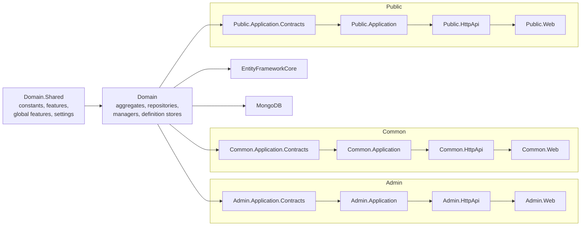
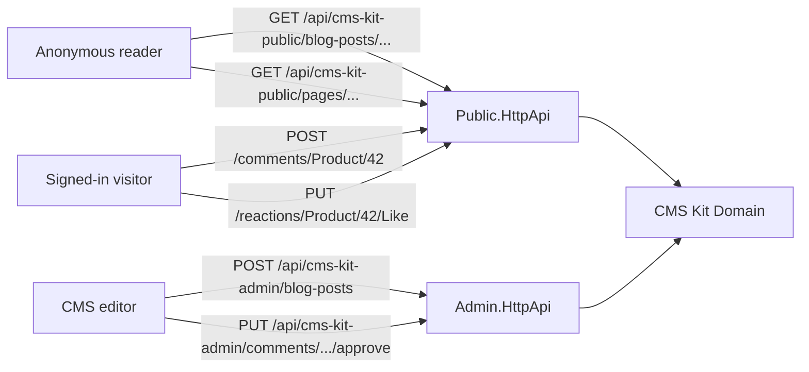

`modules/cms-kit/` is the biggest application module ABP ships. Rather than being one monolithic CMS, it's a **toolbox of reusable CMS aggregates** — Pages, Blogs, Comments, Reactions, Ratings, Tags, Menus, Media descriptors, Global resources, Marked items — each of which can be enabled or disabled independently through the [global feature](/crosscut/global-features) system. Any aggregate that supports "attaching to your entities" (Comments, Reactions, Ratings, Tags, Marked items, Media) does so via two strings — `EntityType` and `EntityId` — so a single Comment row can target your `Product`, your `Question`, or a `BlogPost` from inside the CMS itself, all from the same store.

This page is a directed tour through the module: project layout, every aggregate root, the Admin / Common / Public application service split, and the HTTP endpoint surface. Use it as a reference when you wire CMS Kit into an existing solution or extend any of its aggregates.

## Project layout

`modules/cms-kit/src/` contains **twenty-five** projects. Functionally they cluster into three application layers — **Admin**, **Common**, and **Public** — each with the standard Contracts / Application / HttpApi / HttpApi.Client / Web stack, plus shared Domain and persistence:



| Project | Purpose |
| --- | --- |
| `Volo.CmsKit.Domain.Shared` | Constants, error codes, **`CmsKitFeatures`** (tenant-toggleable features), **`GlobalCmsKitFeatures`** (deployment-time toggles), `CmsKitSettings`, localization resource |
| `Volo.CmsKit.Domain` | All aggregate roots, repository interfaces, managers (`BlogManager`, `BlogPostManager`, `PageManager`, `CommentManager`, `TagManager`, `RatingManager`, `ReactionManager`, `MediaDescriptorManager`, `MarkedItemManager`, `GlobalResourceManager`, `MenuItemManager`, `EntityTagManager`), definition stores, `CmsUser` (a local copy of the user, kept in sync via `CmsUserSynchronizer`) |
| `Volo.CmsKit.EntityFrameworkCore`, `Volo.CmsKit.MongoDB` | Persistence — `CmsKitDbContext`, model-creating extensions, EF/Mongo repositories |
| `Volo.CmsKit.Admin.*` (5 projects) | Authoring APIs and admin UI — create/update/delete pages, blogs, posts, menu items, tags, comments moderation, media management |
| `Volo.CmsKit.Common.*` (4 projects) | Cross-cutting endpoints used by both admin and public — tag listing, media descriptors, blog feature toggles, menu invalidation handler |
| `Volo.CmsKit.Public.*` (5 projects) | Reader-facing APIs — list published pages, render blog posts, post comments, submit reactions/ratings, mark items |
| `Volo.CmsKit.HttpApi`, `Volo.CmsKit.HttpApi.Client`, `Volo.CmsKit.Web` | Shared host bundles that depend on Admin+Common+Public to expose everything in one app |
| `Volo.CmsKit.Installer` | NuGet metadata for `abp install-module` |

<Info>
  You can deploy the three application layers as **separate microservices** — keep `Admin.HttpApi` behind an editor's intranet, and expose `Public.HttpApi` (`/api/cms-kit-public/*`) to the public internet. The `Common` layer ships with both.
</Info>

## Global features and tenant features

Every cluster of aggregates lives behind two toggle layers:

| Layer | Type | Where defined | Effect |
| --- | --- | --- | --- |
| Global feature | `GlobalFeature` (compile/start-up) | `GlobalCmsKitFeatures` | If `Disabled`, the matching controllers/Razor pages return 404 and the corresponding `Configure*` methods skip the DbContext model. |
| Tenant feature | `IFeatureDefinitionProvider` | `CmsKitFeatures` (e.g. `CmsKitFeatures.BlogEnable`) | If a tenant has the feature off, controllers raise a `RequiresFeatureException`. |

```csharp
public class GlobalCmsKitFeatures : GlobalModuleFeatures
{
    public const string ModuleName = "CmsKit";

    public ReactionsFeature       Reactions       { get; }
    public CommentsFeature        Comments        { get; }
    public MediaFeature           Media           { get; }
    public RatingsFeature         Ratings         { get; }
    public TagsFeature            Tags            { get; }
    public PagesFeature           Pages           { get; }
    public BlogsFeature           Blogs           { get; }
    public CmsUserFeature         User            { get; }
    public MenuFeature            Menu            { get; }
    public GlobalResourcesFeature GlobalResources { get; }
    public BlogPostScrollIndexFeature BlogPostScrollIndex { get; }
    public MarkedItemsFeature     MarkedItemsFeature { get; }
}
```

Enable the ones you need in your application module:

```csharp
public override void PreConfigureServices(ServiceConfigurationContext context)
{
    GlobalFeatureManager.Instance.Modules.CmsKit(cms =>
    {
        cms.Blogs.Enable();
        cms.Pages.Enable();
        cms.Comments.Enable();
        cms.Tags.Enable();
    });
}
```

See [global features](/crosscut/global-features) for the activation pipeline.

## Domain aggregates

The `Volo.CmsKit.Domain` project organises aggregates by folder. Each folder owns its aggregate + repository + manager + domain exception + (where applicable) definition store.

### Authoring aggregates (Pages, Blogs, Blog posts)

| Aggregate | File | Key fields |
| --- | --- | --- |
| `Page` | `Pages/Page.cs` | `Title`, `Slug`, `Content`, `Script`, `Style`, `IsHomePage`, `LayoutName`, `Status` (`Draft` / `Published`), `EntityVersion` |
| `Blog` | `Blogs/Blog.cs` | `Name`, `Slug` |
| `BlogPost` | `Blogs/BlogPost.cs` | `BlogId`, `Title`, `Slug`, `ShortDescription`, `Content`, `CoverImageMediaId`, `AuthorId`, `Status` (`Draft` / `Published`), `EntityVersion` |
| `BlogFeature` | `Blogs/BlogFeature.cs` | `BlogId`, `FeatureName`, `IsEnabled` — per-blog overrides of CmsKitFeatures |
| `MenuItem` | `Menus/MenuItem.cs` | `ParentId`, `DisplayName`, `Url`, `Icon`, `IsActive`, `RequiredPermissionName`, `Target`, `ElementId`, `CssClass` |
| `GlobalResource` | `GlobalResources/GlobalResource.cs` | `Name`, `Value` — site-wide CSS/JS/HTML snippets |

```csharp
public class BlogPost : FullAuditedAggregateRoot<Guid>, IMultiTenant, IHasEntityVersion
{
    public virtual Guid BlogId { get; protected set; }
    [NotNull] public virtual string Title { get; protected set; }
    [NotNull] public virtual string Slug { get; protected set; }
    [NotNull] public virtual string ShortDescription { get; protected set; }
    public virtual string Content { get; protected set; }
    public Guid? CoverImageMediaId { get; set; }
    public virtual Guid? TenantId { get; protected set; }
    public Guid AuthorId { get; set; }
    public virtual CmsUser Author { get; set; }
    public virtual BlogPostStatus Status { get; set; }
    public virtual int EntityVersion { get; protected set; }
}
```

`IHasEntityVersion` ensures concurrency conflicts surface as `AbpDbConcurrencyException` rather than silent overwrites. Slug uniqueness is enforced by `BlogPostManager` and surfaces as `BlogPostSlugAlreadyExistException` (also see `BlogSlugAlreadyExistException`, `PageSlugAlreadyExistsException`, `MultipleHomePageException` for sibling domain exceptions).

### "Attach to anything" aggregates

Every aggregate below stores `EntityType` + `EntityId` as strings so it can target any entity in the host application — your domain or another CMS Kit aggregate.

| Aggregate | File | Key fields | Definition store |
| --- | --- | --- | --- |
| `Comment` | `Comments/Comment.cs` | `EntityType`, `EntityId`, `Text`, `RepliedCommentId`, `CreatorId`, `IsApproved`, `Url` | `ICommentEntityTypeDefinitionStore` |
| `UserReaction` | `Reactions/UserReaction.cs` | `EntityType`, `EntityId`, `ReactionName`, `CreatorId` | `IReactionDefinitionStore` |
| `Rating` | `Ratings/Rating.cs` | `EntityType`, `EntityId`, `StarCount` (1–5), `CreatorId` | `IRatingEntityTypeDefinitionStore` |
| `Tag` + `EntityTag` | `Tags/Tag.cs`, `Tags/EntityTag.cs` | `Tag.EntityType`, `Tag.Name`; `EntityTag(TagId, EntityId)` | `ITagDefinitionStore` |
| `UserMarkedItem` | `MarkedItems/UserMarkedItem.cs` | `EntityType`, `EntityId`, `CreatorId` (bookmarks / favorites / wishlist) | `IMarkedItemDefinitionStore` |
| `MediaDescriptor` | `MediaDescriptors/MediaDescriptor.cs` | `EntityType`, `Name`, `MimeType`, `Size` — pairs with a BLOB in [BLOB storing](/blob/blob-storing-overview) | `IMediaDescriptorDefinitionStore` |

```csharp
public class Comment : AggregateRoot<Guid>, IHasCreationTime, IMustHaveCreator, IMultiTenant
{
    public virtual Guid? TenantId { get; protected set; }
    public virtual string EntityType { get; protected set; }
    public virtual string EntityId { get; protected set; }
    public virtual string Text { get; protected set; }
    public virtual Guid? RepliedCommentId { get; protected set; }
    public virtual Guid CreatorId { get; set; }
    public virtual DateTime CreationTime { get; set; }
    public virtual string Url { get; set; }
    public virtual string IdempotencyToken { get; set; }
    public virtual bool? IsApproved { get; private set; }
}
```

The **definition store** is the registration system: at start-up your application calls `Configure<CmsKitCommentOptions>(o => o.EntityTypes.Add(new CommentEntityTypeDefinition("Product")))`. From then on `CommentPublicAppService.CreateAsync("Product", "...", "...")` will accept the entity type; calling it with an unregistered type throws `EntityNotCommentableException`.

### User aggregate

| Aggregate | File | Purpose |
| --- | --- | --- |
| `CmsUser` | `Users/CmsUser.cs` | A local **read-model** of users, kept in sync with the [Identity](/modules/identity) module via `CmsUserSynchronizer` (an `ILocalEventHandler<EntityCreatedEventData<IdentityUser>>` etc.). Stores only `UserName`, `Email`, `Name`, `Surname`, `IsActive`, `EmailConfirmed`, `PhoneNumber`, `PhoneNumberConfirmed`. |

```csharp
public class CmsUser : AggregateRoot<Guid>, IUser, IUpdateUserData
{
    public CmsUser(IUserData user) : base(user.Id)
    {
        TenantId = user.TenantId;
        UpdateInternal(user);
    }
}
```

Why a local copy? Because CMS aggregates reference `AuthorId` and need to render names/avatars without round-tripping to the Identity module — which may be a [microservice](/templates/overview) on the other side of a network call. See the [Users module](/modules/users) for the underlying `IUserData` contract this aggregate implements.

## Domain services (managers)

Every aggregate cluster has a manager that validates invariants — slug uniqueness, definition-store membership, max-rating range, comment depth, marked-item single-toggle — before the repository writes.

| Manager | Enforces |
| --- | --- |
| `BlogManager`, `BlogPostManager` | Slug uniqueness scoped to blog, status transitions, blog deletion cascade |
| `PageManager` | Slug uniqueness, single home page (`MultipleHomePageException`), version increment |
| `MenuItemManager` | Cycle-free parent chain, depth limits, default menu rules |
| `CommentManager` | Reply-depth limit, throws `EntityNotCommentableException` for unregistered entity types |
| `ReactionManager` | Definition-store membership, one reaction per `(user, entity, name)` |
| `RatingManager` | 1–5 star range, definition-store membership, one rating per `(user, entity)` |
| `TagManager`, `EntityTagManager` | Tag-name uniqueness per entity type, throws `TagAlreadyExistException` |
| `MediaDescriptorManager` | Mime type + size validation against `MediaDescriptorDefinition` |
| `MarkedItemManager` | Toggle semantics, definition-store membership |
| `GlobalResourceManager` | Name uniqueness |
| `BlogFeatureManager` | Per-blog feature override merge with `IDefaultBlogFeatureProvider` |

`CmsKitDomainServiceBase` is the common base — gives each manager `Clock`, `GuidGenerator`, `CurrentTenant`, and the localization resource.

## Application services — by layer

### Admin application services

Authoring endpoints. Every controller is `[Authorize(CmsKitAdminPermissions.Xxx.Default)]` and decorated with `[RequiresGlobalFeature(typeof(XxxFeature))]` + `[RequiresFeature(CmsKitFeatures.XxxEnable)]`.

| App service | Controller | Base route | Permission group |
| --- | --- | --- | --- |
| `IBlogAdminAppService` | `BlogAdminController` | `api/cms-kit-admin/blogs` | `CmsKitAdmin.Blogs` |
| `IBlogPostAdminAppService` | `BlogPostAdminController` | `api/cms-kit-admin/blog-posts` | `CmsKitAdmin.BlogPosts` |
| `IBlogFeatureAdminAppService` | `BlogFeatureAdminController` | `api/cms-kit-admin/blog-features` | `CmsKitAdmin.Blogs.Update` |
| `IPageAdminAppService` | `PageAdminController` | `api/cms-kit-admin/pages` | `CmsKitAdmin.Pages` |
| `IMenuItemAdminAppService` | `MenuItemAdminController` | `api/cms-kit-admin/menu-items` | `CmsKitAdmin.Menus` |
| `ITagAdminAppService` | `TagAdminController` | `api/cms-kit-admin/tags` | `CmsKitAdmin.Tags` |
| `IEntityTagAdminAppService` | `EntityTagAdminController` | `api/cms-kit-admin/entity-tags` | `CmsKitAdmin.Tags` |
| `ICommentAdminAppService` | `CommentAdminController` | `api/cms-kit-admin/comments` | `CmsKitAdmin.Comments` |
| `IMediaDescriptorAdminAppService` | `MediaDescriptorAdminController` | `api/cms-kit-admin/media-descriptors` | `CmsKitAdmin.MediaDescriptors` |
| `IGlobalResourceAdminAppService` | `GlobalResourceAdminController` | `api/cms-kit-admin/global-resources` | `CmsKitAdmin.GlobalResources` |

Typical controller wiring:

```csharp
[RequiresFeature(CmsKitFeatures.PageEnable)]
[RequiresGlobalFeature(typeof(PagesFeature))]
[Authorize(CmsKitAdminPermissions.Pages.Default)]
[Route("api/cms-kit-admin/pages")]
public class PageAdminController : CmsKitAdminController, IPageAdminAppService
{
    [HttpGet, Route("{id}")]
    public virtual Task<PageDto> GetAsync(Guid id) => PageAdminAppService.GetAsync(id);

    [HttpPost, Authorize(CmsKitAdminPermissions.Pages.Create)]
    public virtual Task<PageDto> CreateAsync(CreatePageInputDto input)
        => PageAdminAppService.CreateAsync(input);

    [HttpPut, Authorize(CmsKitAdminPermissions.Pages.Update)]
    public virtual Task<PageDto> UpdateAsync(Guid id, UpdatePageInputDto input) => ...;
}
```

### Common application services

Used by both admin and public surfaces.

| App service | Controller | Purpose |
| --- | --- | --- |
| `ITagAppService` | (Common controller) | List tags by entity type, autocomplete |
| `IMediaDescriptorAppService` | — | Stream a media BLOB by id (delegates to [BLOB storing](/blob/blob-storing-overview)) |
| `IBlogFeatureAppService` | — | Read effective feature values for a blog |

`BlogFeatureChangedHandler` and `MenuChangedHandler` are common-layer event handlers that invalidate caches when admin edits propagate.

### Public application services

Reader-facing endpoints. Anonymous-friendly with optional auth (`[AllowAnonymous]` with creator-id capture when signed in).

| App service | Controller | Base route | Notable operations |
| --- | --- | --- | --- |
| `IBlogPostPublicAppService` | `BlogPostPublicController` | `api/cms-kit-public/blog-posts` | `GetAsync(blogSlug, postSlug)`, `GetListAsync`, tag/author filters |
| `IPagePublicAppService` | `PagesPublicController` | `api/cms-kit-public/pages` | `GetBySlugAsync`, `GetHomePageAsync` |
| `IMenuItemPublicAppService` | `MenuItemPublicController` | `api/cms-kit-public/menu-items` | Tree for navigation |
| `IGlobalResourcePublicAppService` | `GlobalResourcePublicController` | `api/cms-kit-public/global-resources` | Site-wide CSS/JS snippets |
| `ICommentPublicAppService` | `CommentPublicController` | `api/cms-kit-public/comments` | `GET {entityType}/{entityId}`, `POST {entityType}/{entityId}`, `PUT {id}`, `DELETE {id}` |
| `IReactionPublicAppService` | `ReactionPublicController` | `api/cms-kit-public/reactions` | `GET {entityType}/{entityId}`, `PUT/DELETE {entityType}/{entityId}/{reaction}` |
| `IRatingPublicAppService` | `RatingPublicController` | `api/cms-kit-public/ratings` | `PUT/DELETE/GET {entityType}/{entityId}` |
| `ITagPublicAppService` | `TagPublicController` | `api/cms-kit-public/tags` | List tags, get popular tags by entity type |
| `IMarkedItemPublicAppService` | `MarkedItemPublicController` | `api/cms-kit-public/marked-items` | Toggle bookmark, list marked items for current user |

### Endpoint patterns at a glance



## Persistence

`Volo.CmsKit.EntityFrameworkCore.CmsKitDbContext` declares a `DbSet<>` for every aggregate. Tables are prefixed `Cms*` (configurable via `AbpCmsKitDbProperties.DbTablePrefix`). Composite indexes target the common access patterns:

- `Comment(EntityType, EntityId, CreationTime)`
- `UserReaction(EntityType, EntityId, ReactionName)`
- `Rating(EntityType, EntityId, CreatorId)` unique
- `Tag(EntityType, Name)` unique
- `EntityTag(EntityId, TagId)` unique
- `BlogPost(BlogId, Slug)` unique
- `Page(Slug)` unique per tenant

MongoDB persistence mirrors the same documents one per collection. Both back-ends honour `IMultiTenant` via the standard ABP filters — multi-tenant CMS deployments share a database with `TenantId` discrimination.

<Note>
  CMS Kit deliberately does not own a [BLOB storing](/blob/blob-storing-overview) container — `MediaDescriptor` carries only the metadata (mime, size, name) while the bytes live in whichever container you configure (`cms-kit-media` is the default container name). Pair this module with the [Database BLOB provider](/modules/blob-storing-database) or an S3 container.
</Note>

## Razor / Blazor UI

Each application layer ships a `Web` companion that provides the UI:

| Project | UI |
| --- | --- |
| `Volo.CmsKit.Admin.Web` | `/CmsKit/Pages`, `/CmsKit/Blogs`, `/CmsKit/BlogPosts`, `/CmsKit/Menu`, `/CmsKit/Tags`, `/CmsKit/Comments` (moderation), `/CmsKit/MediaDescriptors`, `/CmsKit/GlobalResources` |
| `Volo.CmsKit.Common.Web` | Tag-input widget, media uploader, language switcher additions |
| `Volo.CmsKit.Public.Web` | Reader pages — `/cms-kit/pages/{slug}`, `/cms-kit/blogs/{blogSlug}`, `/cms-kit/blogs/{blogSlug}/{postSlug}`, comment thread view-components, reaction picker, rating widget, tag cloud |

The public UI relies on the [Basic Theme](/modules/basic-theme) (or your installed theme) for layout — see [MVC UI themes](/aspnetcore/mvc-ui-themes). Bundles register through [the bundling system](/aspnetcore/mvc-ui-bundling).

## Extension points

<CardGroup cols={2}>
  <Card title="Register your own commentable entity" icon="comment">
    `Configure<CmsKitCommentOptions>(o => o.EntityTypes.Add(new CommentEntityTypeDefinition("Product")))`. Now `POST /api/cms-kit-public/comments/Product/{id}` is valid.
  </Card>
  <Card title="Add a reaction" icon="thumbs-up">
    `Configure<CmsKitReactionOptions>(o => o.Definitions.Add(new ReactionDefinition("Confused", icon: "...")))` — and bind it to an entity type with `EntityTypes.AddOrUpdate(...)`.
  </Card>
  <Card title="Custom rating range" icon="star">
    Override `RatingManager.SetStarAsync` — the base method enforces 1..5 via `RatingEntityTypeDefinition.MaxStarCount`.
  </Card>
  <Card title="Approval workflow for comments" icon="check">
    Configure `CmsKitCommentOptions.IsApprovementEnabled = true`. New comments persist with `IsApproved == null` until an admin calls `CommentAdminAppService.ApproveAsync`.
  </Card>
  <Card title="Custom page layouts" icon="window-maximize">
    `Page.LayoutName` is a string. Map it in your Razor host: `ViewData["Layout"] = page.LayoutName ?? "_DefaultCmsLayout"`.
  </Card>
  <Card title="User read-model" icon="user">
    `CmsUserSynchronizer` listens to Identity events. Subclass it to add your own per-user metadata (profile picture URL, biography) to the local `CmsUser` aggregate.
  </Card>
</CardGroup>

## Cross-references

- [Modules overview](/modules/overview) — full module catalog with replaceability guide.
- [Global features](/crosscut/global-features) — how `GlobalCmsKitFeatures.Blogs.Enable()` removes code paths at compile/start-up.
- [Feature management](/modules/feature-management) — runtime per-tenant feature toggles backing `CmsKitFeatures`.
- [Permission management](/modules/permission-management) — backs every `[Authorize(CmsKitAdminPermissions.*)]`.
- [Identity module](/modules/identity) — source of truth for the user; `CmsUser` mirrors it.
- [Users module](/modules/users) — `IUserData` / `IUser` abstractions implemented by `CmsUser`.
- [BLOB Storing overview](/blob/blob-storing-overview) — `MediaDescriptor` pairs with a BLOB container.
- [Audit logging](/modules/audit-logging) — every admin write is captured.
- [Security & claims](/auth/security-and-claims) — `[Authorize]` semantics on the controllers.
- [MVC UI themes](/aspnetcore/mvc-ui-themes), [MVC UI bundling](/aspnetcore/mvc-ui-bundling) — host integration for the Razor surface.
