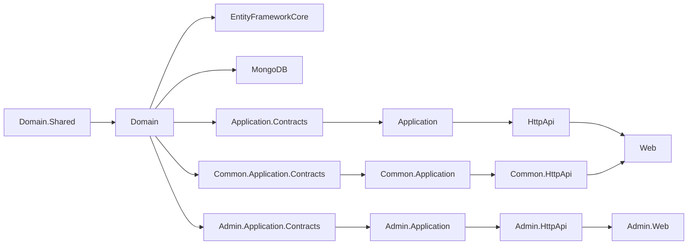
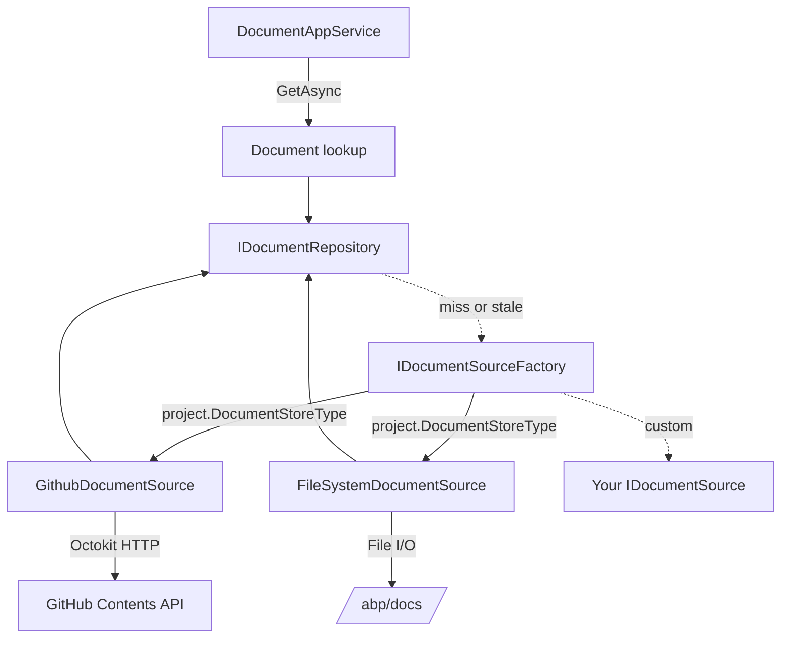
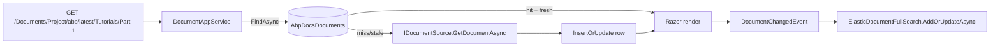
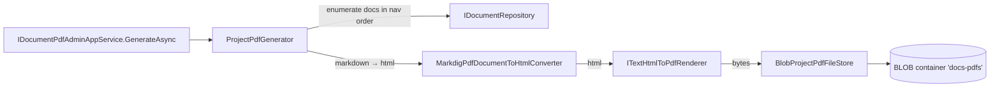

`modules/docs/` is the documentation engine ABP uses to publish [https://abp.io/docs](https://abp.io/docs) itself. It's a real ABP module — not a static-site generator — so the same DDD layout, multi-tenancy, permissions, BLOB integration, and dynamic HTTP API surface that you would find in [Identity](/modules/identity) apply here too. Documents are **fetched from a configurable source** (GitHub repository, local file system, or your own implementation), parsed (Markdown by default), cached in the database, optionally indexed in Elasticsearch for full-text search, and rendered through Razor pages that respect the active [theme](/aspnetcore/mvc-ui-themes).

This page walks the module top to bottom: its layered project layout, the `Project` and `Document` aggregates, the `IDocumentSource` strategy (GitHub vs FileSystem), navigation/parameter resolution, full-text search via Elasticsearch, the admin / common / public split, and the PDF pipeline.

## Projects

`modules/docs/src/` ships nineteen projects organised into an **Admin / Common / Public** split, all sharing a single Domain. Like CMS Kit, you can run the three layers as separate microservices behind one Razor host.

| Project | Purpose |
| --- | --- |
| `Volo.Docs.Domain.Shared` | Constants, `DocsRemoteServiceConsts.ModuleName = "docs"`, language config, settings, localization resource |
| `Volo.Docs.Domain` | `Project` and `Document` aggregates, `IProjectRepository`, `IDocumentRepository`, `IDocumentSource` + `IDocumentSourceFactory`, `GithubDocumentSource`, `FileSystemDocumentSource`, Elastic search adapter, PDF generation pipeline |
| `Volo.Docs.EntityFrameworkCore`, `Volo.Docs.MongoDB` | Persistence |
| `Volo.Docs.Application.Contracts` | Public reader `IDocumentAppService` DTOs, `DocsPermissions` |
| `Volo.Docs.Application` | `DocumentAppService` implementation |
| `Volo.Docs.HttpApi`, `HttpApi.Client` | `DocsDocumentController` at `api/docs/documents` + dynamic proxies |
| `Volo.Docs.Common.Application.Contracts` | `IProjectAppService`, `IDocumentPdfAppService` — shared between admin and public |
| `Volo.Docs.Common.Application`, `Common.HttpApi`, `Common.HttpApi.Client` | Project listing + PDF download endpoints |
| `Volo.Docs.Admin.Application.Contracts` | Authoring services — `IProjectAdminAppService`, `IDocumentAdminAppService`, `IDocumentPdfAdminAppService`, `DocsAdminPermissions` |
| `Volo.Docs.Admin.Application`, `Admin.HttpApi`, `Admin.HttpApi.Client` | Project CRUD, manual document pull/reindex, PDF generation triggers |
| `Volo.Docs.Admin.Web` | `/Docs/Admin/Projects`, `/Docs/Admin/Documents` Razor pages |
| `Volo.Docs.Web` | Public Razor surface — `/Documents/Project/{name}/{version?}/{*documentName}` |
| `Volo.Docs.Installer` | NuGet metadata for `abp install-module` |



## The `Project` aggregate

A `Project` represents one documentation set (e.g. `abp`, `abp-commercial`). It carries everything the navigation and document loader needs.

```csharp
public class Project : AggregateRoot<Guid>
{
    public virtual string Name { get; protected set; }
    public virtual string ShortName { get; protected set; }                // URL slug
    public virtual string Format { get; protected set; }                   // "md" or "html"
    public virtual string DefaultDocumentName { get; protected set; }      // homepage doc
    public virtual string NavigationDocumentName { get; protected set; }   // sidebar index
    public virtual string ParametersDocumentName { get; protected set; }   // {{Parameter}} dictionary
    public virtual string MinimumVersion { get; set; }
    public virtual string DocumentStoreType { get; protected set; }        // "GitHub" or "FileSystem"
    public virtual string MainWebsiteUrl { get; set; }
    public virtual string LatestVersionBranchName { get; set; }
    public virtual string ExtraProperties { get; set; }                    // JSON, e.g. GitHub repo URL
    public virtual DateTime CreationTime { get; set; }
    public virtual DateTime LastSignificantUpdateTime { get; set; }
}
```

`ExtraProperties` is the trick that lets `Project` stay back-end agnostic. The GitHub source reads `GitHubRootUrl`, `GitHubUserAgent`, `GitHubAccessToken`; the file-system source reads `Path`. New sources can read their own keys without changing the aggregate.

`ProjectShortNameAlreadyExistsException` enforces uniqueness through `ProjectManager`. `ProjectWithoutDetails` is a projection DTO used when the navigation only needs `Id`, `Name`, `ShortName`.

## The `Document` aggregate

```csharp
public class Document : AggregateRoot<Guid>
{
    public virtual Guid ProjectId { get; protected set; }
    public virtual string Name { get; protected set; }            // e.g. "Getting-Started.md"
    public virtual string Version { get; protected set; }         // "5.0.0", "latest", "dev"
    public virtual string LanguageCode { get; protected set; }    // "en", "tr", ...
    public virtual string FileName { get; set; }
    public virtual string Content { get; set; }                   // Raw markdown / HTML
    public virtual string Format { get; set; }
    public virtual string EditLink { get; set; }
    public virtual string RootUrl { get; set; }
    public virtual string RawRootUrl { get; set; }
    public virtual string LocalDirectory { get; set; }
    public virtual DateTime CreationTime { get; set; }
    public virtual DateTime LastUpdatedTime { get; set; }
    public virtual DateTime? LastSignificantUpdateTime { get; set; }
    public virtual DateTime LastCachedTime { get; set; }
    public virtual List<DocumentContributor> Contributors { get; set; }
}
```

| Field | Role |
| --- | --- |
| `(ProjectId, Name, Version, LanguageCode)` | Composite uniqueness — one Document row per file per version per language. |
| `Content` | The fetched source. Stored verbatim — markdown parsing happens later in the Razor renderer. |
| `LastCachedTime` | Drives the cache-invalidation logic: if older than `DocsDomainConsts.CacheLastUpdatedTimeMinutes`, the source is re-fetched. |
| `EditLink`, `RootUrl`, `RawRootUrl` | Generated from the source-specific context — GitHub returns `https://github.com/.../edit/dev/...` so the "Edit this page" link works. |
| `Contributors` | Populated only by `GithubDocumentSource` via Octokit. |

Sibling projections `DocumentWithoutContent` and `DocumentWithoutDetails` keep listing endpoints fast.

`DocumentResource` is a sidecar value type that carries a raw `byte[]` payload — used to serve images referenced from the markdown.

```csharp
public class DocumentResource
{
    public byte[] Content { get; }
    public DocumentResource(byte[] content) => Content = content;
}
```

## Document sources

The `IDocumentSource` strategy decouples document storage from the aggregate. The contract:

```csharp
public interface IDocumentSource : IDomainService
{
    Task<Document> GetDocumentAsync(Project project, string documentName, string languageCode, string version, DateTime? lastKnownSignificantUpdateTime = null);
    Task<List<VersionInfo>> GetVersionsAsync(Project project);
    Task<DocumentResource> GetResource(Project project, string resourceName, string languageCode, string version);
    Task<LanguageConfig> GetLanguageListAsync(Project project, string version);
}
```



### `GithubDocumentSource`

The default source for abp.io/docs. Loads documents from a GitHub repository via Octokit:

- Reads raw content from `raw.githubusercontent.com/{owner}/{repo}/{branch}/...` for speed.
- Falls back to the GitHub REST API (`/repos/{owner}/{repo}/contents/...`) to obtain contributor lists for `Document.Contributors`.
- `IGithubRepositoryManager` is the testable shim around Octokit; `IGithubPatchAnalyzer` decides whether a commit was a "significant" update so `LastSignificantUpdateTime` only advances on substantive content changes (used to drive "Recently updated" badges).
- Versions are resolved by `IGithubVersionProviderFactory`, which can return either `BranchGithubVersionProvider` (branches as versions — `dev`, `main`) or `ReleaseGithubVersionProvider` (Git tag releases — `v5.0.0`).

### `FileSystemDocumentSource`

Used for local previews and on-prem deployments. The project's path is read from `ExtraProperties["Path"]`:

```csharp
public async Task<Document> GetDocumentAsync(Project project, string documentName, string languageCode, string version, DateTime? lastKnownSignificantUpdateTime = null)
{
    var projectFolder = project.GetFileSystemPath();
    var path = Path.Combine(projectFolder, languageCode, documentName);
    CheckDirectorySecurity(projectFolder, path);          // prevents directory traversal
    var content = await FileHelper.ReadAllTextAsync(path);
    // version is intentionally pinned to "1.0.0" for FS-based projects
    return new Document(GuidGenerator.Create(), project.Id, documentName, "1.0.0", ...);
}
```

`CheckDirectorySecurity` is the safety net — without it a maliciously named document like `../../etc/passwd` would escape the project folder.

### Registering sources

```csharp
public override void ConfigureServices(ServiceConfigurationContext context)
{
    Configure<DocumentSourceOptions>(options =>
    {
        options.Sources.Add(GithubDocumentSource.Type, typeof(GithubDocumentSource));
        options.Sources.Add(FileSystemDocumentSource.Type, typeof(FileSystemDocumentSource));
        options.Sources.Add("MyDocs", typeof(MyCustomDocumentSource));
    });
}
```

`DocumentSourceFactory.Create(sourceType)` picks the right one based on `Project.DocumentStoreType`. Add your own by implementing `IDocumentSource` + registering the type — that's the entire extension contract.

## Caching and significant-update detection

Documents are stored in the database the first time they're requested. On subsequent requests the cached row is served, but only if it's fresh enough — `LastCachedTime` is compared against now and re-fetched after a window. The flow:



`DocumentChangedEventHandler` listens for the local event and pushes updates into Elasticsearch when full-text search is enabled.

## Full-text search

`IDocumentFullSearch` plus `ElasticDocumentFullSearch` form an optional Elasticsearch integration:

```csharp
public class DocsElasticSearchOptions
{
    public bool Enable { get; set; }
    public string IndexName { get; set; } = "abp_documents";
    public string Url { get; set; }
    public string Username { get; set; }
    public string Password { get; set; }
}
```

The reader-facing endpoint `POST /api/docs/documents/search` delegates to `IDocumentFullSearch.SearchAsync(...)` — returning highlighted snippets via `EsDocumentResult`. `DefaultElasticClientProvider` is the testable seam around `Elastic.Clients.Elasticsearch.ElasticsearchClient`.

## Application services and endpoints

### Public

| App service | Controller | Base route | Notable operations |
| --- | --- | --- | --- |
| `IDocumentAppService` | `DocsDocumentController` | `api/docs/documents` | `GET /` (find by project + name + version + language), `GET /default`, `GET /navigation`, `GET /resource`, `POST /search`, `GET /full-search-enabled`, `GET /links` |

### Common

| App service | Controller | Base route |
| --- | --- | --- |
| `IProjectAppService` | `DocsProjectController` | `api/docs/projects` |
| `IDocumentPdfAppService` | `DocsDocumentPdfController` | `api/docs/documents/pdf` |

### Admin

| App service | Controller | Base route | Operations |
| --- | --- | --- | --- |
| `IProjectAdminAppService` | `ProjectsAdminController` | `api/docs/admin/projects` | CRUD + `POST /ReindexAll` |
| `IDocumentAdminAppService` | `DocumentsAdminController` | `api/docs/admin/documents` | `POST ClearCache`, `POST PullAll`, `POST Pull`, `POST RemoveDocumentFromCache`, `POST ReindexDocument`, `GET GetFilterItems`, `GET GetProjects` |
| `IDocumentPdfAdminAppService` | `DocumentPdfAdminController` | `api/docs/admin/documents/pdf` | `POST generate`, `GET files`, `POST delete-file`, `GET download`, `GET exists` |

The admin surface is gated by `DocsAdminPermissions` — defined in `Volo.Docs.Admin.Application.Contracts` and registered through the standard [permission management](/modules/permission-management) flow.

## PDF generation

`modules/docs/src/Volo.Docs.Domain/Volo/Docs/Projects/Pdf/` is a sub-pipeline that produces a single PDF from a project's documents:



Building blocks:

- `IProjectPdfGenerator` / `ProjectPdfGenerator` — orchestrates the whole render.
- `MarkdigPdfDocumentToHtmlConverter` + `AnchorLinkResolverExtension` / `AnchorLinkRenderer` — rewrite intra-doc Markdown links into anchor jumps inside the merged HTML.
- `IHtmlToPdfRenderer` / `ITextHtmlToPdfRenderer` — iText 9 HTML-to-PDF.
- `IProjectPdfFileStore` / `BlobProjectPdfFileStore` — persists the rendered PDFs into a [BLOB container](/blob/blob-storing-overview) named `DocsProjectPdfContainer` (configurable via `DocsProjectPdfGeneratorOptions`).

## Public Razor UI

`Volo.Docs.Web/Pages/Documents/Project/Index.cshtml` is the single page that renders documents. The route is:

```text
/Documents/Project/{projectName}/{version?}/{languageCode?}/{*documentName}
```

`Index.cshtml.cs` resolves the project, calls `IDocumentAppService.GetAsync(...)`, builds the side navigation from the project's `NavigationDocumentName`, substitutes parameters from `ParametersDocumentName`, and renders the markdown via the configured `IMarkdownToHtmlConverter`. The page is theme-aware — layout comes from your installed [theme](/aspnetcore/mvc-ui-themes).

## Wire-up example

```csharp
[DependsOn(
    typeof(DocsWebModule),
    typeof(DocsAdminWebModule),
    typeof(DocsHttpApiModule),
    typeof(DocsAdminHttpApiModule),
    typeof(DocsApplicationModule),
    typeof(DocsAdminApplicationModule),
    typeof(DocsEntityFrameworkCoreModule)
)]
public class MyDocsHostModule : AbpModule
{
    public override void ConfigureServices(ServiceConfigurationContext context)
    {
        Configure<DocumentSourceOptions>(options =>
        {
            options.Sources.Add(GithubDocumentSource.Type, typeof(GithubDocumentSource));
            options.Sources.Add(FileSystemDocumentSource.Type, typeof(FileSystemDocumentSource));
        });

        Configure<DocsElasticSearchOptions>(options =>
        {
            options.Enable = true;
            options.Url = "http://localhost:9200";
            options.IndexName = "mycompany_docs";
        });
    }
}
```

## Extension points

<CardGroup cols={2}>
  <Card title="Custom IDocumentSource" icon="cloud-arrow-down">
    Implement `IDocumentSource`, register the type in `DocumentSourceOptions.Sources`. Now any `Project` with `DocumentStoreType == "MySource"` is loaded by your code — read from S3, Notion, Confluence, anywhere.
  </Card>
  <Card title="Significant-update heuristic" icon="code-commit">
    Override `IGithubPatchAnalyzer` to redefine what counts as a "significant" change — e.g. ignore typo-fix commits or formatting-only diffs.
  </Card>
  <Card title="Alternative PDF renderer" icon="file-pdf">
    Implement `IHtmlToPdfRenderer` with PuppeteerSharp or wkhtmltopdf to replace iText.
  </Card>
  <Card title="Alternative full-text search" icon="magnifying-glass">
    Implement `IDocumentFullSearch` against MeiliSearch, Algolia, or Postgres `tsvector` and register with `[Dependency(ReplaceServices = true)]`.
  </Card>
  <Card title="Per-tenant docs" icon="building">
    `Project` and `Document` do not implement `IMultiTenant` out of the box. Wrap them in your own host-side filter (or fork the module) to surface per-tenant private documentation.
  </Card>
  <Card title="Custom navigation parser" icon="bars">
    `Project.NavigationDocumentName` resolves to a JSON file. Replace the parser to switch to YAML, or to combine the navigation from multiple files.
  </Card>
</CardGroup>

## Cross-references

- [Modules overview](/modules/overview) — module catalog index.
- [BLOB Storing overview](/blob/blob-storing-overview) — backs the PDF file store.
- [Permission management](/modules/permission-management) — gates the admin surface.
- [Distributed cache](/caching/distributed-cache) — the document cache strategy.
- [MVC UI themes](/aspnetcore/mvc-ui-themes), [MVC UI bundling](/aspnetcore/mvc-ui-bundling) — host integration for `Volo.Docs.Web`.
- [Modules — Virtual File Explorer](/modules/virtual-file-explorer) — handy for debugging documents that live in the [virtual file system](/core/virtual-file-system).
