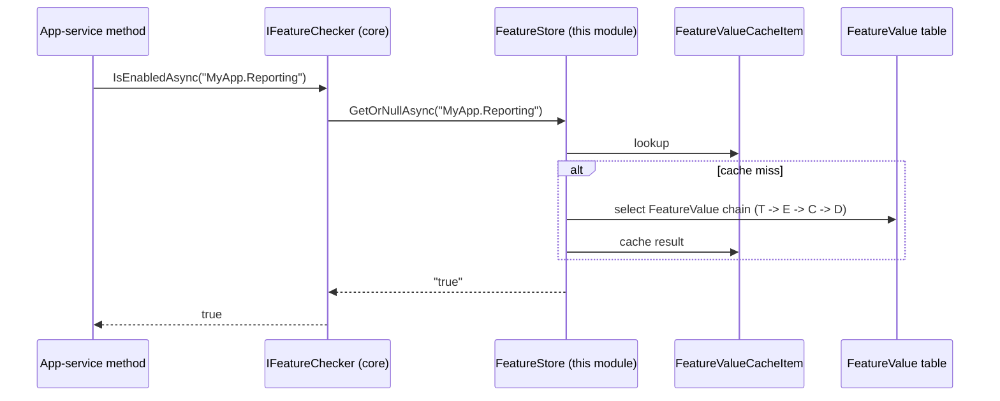

The Feature Management module is the **persistence side** of the [Volo.Abp.Features](/crosscut/features) abstraction. The core layer declares features in code via `FeatureDefinitionProvider` and consumes the current value through `IFeatureChecker`; this module stores the **per-edition** and **per-tenant** overrides, runs the provider chain, and exposes the management UI under `/api/feature-management/features`.

Features are the cornerstone of ABP's SaaS story: a tenant edition (free / standard / enterprise) lifts certain limits, a per-tenant override can grant a customer a one-off boost, and `[RequiresFeature(...)]` attributes on app-service methods gate functionality without sprinkling `if (edition == "free")` checks through the code.

## Projects

`modules/feature-management/src/` ships thirteen projects:

| Project | Purpose |
| --- | --- |
| `Volo.Abp.FeatureManagement.Domain.Shared` | Constants, error codes, JSON converters for selection-string features |
| `Volo.Abp.FeatureManagement.Domain` | `FeatureValue` aggregate, `FeatureDefinitionRecord`, `FeatureGroupDefinitionRecord`, `FeatureManager`, `FeatureStore` (implements `IFeatureStore` from core), `FeatureManagementStore`, provider chain, `StaticFeatureSaver`, `DynamicFeatureDefinitionStore`, options |
| `Volo.Abp.FeatureManagement.Application.Contracts` | `IFeatureAppService`, DTOs, `FeatureManagementPermissions`, `FeaturePermissionDefinitionProvider` |
| `Volo.Abp.FeatureManagement.Application` | `FeatureAppService` implementation |
| `Volo.Abp.FeatureManagement.HttpApi` | `FeaturesController` mounted at `/api/feature-management/features` |
| `Volo.Abp.FeatureManagement.HttpApi.Client` | Dynamic C# proxy |
| `Volo.Abp.FeatureManagement.Web` | MVC modal and view components |
| `Volo.Abp.FeatureManagement.Blazor` | Blazor `FeatureManagementModal.razor` and helpers |
| `Volo.Abp.FeatureManagement.Blazor.Server` | Blazor Server wiring |
| `Volo.Abp.FeatureManagement.Blazor.WebAssembly` | Blazor WASM wiring |
| `Volo.Abp.FeatureManagement.EntityFrameworkCore` | EF Core repository (`IFeatureValueRepository`) |
| `Volo.Abp.FeatureManagement.MongoDB` | MongoDB repository |
| `Volo.Abp.FeatureManagement.Installer` | NuGet installer shim used by the ABP CLI |

## Layering

```mermaid
graph TD
  subgraph Core[Volo.Abp.Features]
    FD[FeatureDefinition]
    IFC[IFeatureChecker]
    IFS[IFeatureStore]
    IFDM[IFeatureDefinitionManager]
  end
  subgraph Domain
    FV[FeatureValue aggregate]
    FDR[FeatureDefinitionRecord]
    Store[FeatureStore<br/>FeatureManagementStore]
    Mgr[FeatureManager]
    Providers[IFeatureManagementProvider:<br/>Default, Configuration, Edition, Tenant]
    DFDS[DynamicFeatureDefinitionStore]
    SFS[StaticFeatureSaver]
  end
  subgraph App
    FAS[FeatureAppService]
  end
  subgraph Http
    Ctrl[FeaturesController<br/>/api/feature-management/features]
  end

  IFS <-.implements.- Store
  Store --> FV
  Mgr --> Providers
  Providers --> FV
  SFS --> FDR
  DFDS --> FDR
  IFDM -.consults.- DFDS
  IFC --> IFS
  FAS --> Mgr
  Ctrl --> FAS
```

## The `FeatureValue` aggregate

[`FeatureValue.cs`](https://github.com/abpframework/abp/blob/dev/modules/feature-management/src/Volo.Abp.FeatureManagement.Domain/Volo/Abp/FeatureManagement/FeatureValue.cs):

```csharp
public class FeatureValue : Entity<Guid>, IAggregateRoot<Guid>
{
    [NotNull] public virtual string Name { get; protected set; }              // feature name, e.g. SaasHost.MaxUserCount
    [NotNull] public virtual string Value { get; internal set; }              // always serialized as string
    [NotNull] public virtual string ProviderName { get; protected set; }      // E (edition) or T (tenant)
    [CanBeNull] public virtual string ProviderKey { get; protected set; }     // edition id / tenant id
}
```

Each row is one `(name, providerName, providerKey)` override. The companion `FeatureDefinitionRecord` mirrors `PermissionDefinitionRecord` and `SettingDefinitionRecord` — it's how feature definitions declared in code get published into the database for cross-microservice editing.

## Provider chain

[`IFeatureManagementProvider`](https://github.com/abpframework/abp/blob/dev/modules/feature-management/src/Volo.Abp.FeatureManagement.Domain/Volo/Abp/FeatureManagement/IFeatureManagementProvider.cs) implementations:

| Provider | File | Provider name | Purpose |
| --- | --- | --- | --- |
| `DefaultValueFeatureManagementProvider` | `DefaultValueFeatureManagementProvider.cs` | `D` (default) | Returns `FeatureDefinition.DefaultValue` |
| `ConfigurationFeatureManagementProvider` | `ConfigurationFeatureManagementProvider.cs` | `C` (configuration) | Reads from `IConfiguration` |
| `EditionFeatureManagementProvider` | `EditionFeatureManagementProvider.cs` | `E` (edition) | Reads/writes per-edition values |
| `TenantFeatureManagementProvider` | `TenantFeatureManagementProvider.cs` | `T` (tenant) | Reads/writes per-tenant overrides |

The resolution chain for **reads** is `Tenant → Edition → Configuration → Default` — the first non-null wins, so a tenant override beats its edition's baseline, which beats `appsettings.json`, which beats the value baked into the code definition. **Writes** target an explicit provider chosen by the management UI.

[`FeatureManagementOptions`](https://github.com/abpframework/abp/blob/dev/modules/feature-management/src/Volo.Abp.FeatureManagement.Domain/Volo/Abp/FeatureManagement/FeatureManagementOptions.cs):

```csharp
public class FeatureManagementOptions
{
    public ITypeList<IFeatureManagementProvider> Providers { get; }
    public Dictionary<string, string> ProviderPolicies { get; }
    public bool SaveStaticFeaturesToDatabase { get; set; } = true;
    public bool IsDynamicFeatureStoreEnabled { get; set; } = false;
}
```

`ProviderPolicies` maps provider name → ASP.NET Core authorization policy: for example, `["E"] = "FeatureManagement.ManageHostFeatures"` ensures that editing an edition's features requires the host-side permission rather than the per-tenant one.

## The store

[`FeatureStore`](https://github.com/abpframework/abp/blob/dev/modules/feature-management/src/Volo.Abp.FeatureManagement.Domain/Volo/Abp/FeatureManagement/FeatureStore.cs) implements core's `IFeatureStore`. [`FeatureManagementStore`](https://github.com/abpframework/abp/blob/dev/modules/feature-management/src/Volo.Abp.FeatureManagement.Domain/Volo/Abp/FeatureManagement/FeatureManagementStore.cs) implements `IFeatureManagementStore` for write access. Both are cached via `FeatureValueCacheItem` and invalidated through `FeatureValueCacheItemInvalidator` on the local bus.

## Application service

[`IFeatureAppService`](https://github.com/abpframework/abp/blob/dev/modules/feature-management/src/Volo.Abp.FeatureManagement.Application.Contracts/Volo/Abp/FeatureManagement/IFeatureAppService.cs):

```csharp
public interface IFeatureAppService : IApplicationService
{
    Task<GetFeatureListResultDto> GetAsync(string providerName, string providerKey);
    Task UpdateAsync(string providerName, string providerKey, UpdateFeaturesDto input);
    Task DeleteAsync(string providerName, string providerKey);
}
```

The implementation in [`FeatureAppService`](https://github.com/abpframework/abp/blob/dev/modules/feature-management/src/Volo.Abp.FeatureManagement.Application/Volo/Abp/FeatureManagement/FeatureAppService.cs) groups features by `FeatureGroup`, attaches the policy from `FeatureManagementOptions.ProviderPolicies` for authorization, and runs `IFeatureManager.SetAsync` for each updated entry.

## HTTP API

Routes from [`FeaturesController.cs`](https://github.com/abpframework/abp/blob/dev/modules/feature-management/src/Volo.Abp.FeatureManagement.HttpApi/Volo/Abp/FeatureManagement/FeaturesController.cs):

| Method | Path | App-service call |
| --- | --- | --- |
| GET | `/api/feature-management/features?providerName=...&providerKey=...` | `IFeatureAppService.GetAsync` |
| PUT | `/api/feature-management/features?providerName=...&providerKey=...` | `UpdateAsync` |
| DELETE | `/api/feature-management/features?providerName=...&providerKey=...` | `DeleteAsync` (reset to inherited values) |

## Permissions

[`FeatureManagementPermissions`](https://github.com/abpframework/abp/blob/dev/modules/feature-management/src/Volo.Abp.FeatureManagement.Application.Contracts/Volo/Abp/FeatureManagement/FeatureManagementPermissions.cs):

```csharp
public class FeatureManagementPermissions
{
    public const string GroupName = "FeatureManagement";
    public const string ManageHostFeatures = GroupName + ".ManageHostFeatures";
}
```

The permission gates edition-level (`providerName = "E"`) feature edits — host-side admins can grant it; tenant admins can only edit their own tenant's features (`providerName = "T"` keyed on their tenant id).

## How `[RequiresFeature]` consults this store



## Dynamic feature sync

[`StaticFeatureSaver`](https://github.com/abpframework/abp/blob/dev/modules/feature-management/src/Volo.Abp.FeatureManagement.Domain/Volo/Abp/FeatureManagement/StaticFeatureSaver.cs) compares the in-memory definitions (from `IFeatureDefinitionProvider`s) against the database on application startup. Changes publish `DynamicFeatureDefinitionsChanged*` ETOs on the distributed bus; [`DynamicFeatureDefinitionStoreInMemoryCache`](https://github.com/abpframework/abp/blob/dev/modules/feature-management/src/Volo.Abp.FeatureManagement.Domain/Volo/Abp/FeatureManagement/DynamicFeatureDefinitionStoreInMemoryCache.cs) refreshes consumers.

## Multi-tenancy integration

The default `T`-provider key is the **current tenant id** as resolved by [Volo.Abp.MultiTenancy](/multitenancy/overview). For the `E`-provider key, ABP looks up `Tenant.EditionId` (from the [Tenant Management module](/modules/tenant-management); the OSS `Tenant` aggregate doesn't expose `EditionId` directly — that lives in the SaaS.Pro module — so the open-source build uses the `E` provider only when an `IFeatureValueProvider` of your own supplies the edition id).

## UI surface

<Tabs>
  <Tab title="MVC / Razor Pages">
    `Volo.Abp.FeatureManagement.Web` ships a partial `FeatureManagementModal` view + JS modal called from Tenant Management (edit-tenant page).
  </Tab>
  <Tab title="Blazor">
    [`FeatureManagementModal.razor.cs`](https://github.com/abpframework/abp/blob/dev/modules/feature-management/src/Volo.Abp.FeatureManagement.Blazor/Components/FeatureManagementModal.razor.cs) is the cross-bundle modal. The setting-management Blazor stack can host it inline through `FeatureSettingManagementComponentContributor`.
  </Tab>
  <Tab title="Angular">
    See [Angular Feature Management](/angular/feature-management).
  </Tab>
</Tabs>

## Feature value types

Features in ABP are typed via `IValueValidator` and `IStringValueType`. Examples:

| Type | When | Example feature |
| --- | --- | --- |
| `ToggleStringValueType` | Boolean on/off | `MyApp.AllowExportToCsv` |
| `FreeTextStringValueType` | Free-form text | `MyApp.SupportEmail` |
| `SelectionStringValueType` | Pick-from-list | Subscription plan with `Free` / `Standard` / `Enterprise` |
| `NumericValueValidator`-bound `FreeTextStringValueType` | Bounded numeric (limit) | `MyApp.MaxProjectCount` |

`SelectionStringValueItemSourceJsonConverter` handles serialization of selection-list sources into the `FeatureDefinitionRecord.Properties` blob.

## Extension points

<CardGroup cols={2}>
  <Card title="Custom feature provider" icon="puzzle-piece">
    Implement `IFeatureManagementProvider` to introduce a new scope — e.g. per-organization-unit. Register it in `FeatureManagementOptions.Providers`.
  </Card>
  <Card title="Define features in code" icon="flag">
    Subclass `FeatureDefinitionProvider` and add `context.Add(new FeatureDefinition(...))`. See [Features (cross-cutting)](/crosscut/features) for the provider contract.
  </Card>
  <Card title="Custom feature page" icon="sliders">
    Use the `FeatureManagementModal` directly inside any razor / Blazor page that wants to expose feature editing for a custom subject.
  </Card>
  <Card title="Disable static saver" icon="lock">
    Set `FeatureManagementOptions.SaveStaticFeaturesToDatabase = false` if you keep features purely in code.
  </Card>
</CardGroup>

## Related pages

- [Features (cross-cutting)](/crosscut/features) — the consumer side.
- [Global features](/crosscut/global-features) — compile-time feature stripping.
- [Tenant Management](/modules/tenant-management) — multi-tenant subject of `T`-provider.
- [Permission Management](/modules/permission-management) — same provider-chain pattern.
- [Setting Management](/modules/setting-management) — same provider-chain pattern.
