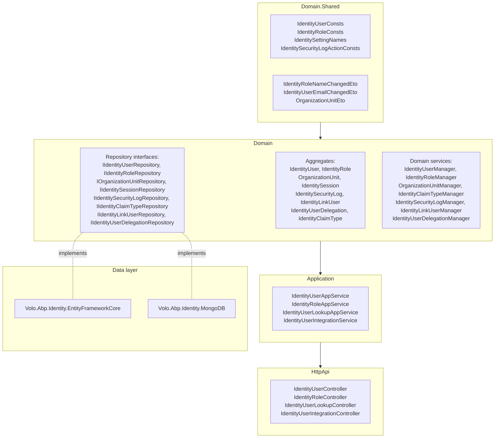

The Identity module is the foundation every other ABP module sits on. It wraps **ASP.NET Core Identity** (`Microsoft.AspNetCore.Identity`) inside ABP's DDD layout: the framework's `UserManager<TUser>` becomes [`IdentityUserManager`](https://github.com/abpframework/abp/blob/dev/modules/identity/src/Volo.Abp.Identity.Domain/Volo/Abp/Identity/IdentityUserManager.cs) (a domain service), the `IUserStore<TUser>` becomes [`IdentityUserStore`](https://github.com/abpframework/abp/blob/dev/modules/identity/src/Volo.Abp.Identity.Domain/Volo/Abp/Identity/IdentityUserStore.cs) (talking to `IIdentityUserRepository`), and the persistence model — `IdentityUser`, `IdentityRole`, `OrganizationUnit`, `IdentityClaimType`, `IdentitySession`, `IdentitySecurityLog`, `IdentityLinkUser`, `IdentityUserDelegation` — lives as proper aggregate roots under `modules/identity/src/Volo.Abp.Identity.Domain/Volo/Abp/Identity/`.

This page walks the full module top-to-bottom: projects, aggregates, repositories, managers, app services, HTTP API, settings, external login providers, data seeding, and extension points.

## Projects

`modules/identity/src/` ships fifteen projects. Listing the folder gives:

| Project | Purpose |
| --- | --- |
| `Volo.Abp.Identity.Domain.Shared` | Constants (`IdentityUserConsts`, `IdentityRoleConsts`, `OrganizationUnitConsts`), ETOs (`IdentityRoleNameChangedEto`, `IdentityUserPasswordChangedEto`), localization resource, `IdentitySettingNames`, error codes |
| `Volo.Abp.Identity.Domain` | Aggregates, repository interfaces, domain services (`IdentityUserManager`, `IdentityRoleManager`, `OrganizationUnitManager`, `IdentityClaimTypeManager`, `IdentitySecurityLogManager`, `IdentityLinkUserManager`, `IdentityUserDelegationManager`), `IdentityDataSeeder`, external login provider abstractions |
| `Volo.Abp.Identity.Application.Contracts` | `IIdentityUserAppService`, `IIdentityRoleAppService`, `IIdentityUserLookupAppService`, DTOs, `IdentityPermissions`, `IdentityPermissionDefinitionProvider` |
| `Volo.Abp.Identity.Application` | App-service implementations and integration services |
| `Volo.Abp.Identity.HttpApi` | Auto-API controllers (`IdentityUserController`, `IdentityRoleController`, `IdentityUserLookupController`, `IdentityUserIntegrationController`) |
| `Volo.Abp.Identity.HttpApi.Client` | Dynamic C# proxies for the HTTP API (generated by ABP — see [HTTP client proxies](/comm/http-client)) |
| `Volo.Abp.Identity.Web` | Razor Pages (`/Identity/Users`, `/Identity/Roles`, `/Identity/OrganizationUnits`, `/Identity/SecurityLogs`, `/Identity/ClaimTypes`) and navigation contributors |
| `Volo.Abp.Identity.Blazor` | Shared Blazor components and pages |
| `Volo.Abp.Identity.Blazor.Server` | Blazor Server bundle wiring |
| `Volo.Abp.Identity.Blazor.WebAssembly` | Blazor WebAssembly bundle wiring |
| `Volo.Abp.Identity.AspNetCore` | `AddAbpIdentity()` builder + `AbpUserClaimsPrincipalFactory` glue with ASP.NET Identity |
| `Volo.Abp.Identity.EntityFrameworkCore` | EF Core repositories and `IdentityDbContext` extensions |
| `Volo.Abp.Identity.MongoDB` | MongoDB repositories |
| `Volo.Abp.Identity.Installer` | NuGet installer shim used by the ABP CLI |
| `Volo.Abp.PermissionManagement.Domain.Identity` | Bridge project that registers `RolePermissionManagementProvider` and `UserPermissionManagementProvider` with the [Permission Management module](/modules/permission-management) |

## Layering



## Aggregate roots

Every aggregate lives under [`modules/identity/src/Volo.Abp.Identity.Domain/Volo/Abp/Identity/`](https://github.com/abpframework/abp/tree/dev/modules/identity/src/Volo.Abp.Identity.Domain/Volo/Abp/Identity).

| Aggregate | Base type | Key properties | File |
| --- | --- | --- | --- |
| `IdentityUser` | `FullAuditedAggregateRoot<Guid>`, `IUser`, `IHasEntityVersion` | `TenantId`, `UserName`, `NormalizedUserName`, `Name`, `Surname`, `Email`, `EmailConfirmed`, `PasswordHash`, `SecurityStamp`, `IsExternal`, `PhoneNumber`, `TwoFactorEnabled`, `LockoutEnd`, `AccessFailedCount`, `Roles` (`ICollection<IdentityUserRole>`), `Logins`, `Claims`, `Tokens`, `OrganizationUnits` (`ICollection<IdentityUserOrganizationUnit>`) | `IdentityUser.cs` |
| `IdentityRole` | `AggregateRoot<Guid>`, `IMultiTenant`, `IHasEntityVersion` | `TenantId`, `Name`, `NormalizedName`, `IsDefault`, `IsStatic`, `IsPublic`, `Claims` (`ICollection<IdentityRoleClaim>`) | `IdentityRole.cs` |
| `OrganizationUnit` | `FullAuditedAggregateRoot<Guid>`, `IMultiTenant`, `IHasEntityVersion` | `TenantId`, `ParentId`, hierarchical `Code` (e.g. `"00001.00042.00005"`), `DisplayName`, `Entry roles` (`ICollection<OrganizationUnitRole>`) | `OrganizationUnit.cs` |
| `IdentityClaimType` | `FullAuditedAggregateRoot<Guid>` | `Name`, `Required`, `IsStatic`, `Regex`, `RegexDescription`, `Description`, `ValueType` (`IdentityClaimValueType`) | `IdentityClaimType.cs` |
| `IdentitySession` | `AggregateRoot<Guid>`, `IMultiTenant` | `SessionId`, `Device`, `DeviceInfo`, `TenantId`, `UserId`, `ClientId`, `IpAddresses`, `SignedIn`, `LastAccessed` | `IdentitySession.cs` |
| `IdentityLinkUser` | `Entity`, `IMultiTenant` | `SourceUserId` / `SourceTenantId`, `TargetUserId` / `TargetTenantId` — pairs an account with another linked identity | `IdentityLinkUser.cs` |
| `IdentitySecurityLog` | `AggregateRoot<Guid>`, `IMultiTenant` | `ApplicationName`, `Identity`, `Action`, `UserId`, `UserName`, `TenantId`, `TenantName`, `ClientId`, `BrowserInfo`, `IpAddresses`, `CreationTime`, `ExtraProperties` | `IdentitySecurityLog.cs` |
| `IdentityUserDelegation` | `AggregateRoot<Guid>`, `IMultiTenant` | `SourceUserId`, `TargetUserId`, `StartTime`, `EndTime` — allows a user to act on another's behalf | `IdentityUserDelegation.cs` |

<Note>
  `IdentityUser` exposes related collections (`Roles`, `Logins`, `Claims`, `Tokens`, `OrganizationUnits`) as `ICollection<>` navigation properties so EF Core and MongoDB can both treat the aggregate as one consistent boundary. Mutation goes through methods on the aggregate (e.g. `AddRole`, `RemoveRole`, `AddLogin`, `AddClaim`) and not by replacing the collection.
</Note>

### Supporting entities (inside aggregates)

`IdentityUserRole`, `IdentityUserClaim`, `IdentityUserLogin`, `IdentityUserToken`, `IdentityUserOrganizationUnit`, `IdentityUserPasskey`, `IdentityUserPasswordHistory`, `IdentityRoleClaim`, and `OrganizationUnitRole` are child entities of the user/role/OU aggregates and are stored in dedicated tables (EF Core) or embedded arrays (MongoDB).

## Repositories

Repository interfaces sit under `Volo.Abp.Identity.Domain` and expose query/aggregate operations beyond `IRepository<>`:

| Interface | File | Notable methods |
| --- | --- | --- |
| `IIdentityUserRepository` | `IIdentityUserRepository.cs` | `FindByNormalizedUserNameAsync`, `FindByNormalizedEmailAsync`, `GetListByIdsAsync`, `GetRoleNamesAsync`, `GetRolesAsync`, `GetOrganizationUnitsAsync`, `CountAsync(filter)`, `GetListAsync(sorting, maxResultCount, skipCount, filter, ...)` |
| `IIdentityRoleRepository` | `IIdentityRoleRepository.cs` | `FindByNormalizedNameAsync`, `GetDefaultOnesAsync`, `GetListAsync(sorting, ...)`, `GetCountAsync(...)`, `GetListByIdsAsync` |
| `IOrganizationUnitRepository` | `IOrganizationUnitRepository.cs` | `GetChildrenAsync`, `GetAllChildrenWithParentCodeAsync`, `GetRolesAsync`, `GetMembersAsync`, `GetUnaddedMembersAsync` |
| `IIdentityClaimTypeRepository` | `IIDentityClaimTypeRepository.cs` (note typo in source) | `AnyAsync(name)`, `GetListAsync(...)`, `GetCountAsync(filter)` |
| `IIdentitySessionRepository` | `IIdentitySessionRepository.cs` | `GetListAsync`, `GetCountAsync`, `FindAsync(sessionId)`, `DeleteAllAsync(userId)` |
| `IIdentitySecurityLogRepository` | `IIdentitySecurityLogRepository.cs` | `GetListAsync(sorting, paging, filters by date/action/user)`, `GetCountAsync(...)` |
| `IIdentityLinkUserRepository` | `IIdentityLinkUserRepository.cs` | `FindAsync`, `GetListAsync(userInfo)`, `DeleteAsync(userId)` |
| `IIdentityUserDelegationRepository` | `IIdentityUserDelegationRepository.cs` | `GetActiveDelegationsAsync(userId)`, `GetListAsync` |

Both EF Core (`Volo.Abp.Identity.EntityFrameworkCore`) and MongoDB (`Volo.Abp.Identity.MongoDB`) provide implementations.

## Domain services (managers)

Domain services are `virtual` classes registered via `[ExposeServices]` so apps can subclass and re-register them.

### `IdentityUserManager`

[`IdentityUserManager.cs`](https://github.com/abpframework/abp/blob/dev/modules/identity/src/Volo.Abp.Identity.Domain/Volo/Abp/Identity/IdentityUserManager.cs) extends ASP.NET Core's `UserManager<IdentityUser>` and adds organization-unit membership and Identity-specific helpers. Highlights:

- `SetRolesAsync(IdentityUser, IEnumerable<string>)` — atomically aligns role membership.
- `GetRolesAsync(IdentityUser)` — returns roles directly assigned **and** roles inherited from OUs.
- `AddToOrganizationUnitAsync(Guid userId, Guid ouId)` / `RemoveFromOrganizationUnitAsync`.
- `SetOrganizationUnitsAsync(IdentityUser, Guid[] ouIds)`.
- `CreateAsync(IdentityUser)` runs the inherited password / lockout / two-factor settings already pre-populated from the Setting Management module by `AbpIdentityOptionsManager` (see Settings section below).

### `IdentityRoleManager`

[`IdentityRoleManager.cs`](https://github.com/abpframework/abp/blob/dev/modules/identity/src/Volo.Abp.Identity.Domain/Volo/Abp/Identity/IdentityRoleManager.cs) extends `RoleManager<IdentityRole>` and adds:

- `SetClaimsAsync(IdentityRole, IEnumerable<Claim>)` — replace all role claims.
- Renaming triggers `IdentityRoleNameChangedEto` on the distributed event bus.

### `OrganizationUnitManager`

[`OrganizationUnitManager.cs`](https://github.com/abpframework/abp/blob/dev/modules/identity/src/Volo.Abp.Identity.Domain/Volo/Abp/Identity/OrganizationUnitManager.cs) maintains the materialized-path `Code` (`"00001.00042.00005"`) on create/move and prevents cycles in the hierarchy. Key methods:

- `CreateAsync(OrganizationUnit)` — generates the next sibling code.
- `MoveAsync(Guid id, Guid? parentId)` — recomputes codes for the entire moved subtree.
- `GetNextChildCodeAsync(Guid? parentId)`, `GetCodeAsync(Guid id)`.

### Other managers

`IdentityClaimTypeManager` validates uniqueness and `IsStatic` flags; `IdentitySecurityLogManager` writes to the security log via `IdentitySecurityLogStore`; `IdentityLinkUserManager` links/unlinks user identities across tenants; `IdentityUserDelegationManager` enforces delegation start/end windows.

## Application services

| Interface | Implementation | HTTP route prefix | File |
| --- | --- | --- | --- |
| `IIdentityUserAppService` | `IdentityUserAppService` | `/api/identity/users` | `IdentityUserAppService.cs` |
| `IIdentityRoleAppService` | `IdentityRoleAppService` | `/api/identity/roles` | `IdentityRoleAppService.cs` |
| `IIdentityUserLookupAppService` | `IdentityUserLookupAppService` | `/api/identity/users/lookup` | `IdentityUserLookupAppService.cs` |
| (integration) | `IdentityUserIntegrationService` | `/api/identity/integration-services/identity-user` | `Integration/IdentityUserIntegrationController.cs` |

Sample `IdentityUserAppService` routes — taken straight from the controller attributes in [`IdentityUserController.cs`](https://github.com/abpframework/abp/blob/dev/modules/identity/src/Volo.Abp.Identity.HttpApi/Volo/Abp/Identity/IdentityUserController.cs):

```csharp expandable
[Route("api/identity/users")]
public class IdentityUserController : AbpControllerBase, IIdentityUserAppService
{
    [HttpGet]
    public Task<PagedResultDto<IdentityUserDto>> GetListAsync(GetIdentityUsersInput input);

    [HttpGet, Route("{id}")]
    public Task<IdentityUserDto> GetAsync(Guid id);

    [HttpPost]
    public Task<IdentityUserDto> CreateAsync(IdentityUserCreateDto input);

    [HttpPut, Route("{id}")]
    public Task<IdentityUserDto> UpdateAsync(Guid id, IdentityUserUpdateDto input);

    [HttpDelete, Route("{id}")]
    public Task DeleteAsync(Guid id);

    [HttpGet, Route("{id}/roles")]
    public Task<ListResultDto<IdentityRoleDto>> GetRolesAsync(Guid id);

    [HttpGet, Route("assignable-roles")]
    public Task<ListResultDto<IdentityRoleDto>> GetAssignableRolesAsync();

    [HttpPut, Route("{id}/roles")]
    public Task UpdateRolesAsync(Guid id, IdentityUserUpdateRolesDto input);

    [HttpGet, Route("by-username/{userName}")]
    public Task<IdentityUserDto> FindByUsernameAsync(string userName);

    [HttpGet, Route("by-email/{email}")]
    public Task<IdentityUserDto> FindByEmailAsync(string email);
}
```

Methods are protected via attributes such as `[Authorize(IdentityPermissions.Users.Default)]` declared on the app-service implementation.

### Permissions

[`IdentityPermissions.cs`](https://github.com/abpframework/abp/blob/dev/modules/identity/src/Volo.Abp.Identity.Application.Contracts/Volo/Abp/Identity/IdentityPermissions.cs) declares the full permission tree, and `IdentityPermissionDefinitionProvider` registers them with the Permission Management module:

| Permission key | Action |
| --- | --- |
| `AbpIdentity.Roles` | View roles |
| `AbpIdentity.Roles.Create` / `.Update` / `.Delete` / `.ManagePermissions` | Mutate roles |
| `AbpIdentity.Users` | View users |
| `AbpIdentity.Users.Create` / `.Update` / `.Delete` / `.ManagePermissions` | Mutate users |
| `AbpIdentity.Users.Update.ManageRoles` | Toggle a user's role assignments |
| `AbpIdentity.UserLookup` | Lookup users (used by external modules) |

See the [Permissions documentation](/auth/permissions) for how grants flow from definitions to the database.

## Settings and options

`IdentitySettingNames` (in `Domain.Shared`) declares the named keys; [`AbpIdentitySettingDefinitionProvider`](https://github.com/abpframework/abp/blob/dev/modules/identity/src/Volo.Abp.Identity.Domain/Volo/Abp/Identity/AbpIdentitySettingDefinitionProvider.cs) registers them with [Volo.Abp.Settings](/crosscut/settings).

| Group | Keys |
| --- | --- |
| Password | `RequiredLength`, `RequiredUniqueChars`, `RequireNonAlphanumeric`, `RequireLowercase`, `RequireUppercase`, `RequireDigit`, `ForceUsersToPeriodicallyChangePassword`, `PasswordChangePeriodDays`, `EnablePreventPasswordReuse`, `PreventPasswordReuseCount` |
| Lockout | `AllowedForNewUsers`, `LockoutDuration`, `MaxFailedAccessAttempts` |
| SignIn | `RequireConfirmedEmail`, `RequireEmailVerificationToRegister`, `EnablePhoneNumberConfirmation`, `RequireConfirmedPhoneNumber` |
| User | `IsUserNameUpdateEnabled`, `IsEmailUpdateEnabled` |
| Organization Unit | `MaxUserMembershipCount` |

[`AbpIdentityOptionsManager`](https://github.com/abpframework/abp/blob/dev/modules/identity/src/Volo.Abp.Identity.Domain/Volo/Abp/Identity/AbpIdentityOptionsManager.cs) is an `IOptions<IdentityOptions>` decorator: every time `IdentityOptions` is read it fetches the current setting values and applies them, so password/lockout policy comes from the running setting store rather than `appsettings.json`.

[`AbpIdentityOptions`](https://github.com/abpframework/abp/blob/dev/modules/identity/src/Volo.Abp.Identity.Domain/Volo/Abp/Identity/AbpIdentityOptions.cs) is the static options class — currently it just exposes `ExternalLoginProviders`:

```csharp
namespace Volo.Abp.Identity;

public class AbpIdentityOptions
{
    public ExternalLoginProviderDictionary ExternalLoginProviders { get; }

    public AbpIdentityOptions()
    {
        ExternalLoginProviders = new ExternalLoginProviderDictionary();
    }
}
```

## External login providers

Identity does **not** hard-code LDAP, Active Directory, or third-party OAuth providers; instead it offers `IExternalLoginProvider` and `IExternalLoginProviderWithPassword`. Concrete implementations register themselves through `AbpIdentityOptions.ExternalLoginProviders`:

| File | Purpose |
| --- | --- |
| `IExternalLoginProvider.cs` | Two-method contract: `TryAuthenticateAsync(userName, password)`, `CreateUserAsync(userName, providerName)` |
| `IExternalLoginProviderWithPassword.cs` | Adds password validation hooks |
| `ExternalLoginProviderBase.cs` | Base class — caches `ExternalLoginUserInfo` lookups and emits user-created events |
| `ExternalLoginProviderWithPasswordBase.cs` | Adds password storage policy |
| `ExternalLoginProviderDictionary.cs` | Keyed registration (`Add<TProvider>(name)`) |
| `ExternalLoginProviderInfo.cs` | Stored metadata |
| `ExternalLoginUserInfo.cs` | DTO holding the upstream identity (UPN, e-mail, name) |

A custom provider:

```csharp
public class MyLdapExternalLoginProvider :
    ExternalLoginProviderWithPasswordBase<MyLdapExternalLoginProvider>
{
    public const string ProviderName = "MyLdap";
    public override string Name => ProviderName;
    // implement TryAuthenticateAsync / GetUserInfoAsync ...
}

// register in a module:
Configure<AbpIdentityOptions>(options =>
{
    options.ExternalLoginProviders.Add<MyLdapExternalLoginProvider>(MyLdapExternalLoginProvider.ProviderName);
});
```

## Data seeding

[`IdentityDataSeedContributor`](https://github.com/abpframework/abp/blob/dev/modules/identity/src/Volo.Abp.Identity.Domain/Volo/Abp/Identity/IdentityDataSeedContributor.cs) implements `IDataSeedContributor` and delegates to [`IdentityDataSeeder`](https://github.com/abpframework/abp/blob/dev/modules/identity/src/Volo.Abp.Identity.Domain/Volo/Abp/Identity/IdentityDataSeeder.cs), an `IIdentityDataSeeder` that creates the default `admin` user and `admin` role plus the admin@abp.io / `1q2w3E*` credentials (overridable through the contributor's input). Seeding runs through the central [data-seeding flow](/data/data-seeding-and-migrations).

## Distributed events

The module publishes ETOs on user / role / OU mutations so other services can react without a database join. Look in `Volo.Abp.Identity.Domain.Shared/Volo/Abp/Identity/` for:

- `IdentityRoleNameChangedEto`
- `IdentityUserPasswordChangedEto`
- `IdentityUserUserNameChangedEto`
- `IdentityUserEmailChangedEto`
- `OrganizationUnitEto`
- `IdentityClaimTypeEto`

These are emitted by `UserEntityUpdatedOrDeletedEventHandler` and the domain managers, consumed via the [distributed event bus](/eventbus/distributed-event-bus).

## Dynamic claims

ASP.NET Identity's claims principal is decorated by [`IdentityDynamicClaimsPrincipalContributor`](https://github.com/abpframework/abp/blob/dev/modules/identity/src/Volo.Abp.Identity.Domain/Volo/Abp/Identity/IdentityDynamicClaimsPrincipalContributor.cs), which pulls fresh user claims from the database into the current `ClaimsPrincipal` on every request — backed by `IdentityDynamicClaimsPrincipalContributorCache` to avoid hitting the database on every middleware tick. The cache TTL is governed by `IdentityDynamicClaimsPrincipalContributorCacheOptions`.

[`AbpUserClaimsPrincipalFactory`](https://github.com/abpframework/abp/blob/dev/modules/identity/src/Volo.Abp.Identity.Domain/Volo/Abp/Identity/AbpUserClaimsPrincipalFactory.cs) augments the standard ASP.NET Identity factory with the user's `TenantId`, OU codes, and ABP session claims.

## UI surface

<Tabs>
  <Tab title="MVC / Razor Pages">
    The `Volo.Abp.Identity.Web` project ships pages under `Pages/Identity/` for Users, Roles, OrganizationUnits, SecurityLogs, and ClaimTypes, plus an `AbpIdentityWebMenuContributor` that adds them under the **Administration → Identity Management** menu.
  </Tab>
  <Tab title="Blazor">
    `Volo.Abp.Identity.Blazor` exposes the same screens as Blazorise components; the `Server` and `WebAssembly` companion projects only differ in HTTP transport.
  </Tab>
  <Tab title="Angular">
    The Angular counterpart is published from `npm/ng-packs/packages/identity` and documented at [Angular Identity](/angular/identity).
  </Tab>
</Tabs>

## Extension points

<CardGroup cols={2}>
  <Card title="Extend IdentityUser" icon="user-pen">
    Use `ObjectExtensionManager.Instance.ConfigureIdentity(...)` ([object extending](/ddd/object-extending)) to add columns. They round-trip through `IdentityUserDto` automatically.
  </Card>
  <Card title="Replace IdentityUserManager" icon="screwdriver-wrench">
    Subclass `IdentityUserManager`, register with `services.Replace(...)` or `[Dependency(ReplaceServices = true)]`.
  </Card>
  <Card title="Custom external login provider" icon="key">
    Implement `IExternalLoginProvider` and register via `AbpIdentityOptions.ExternalLoginProviders` (see above).
  </Card>
  <Card title="Custom data seeder" icon="seedling">
    Replace `IIdentityDataSeeder` to control how the initial admin is created. See [data seeding](/data/data-seeding-and-migrations).
  </Card>
</CardGroup>

## Related pages

- [Account module](/modules/account) — wraps Identity behind login/register/profile pages.
- [OpenIddict module](/modules/openiddict) and [IdentityServer module](/modules/identityserver) — issue tokens for the Identity users.
- [Permission Management](/modules/permission-management) — stores grants keyed on `IdentityUser` and `IdentityRole` via the `Volo.Abp.PermissionManagement.Domain.Identity` bridge project.
- [Identity model](/auth/identity-model) — ABP's user/role abstractions consumed by other modules.
- [Multi-Tenancy overview](/multitenancy/overview) — explains the `TenantId` discriminator on every Identity aggregate.
