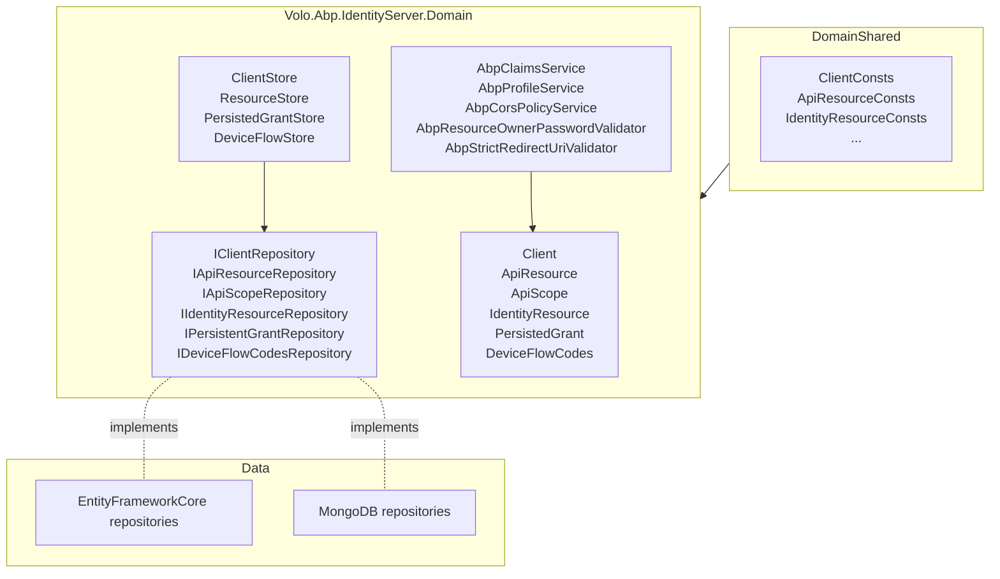

The IdentityServer module is the **legacy** token-server integration ABP shipped before [OpenIddict](/modules/openiddict). It wraps Duende's predecessor [IdentityServer4](https://identityserver4.readthedocs.io/) — projects an `IClientStore` / `IResourceStore` / `IPersistedGrantStore` over ABP repositories, persists `Client`, `ApiResource`, `ApiScope`, `IdentityResource`, `PersistedGrant`, and `DeviceFlowCodes` aggregates, and supplies an ASP.NET Identity-aware profile service.

<Warning>
  IdentityServer4 reached end-of-life on **2022-12-13**. New ABP solutions use the [OpenIddict module](/modules/openiddict). The IdentityServer module remains in the repository for solutions that have not yet migrated; do not pick it for greenfield work.
</Warning>

## Projects

`modules/identityserver/src/` ships six projects (no Application / HttpApi / UI of its own — administration is done via the commercial IdentityServer.Pro UI or programmatically through the managers):

| Project | Purpose |
| --- | --- |
| `Volo.Abp.IdentityServer.Domain.Shared` | Constants, error codes |
| `Volo.Abp.IdentityServer.Domain` | Aggregates, repository interfaces, IdentityServer4 store implementations, `AbpClaimsService`, `AbpProfileService`, `AbpCorsPolicyService`, `AbpResourceOwnerPasswordValidator`, `AbpStrictRedirectUriValidator`, `AbpWildcardSubdomainCorsPolicyService`, data seeders |
| `Volo.Abp.IdentityServer.EntityFrameworkCore` | EF Core repositories and `DbContext` extensions |
| `Volo.Abp.IdentityServer.MongoDB` | MongoDB repositories |
| `Volo.Abp.IdentityServer.Installer` | NuGet installer shim used by the ABP CLI |
| `Volo.Abp.PermissionManagement.Domain.IdentityServer` | Bridge that registers `ClientPermissionManagementProvider` (so permissions can be granted to a Client) |

## Layering



## Aggregate roots

| Aggregate | Folder | Selected properties |
| --- | --- | --- |
| `Client` | `Clients/` | `ClientId`, `ClientName`, `Description`, `ClientUri`, `LogoUri`, `Enabled`, `ProtocolType`, `RequireClientSecret`, `RequireConsent`, `AllowRememberConsent`, `RequirePkce`, `AllowAccessTokensViaBrowser`, `FrontChannelLogoutUri`, `BackChannelLogoutUri`, `AllowOfflineAccess`, lifetimes (`IdentityTokenLifetime`, `AccessTokenLifetime`, `AuthorizationCodeLifetime`, `AbsoluteRefreshTokenLifetime`, `SlidingRefreshTokenLifetime`), plus child collections `AllowedScopes`, `ClientSecrets`, `AllowedGrantTypes`, `AllowedCorsOrigins`, `RedirectUris`, `PostLogoutRedirectUris`, `IdentityProviderRestrictions`, `Claims`, `Properties` |
| `ApiResource` | `ApiResources/` | `Name`, `DisplayName`, `Description`, `Enabled`, `AllowedAccessTokenSigningAlgorithms`, `ShowInDiscoveryDocument`, child `Secrets`, `Scopes`, `UserClaims`, `Properties` |
| `ApiScope` | `ApiScopes/` | `Name`, `DisplayName`, `Description`, `Required`, `Emphasize`, `ShowInDiscoveryDocument`, `UserClaims`, `Properties` |
| `IdentityResource` | `IdentityResources/` | `Name`, `DisplayName`, `Description`, `Enabled`, `Required`, `Emphasize`, `UserClaims`, `Properties` |
| `PersistedGrant` | `Grants/` | `Key`, `Type`, `SubjectId`, `SessionId`, `ClientId`, `Description`, `CreationTime`, `Expiration`, `ConsumedTime`, `Data` |
| `DeviceFlowCodes` | `Devices/` | `DeviceCode`, `UserCode`, `SubjectId`, `SessionId`, `ClientId`, `Description`, `CreationTime`, `Expiration`, `Data` |

`Client` is the largest — its child collections (`ClientClaim`, `ClientCorsOrigin`, `ClientGrantType`, `ClientIdPRestriction`, `ClientPostLogoutRedirectUri`, `ClientProperty`, `ClientRedirectUri`, `ClientScope`, `ClientSecret`) each live in their own file under `Clients/`.

## Repositories and stores

ABP supplies an IdentityServer4 store for every persisted concept:

| IdentityServer4 contract | ABP implementation | Backing repository |
| --- | --- | --- |
| `IClientStore` | `ClientStore` (`Clients/ClientStore.cs`) | `IClientRepository` |
| `IResourceStore` | aggregated via `IApiResourceRepository` + `IIdentityResourceRepository` + `IApiScopeRepository` | — |
| `IPersistedGrantStore` | `PersistedGrantStore` (`Grants/PersistedGrantStore.cs`) | `IPersistentGrantRepository` |
| `IDeviceFlowStore` | `DeviceFlowStore` (`Devices/DeviceFlowStore.cs`) | `IDeviceFlowCodesRepository` |

Repositories surface IdentityServer-specific queries on top of the standard `IRepository<T, TKey>` API — e.g. `IClientRepository.FindByClientIdAsync(string clientId, bool includeDetails = true)`.

## Auth-pipeline services

The Domain project also overrides several IdentityServer4 services so they integrate with ABP's identity stack:

| Service | Replaces | Purpose |
| --- | --- | --- |
| `AbpClaimsService` | `DefaultClaimsService` | Maps ABP user claims (and dynamic claims, see [Identity](/modules/identity#dynamic-claims)) onto issued tokens |
| `AbpProfileService` (`AspNetIdentity/AbpProfileService.cs`) | `ProfileService<>` | Pulls user claims through `IdentityUserManager` |
| `AbpResourceOwnerPasswordValidator` (`AspNetIdentity/`) | `ResourceOwnerPasswordValidator<>` | Enforces ABP's lockout / 2FA / e-mail-confirmation policies during password grant |
| `AbpUserClaimsFactory` (`AspNetIdentity/`) | `UserClaimsFactory<>` | Adds tenant + dynamic claims |
| `AbpCorsPolicyService` / `AbpWildcardSubdomainCorsPolicyService` | `DefaultCorsPolicyService` | Computes CORS origins from `Client.AllowedCorsOrigins` (and optionally wildcards) |
| `AbpStrictRedirectUriValidator` | `StrictRedirectUriValidator` | Adds wildcard subdomain matching like the OpenIddict module |
| `AllowedCorsOriginsCacheItem` + `AllowedCorsOriginsCacheItemInvalidator` | — | Cache CORS origins to avoid DB hits per OPTIONS request |

All are `virtual` and registered with `[ExposeServices]` for easy override.

## Builder + options

[`AbpIdentityServerBuilderExtensions`](https://github.com/abpframework/abp/blob/dev/modules/identityserver/src/Volo.Abp.IdentityServer.Domain/Volo/Abp/IdentityServer/AbpIdentityServerBuilderExtensions.cs) plugs the ABP stores into an `IIdentityServerBuilder` (the IdentityServer4 builder). The host module typically does:

```csharp
context.Services.AddAbpIdentityServer();   // wires Abp* stores + services
```

`AbpIdentityServerBuilderOptions` controls which stores are registered (you can opt out of the persisted-grant store if you front IS4 with a different cache, for example).

## Persistence

<Tabs>
  <Tab title="Entity Framework Core">
    `Volo.Abp.IdentityServer.EntityFrameworkCore` adds `ConfigureIdentityServer(...)` model-builder extensions and EF Core repositories. Tables are prefixed with `IdentityServer` (e.g. `IdentityServerClients`, `IdentityServerClientScopes`, `IdentityServerApiResources`, `IdentityServerPersistedGrants`, `IdentityServerDeviceFlowCodes`).
  </Tab>
  <Tab title="MongoDB">
    `Volo.Abp.IdentityServer.MongoDB` registers collections `AbpIdentityServerClients`, `AbpIdentityServerApiResources`, `AbpIdentityServerApiScopes`, `AbpIdentityServerIdentityResources`, `AbpIdentityServerPersistedGrants`, `AbpIdentityServerDeviceFlowCodes`.
  </Tab>
</Tabs>

## Data seeding

`IdentityResourceDataSeeder` (`IdentityResources/`) seeds the standard OIDC identity resources (`openid`, `profile`, `email`, `address`, `phone`, `role`) on first run, mirroring IdentityServer4's `Resources.GetIdentityResources()` defaults. Client and API resource seeding is left to the host application (typically a contributor derived from a project-level `IIdentityServerDataSeedContributor`).

## Permission management glue

`Volo.Abp.PermissionManagement.Domain.IdentityServer` registers `ClientPermissionManagementProvider` and `ClientResourcePermissionManagementProvider` so that you can grant ABP permissions to an IdentityServer4 `Client`. The provider name is `"C"` (mirrors the OpenIddict bridge's behavior). See [Permission Management](/modules/permission-management) for provider semantics.

## Migration to OpenIddict

The migration path documented by the ABP team is roughly:

<Steps>
  <Step title="Add the OpenIddict module">
    `abp add-package Volo.Abp.OpenIddict.AspNetCore` and remove the IdentityServer module references.
  </Step>
  <Step title="Replace the Account overlay">
    Swap `Volo.Abp.Account.Web.IdentityServer` for `Volo.Abp.Account.Web.OpenIddict` (see [Account](/modules/account#token-server-overlays)).
  </Step>
  <Step title="Re-create clients and scopes">
    Use an `OpenIddictDataSeedContributorBase` subclass to seed the equivalent `OpenIddictApplication`s and `OpenIddictScope`s (the schemas don't map 1:1 — secrets need rehashing, scope-claim associations move).
  </Step>
  <Step title="Drop the IdentityServer tables">
    Once you confirm tokens issue correctly, drop the `IdentityServer*` tables from EF migrations and the `AbpIdentityServer*` collections from MongoDB.
  </Step>
</Steps>

<Info>
  This module ships **no** Application / HttpApi / Web UI projects. Administration of clients / scopes / resources is done through the commercial **IdentityServer.Pro** module or directly through the managers / repositories. That's another reason most new projects pick OpenIddict — the OpenIddict.Pro UI is the actively maintained admin surface.
</Info>

## Extension points

<CardGroup cols={2}>
  <Card title="Replace AbpProfileService" icon="user-pen">
    Subclass to add custom user claims (e.g. tenant-bound business data) into issued tokens.
  </Card>
  <Card title="Wildcard CORS / redirect" icon="globe">
    `AbpWildcardSubdomainCorsPolicyService` and `AbpStrictRedirectUriValidator` enable `https://*.contoso.com` patterns when configured.
  </Card>
  <Card title="Custom grant validator" icon="key">
    Implement IdentityServer4's `IExtensionGrantValidator` and register it in your host module — the ABP pipeline doesn't get in your way.
  </Card>
  <Card title="Cache invalidation" icon="rotate">
    `AllowedCorsOriginsCacheItemInvalidator` listens on the local event bus for `Client` mutations. Subclass to invalidate additional caches when your own admin UI changes clients.
  </Card>
</CardGroup>

## Related pages

- [OpenIddict module](/modules/openiddict) — the supported replacement.
- [Account module](/modules/account) — the matching login UI lives in `Web.IdentityServer`.
- [Permission Management](/modules/permission-management) — `Client`-keyed permission grants.
- [OAuth in ABP](/auth/oauth), [OpenID Connect](/auth/openid-connect) — protocol primer.
- [Identity model](/auth/identity-model) — how ABP claims map onto tokens here.
