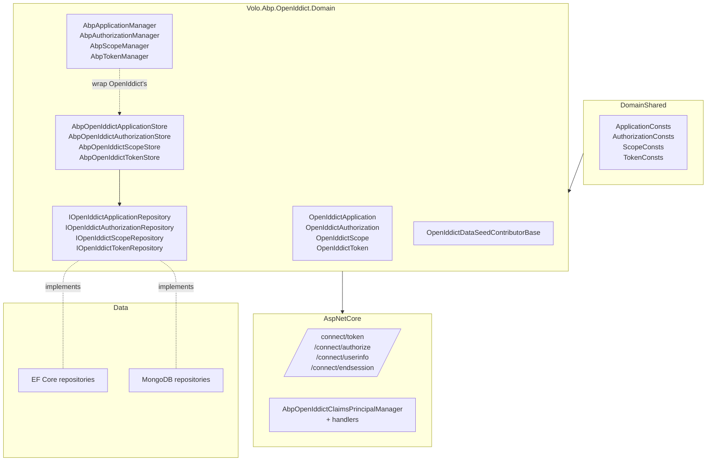

The OpenIddict module is ABP's bridge over the [OpenIddict](https://documentation.openiddict.com/) OAuth 2.1 / OpenID Connect server library. OpenIddict by itself ships its own EF Core / MongoDB stores; ABP **replaces** those stores with implementations that talk to ABP repositories so the OpenIddict entities (`OpenIddictApplication`, `OpenIddictAuthorization`, `OpenIddictScope`, `OpenIddictToken`) live next to your domain data, use the same `IUnitOfWork`, support the same multi-tenancy / soft-delete / auditing infrastructure, and can be administered through the same management modules.

The module **does not host login UI** — that role belongs to [`Volo.Abp.Account.Web.OpenIddict`](/modules/account#token-server-overlays). It exposes the protocol endpoints (`/connect/token`, `/connect/authorize`, `/connect/userinfo`, `/connect/endsession`) plus the management plumbing that the Account UI and external tools build on.

## Projects

`modules/openiddict/src/` ships seven projects:

| Project | Purpose |
| --- | --- |
| `Volo.Abp.OpenIddict.Domain.Shared` | Constants and consent-type enumerations |
| `Volo.Abp.OpenIddict.Domain` | Aggregates, repository interfaces, ABP-flavored `AbpApplicationManager` / `AbpAuthorizationManager` / `AbpScopeManager` / `AbpTokenManager`, store implementations, caches, data-seed contributor base |
| `Volo.Abp.OpenIddict.AspNetCore` | Protocol controllers (`AuthorizeController`, `TokenController` partials per grant type, `UserInfoController`, `EndSessionController`), `AbpOpenIddictClaimsPrincipalManager`, claim-destination handlers, wildcard-domain support |
| `Volo.Abp.OpenIddict.EntityFrameworkCore` | `OpenIddictDbContext`, EF Core repositories, concurrency-exception handler |
| `Volo.Abp.OpenIddict.MongoDB` | MongoDB repositories and collection mappings |
| `Volo.Abp.OpenIddict.Installer` | NuGet installer shim used by the ABP CLI |
| `Volo.Abp.PermissionManagement.Domain.OpenIddict` | Bridge that registers `ApplicationPermissionManagementProvider` so permissions can be granted to an OpenIddict client (see [Permission Management](/modules/permission-management)) |

<Note>
  Unlike most modules, OpenIddict has no `Application.Contracts` / `Application` / `HttpApi` projects. The management screens for applications and scopes belong to the **commercial** OpenIddict.Pro module. The OSS module provides the engine; you administer applications by seeding them programmatically or by editing the database.
</Note>

## Layering



## Aggregate roots

All four sit under `Volo.Abp.OpenIddict.Domain/Volo/Abp/OpenIddict/`:

| Aggregate | Folder | Base | Selected properties |
| --- | --- | --- | --- |
| `OpenIddictApplication` | `Applications/` | `FullAuditedAggregateRoot<Guid>` | `ApplicationType`, `ClientId`, `ClientSecret`, `ClientType`, `ConsentType`, `DisplayName`, `DisplayNames` (JSON), `JsonWebKeySet`, `Permissions` (JSON-array of scopes/grants), `PostLogoutRedirectUris`, `RedirectUris`, `Properties`, `Requirements`, `Settings`, `ClientUri`, `LogoUri` |
| `OpenIddictAuthorization` | `Authorizations/` | `FullAuditedAggregateRoot<Guid>` | `ApplicationId`, `Subject`, `Type` (`ad-hoc` / `permanent`), `Status`, `Scopes` (JSON), `Properties`, `CreationDate` |
| `OpenIddictScope` | `Scopes/` | `FullAuditedAggregateRoot<Guid>` | `Name`, `DisplayName`, `DisplayNames` (JSON), `Description`, `Descriptions` (JSON), `Resources` (JSON), `Properties` |
| `OpenIddictToken` | `Tokens/` | `FullAuditedAggregateRoot<Guid>` | `ApplicationId`, `AuthorizationId`, `Subject`, `Type` (`access_token` / `refresh_token` / `id_token`), `Status`, `Payload` (compressed JWT), `RedemptionDate`, `ExpirationDate`, `ReferenceId` |

Each aggregate has a matching `*Model` POCO (e.g. `OpenIddictApplicationModel.cs`) used as the in-memory descriptor that OpenIddict's `OpenIddict*Descriptor` types translate to. The conversion happens via `AbpOpenIddictDomainMappers.cs`.

## Repositories and stores

| Repository interface | EF Core impl | MongoDB impl |
| --- | --- | --- |
| `IOpenIddictApplicationRepository` | `EfCoreOpenIddictApplicationRepository` | `MongoDbOpenIddictApplicationRepository` |
| `IOpenIddictAuthorizationRepository` | `EfCoreOpenIddictAuthorizationRepository` | `MongoDbOpenIddictAuthorizationRepository` |
| `IOpenIddictScopeRepository` | `EfCoreOpenIddictScopeRepository` | `MongoDbOpenIddictScopeRepository` |
| `IOpenIddictTokenRepository` | `EfCoreOpenIddictTokenRepository` | `MongoDbOpenIddictTokenRepository` |

OpenIddict itself doesn't talk to your repository — it talks to an `IOpenIddict*Store<T>`. ABP supplies one of those per aggregate (e.g. `AbpOpenIddictApplicationStore` in `Applications/AbpOpenIddictApplicationStore.cs`), which:

1. Receives OpenIddict's `OpenIddictApplicationDescriptor` calls.
2. Loads the matching `OpenIddictApplication` aggregate via `IOpenIddictApplicationRepository`.
3. Mutates the aggregate (creating / updating / deleting through ABP repository methods).
4. Caches the result in `AbpOpenIddictApplicationCache` to keep token-issuance hot paths off the database.

The companion managers (`AbpApplicationManager`, `AbpAuthorizationManager`, `AbpScopeManager`, `AbpTokenManager`) extend OpenIddict's `OpenIddict<Application|Authorization|Scope|Token>Manager` and add the ABP options/cache wiring. Use them — not the OpenIddict bare managers — when seeding programmatically.

## Protocol endpoints

`Volo.Abp.OpenIddict.AspNetCore/Volo/Abp/OpenIddict/Controllers/` exposes the standard endpoints, each as an `AbpOpenIdDictControllerBase` subclass:

| Controller / partial | Route | Purpose |
| --- | --- | --- |
| `AuthorizeController` | `/connect/authorize`, `/connect/authorize/callback` | Authorization-code flow entry point — bounces to the Account UI's login/consent pages |
| `TokenController.AuthorizationCode.cs` | `/connect/token` | Authorization-code exchange |
| `TokenController.ClientCredentials.cs` | `/connect/token` | `client_credentials` grant |
| `TokenController.Password.cs` | `/connect/token` | Resource-owner-password grant |
| `TokenController.RefreshToken.cs` | `/connect/token` | Refresh-token grant |
| `TokenController.DeviceCode.cs` | `/connect/token` | Device-code grant |
| `TokenController.TokenExchange.cs` | `/connect/token` | RFC 8693 token exchange |
| `UserInfoController` | `/connect/userinfo` | OpenID Connect userinfo |
| `EndSessionController` | `/connect/endsession` | RP-initiated logout |

These all delegate to OpenIddict's `IOpenIddictServerEndpointHandler` pipeline; the controllers wrap the result in `IActionResult`s and translate `SignInResult` ↔ ABP exceptions through `AbpSignInResultExtensions`.

## Claims principal pipeline

The interesting ABP-specific piece is **how access tokens are populated**. `AbpOpenIddictClaimsPrincipalManager` (in `Volo/Abp/OpenIddict/Claims/AbpOpenIddictClaimsPrincipalManager.cs`) is invoked on every token issuance and runs a chain of `IAbpOpenIddictClaimsPrincipalHandler` implementations. Each handler may add or remove claims and decide their **destinations** (which OpenIddict uses to choose whether a claim ends up in the `id_token`, the `access_token`, or both).

| Class | Role |
| --- | --- |
| `AbpOpenIddictClaimsPrincipalManager` | The pipeline runner |
| `IAbpOpenIddictClaimsPrincipalHandler` | Handler contract |
| `AbpDefaultOpenIddictClaimsPrincipalHandler` | Default handler that sets destinations per OpenIddict's recommended defaults |
| `AbpOpenIddictClaimsPrincipalOptions` | Lets you append your own handlers |
| `RemoveClaimsFromClientCredentialsGrantType` | Strips user-bound claims out of `client_credentials` tokens |
| `OpenIddictClaimsPrincipalContributor` | Bridges ABP's `IAbpClaimsPrincipalContributor` set into the OpenIddict pipeline |

A custom claim contributor is registered through `AbpOpenIddictClaimsPrincipalOptions`:

```csharp
Configure<AbpOpenIddictClaimsPrincipalOptions>(options =>
{
    options.ClaimsPrincipalHandlers.Add<MyTenantClaimHandler>();
});
```

## Wildcard redirect URIs

The `WildcardDomains/` subfolder in `Volo.Abp.OpenIddict.AspNetCore` adds `AbpOpenIddictWildcardDomain` support — opt-in handling so that a registered redirect URI such as `https://*.contoso.com/signin-oidc` matches any subdomain at token-validation time. This is **off** by default for security and enabled through `AbpOpenIddictOptions`:

```csharp
Configure<AbpOpenIddictOptions>(options =>
{
    options.IsWildcardDomainsEnabled = true;
    options.WildcardDomains.Add("https://*.contoso.com/*");
});
```

## Data seeding

`OpenIddictDataSeedContributorBase` is the abstract base your application's contributor should derive from to programmatically seed clients and scopes during `IDataSeedContributor.SeedAsync`. It exposes helpers like `CreateApplicationAsync` / `CreateScopeAsync` that wrap the `AbpApplicationManager` and `AbpScopeManager` so you don't deal with descriptors directly. See [data seeding](/data/data-seeding-and-migrations) for how contributors are discovered.

## Caches and concurrency

Each aggregate has a dedicated cache:

- `AbpOpenIddictApplicationCache`
- `AbpOpenIddictAuthorizationCache`
- `AbpOpenIddictScopeCache`
- `AbpOpenIddictTokenCache`

They derive from `AbpOpenIddictCacheBase` and back OpenIddict's `IOpenIddict*Cache<T>` interfaces. EF Core concurrency conflicts during token revocation are funneled through `EfCoreOpenIddictDbConcurrencyExceptionHandler` (implements `IOpenIddictDbConcurrencyExceptionHandler`) so they're swallowed gracefully instead of crashing the token request.

## Persistence

<Tabs>
  <Tab title="Entity Framework Core">
    `OpenIddictDbContext` in `Volo.Abp.OpenIddict.EntityFrameworkCore/Volo/Abp/OpenIddict/EntityFrameworkCore/` is the dedicated context. `OpenIddictDbContextModelCreatingExtensions.ConfigureOpenIddict(builder)` can also be called from a host `DbContext` to embed the tables into an existing schema instead of a separate DB. Indexes match OpenIddict's recommendations: `OpenIddictApplications.ClientId` (unique), `OpenIddictTokens(ApplicationId, AuthorizationId, Subject)`, `OpenIddictAuthorizations(ApplicationId, Status, Type, Subject)`.
  </Tab>
  <Tab title="MongoDB">
    `Volo.Abp.OpenIddict.MongoDB` registers collections `AbpOpenIddictApplications`, `AbpOpenIddictAuthorizations`, `AbpOpenIddictScopes`, `AbpOpenIddictTokens` and provides the matching repositories. JSON-shaped properties on the aggregate stay as strings; MongoDB does **not** parse them into BSON sub-documents.
  </Tab>
</Tabs>

## Permission management glue

[`Volo.Abp.PermissionManagement.Domain.OpenIddict`](https://github.com/abpframework/abp/tree/dev/modules/openiddict/src/Volo.Abp.PermissionManagement.Domain.OpenIddict) registers two providers:

| Provider | Subject |
| --- | --- |
| `ApplicationPermissionManagementProvider` | `OpenIddictApplication.ClientId` — lets you grant ABP permissions to a machine-to-machine client (used by `client_credentials` access tokens) |
| `ApplicationResourcePermissionManagementProvider` | Same, for resource-scoped permissions |

See [Permission Management](/modules/permission-management) for how providers participate in `is-granted` checks.

## Common configuration

The umbrella options class is `AbpOpenIddictOptions` (in `Volo/Abp/OpenIddict/AbpOpenIddictOptions.cs`):

```csharp
public class AbpOpenIddictOptions
{
    public bool IsWildcardDomainsEnabled { get; set; }
    public AbpOpenIddictWildcardDomainsOptions WildcardDomains { get; }
    public bool HideErrors { get; set; }
    public bool UpdateAbpClaimTypes { get; set; }
}
```

Store-level options (caching TTLs, error handling) live in `AbpOpenIddictStoreOptions`.

## Extension points

<CardGroup cols={2}>
  <Card title="Custom grant type" icon="key">
    Drop a class into `Volo.Abp.OpenIddict.AspNetCore/Volo/Abp/OpenIddict/ExtensionGrantTypes/` (or your own assembly) implementing `IOpenIddictServerHandler<TContext>`. Register it via OpenIddict's builder in your module class.
  </Card>
  <Card title="Custom claim destination" icon="address-card">
    Implement `IAbpOpenIddictClaimsPrincipalHandler` and register through `AbpOpenIddictClaimsPrincipalOptions` (example above).
  </Card>
  <Card title="Custom data-seed contributor" icon="seedling">
    Derive from `OpenIddictDataSeedContributorBase` to register clients and scopes during application startup.
  </Card>
  <Card title="Replace a store" icon="screwdriver-wrench">
    All `AbpOpenIddict*Store` classes are `virtual` and registered through `[ExposeServices]`. Subclass to alter how aggregates are translated to OpenIddict descriptors.
  </Card>
</CardGroup>

## Related pages

- [Account module](/modules/account) — `Web.OpenIddict` hosts the login & consent pages this server redirects to.
- [Permission Management](/modules/permission-management) — application-keyed permission provider lives in the bridge project.
- [OAuth in ABP](/auth/oauth) and [OpenID Connect](/auth/openid-connect) — how clients are configured to talk to this server.
- [IdentityServer module](/modules/identityserver) — the legacy alternative being phased out.
- [JWT bearer authentication](/auth/jwt-bearer) — the receiving side of access tokens issued here.
