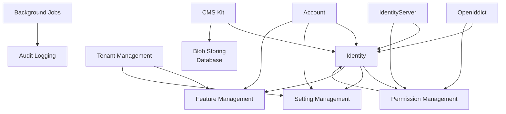

ABP ships with a curated set of **application modules** under [`modules/`](https://github.com/abpframework/abp/tree/dev/modules) at the root of the repository — eighteen first-party modules in total, listed below. Each module is a vertical slice of functionality — Identity, OpenIddict, Audit Logging, Tenant Management, and so on — packaged as the same `Domain.Shared`/`Domain`/`Application.Contracts`/`Application`/`HttpApi`/`HttpApi.Client`/`Web`/`Blazor`/`EntityFrameworkCore`/`MongoDB`/`Installer` project family that you produce when you scaffold a module with the ABP CLI. They are loaded into the host through ABP's `[DependsOn(...)]` graph and become first-class citizens of your application — their entities live in **your** database, their HTTP endpoints are mounted on **your** host, and their permission / setting / feature definitions are merged into the same definition manager that resolves your own application's permissions.

This section deep-dives every module under `modules/`. This page is the map: it lists each module, its purpose, the aggregate roots it contributes, and how it is intended to be replaced — either via the **source-code option** in the CLI (which copies the module's source into your solution so you can edit it) or via runtime extension points (custom `IPermissionManagementProvider`, custom `ISettingStore`, custom user `IUserClaimsPrincipalFactory`, and so on).

<Info>
  Module-internal architecture follows ABP's standard DDD layering (see [DDD overview](/ddd/overview)). All modules build on the [Volo.Abp.Core](/core/volo-abp-core) modularity system, the [Volo.Abp.Data](/data/volo-abp-data) data layer, and — for endpoints — the [ASP.NET Core integration](/aspnetcore/overview).
</Info>

## The 18 modules

The `modules/` directory at the repo root contains exactly eighteen modules, each in its own folder:

| Module | Folder | Purpose | Key aggregate roots |
| --- | --- | --- | --- |
| Identity | `modules/identity` | Users, roles, organization units, claims, sessions, security log | `IdentityUser`, `IdentityRole`, `OrganizationUnit`, `IdentityClaimType`, `IdentitySession`, `IdentitySecurityLog`, `IdentityLinkUser`, `IdentityUserDelegation` |
| Account | `modules/account` | Login, register, profile, password reset, 2FA UI + APIs | (no aggregates — operates on Identity entities) |
| OpenIddict | `modules/openiddict` | OAuth 2.1 / OIDC server (OpenIddict bridge) | `OpenIddictApplication`, `OpenIddictAuthorization`, `OpenIddictScope`, `OpenIddictToken` |
| IdentityServer | `modules/identityserver` | Legacy IdentityServer4 bridge | `Client`, `ApiResource`, `ApiScope`, `IdentityResource`, `PersistedGrant`, `DeviceFlowCodes` |
| Permission Management | `modules/permission-management` | Persisted permission grants + UI | `PermissionGrant`, `PermissionDefinitionRecord`, `PermissionGroupDefinitionRecord` |
| Setting Management | `modules/setting-management` | Persisted settings + UI | `Setting`, `SettingDefinitionRecord` |
| Feature Management | `modules/feature-management` | Persisted feature values + UI | `FeatureValue`, `FeatureDefinitionRecord`, `FeatureGroupDefinitionRecord` |
| Tenant Management | `modules/tenant-management` | Tenant CRUD, connection strings | `Tenant` |
| Audit Logging | `modules/audit-logging` | Audit log persistence | `AuditLog` (with `AuditLogAction`, `EntityChange`, `EntityPropertyChange` child entities) |
| Background Jobs | `modules/background-jobs` | Database-backed background jobs | `BackgroundJobRecord` |
| Blob Storing (Database) | `modules/blob-storing-database` | BLOB provider backed by EF/Mongo | `DatabaseBlob`, `DatabaseBlobContainer` |
| CMS Kit | `modules/cms-kit` | Pages, blogs, comments, ratings, tags, reactions, menus | `Page`, `Blog`, `BlogPost`, `Comment`, `Tag`, `Rating`, `UserReaction`, `UserMarkedItem`, `MediaDescriptor`, `MenuItem`, `GlobalResource`, `CmsUser` |
| Blogging | `modules/blogging` | Standalone blogging module (older) | `Blog`, `Post`, `Comment`, `Tag`, `BlogUser` |
| Docs | `modules/docs` | Markdown docs publishing | `Document`, `Project` |
| Users | `modules/users` | Shared `IUser` abstractions consumed by other modules | (interfaces / DTOs only) |
| Virtual File Explorer | `modules/virtual-file-explorer` | UI to browse the [virtual file system](/core/virtual-file-system) | (none) |
| Basic Theme | `modules/basic-theme` | Default Bootstrap theme | (none) |
| Client Simulation | `modules/client-simulation` | Load-testing harness for HTTP APIs | (none) |

<Tip>
  Every module above has a dedicated page in this group with the same depth treatment — projects, aggregates, repositories, app services / HTTP endpoints, EF Core / MongoDB context, and extension points.
</Tip>

## Common project layout

Every module follows the same project decomposition. The Identity module is canonical — listing `modules/identity/src/` gives:

```text
Volo.Abp.Identity.Domain.Shared
Volo.Abp.Identity.Domain
Volo.Abp.Identity.Application.Contracts
Volo.Abp.Identity.Application
Volo.Abp.Identity.HttpApi
Volo.Abp.Identity.HttpApi.Client
Volo.Abp.Identity.Web              ← MVC / Razor Pages UI
Volo.Abp.Identity.Blazor           ← Blazor UI (shared)
Volo.Abp.Identity.Blazor.Server
Volo.Abp.Identity.Blazor.WebAssembly
Volo.Abp.Identity.AspNetCore       ← ASP.NET Identity glue
Volo.Abp.Identity.EntityFrameworkCore
Volo.Abp.Identity.MongoDB
Volo.Abp.Identity.Installer
Volo.Abp.PermissionManagement.Domain.Identity   ← cross-module glue
```

A module's `*.Domain.Shared` project carries constants, ETOs, and localization resources; `*.Domain` carries aggregates, repositories interfaces, and domain services; `*.Application.Contracts` declares the app-service interfaces and DTOs (plus permission definitions); `*.Application` implements them; `*.HttpApi` exposes them as controllers; `*.HttpApi.Client` is the auto-generated dynamic C# proxy package; the UI projects render management pages; the data-layer projects implement the repositories on EF Core or MongoDB; `*.Installer` is the NuGet shim used by the CLI to pull the package family in one command.

## Cross-module dependency graph

Most modules depend on three cross-cutting modules — **Permission Management**, **Setting Management**, and **Feature Management** — plus, very often, **Identity**. The diagram below shows the typical edges (only the most common are drawn; each module's actual `[DependsOn]` is in its `*Module.cs`):



Edges going **into** Permission/Setting/Feature Management come from the `Volo.Abp.PermissionManagement.Domain.Identity`, `Volo.Abp.PermissionManagement.Domain.OpenIddict`, and `Volo.Abp.PermissionManagement.Domain.IdentityServer` glue projects — those are tiny bridges that register an `IPermissionManagementProvider` for the matching subject (role, user, OpenIddict application, IdentityServer client).

## Replaceability

ABP modules are designed to be **drop-in plus drop-out**. The supported customization paths are:

<CardGroup cols={2}>
  <Card title="Source-code option" icon="code-branch">
    The `abp new` and `abp add-package` CLI commands accept `--with-source-code` (see [project creation](/cli/project-creation)). The selected module's source is copied into your solution's `src/` under `Yourapp.Modules.<Module>/` so you can edit it.
  </Card>
  <Card title="Entity extension" icon="puzzle-piece">
    Use [ObjectExtensionManager](/ddd/object-extending) to add columns to module entities like `IdentityUser` and `Tenant` without forking — extra properties round-trip through DTOs and EF Core mappings.
  </Card>
  <Card title="Domain-service override" icon="screwdriver-wrench">
    All domain services (e.g. `IdentityUserManager`, `OrganizationUnitManager`, `TenantManager`) are `virtual` and registered with `[ExposeServices]` so you can derive and re-register your own subclass.
  </Card>
  <Card title="Pluggable contracts" icon="plug">
    Single-implementation interfaces — `IPermissionManagementProvider`, `ISettingStore`, `ITenantStore`, `IAuditingStore`, `IExternalLoginProvider` — accept your own implementation by replacing the binding in your module class.
  </Card>
</CardGroup>

## Reading order

<Steps>
  <Step title="Start with Identity">
    Most modules touch users and roles. Read [Identity](/modules/identity) first to understand `IdentityUser`, `IdentityRole`, and the manager/store pattern.
  </Step>
  <Step title="Then Account">
    [Account](/modules/account) wraps Identity behind login/register/profile UI and provides the OpenIddict and IdentityServer connection variants.
  </Step>
  <Step title="Pick a token server">
    Either [OpenIddict](/modules/openiddict) (new projects) or [IdentityServer](/modules/identityserver) (legacy IdentityServer4 bridge).
  </Step>
  <Step title="Wire the management trio">
    [Permission Management](/modules/permission-management), [Setting Management](/modules/setting-management), [Feature Management](/modules/feature-management) — the runtime storage behind ABP's [authorization](/auth/permissions), [settings](/crosscut/settings), and [features](/crosscut/features) systems.
  </Step>
  <Step title="Add multi-tenancy and auditing">
    [Tenant Management](/modules/tenant-management) layers a UI and connection-string editor over [Volo.Abp.MultiTenancy](/multitenancy/overview); [Audit Logging](/modules/audit-logging) persists the audit info captured by the [auditing infrastructure](/crosscut/auditing).
  </Step>
</Steps>

## How the rest of this section is organized

Each per-module page documents:

1. The full project list (`Domain.Shared` through `Installer`).
2. Aggregate roots and supporting entities with their key properties.
3. Repository interfaces and the typical EF Core / MongoDB implementations.
4. Domain services / managers and what invariants they enforce.
5. Application services with the HTTP route prefix and protected permissions.
6. Settings, features, and permissions the module defines.
7. UI surface (MVC / Razor Pages / Blazor / Angular cross-links).
8. Extension and replacement points.

When a module participates in a broader ABP feature (multi-tenancy, distributed events, dynamic client proxies), the page links into the relevant cross-cutting documentation rather than restating it.

<Note>
  This catalog tracks the open-source `abpframework/abp` repository. Commercial modules (Account.Pro, Identity.Pro, LeptonX Theme, SaaS, LDAP, Gdpr) live in a separate repository and are out of scope here, but where a free module exposes an extension point the commercial counterpart uses, the page calls it out.
</Note>
