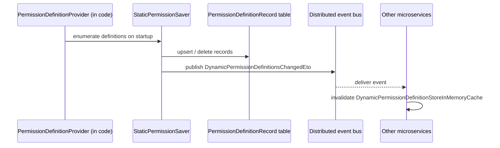

The Permission Management module persists the **grants** the [Volo.Abp.Authorization](/auth/authorization) and [Volo.Abp.PermissionManagement.Domain.Shared](/auth/permissions) layers consult at runtime. Permission **definitions** are declared in code by `PermissionDefinitionProvider` classes; this module stores **whether** each definition is granted for a given subject (a role, a user, an OpenIddict client, a tenant edition, …) and serves those grants via cached lookups during every authorization check.

It bundles three concerns:

1. The `PermissionGrant` aggregate plus a `PermissionDefinitionRecord` / `PermissionGroupDefinitionRecord` aggregate used to publish in-memory definitions to a database for dynamic propagation across microservices.
2. A pluggable `IPermissionManagementProvider` pipeline — one provider per subject kind — that the `PermissionManager` consults to read and set grants.
3. A `PermissionAppService` plus REST endpoints under `/api/permission-management/permissions` that the management UI (MVC, Blazor, Angular) calls.

## Projects

`modules/permission-management/src/` ships thirteen projects:

| Project | Purpose |
| --- | --- |
| `Volo.Abp.PermissionManagement.Domain.Shared` | Constants (`PermissionGrantConsts`, `PermissionDefinitionRecordConsts`, `PermissionGroupDefinitionRecordConsts`), `IPermissionFinder`, `IsGrantedRequest`/`IsGrantedResponse`, `DynamicPermissionDefinitionsChangedEto`, localization |
| `Volo.Abp.PermissionManagement.Domain` | `PermissionGrant` aggregate, `PermissionDefinitionRecord` + `PermissionGroupDefinitionRecord`, `PermissionManager` (implements `IPermissionManager`), `PermissionStore` (implements `IPermissionStore` from the Authorization layer), base `PermissionManagementProvider`, `DynamicPermissionDefinitionStore`, `StaticPermissionSaver`, `PermissionDataSeeder`, options |
| `Volo.Abp.PermissionManagement.Application.Contracts` | `IPermissionAppService`, DTOs, integration service |
| `Volo.Abp.PermissionManagement.Application` | `PermissionAppService` implementation, `PermissionIntegrationService` |
| `Volo.Abp.PermissionManagement.HttpApi` | `PermissionsController` (route `/api/permission-management/permissions`), integration controller |
| `Volo.Abp.PermissionManagement.HttpApi.Client` | Dynamic C# proxy |
| `Volo.Abp.PermissionManagement.Web` | Razor Pages modal and view components |
| `Volo.Abp.PermissionManagement.Blazor` | Shared Blazor modal (`PermissionManagementModal.razor`) |
| `Volo.Abp.PermissionManagement.Blazor.Server` | Blazor Server wiring |
| `Volo.Abp.PermissionManagement.Blazor.WebAssembly` | Blazor WASM wiring |
| `Volo.Abp.PermissionManagement.EntityFrameworkCore` | EF Core repositories |
| `Volo.Abp.PermissionManagement.MongoDB` | MongoDB repositories |
| `Volo.Abp.PermissionManagement.Installer` | NuGet installer shim used by the ABP CLI |

## Layering

```mermaid
graph TD
  subgraph Authorization[Volo.Abp.Authorization]
    PC[PermissionChecker]
    PVP[IPermissionValueProvider<br/>RolePermissionValueProvider<br/>UserPermissionValueProvider<br/>ClientPermissionValueProvider]
  end
  subgraph Domain
    PM[PermissionManager]
    PS[PermissionStore]
    IPMP[IPermissionManagementProvider]
    PMP[PermissionManagementProvider<br/>RolePermissionManagementProvider<br/>UserPermissionManagementProvider<br/>ClientPermissionManagementProvider<br/>ApplicationPermissionManagementProvider]
    DPDS[DynamicPermissionDefinitionStore]
    SPS[StaticPermissionSaver]
    PG[PermissionGrant<br/>PermissionDefinitionRecord<br/>PermissionGroupDefinitionRecord]
  end
  subgraph App
    PAS[PermissionAppService]
  end
  subgraph HttpApi
    Ctrl[PermissionsController<br/>/api/permission-management/permissions]
  end

  PC --> PS
  PS --> PG
  PM --> IPMP
  IPMP <-.implements.- PMP
  PMP --> PG
  SPS --> PG
  DPDS --> PG
  PAS --> PM
  PAS --> DPDS
  Ctrl --> PAS
```

## Aggregates

### `PermissionGrant`

[`PermissionGrant.cs`](https://github.com/abpframework/abp/blob/dev/modules/permission-management/src/Volo.Abp.PermissionManagement.Domain/Volo/Abp/PermissionManagement/PermissionGrant.cs):

```csharp
public class PermissionGrant : Entity<Guid>, IMultiTenant
{
    public virtual Guid? TenantId { get; protected set; }
    [NotNull] public virtual string Name { get; protected set; }            // permission name e.g. AbpIdentity.Users.Create
    [NotNull] public virtual string ProviderName { get; protected set; }    // R, U, C, E, T, ...
    [CanBeNull] public virtual string ProviderKey { get; protected internal set; } // e.g. role name, user GUID
}
```

Each row represents one **(permission, provider, providerKey)** triple. Lookups against this row drive every `PermissionChecker.IsGrantedAsync(...)` call. Indexes on `(Name, ProviderName, ProviderKey, TenantId)` make those lookups O(1) — the row also doubles as the cache key (see `PermissionGrantCacheItem` below).

<Note>
  The `// TODO: To aggregate root?` comment at the top of the file is intentional — `PermissionGrant` is modeled as an `Entity` (not an aggregate root) because it never has children of its own. EF Core indexes still treat it as a first-class table.
</Note>

### `PermissionDefinitionRecord`

When a microservice declares permissions in code via `PermissionDefinitionProvider`, those declarations are *static* — they're available only in the process that loaded the assembly. The Permission Management module persists them into [`PermissionDefinitionRecord`](https://github.com/abpframework/abp/blob/dev/modules/permission-management/src/Volo.Abp.PermissionManagement.Domain/Volo/Abp/PermissionManagement/PermissionDefinitionRecord.cs) and a paired [`PermissionGroupDefinitionRecord`](https://github.com/abpframework/abp/blob/dev/modules/permission-management/src/Volo.Abp.PermissionManagement.Domain/Volo/Abp/PermissionManagement/PermissionGroupDefinitionRecord.cs) so that:

- A different process (say, the management UI host) can render checkboxes for permissions defined inside another microservice.
- The list of permissions can be edited at runtime without redeploying.

Key columns on `PermissionDefinitionRecord`:

| Column | Meaning |
| --- | --- |
| `GroupName` | Owning group (e.g. `AbpIdentity`) |
| `Name` | Permission key (e.g. `AbpIdentity.Users.Create`) |
| `ResourceName` | Optional resource (for resource-scoped permissions) |
| `ManagementPermissionName` | The permission the UI checks before allowing edits |
| `ParentName` | Hierarchical parent permission |
| `DisplayName` | Localizable display name |
| `IsEnabled` | Soft on/off |
| `MultiTenancySide` | `Host` / `Tenant` / `Both` from `MultiTenancySides` |
| `Providers` | Comma-separated list of permission-value provider names this permission applies to |
| `StateCheckers` | JSON-serialized state checker info (e.g. require feature X to be enabled) |

[`StaticPermissionSaver`](https://github.com/abpframework/abp/blob/dev/modules/permission-management/src/Volo.Abp.PermissionManagement.Domain/Volo/Abp/PermissionManagement/StaticPermissionSaver.cs) compares the in-memory definitions against the database on application startup and updates the records. [`DynamicPermissionDefinitionStore`](https://github.com/abpframework/abp/blob/dev/modules/permission-management/src/Volo.Abp.PermissionManagement.Domain/Volo/Abp/PermissionManagement/DynamicPermissionDefinitionStore.cs) then exposes the merged static + dynamic catalog to the rest of the runtime via the `IPermissionFinder` API.

## Providers

The `PermissionManager` doesn't read `PermissionGrant` directly — it goes through `IPermissionManagementProvider`. The OSS repo ships **base** plumbing and **per-subject** providers in bridge projects:

| Provider class | Lives in | Subject (provider name) | Provider key |
| --- | --- | --- | --- |
| `PermissionManagementProvider` (base) | `permission-management/...Domain` | — | — |
| `RolePermissionManagementProvider` | `identity/...PermissionManagement.Domain.Identity` | `R` (role) | `IdentityRole.Name` |
| `UserPermissionManagementProvider` | `identity/...PermissionManagement.Domain.Identity` | `U` (user) | `IdentityUser.Id` |
| `RoleResourcePermissionManagementProvider` | `identity/...PermissionManagement.Domain.Identity` | `R` for resource-scoped permissions | role name |
| `UserResourcePermissionManagementProvider` | `identity/...PermissionManagement.Domain.Identity` | `U` for resource-scoped permissions | user id |
| `ClientPermissionManagementProvider` | `identityserver/...PermissionManagement.Domain.IdentityServer` | `C` (IdentityServer client) | client id |
| `ClientResourcePermissionManagementProvider` | same | `C` for resource-scoped permissions | client id |
| `ApplicationPermissionManagementProvider` | `openiddict/...PermissionManagement.Domain.OpenIddict` | `C` (OpenIddict application — same provider name) | `OpenIddictApplication.ClientId` |
| `ApplicationResourcePermissionManagementProvider` | same | `C` resource-scoped | client id |

The interface itself ([`IPermissionManagementProvider.cs`](https://github.com/abpframework/abp/blob/dev/modules/permission-management/src/Volo.Abp.PermissionManagement.Domain/Volo/Abp/PermissionManagement/IPermissionManagementProvider.cs)):

```csharp
public interface IPermissionManagementProvider : ISingletonDependency
{
    string Name { get; }

    Task<PermissionValueProviderGrantInfo> CheckAsync(string name, string providerName, string providerKey);

    Task<MultiplePermissionValueProviderGrantInfo> CheckAsync(string[] names, string providerName, string providerKey);

    Task SetAsync(string name, string providerKey, bool isGranted);
}
```

A single permission may be **granted by multiple providers simultaneously** — e.g. a user is granted directly **and** through a role. The `PermissionManager` evaluates all matching providers and returns the union; the management UI shows which provider currently grants the permission so the admin understands inheritance.

## Application service & HTTP API

[`IPermissionAppService`](https://github.com/abpframework/abp/blob/dev/modules/permission-management/src/Volo.Abp.PermissionManagement.Application.Contracts/Volo/Abp/PermissionManagement/IPermissionAppService.cs):

```csharp
public interface IPermissionAppService : IApplicationService
{
    Task<GetPermissionListResultDto> GetAsync(string providerName, string providerKey);
    Task<GetPermissionListResultDto> GetByGroupAsync(string groupName, string providerName, string providerKey);
    Task UpdateAsync(string providerName, string providerKey, UpdatePermissionsDto input);

    Task<GetResourceProviderListResultDto> GetResourceProviderKeyLookupServicesAsync(string resourceName);
    Task<SearchProviderKeyListResultDto> SearchResourceProviderKeyAsync(string resourceName, string serviceName, string filter, int page);
    Task<GetResourcePermissionDefinitionListResultDto> GetResourceDefinitionsAsync(string resourceName);
    Task<GetResourcePermissionListResultDto> GetResourceAsync(string resourceName, string resourceKey);
    Task<GetResourcePermissionWithProviderListResultDto> GetResourceByProviderAsync(string resourceName, string resourceKey, string providerName, string providerKey);
    Task UpdateResourceAsync(string resourceName, string resourceKey, UpdateResourcePermissionsDto input);
    Task DeleteResourceAsync(string resourceName, string resourceKey, string providerName, string providerKey);
}
```

Routes from [`PermissionsController.cs`](https://github.com/abpframework/abp/blob/dev/modules/permission-management/src/Volo.Abp.PermissionManagement.HttpApi/Volo/Abp/PermissionManagement/PermissionsController.cs):

| Method | Path | App-service call |
| --- | --- | --- |
| GET | `/api/permission-management/permissions` | `GetAsync(providerName, providerKey)` |
| GET | `/api/permission-management/permissions/by-group` | `GetByGroupAsync(...)` |
| PUT | `/api/permission-management/permissions` | `UpdateAsync(...)` |
| GET | `/api/permission-management/permissions/resource-provider-key-lookup-services` | `GetResourceProviderKeyLookupServicesAsync(...)` |
| GET | `/api/permission-management/permissions/search-resource-provider-keys` | `SearchResourceProviderKeyAsync(...)` |
| GET | `/api/permission-management/permissions/resource-definitions` | `GetResourceDefinitionsAsync(...)` |
| GET | `/api/permission-management/permissions/resource` | `GetResourceAsync(...)` |
| GET | `/api/permission-management/permissions/resource/by-provider` | `GetResourceByProviderAsync(...)` |
| PUT | `/api/permission-management/permissions/resource` | `UpdateResourceAsync(...)` |
| DELETE | `/api/permission-management/permissions/resource` | `DeleteResourceAsync(...)` |

The same controller exposes an [Integration service](https://github.com/abpframework/abp/tree/dev/modules/permission-management/src/Volo.Abp.PermissionManagement.HttpApi/Volo/Abp/PermissionManagement/Integration) used by sibling microservices to ask "is X granted on Y?" without hand-rolling the call.

## Caching

[`PermissionGrantCacheItem`](https://github.com/abpframework/abp/blob/dev/modules/permission-management/src/Volo.Abp.PermissionManagement.Domain/Volo/Abp/PermissionManagement/PermissionGrantCacheItem.cs) is the distributed-cache item for a single grant. The cache key is `(name, providerName, providerKey, tenantId)`. [`PermissionGrantCacheItemInvalidator`](https://github.com/abpframework/abp/blob/dev/modules/permission-management/src/Volo.Abp.PermissionManagement.Domain/Volo/Abp/PermissionManagement/PermissionGrantCacheItemInvalidator.cs) listens to local-bus events and evicts stale items.

[`DynamicPermissionDefinitionStoreInMemoryCache`](https://github.com/abpframework/abp/blob/dev/modules/permission-management/src/Volo.Abp.PermissionManagement.Domain/Volo/Abp/PermissionManagement/DynamicPermissionDefinitionStoreInMemoryCache.cs) keeps the database-backed definitions in process memory and refreshes them when the host process receives a [`DynamicPermissionDefinitionsChangedEto`](https://github.com/abpframework/abp/blob/dev/modules/permission-management/src/Volo.Abp.PermissionManagement.Domain.Shared/Volo/Abp/PermissionManagement/DynamicPermissionDefinitionsChangedEto.cs) on the distributed event bus.

## Static permission sync flow



This is what lets a permission added in microservice A become editable from microservice B's admin UI without a manual sync step.

## Data seeding

[`PermissionDataSeedContributor`](https://github.com/abpframework/abp/blob/dev/modules/permission-management/src/Volo.Abp.PermissionManagement.Domain/Volo/Abp/PermissionManagement/PermissionDataSeedContributor.cs) sits on top of [`IPermissionDataSeeder`](https://github.com/abpframework/abp/blob/dev/modules/permission-management/src/Volo.Abp.PermissionManagement.Domain/Volo/Abp/PermissionManagement/IPermissionDataSeeder.cs), which grants a set of permission names to a (provider, providerKey) pair — typically used by the [Identity data seeder](/modules/identity#data-seeding) to grant `AbpIdentity.*` to the seeded `admin` role.

## UI

<Tabs>
  <Tab title="MVC / Razor Pages">
    `Volo.Abp.PermissionManagement.Web` ships `PermissionManagementModal` partial views and a JS modal used by the Identity / Tenant Management UIs.
  </Tab>
  <Tab title="Blazor">
    `PermissionManagementModal.razor.cs` (in `Volo.Abp.PermissionManagement.Blazor/Components/`) and the resource-scoped counterpart `ResourcePermissionManagementModal.razor.cs` render the same matrix as the MVC modal.
  </Tab>
  <Tab title="Angular">
    See [Angular Permission Management](/angular/permission-management).
  </Tab>
</Tabs>

## Extension points

<CardGroup cols={2}>
  <Card title="Custom provider" icon="puzzle-piece">
    Derive from `PermissionManagementProvider` and register your own `Name`. ABP picks it up automatically through `ISingletonDependency`.
  </Card>
  <Card title="Replace IPermissionManager" icon="screwdriver-wrench">
    Subclass `PermissionManager` to add e.g. provider precedence or audit hooks.
  </Card>
  <Card title="Disable static saver" icon="lock">
    `PermissionManagementOptions.SaveStaticPermissionsToDatabase = false` if you manage definitions purely in code.
  </Card>
  <Card title="Custom resource lookup" icon="magnifying-glass">
    Implement `IResourcePermissionProviderKeyLookupService` to let the management UI search for resource keys (e.g. project IDs) on your side.
  </Card>
</CardGroup>

## Related pages

- [Authorization](/auth/authorization) and [Permissions](/auth/permissions) — the consumer side of grants stored here.
- [Identity module](/modules/identity) — role and user providers live in its bridge project.
- [OpenIddict module](/modules/openiddict) and [IdentityServer module](/modules/identityserver) — client-keyed providers.
- [Distributed event bus](/eventbus/distributed-event-bus) — channel `DynamicPermissionDefinitionsChangedEto` flows on.
- [Settings](/crosscut/settings) and [Features](/crosscut/features) — sibling concepts with the same provider pattern.
