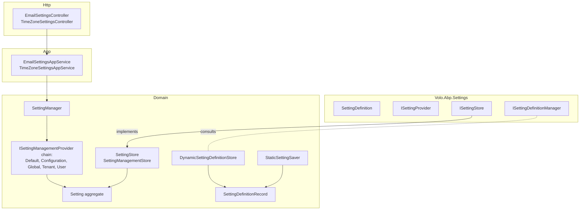

The Setting Management module is the **persistence side** of the [Volo.Abp.Settings](/crosscut/settings) abstraction. The core layer defines what a setting *is* (`SettingDefinition`) and how callers read its current value (`ISettingProvider.GetOrNullAsync(...)`); this module provides the database-backed `ISettingStore`, a chain of `ISettingManagementProvider` implementations for the five scopes (Default, Configuration, Global, Tenant, User), and the `IEmailSettingsAppService` / `ITimeZoneSettingsAppService` HTTP API used by the management UI.

If you only ever set settings from `appsettings.json`, you don't need this module — the core layer reads `IConfiguration` directly. You add Setting Management when an admin should be able to **change** settings from a UI and have those values survive restarts, scope to a tenant, or override per user.

## Projects

`modules/setting-management/src/` ships thirteen projects:

| Project | Purpose |
| --- | --- |
| `Volo.Abp.SettingManagement.Domain.Shared` | Constants (`SettingConsts`, `SettingDefinitionRecordConsts`), `SettingManagementFeatures`, `SettingManagementFeatureDefinitionProvider`, localization |
| `Volo.Abp.SettingManagement.Domain` | `Setting` aggregate, `SettingDefinitionRecord`, repositories, `SettingManagementStore` (implements `ISettingManagementStore`), `SettingStore` (implements `ISettingStore` from the core), `SettingManager` (implements `ISettingManager`), provider chain, `StaticSettingSaver`, `DynamicSettingDefinitionStore`, options |
| `Volo.Abp.SettingManagement.Application.Contracts` | `IEmailSettingsAppService`, `ITimeZoneSettingsAppService`, DTOs, `SettingManagementPermissions`, `AllowChangingEmailSettingsFeatureSimpleStateChecker` |
| `Volo.Abp.SettingManagement.Application` | `EmailSettingsAppService`, `TimeZoneSettingsAppService`, `SettingManagementAppServiceBase`, `UserDeletedEventHandler` |
| `Volo.Abp.SettingManagement.HttpApi` | `EmailSettingsController` (`/api/setting-management/emailing`), `TimeZoneSettingsController` (`/api/setting-management/timezone`) |
| `Volo.Abp.SettingManagement.HttpApi.Client` | Dynamic C# proxy |
| `Volo.Abp.SettingManagement.Web` | MVC settings page and contributors |
| `Volo.Abp.SettingManagement.Blazor` | Blazor pages and `ISettingComponentContributor` framework |
| `Volo.Abp.SettingManagement.Blazor.Server` | Blazor Server wiring |
| `Volo.Abp.SettingManagement.Blazor.WebAssembly` | Blazor WebAssembly wiring |
| `Volo.Abp.SettingManagement.EntityFrameworkCore` | EF Core repositories |
| `Volo.Abp.SettingManagement.MongoDB` | MongoDB repositories |
| `Volo.Abp.SettingManagement.Installer` | NuGet installer shim used by the ABP CLI |

## Layering



## The `Setting` aggregate

[`Setting.cs`](https://github.com/abpframework/abp/blob/dev/modules/setting-management/src/Volo.Abp.SettingManagement.Domain/Volo/Abp/SettingManagement/Setting.cs):

```csharp
public class Setting : Entity<Guid>, IAggregateRoot<Guid>
{
    [NotNull] public virtual string Name { get; protected set; }              // setting key, e.g. Abp.Identity.Password.RequiredLength
    [NotNull] public virtual string Value { get; internal set; }              // serialized value (always string)
    [CanBeNull] public virtual string ProviderName { get; protected set; }    // G (global), T (tenant), U (user), ...
    [CanBeNull] public virtual string ProviderKey { get; protected set; }     // null for G, tenant id for T, user id for U
}
```

The row is the canonical "stored value" for one `(name, providerName, providerKey)` triple. The companion `SettingDefinitionRecord` mirrors what `PermissionDefinitionRecord` does for permissions — it's how setting definitions declared in code are saved to a database so other processes can discover them.

## Provider chain

[`ISettingManagementProvider`](https://github.com/abpframework/abp/blob/dev/modules/setting-management/src/Volo.Abp.SettingManagement.Domain/Volo/Abp/SettingManagement/ISettingManagementProvider.cs) is the management-side cousin of `ISettingValueProvider` from the core. Implementations:

| Provider | File | Provider name | Purpose |
| --- | --- | --- | --- |
| `DefaultValueSettingManagementProvider` | `DefaultValueSettingManagementProvider.cs` | `D` | Returns the value baked into the `SettingDefinition.DefaultValue` |
| `ConfigurationSettingManagementProvider` | `ConfigurationSettingManagementProvider.cs` | `C` (configuration) | Reads from `IConfiguration` (typically `appsettings.json` section `Settings:`) |
| `GlobalSettingManagementProvider` | `GlobalSettingManagementProvider.cs` | `G` | Reads/writes `Setting` rows with `ProviderName = "G"` and `ProviderKey = null` |
| `TenantSettingManagementProvider` | `TenantSettingManagementProvider.cs` | `T` | Reads/writes `Setting` rows with `ProviderName = "T"` and `ProviderKey = TenantId.ToString()` |
| `UserSettingManagementProvider` | `UserSettingManagementProvider.cs` | `U` | Reads/writes per-user settings — keyed on the current user's id |

The order in `SettingManagementOptions.Providers` defines precedence. By default the resolution order for **reads** is `User → Tenant → Global → Configuration → Default` (the first non-null wins); **writes** target the explicit provider the management UI selects (Tenant for tenant admins, Global for host admins, User for the "My Account → Settings" page).

[`SettingManagementOptions`](https://github.com/abpframework/abp/blob/dev/modules/setting-management/src/Volo.Abp.SettingManagement.Domain/Volo/Abp/SettingManagement/SettingManagementOptions.cs):

```csharp
public class SettingManagementOptions
{
    public ITypeList<ISettingManagementProvider> Providers { get; }
    public bool SaveStaticSettingsToDatabase { get; set; } = true;
    public bool IsDynamicSettingStoreEnabled { get; set; } = false;
}
```

Convenience extension methods such as `UseGlobalSettingsAsync(...)`, `UseTenantSettingsAsync(...)`, `UseUserSettingsAsync(...)` (in `GlobalSettingManagerExtensions.cs`, `TenantSettingManagerExtensions.cs`, `UserSettingManagerExtensions.cs`) let you talk to a specific provider directly without specifying its name string.

## The store

[`SettingStore`](https://github.com/abpframework/abp/blob/dev/modules/setting-management/src/Volo.Abp.SettingManagement.Domain/Volo/Abp/SettingManagement/SettingStore.cs) implements the core layer's `ISettingStore` interface — the **read** path consumed by `ISettingProvider` in [Volo.Abp.Settings](/crosscut/settings). It walks the configured provider chain in order and returns the first non-null hit. Results are cached via `SettingCacheItem`; `SettingCacheItemInvalidator` evicts entries on local-bus mutation events.

[`SettingManagementStore`](https://github.com/abpframework/abp/blob/dev/modules/setting-management/src/Volo.Abp.SettingManagement.Domain/Volo/Abp/SettingManagement/SettingManagementStore.cs) is the **write** path: it persists the value into the right `Setting` row through the underlying `ISettingRepository`.

## Application services

### `IEmailSettingsAppService`

```csharp
public interface IEmailSettingsAppService : IApplicationService
{
    Task<EmailSettingsDto> GetAsync();
    Task UpdateAsync(UpdateEmailSettingsDto input);
    Task SendTestEmailAsync(SendTestEmailInput input);
}
```

Implementation: [`EmailSettingsAppService`](https://github.com/abpframework/abp/blob/dev/modules/setting-management/src/Volo.Abp.SettingManagement.Application/Volo/Abp/SettingManagement/EmailSettingsAppService.cs). It reads / writes the standard SMTP settings (`Abp.Mailing.Smtp.*`, see [emailing](/comm/emailing)) and exercises them via `IEmailSender.SendAsync` for the test-email endpoint.

### `ITimeZoneSettingsAppService`

```csharp
public interface ITimeZoneSettingsAppService : IApplicationService
{
    Task<string> GetAsync();
    Task<List<NameValue>> GetTimezonesAsync();
    Task UpdateAsync(string timezone);
}
```

Reads/writes `Abp.Timing.Timezone`; `GetTimezonesAsync` returns the IANA list so the UI can render a dropdown.

## HTTP API

| Method | Path | App-service call |
| --- | --- | --- |
| GET  | `/api/setting-management/emailing` | `IEmailSettingsAppService.GetAsync` |
| POST | `/api/setting-management/emailing` | `UpdateAsync` |
| POST | `/api/setting-management/emailing/send-test-email` | `SendTestEmailAsync` |
| GET  | `/api/setting-management/timezone` | `ITimeZoneSettingsAppService.GetAsync` |
| GET  | `/api/setting-management/timezone/timezones` | `GetTimezonesAsync` |
| POST | `/api/setting-management/timezone` | `UpdateAsync` |

Routes come straight from the controllers in `Volo.Abp.SettingManagement.HttpApi/Volo/Abp/SettingManagement/`.

## Permissions and features

[`SettingManagementPermissions`](https://github.com/abpframework/abp/blob/dev/modules/setting-management/src/Volo.Abp.SettingManagement.Application.Contracts/Volo/Abp/SettingManagement/SettingManagementPermissions.cs):

| Permission | Action |
| --- | --- |
| `SettingManagement.Emailing` | Read SMTP settings |
| `SettingManagement.Emailing.Test` | Send a test e-mail |
| `SettingManagement.TimeZone` | Read/write the active timezone |

[`SettingManagementFeatures`](https://github.com/abpframework/abp/blob/dev/modules/setting-management/src/Volo.Abp.SettingManagement.Domain.Shared/Volo/Abp/SettingManagement/SettingManagementFeatures.cs):

| Feature | Default | Effect |
| --- | --- | --- |
| `SettingManagement.Enable` | `true` | Master switch — disable to hide the management UI for a tenant edition |
| `SettingManagement.AllowChangingEmailSettings` | `false` | When `false`, the e-mail-settings UI is read-only (so tenants can't fiddle with the host's SMTP server) |

`AllowChangingEmailSettingsFeatureSimpleStateChecker` is the `ISimpleStateChecker<IFeatureDefinition>` that wires the feature into the permission's `StateCheckers` list.

## Settings UI

<Tabs>
  <Tab title="MVC / Razor Pages">
    `Volo.Abp.SettingManagement.Web` exposes a master `/SettingManagement` page populated by view components contributed via `SettingPageOptions`. The two built-in contributors are `EmailSettingGroupViewComponent` and `TimeZoneSettingGroupViewComponent`.
  </Tab>
  <Tab title="Blazor">
    `Volo.Abp.SettingManagement.Blazor/Pages/SettingManagement/SettingManagement.razor.cs` is the host; `ISettingComponentContributor` (in `ISettingComponentContributor.cs`) is the extension contract. Built-ins live in `Settings/EmailingPageContributor.cs` and `Settings/TimeZonePageContributor.cs`.
  </Tab>
  <Tab title="Angular">
    See [Angular Setting Management](/angular/setting-management).
  </Tab>
</Tabs>

## Encryption

The setting `Value` column is **not** encrypted at rest — sensitive values (SMTP password, signing keys) should rely on the [data protection](/auth/security-and-claims) string-encryption service (`IStringEncryptionService`) before being passed to `SettingManager.SetAsync(...)`. The `EmailSettingsAppService` does this automatically for the SMTP password; for your own sensitive settings, encrypt the value yourself (or use the `[EncryptedString]` extra-property convention).

## Dynamic setting sync

Like permissions, settings declared by `SettingDefinitionProvider` classes are projected into `SettingDefinitionRecord` rows by [`StaticSettingSaver`](https://github.com/abpframework/abp/blob/dev/modules/setting-management/src/Volo.Abp.SettingManagement.Domain/Volo/Abp/SettingManagement/StaticSettingSaver.cs). A change publishes a `DynamicSettingDefinitionsChanged*` event on the distributed bus, and [`DynamicSettingDefinitionStoreInMemoryCache`](https://github.com/abpframework/abp/blob/dev/modules/setting-management/src/Volo.Abp.SettingManagement.Domain/Volo/Abp/SettingManagement/DynamicSettingDefinitionStoreInMemoryCache.cs) refreshes itself in every consuming microservice.

## Event handlers

[`UserDeletedEventHandler`](https://github.com/abpframework/abp/blob/dev/modules/setting-management/src/Volo.Abp.SettingManagement.Application/Volo/Abp/SettingManagement/UserDeletedEventHandler.cs) listens for `IdentityUser` deletion events on the local bus and cascades by removing every `Setting` row with that user as its `ProviderKey` — keeping the setting store free of orphans.

## Extension points

<CardGroup cols={2}>
  <Card title="Custom provider" icon="puzzle-piece">
    Implement `ISettingManagementProvider` and add it to `SettingManagementOptions.Providers` — useful for edition-scoped or environment-scoped settings.
  </Card>
  <Card title="Custom settings page" icon="sliders">
    Add a Razor view component (MVC) or implement `ISettingComponentContributor` (Blazor) to surface a new group inside the management page.
  </Card>
  <Card title="Replace ISettingManager" icon="screwdriver-wrench">
    Subclass `SettingManager` to add audit / approval workflows around writes.
  </Card>
  <Card title="Encrypted settings" icon="lock">
    Wrap `SettingManager.SetAsync` with a call to `IStringEncryptionService.Encrypt` and decrypt on read.
  </Card>
</CardGroup>

## Related pages

- [Settings (cross-cutting)](/crosscut/settings) — the consumer side of `ISettingStore`.
- [Identity module](/modules/identity) — declares the password/lockout/sign-in settings stored here.
- [Feature Management](/modules/feature-management) — sibling concept with the same provider chain pattern.
- [Multi-tenancy overview](/multitenancy/overview) — explains why a tenant-scoped provider is the default for tenant admins.
- [Emailing](/comm/emailing) — the consumer of SMTP settings managed via this module.
