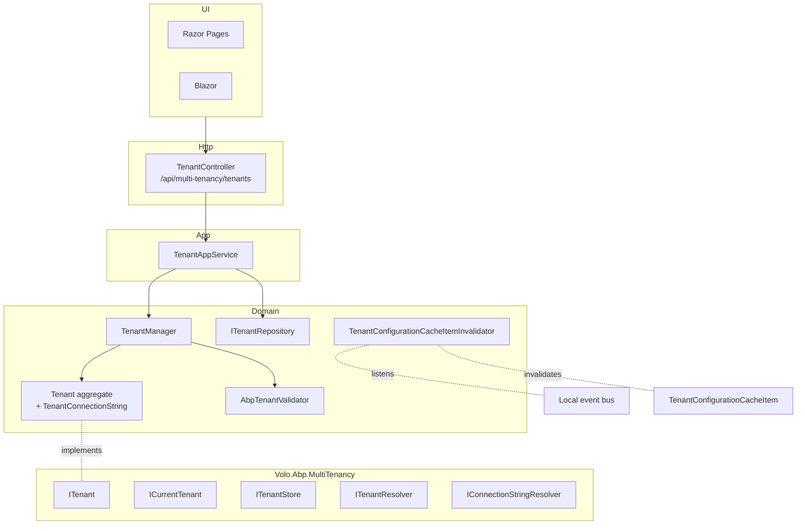

The Tenant Management module is the **management UI / API** sitting on top of the [Volo.Abp.MultiTenancy](/multitenancy/overview) abstraction. MultiTenancy itself defines `ITenant`, `ICurrentTenant`, `ITenantStore`, and `ITenantResolver` — they let your app run as multi-tenant. This module makes tenants **manageable**: a `Tenant` aggregate stored in your database, a `TenantManager` domain service, a `TenantAppService` exposing CRUD over `/api/multi-tenancy/tenants`, and the per-tenant connection-string editor that the [connection-string resolver](/multitenancy/connection-string-resolver) uses to find the right database.

If you only host a single tenant, you don't need this module — `Volo.Abp.MultiTenancy` is enough. You add Tenant Management when you sell your app to multiple customers and an operator needs to create, edit, suspend, and switch tenants from a UI.

## Projects

`modules/tenant-management/src/` ships thirteen projects:

| Project | Purpose |
| --- | --- |
| `Volo.Abp.TenantManagement.Domain.Shared` | Constants (`TenantConsts`, `TenantConnectionStringConsts`), `TenantEto`, `TenantManagementModuleExtensionConfiguration` (for `ObjectExtensionManager`), localization |
| `Volo.Abp.TenantManagement.Domain` | `Tenant` aggregate + `TenantConnectionString` child entity, `TenantManager`, `AbpTenantValidator`, `ITenantValidator`, `ITenantRepository`, `TenantConfigurationCacheItemInvalidator` |
| `Volo.Abp.TenantManagement.Application.Contracts` | `ITenantAppService`, DTOs, `TenantManagementPermissions`, `AbpTenantManagementPermissionDefinitionProvider` |
| `Volo.Abp.TenantManagement.Application` | `TenantAppService` implementation + `TenantManagementAppServiceBase` |
| `Volo.Abp.TenantManagement.HttpApi` | `TenantController` mounted at `/api/multi-tenancy/tenants` |
| `Volo.Abp.TenantManagement.HttpApi.Client` | Dynamic C# proxy |
| `Volo.Abp.TenantManagement.Web` | MVC pages (`/TenantManagement/Tenants`, modals) and navigation contributor |
| `Volo.Abp.TenantManagement.Blazor` | Blazor `TenantManagement.razor` page + menu contributor |
| `Volo.Abp.TenantManagement.Blazor.Server` | Blazor Server wiring |
| `Volo.Abp.TenantManagement.Blazor.WebAssembly` | Blazor WebAssembly wiring |
| `Volo.Abp.TenantManagement.EntityFrameworkCore` | EF Core repository |
| `Volo.Abp.TenantManagement.MongoDB` | MongoDB repository |
| `Volo.Abp.TenantManagement.Installer` | NuGet installer shim used by the ABP CLI |

## Layering



## The `Tenant` aggregate

[`Tenant.cs`](https://github.com/abpframework/abp/blob/dev/modules/tenant-management/src/Volo.Abp.TenantManagement.Domain/Volo/Abp/TenantManagement/Tenant.cs):

```csharp
public class Tenant : FullAuditedAggregateRoot<Guid>, IHasEntityVersion
{
    public virtual string Name { get; protected set; }
    public virtual string NormalizedName { get; protected set; }
    public virtual int EntityVersion { get; protected set; }
    public virtual List<TenantConnectionString> ConnectionStrings { get; protected set; }

    public virtual string FindDefaultConnectionString();
    public virtual string FindConnectionString(string name);
    public virtual void SetDefaultConnectionString(string connectionString);
    public virtual void SetConnectionString(string name, string connectionString);
    public virtual void RemoveDefaultConnectionString();
    public virtual void RemoveConnectionString(string name);
    public virtual void SetName(string name);
    public virtual void SetNormalizedName(string normalizedName);
}
```

The `ConnectionStrings` child collection is the heart of the module — each row is a `TenantConnectionString` keyed on (`TenantId`, `Name`):

```csharp
public class TenantConnectionString : Entity
{
    public virtual Guid TenantId { get; protected set; }
    public virtual string Name { get; protected set; }   // e.g. "Default" or "OrderModule"
    public virtual string Value { get; protected set; }  // the actual connection string

    public override object[] GetKeys() => new object[] { TenantId, Name };
}
```

The MultiTenancy [connection-string resolver](/multitenancy/connection-string-resolver) calls `FindConnectionString(name)` first; if the tenant has no entry for that database name it falls back to `FindDefaultConnectionString()`, then to the host's `ConnectionStrings:Default`. This is how a single deployment supports both "shared database" and "database-per-tenant" tenants side-by-side.

## Domain service

[`TenantManager`](https://github.com/abpframework/abp/blob/dev/modules/tenant-management/src/Volo.Abp.TenantManagement.Domain/Volo/Abp/TenantManagement/TenantManager.cs):

```csharp
public class TenantManager : DomainService, ITenantManager
{
    public virtual async Task<Tenant> CreateAsync(string name)
    {
        var tenant = new Tenant(GuidGenerator.Create(), name, TenantNormalizer.NormalizeName(name));
        await TenantValidator.ValidateAsync(tenant);
        return tenant;
    }

    public virtual async Task ChangeNameAsync(Tenant tenant, string name)
    {
        await LocalEventBus.PublishAsync(new TenantChangedEvent(tenant.Id, tenant.NormalizedName));
        tenant.SetName(name);
        tenant.SetNormalizedName(TenantNormalizer.NormalizeName(name));
        await TenantValidator.ValidateAsync(tenant);
    }
}
```

Validation is delegated to [`AbpTenantValidator`](https://github.com/abpframework/abp/blob/dev/modules/tenant-management/src/Volo.Abp.TenantManagement.Domain/Volo/Abp/TenantManagement/AbpTenantValidator.cs) (via `ITenantValidator`): it checks name length and uniqueness. `ITenantNormalizer` (in core MultiTenancy) uppercases and trims the name to produce `NormalizedName`, which is what the [tenant resolver](/multitenancy/tenant-resolution) compares against to match e.g. `acme` subdomains case-insensitively.

The local event `TenantChangedEvent` is what the cache invalidator listens to (see below).

## Application service

[`ITenantAppService`](https://github.com/abpframework/abp/blob/dev/modules/tenant-management/src/Volo.Abp.TenantManagement.Application.Contracts/Volo/Abp/TenantManagement/ITenantAppService.cs):

```csharp
public interface ITenantAppService :
    ICrudAppService<TenantDto, Guid, GetTenantsInput, TenantCreateDto, TenantUpdateDto>
{
    Task<string> GetDefaultConnectionStringAsync(Guid id);
    Task UpdateDefaultConnectionStringAsync(Guid id, string defaultConnectionString);
    Task DeleteDefaultConnectionStringAsync(Guid id);
}
```

By inheriting from `ICrudAppService<...>` it picks up the standard `GetAsync(id)`, `GetListAsync(input)`, `CreateAsync(input)`, `UpdateAsync(id, input)`, `DeleteAsync(id)` shape — the [Application Services](/ddd/application-services) layer wires those up automatically.

## HTTP API

Routes from [`TenantController.cs`](https://github.com/abpframework/abp/blob/dev/modules/tenant-management/src/Volo.Abp.TenantManagement.HttpApi/Volo/Abp/TenantManagement/TenantController.cs):

| Method | Path | App-service call |
| --- | --- | --- |
| GET | `/api/multi-tenancy/tenants` | `GetListAsync(GetTenantsInput)` |
| GET | `/api/multi-tenancy/tenants/{id}` | `GetAsync(id)` |
| POST | `/api/multi-tenancy/tenants` | `CreateAsync(TenantCreateDto)` |
| PUT | `/api/multi-tenancy/tenants/{id}` | `UpdateAsync(id, TenantUpdateDto)` |
| DELETE | `/api/multi-tenancy/tenants/{id}` | `DeleteAsync(id)` |
| GET | `/api/multi-tenancy/tenants/{id}/default-connection-string` | `GetDefaultConnectionStringAsync(id)` |
| PUT | `/api/multi-tenancy/tenants/{id}/default-connection-string` | `UpdateDefaultConnectionStringAsync(id, value)` |
| DELETE | `/api/multi-tenancy/tenants/{id}/default-connection-string` | `DeleteDefaultConnectionStringAsync(id)` |

<Note>
  Only the `Default` connection string is wired into the OSS HTTP API. Per-module connection strings (e.g. `OrderModule` or `Cms`) can still be edited on the `Tenant` aggregate through the manager / repository directly — the **commercial SaaS module** ships the UI that surfaces all named connection strings.
</Note>

## Permissions

[`TenantManagementPermissions`](https://github.com/abpframework/abp/blob/dev/modules/tenant-management/src/Volo.Abp.TenantManagement.Application.Contracts/Volo/Abp/TenantManagement/TenantManagementPermissions.cs):

| Permission | Action |
| --- | --- |
| `AbpTenantManagement.Tenants` | View tenants |
| `AbpTenantManagement.Tenants.Create` | Create a new tenant |
| `AbpTenantManagement.Tenants.Update` | Edit tenant name / extra properties |
| `AbpTenantManagement.Tenants.Delete` | Delete a tenant (soft-delete; `FullAuditedAggregateRoot` carries `IsDeleted`) |
| `AbpTenantManagement.Tenants.ManageFeatures` | Open the [feature-management modal](/modules/feature-management#ui-surface) for the tenant |
| `AbpTenantManagement.Tenants.ManageConnectionStrings` | Edit per-tenant connection strings |

## Cache invalidation

The MultiTenancy core caches a tenant's resolved configuration (id, normalized name, connection strings) in [`TenantConfigurationCacheItem`](/multitenancy/overview) so that the [tenant resolver](/multitenancy/tenant-resolution) doesn't hit the database on every request. When the management UI mutates a `Tenant`, [`TenantConfigurationCacheItemInvalidator`](https://github.com/abpframework/abp/blob/dev/modules/tenant-management/src/Volo.Abp.TenantManagement.Domain/Volo/Abp/TenantManagement/TenantConfigurationCacheItemInvalidator.cs) catches the local-bus event and evicts the stale entry:

```csharp
[LocalEventHandlerOrder(-1)]
public class TenantConfigurationCacheItemInvalidator :
    ILocalEventHandler<EntityChangedEventData<Tenant>>,
    ILocalEventHandler<TenantChangedEvent>,
    ITransientDependency
{
    public virtual async Task HandleEventAsync(EntityChangedEventData<Tenant> eventData)
    {
        if (eventData is EntityCreatedEventData<Tenant>) return;
        await ClearCacheAsync(eventData.Entity.Id, eventData.Entity.NormalizedName);
    }
    // ...
}
```

`[LocalEventHandlerOrder(-1)]` ensures the cache is cleared **before** any other handler runs, so downstream consumers see the fresh value.

## Distributed event

The `TenantEto` (in `Domain.Shared`) is the cross-microservice event payload — it's automatically published by ABP's entity-event-publisher pattern (configured via `services.AddAbpDbContext<>(opt => opt.Entity<Tenant>(e => e.AutoEventSelectors.Add<Tenant>()))`). Other microservices subscribe to `EntityCreatedEto<TenantEto>` / `EntityUpdatedEto<TenantEto>` / `EntityDeletedEto<TenantEto>` to invalidate their own tenant caches and trigger any per-tenant data migrations. See the [distributed event bus](/eventbus/distributed-event-bus).

## Object extensions

[`TenantManagementModuleExtensionConfiguration`](https://github.com/abpframework/abp/blob/dev/modules/tenant-management/src/Volo.Abp.TenantManagement.Domain.Shared/Volo/Abp/ObjectExtending/TenantManagementModuleExtensionConfiguration.cs) is the `ObjectExtensionManager` entry point — use it to add extra columns to `Tenant` (e.g. `BillingPlan`, `ContactEmail`) without forking the module. See [Object extending](/ddd/object-extending).

## UI

<Tabs>
  <Tab title="MVC / Razor Pages">
    `Volo.Abp.TenantManagement.Web/Pages/TenantManagement/Tenants/` ships the list page, edit modal, and the connection-string editor; `TenantManagementMenuContributor` adds them under **Administration → Tenant Management** when the user holds the right permission.
  </Tab>
  <Tab title="Blazor">
    [`TenantManagement.razor.cs`](https://github.com/abpframework/abp/blob/dev/modules/tenant-management/src/Volo.Abp.TenantManagement.Blazor/Pages/TenantManagement/TenantManagement.razor.cs) is the grid + edit modal; `TenantManagementBlazorMenuContributor` registers the menu.
  </Tab>
  <Tab title="Angular">
    See [Angular Tenant Management](/angular/tenant-management).
  </Tab>
</Tabs>

## Multi-tenancy integration

The module **only** implements the management surface — the runtime `ITenantStore` consulted by the [tenant resolver](/multitenancy/tenant-resolution) is implemented in a separate class:

- `Volo.Abp.MultiTenancy` defines `ITenantStore`.
- `TenantManagementTenantStore` (in `Volo.Abp.TenantManagement.Domain`) implements it by querying `ITenantRepository`.

This separation lets you swap the management UI without changing the resolution path, and vice versa.

## Extension points

<CardGroup cols={2}>
  <Card title="Custom tenant validator" icon="check-double">
    Replace `ITenantValidator` to enforce additional naming rules (e.g. minimum length 5, must not match reserved subdomains).
  </Card>
  <Card title="Extend the Tenant entity" icon="puzzle-piece">
    Use `ObjectExtensionManager.Instance.ConfigureTenantManagement(...)` to add columns to `Tenant`.
  </Card>
  <Card title="Replace TenantAppService" icon="screwdriver-wrench">
    Subclass `TenantAppService` to add provisioning logic on create (run migrations, seed an admin user).
  </Card>
  <Card title="Custom tenant store" icon="database">
    Replace `ITenantStore` if you want to source tenants from an external registry instead of this module's database.
  </Card>
</CardGroup>

## Related pages

- [Multi-tenancy overview](/multitenancy/overview) — the abstraction this module manages.
- [Tenant resolution](/multitenancy/tenant-resolution) — how requests get bound to a tenant.
- [Connection-string resolver](/multitenancy/connection-string-resolver) — consumer of `Tenant.ConnectionStrings`.
- [Feature Management](/modules/feature-management) — `T`-provider is keyed on `Tenant.Id`.
- [Distributed event bus](/eventbus/distributed-event-bus) — channel for `TenantEto` propagation.
- [Object extending](/ddd/object-extending) — adding columns to `Tenant`.
